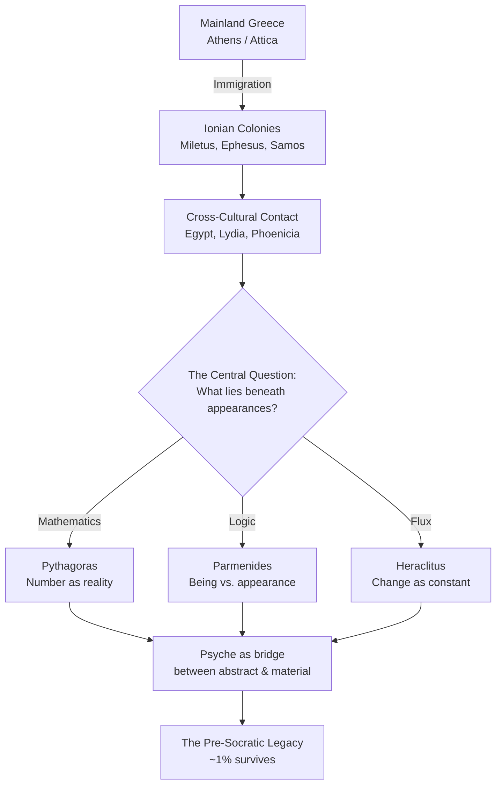

# Module 2: The First Psychologists

It is 585 BCE, and the streets of Miletus are emptying in panic. The sky is darkening at midday. Soldiers on the battlefield between the Lydians and the Medes have dropped their weapons. Everyone — merchant, slave, soldier, priest — is looking upward and trembling.

Everyone except Thales.

The old man stands in the doorway of his workshop near the harbor, his sandals dusty from the agora, his face calm. He has been telling anyone who would listen for weeks that this would happen. Not because he prayed to Helios. Not because he read the entrails of a sacrificed bird. But because he had traveled to Egypt, studied their records of celestial patterns, and calculated the geometry of shadow and light. The moon, he told his skeptical neighbors, would pass between the earth and the sun. The darkness would last minutes. Then the light would return.

When it does — precisely as he described — the Lydians and Medes make peace, terrified by the omen. The Milesian merchants resume their haggling. The priests resume their sacrifices.

But something has shifted. A man has stood before the most terrifying phenomenon in human experience — the disappearance of the sun — and explained it without invoking a single god. He used **logos**: reason, argument, the word made rational.

What happens to a civilization when one person demonstrates that the universe can be understood?

---

## The Islands That Invented Thinking

You might expect philosophy to have been born in Athens, the city that would later claim credit for everything from democracy to tragedy. But Athens in the seventh century BCE was a mainland power, conservative, agrarian, and deeply invested in its own traditions. The real revolution happened at the edges — on islands, in port cities, in colonies scattered across the Aegean like seeds thrown by a restless hand.

The people who settled these colonies were immigrants, and immigrants carry something that stay-at-home populations often lack: an urgent need to explain who they are. The Ionian Greeks who crossed the Aegean to settle the coast of Asia Minor came primarily from Attica. Athens was their mother city. And like every displaced population in history — from the Irish diaspora in nineteenth-century America to the Armenian communities scattered across the modern Middle East — they responded to the threat of assimilation by clutching harder to their identity.

This is the first ingredient in the recipe that produced philosophy: **the psychology of the outsider**.

*Figure 2.1 — The intellectual network of the Ionian world: mainland Greek culture, filtered through colonial displacement and foreign contact, generated competing philosophical systems that converged on a single question — the nature of psyche.*

### The Pride of the Displaced

Consider what it means to leave home. The seventh-century Ionians didn't emigrate because they were forced out by famine or war — at least not entirely. Scarcity on the mainland played a role, but so did the lure of trade routes, the promise of land, the chance to build something new. They were ambitious, restless, and fiercely proud of being Greek.

That pride mattered. The earliest Homeric scholars appeared not in Athens but in Ionia. Why? Because when you live among people whose gods, customs, and stories are radically different from your own, you don't just remember your culture — you *curate* it. You preserve it. You study it. You argue about what it means with an intensity that people back home, surrounded by the familiar, never feel the need to muster.

The Ionians of the seventh century were, in a very real sense, more Greek than the Greeks.

> [!TIP]
> **Stop and Think:** Have you ever noticed that diaspora communities often maintain traditions more rigidly than the homeland? Chinatowns in Western cities preserve dialects that have evolved on the mainland. Jewish communities in exile developed meticulous traditions of textual interpretation. What is it about displacement that turns culture into a *project* rather than a background condition?

### Commerce as Curriculum

But ethnic pride alone doesn't produce philosophy. If it did, every tight-knit immigrant community would generate its own Thales. What made Ionia different was the second ingredient: **radical cultural contact**.

The Milesian port was one of the great trading hubs of the ancient Mediterranean. Ships arrived from Egypt carrying grain, papyrus, and architectural knowledge. From Mesopotamia came astronomical records stretching back centuries. From Lydia came coined money — a technology so transformative that it restructured how people thought about value itself. Every cargo that came ashore carried not just goods but *ideas*: different creation stories, different explanations for natural phenomena, different relationships between humans and the divine.

This is what psychologists studying creativity call **domain rotation** — exposure to multiple, unrelated knowledge systems that forces the mind to find patterns beneath surface differences. The Ionian merchant who bargained with an Egyptian priest and then debated with a Phoenician sailor and then sailed home past a volcano was not just accumulating facts. He was being *forced* to ask: what do all these explanations have in common? What is the *one* explanation that accounts for everything?

That question — the search for unity beneath diversity — is the birth cry of Western philosophy.

### The Fragment Problem

Before we go further, you need to understand something that will haunt every claim we make about the **Pre-Socratics**: we are working with almost nothing.

Thales and Pythagoras may never have written anything down — or if they did, not a scrap survives. Anaximander left us roughly five sentences. Anaximenes: one. Heraclitus, the great riddler of Ephesus, left about 140 fragments, of which perhaps a few dozen deserve serious philosophical attention. All told, the writings of the major Pre-Socratic thinkers — the people who invented cosmology, mathematics, logic, and the concept of the soul as something worth investigating — fit comfortably into fewer than two hundred pages of modern print.

Two hundred pages. That is the sum total of direct evidence for the intellectual revolution that produced Western science.

Indirect evidence — references in later writers like Aristotle, Simplicius, and Diogenes Laërtius — suggests these thinkers produced entire books, multiple volumes, sustained arguments. We possess, liberally, about one percent of their work. Imagine reconstructing the twentieth century from a single newspaper edition, a handful of postcards, and some gossip recorded by a historian writing three hundred years later. That is roughly the evidentiary situation we face.

> [!TIP]
> **Stop and Think:** If you had to reconstruct a civilization's entire intellectual achievement from one percent of its written output, what would you inevitably get wrong? What biases would the surviving fragments carry — and whose voices would be missing entirely?

Why does this matter for psychology? Because when we attribute specific ideas to specific thinkers, we are often relying on secondhand reports from commentators who had their own agendas. Plato used the Pre-Socratics as foils. Aristotle summarized them in ways that made his own positions look like natural successors. The fragments we have are not a random sample — they are what later writers found useful to preserve, or quotable enough to repeat, or wrong enough to refute. We are seeing these thinkers through the lens of their critics.

Keep this in mind. It will matter more than you think.

---

## When Numbers Became Reality

Of all the Pre-Socratics, none is more strange — or more consequential for psychology — than **Pythagoras of Samos**.

Here is a man who founded a religious community in southern Italy, required his followers to take vows of public silence, believed in the transmigration of souls, forbade the eating of beans, and — oh yes — discovered that the fundamental structure of the universe is mathematical. He is either a mystic who stumbled into mathematics or a mathematician who was also a mystic, and the distinction may not have existed for him.

The insight that made Pythagoras famous was deceptively simple: the relationship between musical harmony and number.

### The Music of the Spheres

Legend has it that Pythagoras was walking past a blacksmith's shop when he noticed that hammers of different sizes produced notes of different pitch — and that the pitches that sounded *harmonious* together corresponded to hammers whose weights stood in simple numerical ratios. A hammer twice as heavy as another produced a note one octave lower. Hammers whose weights were in a 3:2 ratio produced a perfect fifth.

This is not a minor observation. This is the discovery that *beauty has a structure*, and that structure is mathematical. The experience of musical harmony — one of the most subjective, intimate, "felt" experiences in human life — turns out to obey the same rules as geometry.

Pythagoras took this insight and ran with it — straight off the edge of the known world.

If musical harmony is governed by number, he reasoned, then perhaps *all* of nature is. Perhaps the entire cosmos is, at bottom, a mathematical structure. Perhaps the planets themselves produce music as they move — the famous **musica universalis**, the "music of the spheres" — each celestial body generating a tone determined by its orbital distance and velocity, all combining into a cosmic symphony that we cannot hear only because we have never known silence.

### The Tetractys and the Bridge of Soul

Pythagoras didn't stop at metaphor. His community developed a specific cosmogony — a theory of how the universe came to be — rooted in the first four integers: 1, 2, 3, and 4. They called this sequence the **tetractys**, and they swore their most sacred oaths upon it.

Here is how the mapping worked:

| Integer | Geometric Correspondence |
|---------|-------------------------|
| 1 | The point |
| 2 | The line |
| 3 | The plane |
| 4 | The solid |

One generates two. Two generates three. Three generates four. And four — the solid — is the physical world you inhabit. The material universe, in Pythagorean teaching, is the *product* of abstract numerical relationships playing themselves out.

But notice the problem this creates. If numbers are abstract — if they are not physical things — then how do they produce physical things? By what mechanism does the concept "4" become a rock, a tree, a human body? The Pythagorean answer was as bold as it was mysterious: **soul** (**psyche**). It must be in the realm of soul that abstract numbers are absorbed and used to construct the material world. Soul is the bridge between the ideal and the real, the mathematical and the physical.

> [!TIP]
> **Stop and Think:** This is not an ancient curiosity. When a physicist today says the universe is "really" made of mathematical relationships — that particles are excitations of quantum fields described by equations — how different is that from what Pythagoras claimed? Have we actually moved past his position, or just given it better notation?

This tension — between the abstract and the concrete, the ideal and the observable, the mathematical and the physical — is one of the deepest fault lines in the history of thought. And it runs directly through the history of psychology. Plato will build his entire theory of the soul on it. Descartes will wrestle with it. The debate between nativism and empiricism, between those who believe knowledge is innate and those who believe it is learned, is a distant descendant of Pythagoras standing in that blacksmith's shop, listening to hammers, and hearing number beneath sound.

### The First Psychologist?

If soul is what bridges the abstract and the material at the cosmic level, then what about the soul of an individual person? The Pythagorean logic leads to a startling conclusion: if the cosmos itself is constructed by soul acting on number, then the soul *within* a living person must possess similar constructive powers. Your psyche — whatever it is that makes you *you* — participates in the same generative process that built the stars.

This makes Pythagoras, arguably, the first person in Western history to offer a *theory* of the soul rather than simply a story about it. The Homeric psyche was a shade, a wisp, a diminished afterimage of the living person. The Pythagorean psyche is a *force* — creative, mathematical, cosmic in scope.

Whether Pythagoras actually held these views in precisely this form, we cannot say with certainty. Remember the fragment problem. But the tradition that reaches us — through Philolaus, through Plato, through Aristotle's reports — consistently attributes to the Pythagorean school this revolutionary idea: that the soul is not merely the ghost of a living person but the *principle* by which the intelligible becomes sensible, the abstract becomes real.

---

## The Philosopher Who Distrusted His Eyes

If Pythagoras found truth in number, another Pre-Socratic found it by rejecting everything the senses report. **Parmenides of Elea** — a philosopher of the **Eleatic** school — born around 515 BCE in a Greek colony on the western coast of Italy — produced one of the most rigorous and disturbing arguments in the history of philosophy. And his method was as unusual as his conclusions: he wrote philosophy as *poetry*.

### The Goddess's Dialectic

In a work that may originally have been titled "On Nature," Parmenides describes a journey. He is carried by chariot to the gates of Night and Day, where a nameless goddess receives him. She promises to teach him two things: the truth about reality, and the opinions of mortals — "in which there is no true belief."

The truth, she tells him, is arrived at by **dialectic**: by argument, by the careful analysis of what it means for something to *be*. And the conclusion of that analysis is this: **whatever truly exists must be eternal and unchanging**.

Think about what that means. The chair you are sitting in changes — it weathers, it breaks, it eventually rots. Your body changes — it ages, it heals, it dies. The river changes — the water you saw a moment ago is already gone, replaced by new water flowing from upstream. If change is the mark of *non-being* — if to change is to become what you were not, and therefore to be something that *is not* — then nothing in the sensible world truly exists.

Parmenides was not joking. He was not speaking metaphorically. He meant it literally: the world you see, hear, touch, taste, and smell is not real. It is appearance. **Being** — true, stable, unchanging reality — is accessible only to reason.

### Being vs. Becoming

Here is the argument in compressed form. It starts with what seems like a logical truism: *what is, is; and what is not, is not*. From this, Parmenides draws several conclusions that feel inescapable once you accept his premises:

First, nothing can come from nothing. If something now exists, it cannot have *begun* to exist, because beginning requires a prior state of non-existence — and non-existence, by definition, is nothing. You can't get something from nothing. Therefore, what exists has always existed.

Second, nothing that exists can cease to exist, because ceasing to exist means becoming nothing — and nothing is not a state you can *be in*. Therefore, what exists will always exist.

Third, what truly exists cannot change, because change means becoming what you were not — and "what you were not" is nothing. You cannot become nothing. Therefore, what truly exists is eternal, unchanging, and indivisible.

> [!TIP]
> **Stop and Think:** Heraclitus said you can never step into the same river twice. Parmenides said the river doesn't really exist. Both are trying to make the same point from opposite directions: the senses are unreliable. But which position is more *dangerous* to everyday life — the claim that everything changes, or the claim that nothing does?

The clash between Parmenides and **Heraclitus** — the philosopher of Ephesus who insisted that "everything flows" (**panta rhei**) and that change is the only constant — defines a fault line that runs through the entire history of Western thought. Plato will spend his career trying to resolve it. Aristotle will claim to have resolved it. Psychologists will inherit it as the tension between those who seek permanent, universal laws of mind and those who insist that every human experience is contextual, situated, and fleeting.

### What Remains When the Senses Are Removed

Strip away everything the senses report — the colors, the sounds, the textures, the changes — and what is left? For Parmenides, what remains is a realm of abstractions: stable, eternal truths accessible only to reason. This is not the physical world. It is the *intelligible* world — the world of logical necessity, of what *must* be true regardless of what your eyes tell you.

Notice how close this is to Pythagoras, despite the enormous difference in method and temperament. Pythagoras arrived at the primacy of the abstract through music and mathematics. Parmenides arrived at it through pure logical argument. But both converge on the same revolutionary claim: **the deepest reality is not what you can see**. The senses deceive. The mind, and the mind alone, can access what is real.

This convergence is not a coincidence. Both thinkers were responding to the same puzzle — the puzzle that the Ionian experience of cultural diversity had made unavoidable: how do you find *one* truth beneath *many* appearances? How do you know which stories, which explanations, which experiences are real and which are the distortions of a particular perspective?

The Pythagorean answer: truth is mathematical. The Parmenidean answer: truth is logical. But both answers agree on one thing: truth is not sensory.

For psychology, the implications are enormous. If the senses cannot be trusted, then the empirical method — the method of learning about the world by observing it — is fundamentally unreliable. And if the mind *can* access a truth that the senses cannot, then the mind possesses capacities that go beyond mere perception. The human **psyche** is not just a receiver of sensory data; it is an *apprehender* of reality.

---

## From Stars to People

Something else was happening in fifth-century Athens — something that would redirect the entire trajectory of Western thought. Philosophy was turning away from the cosmos and toward the human being.

The shift from **cosmocentric** to **anthropocentric** philosophy did not happen because the earlier questions had been answered. It happened because the earlier questions had become *dangerous*.

### Why the Heavens Became Dangerous

Two incidents tell the story. **Protagoras**, the great Sophist from Thrace, wrote a treatise on the gods that began: "About the gods, I am not able to know either that they exist or that they do not exist." For this honest admission of uncertainty, he was charged with impiety, tried, and banished from Athens. His books were burned in the public square.

**Anaxagoras**, who taught in Athens and counted Pericles among his students, claimed that the sun was not a god but a mass of red-hot metal — larger, he said, than the Peloponnese. For this, he too was charged with impiety. Pericles managed to save his life, but Anaxagoras was exiled and spent his final years in Lampsacus, a small town where the citizens, at least, respected his courage.

> [!TIP]
> **Stop and Think:** Athens prided itself on rational inquiry and democratic debate. Yet when philosophical speculation produced conclusions that threatened religious orthodoxy, the city responded with prosecution and exile. Is this hypocrisy — or is it something more complex? When does a society's tolerance for free thought reach its actual limit?

The pattern was clear: you could philosophize about the heavens as long as the city was prosperous. But when Athens faced military defeat, political crisis, or financial strain — as it did repeatedly during the Peloponnesian War — the public looked for someone to blame. And the man who said the sun was a rock, or who doubted the gods existed, made an easy target.

Socrates, it appears, was paying attention.

### The Birth of the Human Question

The philosophers who gathered around Socrates in the agora — the young Plato, the visiting Euclid of Megara, the wealthy Crito — were not uninterested in cosmology. But they understood that the path to wisdom now ran through different territory. If the heavens were politically off-limits, the human soul was not. If you couldn't ask "what is the sun made of?" without risking prosecution, you could still ask "what is justice?" or "what is courage?" or "what is the good life?" — and the Athenian authorities, at least for a while, would leave you alone.

This is the moment when the **logos** — reason, argument, the rational account — turns inward. The Pre-Socratics had used logos to explain the cosmos. Socrates would use it to examine the human being. And in doing so, he would transform **psyche** from a cosmological principle into a *personal* one — from the soul of the universe to the soul of *you*.

The Pre-Socratics had asked: what is the world made of? Pythagoras said number. Parmenides said being. Heraclitus said flux. Thales said water. Each answer was more abstract, more daring, more removed from common sense than the last. And each answer pushed the thinker further from the safe ground of public opinion.

Socrates would ask a different question — a question that was, in its way, even more dangerous: *what are you made of?*

---

## Speaking of Fragments and Lost Worlds...

You have just encountered perhaps the most poignant paradox in intellectual history. The people who invented the idea that the universe is rationally intelligible — the idea that underlies all of science, all of psychology, all of modern civilization — left behind almost nothing. We have a few hundred sentences from thinkers who produced entire libraries. We reconstruct their thought from the reports of people who disagreed with them. We know them mainly by what their enemies chose to quote.

And yet those fragments changed everything. From five sentences of Anaximander, we trace the concept of natural law. From Heraclitus's riddles, we inherit the idea that change is fundamental. From Pythagoras's blacksmith-shop epiphany, we get the conviction — still alive in every physics department on earth — that mathematics describes reality. From Parmenides's goddess, we learn that the mind can reach truths the senses cannot.

These are not marginal contributions. They are the foundation stones of Western thought. And they survive in whispers.

What would these thinkers have said about the soul — about *your* soul — if we had their actual words instead of fragments, paraphrases, and polemics? We cannot know. But we can trace how their ideas traveled, mutated, and converged in the work of the one thinker who would synthesize them all: Plato. And to understand Plato's psychology, you first need to understand what he was trying to rescue from the wreckage of the Pre-Socratic achievement.

That rescue mission begins with the man who turned philosophy's gaze from the stars to the human face.

---

> [!IMPORTANT]
> The first psychologists were not psychologists at all. They were cosmologists, mathematicians, and poets who were trying to understand the universe. But in doing so, they stumbled upon the most consequential idea in the history of the discipline: that **reality is not what it appears to be**, and that the mind — the soul, the psyche — is the instrument by which we access what is real. Every subsequent theory of psychology, from Plato's tripartite soul to Freud's unconscious to the computational models of modern cognitive science, is a variation on this single, Pythagorean insight. The bridge between the abstract and the concrete was never built. It was *discovered* — and it runs through you.

---

## References

- Aristotle. *Metaphysics*. Trans. W.D. Ross. Oxford: Clarendon Press, 1924.
- Barnes, J. *The Presocratic Philosophers*. London: Routledge, 1982.
- Burkert, W. *Lore and Science in Ancient Pythagoreanism*. Trans. E.L. Minar. Cambridge, MA: Harvard University Press, 1972.
- Diels, H., & Kranz, W. *Die Fragmente der Vorsokratiker*. Berlin: Weidmann, 1951.
- Guthrie, W.K.C. *A History of Greek Philosophy*. Vols. 1–2. Cambridge: Cambridge University Press, 1962–1965.
- Heraclitus. *Fragments*. Trans. T.M. Robinson. Toronto: University of Toronto Press, 1987.
- Kirk, G.S., Raven, J.E., & Schofield, M. *The Presocratic Philosophers*. 2nd ed. Cambridge: Cambridge University Press, 1983.
- Parmenides. *On Nature*. In *The Presocratic Philosophers*, ed. G.S. Kirk et al., 239–262.
- Pythagoras. Fragments and testimonies. In *The Pythagorean Sourcebook and Library*, ed. K.S. Guthrie. Grand Rapids: Phanes Press, 1987.

*Module 2 of 8 complete.*
