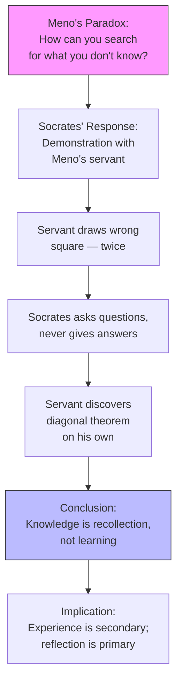

# Chapter 2 — Psychology in the Hellenic Age

## Module 3: Socrates and the Art of Not Knowing

---

The marketplace in Athens smelled of olive oil and sweat. It was late afternoon, somewhere around 405 BC, and the city was losing a war it had started. Young men who should have been haggling over fish were instead being loaded onto triremes, and the ones who came back were different — quieter, harder, with a look in their eyes that the older citizens recognized from their own youth. Athens was fighting Sparta, and Athens was losing.

Among the crowd that day was a stocky, barefoot man with a broad flat nose and bulging eyes. He was not handsome. He was not wealthy — or rather, he didn't act like it. He wandered from stall to stall, stopping merchants and politicians and anyone who looked confident, and he asked them questions. Simple questions, at first. What is courage? What is justice? What do you mean when you say someone is good? The confident people answered easily at first. Then less easily. Then they stopped answering at all, because the stocky man had a way of showing you that your confident answer didn't actually mean what you thought it meant.

His name was Socrates. He called himself a **gadfly** — an insect that bites horses to keep them from growing sluggish. The city, he said, was a noble horse that had grown slow and lazy, and it needed stinging.

The young men who gathered around him — Plato among them — were children of the losing side. Their city had been humiliated. The democratic institutions their fathers had praised were crumbling. They came to Socrates not because he had answers, but because he had a method for showing that nobody else did, either.

But here is the question that haunted them, the one that would shape the entire future of Western thought: If Socrates knew that he didn't know — and he said so, famously, publicly — then how could he teach anyone anything? And how could the people he questioned search for knowledge they didn't yet possess? What would they even be looking for?

---

## The War Behind the Questions

You need to understand what happened to Athens to understand why these questions mattered so urgently.

The **Peloponnesian War** (431–404 BC) was not a border skirmish. It was a decades-long catastrophe that ended with Sparta besieging Athens itself, starving the city into surrender, tearing down its walls, and installing a puppet government. The democracy was briefly overthrown. Citizens were executed. The golden age of Pericles — the era of great temples, public festivals, and soaring rhetoric — was over.

The philosophers who gathered around Socrates were not detached academics. They were traumatized survivors. They had watched their city betray its own ideals. They had seen popular assemblies vote for disastrous military campaigns. They had witnessed neighbors turn on neighbors. And they asked: Where did things go wrong? Was there a point — a single moment, a single decision — where Athens took a wrong turn away from the values it claimed to hold?

These were not abstract philosophical questions. They were desperate ones.

Plato, who came from wealth and was groomed for politics, wrote later about his own disillusionment: "Our city was no longer governed according to the customs and institutions of our fathers.... I realized that all existing states without exception had irremediably bad constitutions." He turned away from politics entirely and toward what he called "true philosophy" — the belief that only through rigorous inquiry could anyone figure out what was actually right, for states and for individuals.

> [!TIP]
> **Stop and Think:** Think of a time when a system you trusted — a government, an institution, a relationship — failed in a way that made you question everything you believed about it. Did the failure make you more or less interested in foundational questions? In questions like "What does justice actually mean?" or "What do I actually know?"

---

## Who Was Socrates, Really?

Here is a problem that should bother you: we don't really know what Socrates thought.

Socrates wrote nothing. Not a word. Everything we know about him comes from other people — and the most important of those people was Plato, who wrote a series of dramatic dialogues in which Socrates is the main character. Plato claimed, in a letter, that "there is not and never will be a work of Plato; the works which now go by that name belong to Socrates, embellished and rejuvenated."

But was Plato a faithful reporter? Almost certainly not. The Socrates of Plato's early dialogues — questioning, probing, claiming ignorance — is probably close to the real person. The Socrates of the later dialogues — pronouncing elaborate theories about the soul, the afterlife, and the nature of reality — is almost certainly Plato putting his own ideas into his teacher's mouth.

Think of it like a song you heard performed live by a singer, and then years later you hear a studio recording of the same song by someone else who was at that concert. The melody might be the same. The arrangement is different. The production is polished. And you can never be entirely sure which parts are the original and which parts are the cover.

The only other contemporary account comes from **Xenophon**, a soldier and writer who knew Socrates personally. Xenophon's Socrates is simpler, more practical, less philosophical. He gives advice about household management and military strategy. It's like reading two biographies of the same person written by people who knew them in different contexts — a college roommate and a work colleague — and wondering how they could possibly be describing the same human being.

> [!TIP]
> **Stop and Think:** Imagine that everything people know about you fifty years from now comes from the text messages of two friends — one who admired you and one who merely found you useful. What picture would emerge? What would be lost?

---

## Meno's Challenge: The Paradox of Search

Now we arrive at the philosophical problem that made Socrates famous — and that still haunts **epistemology**, the study of knowledge itself.

In a dialogue named after a young aristocrat called Meno, who had recently returned to Athens from Thessaly, Socrates encounters a challenge that sounds simple but is devastating. Meno has been spending time with followers of the **Sophists** — traveling teachers who, for a fee, instructed young men in rhetoric, argumentation, and the arts of persuasion. The Sophists were not philosophers in the Socratic sense. They were closer to debate coaches or political consultants. They taught you how to win arguments, not how to find truth.

Meno, armed with Sophist training, asks Socrates a seemingly innocent question: "How will you enquire into that which you do not know? What will you put forth as the subject of enquiry? And if you find what you want, how will you ever know that this is the thing which you did not know?"

Read that again slowly. It's a trap, and it's a good one.

If you already know what you're looking for, you don't need to search. If you don't know what you're looking for, you can't search — because you wouldn't recognize it if you found it. Either way, genuine inquiry seems impossible. You're either looking for something you already have, or you're wandering blind.

This is **Meno's paradox**, and it has never been fully resolved. It's the kind of question that sounds like a clever trick until you realize it strikes at the foundations of all learning. How does a child learn language if they don't already know language? How does a scientist discover a new principle if they didn't already know it? How does anyone learn anything genuinely new?

Socrates' answer — or rather, the demonstration he uses to sidestep the paradox — is one of the most famous moments in the history of philosophy.

---

## The Slave Boy and the Geometry

Socrates turns to Meno's servant — a young, uneducated enslaved person — and begins to draw shapes in the sand. He draws a square. He asks the boy simple questions: If this square has sides of two feet, what is its area? The boy answers correctly: four square feet. Socrates nods. Now: can you draw a square that has double the area — eight square feet?

The boy tries. He suggests doubling the length of the sides. Socrates draws it out: four by four is sixteen, not eight. The boy sees his error. He tries again, suggesting a side of three. Three by three is nine. Still wrong. The boy is confused, embarrassed — he has been shown that he doesn't know something he thought he understood.

And then, through a series of careful questions — not statements, not lectures, not answers, just questions — Socrates guides the boy toward the discovery. The diagonal of the original square. If you use the diagonal as the side of a new square, that square has exactly double the area. The boy arrives at this insight himself. Socrates never tells him the answer. He only asks questions, one after another, each one narrowing the possibility space, each one eliminating a wrong turn.

The boy's face, we can imagine, changes. Something clicks. He doesn't just know the answer — he understands *why* it's the answer. And he understands why his previous guesses were wrong.

Socrates turns to Meno: "You see? He didn't learn anything from me. He already had the knowledge within him. I merely helped him recollect it."

> [!TIP]
> **Stop and Think:** Think about a time you struggled with a problem — a math puzzle, a design challenge, a personal dilemma — and the answer suddenly appeared. Did someone hand you the answer, or did it emerge from your own thinking? Was the person who asked you the right questions doing less work than you, or more?

---

## Knowledge as Recollection

This demonstration is meant to prove a radical claim: **knowledge is reminiscence**. The knower already has the truth within them. Learning is not the acquisition of something new. It is the recovery of something forgotten.

You should find this claim either completely absurd or deeply compelling, and which reaction you have will tell you something important about your own assumptions about the mind.

If you think of the mind as a blank slate — empty at birth, filled by experience — then Socrates' claim makes no sense. Where would the knowledge come from if not from the outside? But if you think of the mind as having some innate structure, some built-in capacity for understanding, then the claim starts to make a different kind of sense. The slave boy had never been taught geometry. But he could *recognize* geometric truth when it was carefully revealed to him. He had the capacity for understanding already; Socrates just activated it.

This is not as exotic as it sounds. Consider language acquisition. A child in São Paulo learns Portuguese. A child in Kyoto learns Japanese. No one teaches them grammar rules first — they absorb patterns, and they produce sentences they've never heard before. Where does that capacity come from? Not from the specific language, which varies. Something deeper — some innate structure for language — must be there from the start.

Socrates was making an analogous claim about all knowledge: that the mind comes equipped with the capacity for truth, and that the job of the teacher is not to fill an empty vessel but to draw out what is already there.

*Figure 2.3: Socrates' geometry demonstration in the Meno dialogue. The servant's errors are not failures — they are necessary steps on the path to recollection.*

---

## The Dialectical Method

Now you can see why the method matters. If knowledge is recollection, then the right way to teach is not to lecture, not to demonstrate, not to explain — but to ask. The **dialectical method** is the practical consequence of Socrates' theory of knowledge.

But "method" is the wrong word if it makes you think of a checklist or a procedure. The dialectical method is not a conversation in the casual sense. It is a rigorous process of exposing and examining the assumptions behind every claim.

Here is how it works. Someone makes a statement — "Courage is standing your ground in battle." Socrates asks: Is it courageous for a soldier to retreat when retreat saves his unit? The person adjusts: "Courage is knowing when to stand and when to retreat." Socrates asks: Can a coward who happens to guess correctly about when to retreat be called courageous? The person adjusts again. And again. Each adjustment reveals a hidden assumption. Each assumption is examined. The process continues until the person either arrives at a defensible position or admits they don't actually know what they thought they knew.

The key insight: the dialectical method is not about getting the right answer. It's about understanding *why* your previous answers were wrong. The slave boy didn't just learn the diagonal theorem — he learned why his earlier guesses were wrong. That understanding of error is the real knowledge. The theorem itself is just the residue.

Think about how different this is from how most learning works. In a typical classroom, you receive information, memorize it, reproduce it on an exam. The Socratic approach asks you to produce your own understanding, defend it, watch it fail, and rebuild. It's slower. It's more painful. And it produces understanding that sticks — because you earned it through your own errors.

> [!TIP]
> **Stop and Think:** Think about the last time you changed your mind about something important. Did someone tell you the right answer, or did you arrive at the new position through a process of questioning your old one? Which path left you more certain of your new belief?

---

## Speaking of Gadflies and Geometry...

Let's make this concrete. Here's how Socratic questioning looks in practice — across cultures, across centuries.

**In Japanese martial arts:** A kendo instructor doesn't explain the correct sword grip to a beginner. Instead, she watches the student hold the sword, asks them to swing, and then asks: "Where did the blade tip go? Why did it go there? What happens if you change your wrist angle by two degrees?" The student discovers proper form through error and correction — not through instruction.

**In Brazilian jiu-jitsu:** A purple belt explains a chokehold to a white belt. The white belt tries it. It doesn't work. The purple belt asks: "Where is your pressure? What happened to your opponent's posture? Why didn't they tap?" The white belt adjusts. Tries again. Fails differently. Adjusts again. The technique is learned through iterative failure, each failure revealing a hidden assumption about leverage and body mechanics.

**In West African oral tradition:** A griot — a storyteller and historian — doesn't lecture children about the meaning of proverbs. She asks: "What do you think this proverb means? Can you think of a time when it wasn't true? What would change your mind?" The children argue among themselves, and the griot listens, intervening only to sharpen a question or expose a contradiction.

**In a modern therapy session:** A cognitive behavioral therapist doesn't tell a patient that their fear is irrational. They ask: "What evidence supports this belief? What evidence contradicts it? What would you say to a friend who held this belief?" The patient dismantles their own distortion — or doesn't — through the process of examination.

The pattern is the same everywhere: the teacher asks, the student discovers, and the discovery is owned by the student because they made it themselves.

---

## The Cost of Not Knowing

There is something almost unbearably honest about Socrates' position. He claimed to know nothing — and he meant it. His famous statement, "I know that I know nothing," is not false modesty. It's a methodological commitment. If you admit you don't know, you remain open to inquiry. The moment you claim to know, you stop looking.

This is why he was dangerous. Not because he had radical ideas — he claimed to have no ideas at all — but because his method of questioning exposed the emptiness of other people's certainties. The politicians who claimed to know justice, the generals who claimed to know courage, the Sophists who claimed to know virtue — Socrates showed, through patient questioning, that none of them could defend their claims.

Athens executed him for it in 399 BC. The charge was "corrupting the youth" and "not believing in the gods of the city." The real crime was making powerful people look foolish.

---

## Why This Matters for Psychology

Socrates didn't think of himself as a psychologist. The word wouldn't exist for two thousand years. But his method and his theory of knowledge contain the seeds of several ideas that would become central to psychology.

First, the claim that knowledge is innate — that the mind has built-in structures for understanding — is a direct ancestor of **nativism**, the view that certain capacities are inborn rather than learned. Modern debates about whether language, morality, or mathematical reasoning are innate echo Socrates' demonstration with the slave boy.

Second, the dialectical method — the process of exposing assumptions through systematic questioning — anticipates modern therapeutic techniques. Cognitive behavioral therapy, Socratic questioning in education, and even the basic structure of a scientific experiment (hypothesis, test, revision) all share the Socratic DNA of learning through the systematic examination of error.

Third, and most broadly, Socrates turned the focus of philosophy inward — away from the stars and toward the self. The Pre-Socratics asked what the world was made of. Socrates asked what *you* know, what *you* mean, what *you* believe. This shift — from cosmology to psychology, from the cosmos to the person — is arguably the most important turn in the history of Western thought.

> [!TIP]
> **Stop and Think:** Socrates said the unexamined life is not worth living. Do you agree? Is there a difference between examining your life and simply worrying about it? What would Socrates say is the difference?

---

> [!IMPORTANT]
> The most important thing to carry forward from this module is that Socrates' contribution to psychology was not a theory — it was a method and a question. The method is the dialectical process of exposing and testing assumptions through systematic questioning. The question is: Where does knowledge come from? Does the mind arrive empty, filled by experience? Or does it arrive equipped with structures that make experience intelligible? That question — nativism versus empiricism — would dominate psychology for the next two millennia, and it started here, in a dusty Athenian marketplace, with a barefoot man who claimed to know nothing.

---

The story continues. Plato took Socrates' method and built an entire philosophy around it — a philosophy that included an elaborate theory of innate ideas, a metaphor for the human condition that remains the most famous image in Western thought, and a vision of the soul that would shape psychology for centuries. That theory, and that metaphor, are what we turn to next.

---

## References

Plato. *Meno*. Translated by Benjamin Jowett.

Plato. *Apology*. Translated by Benjamin Jowett.

Robinson, D. N. (1995). *An Intellectual History of Psychology* (3rd ed.). Madison: University of Wisconsin Press.

---

*Module 3 of 8 complete.*
