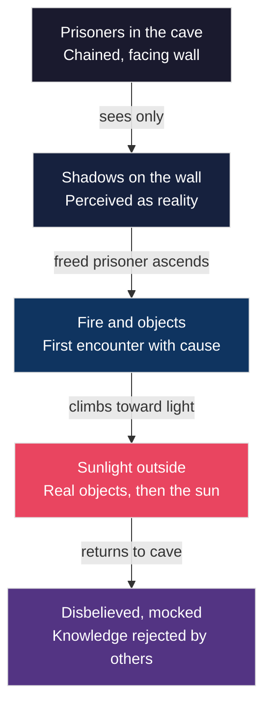

# The Cave and the Problem of Knowledge

Imagine you are standing at the mouth of a limestone cave on the island of Crete, the kind tourists pay good money to explore today. Sunlight pours in behind you, but ahead the passage narrows into absolute blackness. Your guide hands you a flickering oil lamp and says, "What you see inside is the real Crete." You descend. The walls glitter with mineral deposits, stalactites drip with ancient water, and shadows leap and twist as your lamp swings with each step. After an hour underground, you emerge blinking into the midday Mediterranean sun — and everything looks wrong. The white-washed buildings seem impossibly bright, the sea impossibly blue. For a few disorienting seconds, you cannot tell which world was real: the dark, echoing chambers below, or this blazing surface world above.

Now imagine you never left the cave at all. Imagine you were born there, chained facing a wall, watching shadows projected by a fire you have never seen. This is the image that a middle-aged Athenian philosopher — Plato, writing through the voice of his teacher Socrates — placed before his students in the *Republic* around 375 BCE. It would become the single most influential metaphor for human knowledge in Western intellectual history. But why did Plato feel the need to invent it? What problem was so urgent that it required a story about prisoners, shadows, and a blinding ascent into daylight?

The answer begins not with Plato, but with a traveling teacher named Protagoras, who had offered a deceptively simple claim: "Man is the measure of all things." It sounded democratic, even liberating. But Socrates saw something far more dangerous lurking beneath its surface — a claim that, if taken seriously, would dissolve the very possibility of knowledge itself. And if knowledge dissolves, then so does psychology, philosophy, and every science that depends on distinguishing truth from illusion.

The argument between these two positions — sensation as the road to truth versus reason as the road to truth — would shape how thinkers for the next two millennia understood the human mind. You are about to watch it unfold.

---

## The Sophist's Bet: Man as Measure

You need to understand what Protagoras was claiming before you can appreciate why Socrates attacked it so vigorously. Protagoras of Abdera (c. 490–420 BCE) was a **Sophist** — one of those itinerant intellectuals who traveled from city to city across the Greek world, teaching rhetoric, politics, and practical wisdom to anyone who could pay. The Sophists were the first professional educators in Western history, and they were brilliant at what they did. But they were also controversial, because many of them taught that truth was relative — that what mattered was not what was *true* but what was *persuasive*.

Protagoras distilled this philosophy into a single, devastating sentence: "Man is the measure of all things — of the things that are, that they are, and of the things that are not, that they are not."

Read that carefully. It means that there is no truth independent of human perception. If the wind feels cold to you and warm to me, then the wind *is* cold for you and warm for me. There is no fact of the matter beyond what each person experiences. This is **sensationism** — the doctrine that all knowledge reduces to sensory experience — taken to its radical conclusion.

The implications are staggering. If each person's sensations constitute their truth, then knowledge becomes private, locked inside individual skulls. There is no shared reality to discover, no objective standard to appeal to. You have your truth; I have mine. And there is no way to adjudicate between them.

> [!TIP]
> **Stop and Think:** Consider this scenario. You are in São Paulo, Brazil, tasting a cup of *cafézinho* — that strong, sweet, tiny cup of coffee Brazilians drink after meals. To you, it tastes bitter. To your Brazilian host, it tastes perfectly balanced. Under Protagoras's doctrine, both experiences are equally true, with no objective standard to resolve the disagreement. But here is the question: does this make the concept of "knowledge" meaningless? If every perception is automatically true, can we still talk about learning, discovery, or expertise?

---

## Socrates Strikes Back: The Pig and the Baboon

Socrates, as Plato portrays him in the *Theaetetus*, does not simply disagree with Protagoras. He demolishes the position through a combination of wit, logic, and what can only be described as philosophical mockery.

"I am charmed with his doctrine," Socrates begins, with the kind of false praise that should make any opponent nervous. Then he delivers the blow: why did Protagoras not begin his book by declaring that "a pig or a dog-faced baboon, or some yet stranger monster which has sensation, is the measure of all things"? After all, pigs have sensations. Baboons have sensations. If sensation is the criterion of truth, then every creature with functioning sense organs is equally qualified to be the measure of reality.

The point is devastating because it exposes the hidden assumption in Protagoras's claim. By saying "man" is the measure, Protagoras smuggled in a preference for *human* sensation — but his own logic does not support that preference. If truth is sensation, then the pig rooting in the mud of a Minoan farmyard has equal claim to truth as the philosopher sitting in the agora.

But Socrates is not finished. He presses the argument further. If Protagoras is right that each person's perceptions are their truth, then why should anyone pay Protagoras to teach them? The Sophist claimed to be wise — wiser than his students, wise enough to instruct them. But if every individual is the sole judge of their own truth, "why should Protagoras be preferred to the place of wisdom and instruction, and deserve to be well paid, and we poor ignoramuses have to go to him?"

> [!TIP]
> **Stop and Think:** Socrates is making a self-refutation argument. If Protagoras's doctrine is true, then it undermines Protagoras's authority as a teacher. Can you think of a modern equivalent? Consider a self-help guru who declares, "There are no absolute truths — only your personal truth." Does that statement, if true, undermine the guru's ability to teach you anything?

---

## Beyond Sensation: The Standing, Reclining, Sick Socrates

The *Theaetetus* moves from mockery to something more systematic. Socrates offers concrete examples of why sensation alone cannot account for knowledge.

Consider animals. A hawk's vision is roughly eight times sharper than a human's. A bloodhound's sense of smell can detect a single teaspoon of sugar dissolved in two Olympic swimming pools of water. If knowledge were sensation, hawks and bloodhounds would be our intellectual superiors. Yet no one consults a hawk about geometry or a bloodhound about ethics.

Consider infants. A newborn can see, hear, taste, smell, and feel from the moment of birth. These senses are acute — in some cases more acute than adult senses. But we do not say that a newborn *knows* anything in the way that a trained philosopher or scientist knows things. Sensation is necessary but not sufficient.

Now consider this more subtle argument. You are reading these words. You know what a book is. If I remove the book from your hands, you still know what a book is. If knowledge were only perception, your knowledge would vanish the moment the object vanished from your senses. But it does not. You carry knowledge with you even in darkness, even in silence, even with your eyes closed.

And here is the most elegant part of the argument. Imagine Socrates standing before you. Now imagine him reclining on a couch. Now imagine him sick with fever. His appearance changes constantly — his posture, his skin color, his expression. If knowledge were sensation, then the standing Socrates, the reclining Socrates, and the sick Socrates would be three different objects of knowledge. You would be perpetually confused. But you are not confused. Somehow, beneath all the changing appearances, you grasp the *real*, unchanging, essential Socrates.

What makes that possible? Not the senses. Something else — something the Greeks called the **soul** (*psychē*), and something that reads *through* the flux of sensation to find the permanent underneath.

> [!TIP]
> **Stop and Think:** This argument from constancy is remarkably modern. Cognitive psychologists today distinguish between *sensation* (raw sensory input) and *perception* (the brain's organized interpretation of that input). Socrates is essentially arguing, twenty-four centuries early, that perception requires an organizing principle that cannot itself be sensory. What do you think that organizing principle is? Is it built into the brain, learned through experience, or — as Plato will argue — something else entirely?

---

## The Cave Allegory: Shadows on the Wall

Everything Socrates argues in the *Theaetetus* converges in a single, unforgettable image in Book VII of the *Republic*. This is the **Cave Allegory** — perhaps the most famous metaphor in the entire history of philosophy.

Picture a deep underground cavern. Prisoners sit chained from birth, facing a blank wall. Behind them, a fire burns. Between the fire and the prisoners, objects are carried back and forth — figurines of animals, trees, human shapes. The fire casts shadows of these objects onto the wall. The prisoners, having never seen anything else, believe the shadows are reality. They give them names. They study their movements. They become experts in shadow-interpretation.

Now imagine one prisoner is freed. She turns around and sees the fire — and is blinded. She staggers up the long passage toward the mouth of the cave. The sunlight is agonizing. She cannot see. But slowly, painfully, her eyes adjust. First she sees reflections in water. Then she sees the objects themselves — real trees, real animals, real people. Finally she looks up and sees the sun, the source of all light and life.

And then — here is the part that stings — she goes back down into the cave to tell the others. They cannot understand her. Her eyes, adjusted to sunlight, cannot see the shadows as well as before. She stumbles. She seems worse off than they are. They laugh at her. They might even kill her if she tries to free them.

*Figure: The ascent from shadow to sunlight in Plato's Cave Allegory. Each stage represents a deeper level of knowledge — from sensory appearance to rational understanding.*

The allegory maps directly onto Socrates's epistemology. The shadows are the world of sensory appearance — what Protagoras called "truth." The fire is the first step toward understanding that appearances have causes. The sunlight is the realm of pure reason, where the mind grasps permanent, unchanging truths that the senses can never reveal. And the returning prisoner? That is the philosopher — Socrates himself, who would eventually be executed by Athens for the crime of seeing too clearly.

> [!TIP]
> **Stop and Think:** The Cave Allegory has been applied to almost everything — education, politics, religion, media, virtual reality. But consider it psychologically. Socrates is arguing that ordinary human beings are *naturally* inclined to mistake appearance for reality, and that correcting this error requires painful effort. Is this true? Think about optical illusions, conspiracy theories, or the way advertising exploits our tendency to accept surface impressions. Are we all, in some sense, still in the cave?

---

## Platonic Ideas: The Architecture of Reality

If the senses deceive, what does not? Plato's answer is the doctrine of **Platonic ideas** (sometimes called Platonic Forms) — and it is one of the most consequential theories in the history of human thought.

The word "idea" is misleading in modern English. When you hear "idea," you probably think of a mental event — something happening inside your head. A Platonic idea is not that. It is not a thought, not a concept, not an opinion. A Platonic idea is an *objective, eternal, non-physical reality* that exists independently of any mind that contemplates it.

Consider goodness. You have encountered good actions, good people, good meals. Each of these is good in a particular way, at a particular time, to a particular degree. But none of them *is* goodness itself. They participate in goodness; they reflect it; they approximate it. But the **Form of the Good** — the Platonic idea of goodness — is something else entirely. It is perfect, unchanging, and eternal. It does not come into being, and it does not pass away. It is not located in space. It is not perceived by the senses.

Socrates argues in the *Theaetetus* that language itself requires these ideas. How could human beings invent and agree on the word "justice" unless they shared some intuitive grasp of what justice *is*? Not justice as displayed in any particular courtroom or legal code — those are all imperfect approximations — but justice itself, the standard against which we measure every particular instance.

This is **nativism** in its purest form: the doctrine that certain fundamental truths are innate — present in the soul prior to any experience. They are not learned from the world. They are *recalled* through philosophical training, the way a forgotten melody can be brought back to mind by hearing a few familiar notes.

The *Meno* demonstrates this with a stunning experiment. Socrates takes an enslaved boy who has never studied geometry and, through a series of carefully crafted questions, leads him to discover a geometric truth — that the area of a square built on the diagonal of another square is double the original. The boy arrives at this truth not through instruction but through guided recollection. The knowledge was there all along, buried in the soul, waiting for the right questions to excavate it.

> [!TIP]
> **Stop and Think:** Modern cognitive science has a concept called *core knowledge* — the hypothesis that infants are born with certain foundational cognitive systems for understanding objects, numbers, space, and social agents. These systems are not learned from experience but appear to be part of our biological endowment. Is this the same claim Plato is making? Or is there a crucial difference between "biologically given cognitive architecture" and "eternal, non-physical truths residing in the soul"?

---

## Space: The Final Frontier of Nativism

There is one more piece of evidence for Plato's nativism, and it is the most surprising. In the *Timaeus*, Plato's spokesman turns to a question that seems, at first, almost absurd: what is space?

Space is not an object you can see, touch, or hear. You cannot bump into it, weigh it, or photograph it. It is not a quality of things, like color or texture. It is not a concept you learned from a teacher or a textbook. And yet you know it. From your earliest moments, you understood that objects exist *somewhere*, that they occupy *place*, that they have *extension*.

Plato describes space as "apprehended without the help of sense, by a kind of spurious reason, and is hardly real; which we, beholding as in a dream, say of all existence that it must of necessity be in some place and occupy a space." This is a remarkable passage. Space, Plato says, is a species of **a priori** knowledge — knowledge that exists prior to and independent of experience.

The evidence is compelling. A child who receives instruction and practice will become more accurate in spatial judgments — learning, for instance, to hit a target with a javelin or to estimate the distance between two points on a Cretan hillside. But no amount of instruction *creates* the capacity for spatial understanding. That capacity was there from the beginning, a **native endowment** of the soul.

Think about it this way. You can teach a child to be a better archer. You cannot teach a child that things exist in space. The first is skill; the second is the precondition for having any experience at all.

> [!TIP]
> **Stop and Think:** The philosopher Immanuel Kant would argue, two thousand years after Plato, that space and time are the two fundamental *forms of intuition* — the built-in structures through which the mind organizes all experience. He called this view "transcendental idealism." But Plato got there first, at least regarding space. Does it surprise you that a claim made in Athens around 360 BCE anticipated one of the central arguments of modern philosophy? What does this tell you about the depth of Greek psychological thinking?

---

*Figure: The logical chain from Protagoras's challenge to Plato's nativist conclusion, showing how each step in the argument builds on the previous one.*

---

> [!IMPORTANT]
> The debate between sensationism and nativism is not an ancient curiosity. It is the founding argument of psychology as a science — and it has never been settled. Every generation of psychologists has returned to it. The British empiricists (Locke, Berkeley, Hume) argued that all knowledge comes from experience. The Gestalt psychologists of the early twentieth century argued that perception involves innate organizing principles. The nativist linguist Noam Chomsky argued that language acquisition requires innate grammatical structures. The cognitive scientist Elizabeth Spelke argues that infants possess core knowledge systems present from birth. Each of these positions is a descendant of the argument you have just read in Plato's dialogues. When you encounter the nature-nurture debate in your psychology coursework — and you will encounter it repeatedly — remember that it began here, in a cave, with a man who was executed for insisting that shadows are not reality.

---

## Speaking of Caves...

The philosopher Diogenes of Sinope — the one who lived in a clay storage jar and famously carried a lantern in broad daylight, "looking for an honest man" — once encountered Plato at a lecture. Plato had defined a human being as a "featherless biped." Diogenes plucked a chicken, walked into the lecture hall, and declared: "Behold — Plato's man!" Plato reportedly added "with broad flat nails" to his definition. The point is not just that philosophers can be funny. It is that even Plato understood that definitions — and the ideas behind them — require constant refinement through encounters with the messy, particular, sensory world. The cave, it seems, has a way of following you even into the sunlight.

---

## Bridge to Module 5

You have now seen how Plato, through Socrates, dismantled the claim that sensation is the road to truth and replaced it with a doctrine of innate ideas, recollection, and rational ascent from appearance to reality. But a question remains — one that Plato himself struggled with, and one that would consume his greatest student: if the soul contains eternal truths, if knowledge is recollection of what was always there, then what is the relationship between the soul and the body? What happens to the soul after death? And what kind of psychology — what kind of account of the living, breathing, feeling human being — can you build on a foundation that privileges the eternal over the temporal? These are the questions that Plato's student Aristotle would take up, and his answers would diverge from his teacher's in ways that would reshape psychology forever.

---

## References

- Plato. *Theaetetus*. Translated by Benjamin Jowett.
- Plato. *Republic*, Book VII. Translated by Benjamin Jowett.
- Plato. *Timaeus*. Translated by Benjamin Jowett.
- Plato. *Meno*. Translated by Benjamin Jowett.
- Robinson, D. N. (1995). *An Intellectual History of Psychology* (3rd ed.). University of Wisconsin Press. Chapter 2.
- Guthrie, W. K. C. (1975). *A History of Greek Philosophy*, Vol. 4: Plato, the Man and His Dialogues: Earlier Period. Cambridge University Press.
- Spelke, E. S. (2000). Core knowledge. *American Psychologist*, 55(11), 1233–1243.
- Chomsky, N. (1965). *Aspects of the Theory of Syntax*. MIT Press.

---

*Module 4 of 8 complete.*
