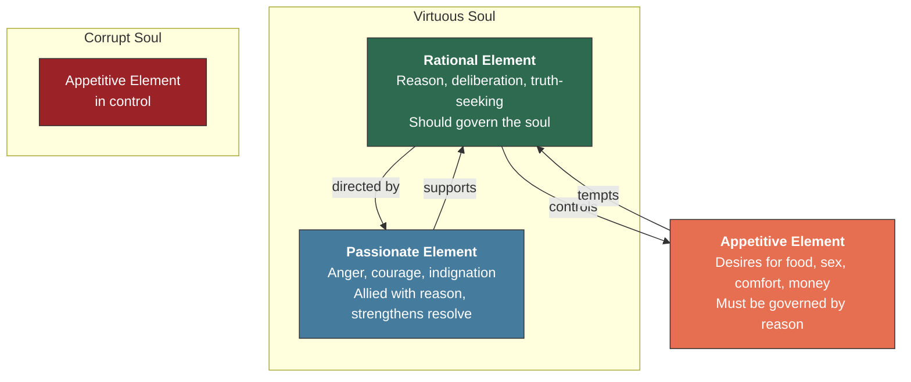
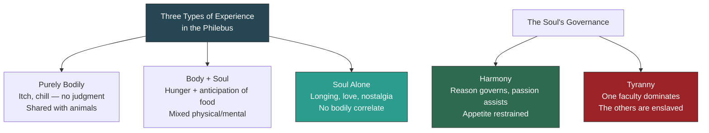

# The Soul Divided

Imagine you are a young Athenian named Glaucon, twenty-three years old, restless, sharp-tongued, and not entirely convinced by the old man sitting across from you. It is the summer of roughly 375 B.C. The agora is emptying in the heat. You have just finished listening to Socrates dismantle an opponent's argument about justice — the usual thing, the just life is the better life, virtue is its own reward — and you are not satisfied. Something gnaws at you. The argument felt too clean, too philosophical, too disconnected from the world as you actually experience it. So you lean forward and say something that will echo through twenty-four centuries of moral philosophy: "Socrates, I believe all that. But I want to know whether it's *true*. Not whether it sounds noble — whether it holds up when the stakes are real."

And then you tell him a story. You have borrowed it from Lydian lore, a tale traders carry along the caravan routes like a jewel wrapped in cloth. Imagine a shepherd named Gyges, tending his flocks in the hills of Lydia, a kingdom far to the east where the richest man alive — Croesus, they say — is reputed to be Gyges' descendant. One day an earthquake opens a chasm in the earth. Gyges descends and finds a bronze horse with a hollow body. Inside is a corpse wearing a golden ring. He takes the ring and discovers, quite by accident, that turning the collet toward his palm makes him invisible. He tests it. He walks into the palace. No one sees him. He seduces the queen, kills the king, and takes the throne.

You pause. Then you ask the question: "If *you* had that ring, Socrates — if no one could ever catch you, if every consequence were removed — would you still be just?"

Socrates does not answer immediately. And that silence — that long, uncomfortable silence in the Athenian heat — is where the real work of psychology begins.

---

## The Challenge You Cannot Ignore

You need to understand why Glaucon's question is so dangerous before you can appreciate what Plato does with it. The challenge is not merely philosophical. It is existential. It asks whether justice — whether *any* moral behavior — is anything more than a social contract enforced by the fear of punishment.

Glaucon does not present this as his own belief. He is too clever for that. He frames it as the strongest possible objection to everything Socrates has taught. He sorts human goods into three categories. There are things valued purely for their own sake — harmless pleasures, like scratching an itch. There are things valued both for themselves and for their consequences — health, knowledge, sight. And there are things valued only for their consequences — physical training, medical treatment, earning a living. Where, Glaucon asks, does justice belong?

The conventional answer is the second category: justice is good in itself *and* good for what it brings. But Glaucon pushes back. Strip away the consequences. Imagine you could be unjust with absolute impunity — no punishment, no reputation loss, no social fallout. Would anyone still choose justice? The legend of Gyges' ring is designed to make that question impossible to dodge.

And here is what makes the challenge truly formidable: Glaucon is not some cynical outsider. He is Socrates' own student, a young man who *wants* to believe in justice. He is asking the question on behalf of every honest person who has ever watched a corrupt executive avoid prison, a cheating partner prosper, a ruthless politician gain power. He is asking the question you ask yourself at two in the morning when no one is watching.

> [!TIP]
> **Stop and Think:** Imagine you possessed Gyges' ring — total invisibility, total impunity. No camera would catch you, no friend would discover your secret, no legal system would hold you accountable. Would your behavior change? Be honest with yourself. If it would change even slightly, what does that reveal about the *actual* reason you behave morally? Is it virtue — or is it surveillance?

---

## Thrasymachus: The Realist's Case

Before Glaucon pressed the argument further, another voice had already made the case with considerably less subtlety. Thrasymachus, a professional rhetorician and Sophist, had interrupted Socrates earlier in the *Republic* with a blunt declaration: justice is nothing more than the advantage of the stronger. The powerful make the laws. The laws serve the powerful. And anyone who tells you otherwise is either naive or lying.

Thrasymachus paints a picture that will sound grimly familiar. The rich avoid taxation through guile while the poor sink deeper into debt. The tyrant — the man who would be imprisoned if he were a mere citizen — is praised for the power, wealth, and loyalty he commands. The unjust partner in any business deal consistently gains advantage over the just one. "You fancy," Thrasymachus tells Socrates, "that the shepherd fattens the sheep with a view to their own good and not to the good of himself or his master." The shepherd does not serve the sheep. The ruler does not serve the ruled. Why should you expect the just person to serve justice?

This is not a philosophical puzzle. It is a description of the world as Thrasymachus sees it — a world in which power determines morality and innocence is just another word for weakness.

You might recognize this argument. It surfaces every time someone says "nice guys finish last" or "you have to be ruthless to succeed" or "the system is rigged." Thrasymachus is not a historical curiosity. He is the voice in your head that whispers, at the worst possible moment, that honesty is a luxury only the privileged can afford.

> [!TIP]
> **Stop and Think:** Thrasymachus argues that justice serves the powerful, not the just. Think of a concrete example from your own life or your community — a situation where someone benefited from cutting corners while someone who played fair lost out. Did that experience shake your belief in justice? How did you reconcile the evidence with your values?

---

## Socrates' Rebuttal: The Soul Has Three Parts

Now comes the move that would shape two thousand years of psychology. Socrates does not argue against Thrasymachus and Glaucon by citing scripture or appealing to divine authority. He does something far more radical: he looks *inside* the human soul and finds that it is not one thing but three.

The soul, Socrates argues in Book IV of the *Republic* (441), contains three distinct principles. There is the **rational** element — the part that calculates, reasons, deliberates, and seeks truth. There is the **appetitive** element — the part that craves food, sex, comfort, money, and all the bodily satisfactions. And there is the **passionate** element — the part that feels anger, indignation, courage, and the fierce desire to defend what it loves.

Think of a city, Socrates suggests. A city contains merchants, artisans, and laborers (the productive class), soldiers and auxiliaries (the defenders), and counsellors or philosopher-kings (the rulers). A city functions well when each class does its proper work and does not interfere with the others. The soul works the same way. You are **virtuous** — truly virtuous, not merely compliant — when your rational element governs your appetites and your passionate element serves as an ally to reason, strengthening your resolve against temptation.

This is the **tripartite soul**, and it is one of the most consequential ideas in the history of psychology. Not because it is anatomically correct — Plato was not doing neuroscience — but because it offers a model of internal conflict that remains startlingly useful. When you are on a diet and reach for the chocolate anyway, your appetitive element has overthrown your rational one. When you feel a surge of rage at an injustice and channel it into productive action, your passionate element is serving reason well. When you stay up until 3 a.m. doom-scrolling despite knowing you should sleep, your appetitive element has seized control and your rational element is, for the moment, a deposed monarch.

*Figure: The tripartite soul in Plato's Republic. In the virtuous soul, reason governs appetite and passion serves as reason's ally. In the corrupt soul, appetite seizes control.*

---

## Harmony, Not Pleasure

Here is where Plato departs most sharply from the common-sense view of the good life. The goal of human existence is not the maximization of pleasure. It is the achievement of **harmony** — a condition in which each part of the soul performs its proper function without encroaching on the others.

You might wonder why Plato uses the word "harmony" rather than, say, "control" or "discipline." The answer lies in his debt to Pythagoras. The Pythagoreans, a philosophical and mathematical school active in southern Italy from the sixth century B.C. onward, believed that the ultimate reality of the universe was mathematical relationship — ratio, proportion, the intervals between musical notes. They discovered that musical consonance depends on simple numerical ratios: the octave is 2:1, the fifth is 3:2, the fourth is 4:3. Music, for the Pythagoreans, was not entertainment. It was the audible expression of cosmic order.

Plato absorbed this vision completely. Ancient Greek medicine already employed music therapeutically — using specific modes (scales) to treat emotional disturbance. The Spartan ephors carefully regulated which musical modes citizens could hear, believing that certain rhythms and scales produced courage while others produced softness. This was not superstition. It was a working theory of psychological influence through structured sound.

When Plato says the soul must be harmonized, he means something precise. Just as a lyre produces beautiful music when its strings are properly tuned — each string at the right tension, none too tight or too loose — the soul produces a beautiful life when its three elements are in proper proportion. The rational element must set the pitch. The passionate element must hold the tension. And the appetitive element must vibrate at the frequency reason dictates.

> [!TIP]
> **Stop and Think:** Think about a time when your desires, your emotions, and your reason were all pulling in the same direction — a moment of deep alignment where you wanted what you felt was right and knew was wise. How did that feel compared to the more common experience of inner conflict? Was the aligned state more like pleasure, or something else entirely — something closer to what Plato might call harmony?

---

A Socratic interruption here, if you will permit one. You might object: "Surely this is just metaphor. The soul does not literally contain three parts. You cannot perform surgery and find the 'appetitive element' in one lobe and the 'rational element' in another." And you would be right — Plato is not offering a neuroanatomy lesson. But consider this: when a modern psychologist talks about "dual-process theory" — the idea that human cognition involves a fast, automatic, emotional system (System 1) and a slow, deliberate, rational system (System 2) — they are offering a model that maps almost exactly onto Plato's appetitive and rational elements. The map is not the territory. But a good map saves you from walking off cliffs.

---

## The Disease of Injustice

Socrates does not stop at describing the three parts of the soul. He draws a conclusion that is as bold as it is counterintuitive: injustice is a disease, and the unjust person is sick.

In the *Timaeus* (86), Plato states explicitly that both madness and ignorance are diseases of the soul. Acts of injustice and wrongdoing are perpetrated by the mad or the ignorant — people whose internal harmony has broken down, whose appetitive element has seized control, whose rational element has been dethroned. To ask whether the unjust person is happier than the just person, Socrates argues in *Republic* IV (445), is as ridiculous as asking whether the diseased person is healthier than the healthy one.

This is a staggering claim, and you should feel its force. Thrasymachus and Glaucon have just told you — with considerable evidence — that the unjust often prosper. The tyrant lives in luxury. The cheater wins the prize. The corrupt executive retires to a seaside villa. Socrates is saying that none of that matters, because the tyrant, the cheater, and the corrupt executive are *psychologically sick*. They may appear prosperous on the outside, but their souls are in a state of internal civil war — appetites raging unchecked, reason deposed, passion enlisted in the service of greed rather than justice.

You do not have to accept this claim to appreciate its power. It reframes the entire debate. The question is no longer "Does crime pay?" but "What does it cost?" — not in external consequences, but in the architecture of the self.

> [!TIP]
> **Stop and Think:** Imagine two people. One is wealthy, powerful, and universally feared — but inwardly consumed by suspicion, envy, and the knowledge that everything he has was taken by force. The other is modest, honest, and largely overlooked — but inwardly calm, integrated, and certain of her own integrity. Which person would you rather *be*? Not which life looks better from the outside — which inner experience would you choose? Does your answer change the way you evaluate Thrasymachus's argument?

---

## Body and Soul: The Philebus

Plato extends the analysis in the *Philebus*, a later dialogue that examines the relationship between pleasure and the good life. Here he identifies three different types of experience — and in doing so, he draws a line between the body and the soul that would haunt psychology for millennia.

The first type is purely bodily: an itch that can be soothed by scratching, a chill relieved by warmth. These are simple physiological events. They involve no judgment, no desire beyond the immediate stimulus. A dog scratches an itch. A lizard basks in the sun. There is nothing distinctively human about them.

The second type involves both body and soul working together: the painful hunger that is happily relieved by the anticipation of food. Here the body provides the raw sensation — the emptiness, the discomfort — but the soul contributes something extra: the *anticipation*, the image of the meal, the pleasure of imagining relief. This mixed experience is richer than the purely bodily one, and it is distinctively psychological. The hunger itself is physical; the relief of anticipation is mental.

The third type exists within the soul alone: longing, love, nostalgia, the ache of missing someone who is far away. These feelings have no direct bodily correlate. You cannot scratch a longing. You cannot warm yourself against nostalgia. They are generated entirely within the soul's own operations — its memories, its desires, its capacity to form images of what is absent.

This three-part taxonomy of experience is quietly revolutionary. Plato is saying that the soul has its own domain of feeling — experiences that arise from the soul's own nature, not from the body's needs. The body is not irrelevant, but it is not the whole story. And the soul's own experiences — love, longing, the pursuit of truth — are the highest and most distinctively human ones.

> [!TIP]
> **Stop and Think:** Consider the difference between hunger and loneliness. Both are unpleasant. Both motivate you to act. But hunger arises from the body and can be satisfied by eating, while loneliness arises from the soul and cannot be satisfied by any purely physical remedy. What does this distinction tell you about the relationship between your body and your mind? Are there experiences you have that seem to belong entirely to the soul — that no amount of physical comfort can resolve?

---

## The Tyranny of Appetite

The *Philebus* offers one final insight that ties everything together. The soul, Plato warns, will be governed either by a harmony of its faculties or by the tyranny of one of them over the others. There is no neutral ground. If reason does not govern, then appetite will — and appetite, unlike reason, has no internal limit. Reason tells you when enough is enough. Appetite never does.

Consider the implications. The person ruled by appetite is not free — they are enslaved to their own desires. The person ruled by passion (anger, ambition, the need for dominance) is equally unfree — they are a prisoner of their own emotions. Only the person governed by reason — with passion as reason's ally and appetite properly restrained — achieves something that deserves the name of freedom.

This is Plato's answer to Thrasymachus and Glaucon. The unjust person may appear free. They may appear powerful. But they are slaves — slaves to the very appetites they think they are indulging. The just person, by contrast, is the only truly free person, because they alone have achieved internal self-governance.

You do not have to believe this. But you should understand what Plato is claiming: that the good life is not a matter of what you *have* but of what you *are* — of the internal architecture of your soul. And that architecture is not given. It must be built, through education, through practice, through the painful and ongoing work of bringing your appetites into line with your reason.

*Figure: Plato's taxonomy of experience in the Philebus and his theory of the soul's governance. The soul alone generates the highest experiences; harmony among the faculties produces the good life.*

---

A second interruption, if you will. You might be thinking: "This is all very well, but it sounds like Plato is saying we should suppress our desires and live like monks." He is not. Plato is not an ascetic. He does not say that appetite is evil. He says that appetite must be *governed*. The difference is enormous. A city needs merchants — it needs people who produce, trade, and create material goods. But a city ruled by merchants, with no soldiers to defend it and no wise counsellors to guide it, is a city that will be conquered or will collapse into corruption. The same is true of the soul. Appetite is necessary. It is just not qualified to rule.

---

> [!IMPORTANT]
> Plato's answer to Thrasymachus and Glaucon is not an argument about consequences. It is an argument about *constitution*. The just person is not happier because justice leads to better outcomes — though Plato believes it does, in the long run. The just person is happier because justice is the health of the soul, and injustice is its disease. To ask whether the unjust person is happier than the just person is to commit a category error — like asking whether a broken bone is more comfortable than a whole one. The question answers itself, once you understand what justice *is*: not a set of behaviors enforced by fear of punishment, but a state of internal harmony in which reason governs, passion supports, and appetite knows its place. This model — the soul as an organized system whose health depends on the proper relationship among its parts — is one of the earliest and most enduring contributions of Greek thought to the science of psychology.

---

## Speaking of Gyges' Ring...

The legend of Gyges has never stopped provoking thought. In the twentieth century, the philosopher John Rawls used a version of it — the "veil of ignorance" — as the foundation of his theory of justice. Rawls asked: what kind of society would you design if you did not know in advance what position you would occupy in it? Behind the veil of ignorance, stripped of your knowledge of your own talents, wealth, gender, or race, what principles of justice would you choose? The structure of the thought experiment is pure Plato: strip away the incentives, strip away the consequences, and ask what remains.

The ring itself has traveled through literature with remarkable persistence. J. R. R. Tolkien placed a version of it at the center of his *Lord of the Rings* — a ring of invisibility that corrupts everyone who wears it, turning even the humblest hobbit into a tyrant. Tolkien, a devout Catholic and a careful reader of classical literature, understood what Plato was saying: the capacity for injustice is not external. It lives inside the soul, waiting for the removal of consequences to reveal it.

And then there is the question that Glaucon actually asked — the one that has no comfortable answer. If you had the ring, would you be just? Plato's answer is that only a person whose soul is already harmonized — whose reason already governs — would resist the temptation. The ring does not create the tyrant. It reveals whether there was a tyrant inside all along.

---

You have watched Plato build, piece by piece, a psychology of the inner life: the soul divided into rational, appetitive, and passionate elements; virtue as harmony among them; injustice as disease; the body as the source of lower pleasures and the soul as the seat of the highest ones. But a question now rises that Plato himself found difficult to resolve, and that his greatest student would answer in a radically different way. If the soul is immortal and the body is its prison — if the truest experiences belong to the soul alone — then what is the point of studying the body at all? What kind of science of the human being can you build if you start from the premise that the body is merely a temporary vessel? Aristotle, Plato's student for twenty years, would reject this premise entirely and build a psychology grounded not in the soul's escape from the body but in the body's partnership with the soul. That is where we go next.

---

## References

Plato. (ca. 375 B.C.). *Republic*, Books I, II, and IV. Translated by Benjamin Jowett.

Plato. (ca. 360 B.C.). *Philebus*. Translated by Benjamin Jowett.

Plato. (ca. 360 B.C.). *Timaeus*. Translated by Benjamin Jowett.

Robinson, D. N. (1995). *An Intellectual History of Psychology* (3rd ed.). University of Wisconsin Press.

Rawls, J. (1971). *A Theory of Justice*. Harvard University Press.

Tolkien, J. R. R. (1954). *The Lord of the Rings*. George Allen & Unwin.

Kahneman, D. (2011). *Thinking, Fast and Slow*. Farrar, Straus and Giroux.

*Module 5 of 8 complete.*
