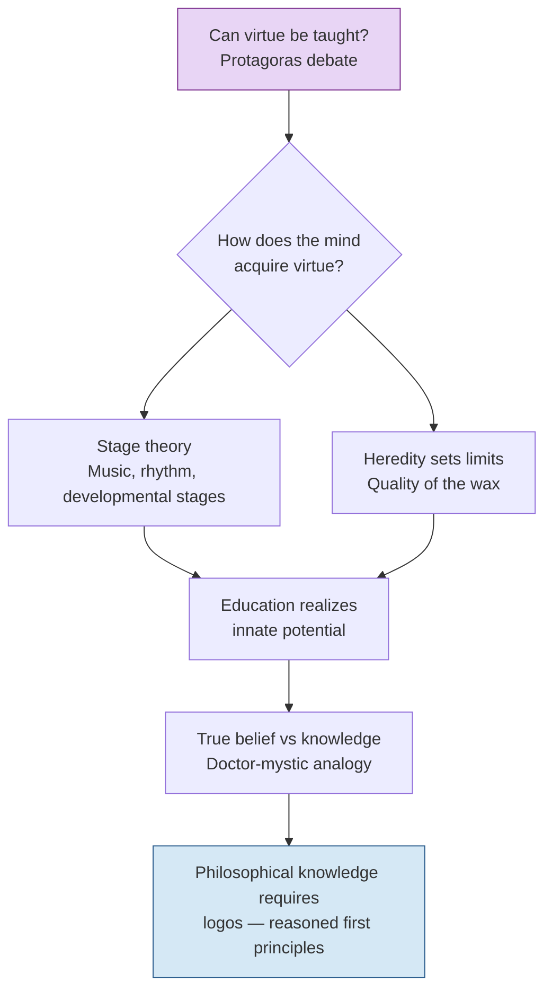

# Can Virtue Be Taught?

Hippocrates was terrified, and he had every right to be. It was still dark outside when he arrived at the house where Protagoras was staying, shaking Socrates awake before dawn. He wanted — desperately, impulsively — to become a student of the most famous teacher in the Greek world. Protagoras, the man who claimed he could make anyone a better citizen, a more virtuous person, for a fee. Socrates, characteristically, did not reassure him. Instead, he asked a question that would haunt philosophy for the next two thousand years.

If you wanted to become a sculptor, you would go to Pheidias. If you wanted to study medicine, you would seek out Asclepius. Each master trades in a specific craft, a teachable skill. But what exactly would Protagoras teach you? What is the *subject matter* of his expertise? When Protagoras answers — with supreme confidence — that he teaches **virtue** (*arete*), Socrates presses harder: *Can virtue actually be taught?*

It sounds like a simple question. It is anything but. Consider a wealthy Athenian father, desperate to raise a son who will govern wisely, fight bravely, and live temperately. He hires the best tutors, exposes the boy to music and gymnastics, surrounds him with exemplary citizens. Yet the son grows up reckless and cruel. Meanwhile, a poor boy from the pottery district, educated only by the rough streets of the Piraeus, turns out to be just, brave, and thoughtful. What went right? What went wrong? If virtue were truly teachable — like pottery, like shipbuilding — then good teachers should reliably produce good students. They do not.

Socrates found himself in a bind. He was, after all, a teacher. His entire philosophical mission depended on the belief that examining one's life could make a person *better*. If virtue cannot be taught, then what was he doing in the agora every day, pestering generals about courage and politicians about justice? He needed an answer. And he would not find one quickly. The dialogue with Protagoras ends in a tangle of contradictions, neither man able to settle the question. It would take the *Republic*, composed years later during Plato's middle period, to offer something closer to a resolution. And that resolution would reshape how we think about the mind itself.

## The Harmony That Cannot Be Taught

In the *Republic*, Plato arrives at a striking analogy. Virtue, he argues, is not a body of knowledge that can be transmitted from teacher to student, the way a potter shows an apprentice how to shape clay on a wheel. Virtue is more like **harmony** — a relationship between parts of the soul, a balance that either exists or does not.

Think about it this way. You cannot *teach* someone to hear harmony. Either their ears are intact, or they are not. A person born deaf cannot be instructed into musical perception. But — and this is crucial — a person with healthy ears still needs exposure to music to develop the capacity. A child raised in total silence, never hearing a single note, would not spontaneously compose a symphony. The native endowment is necessary but not sufficient. Experience completes what nature begins.

Plato applies this logic directly to moral development. Except for what he calls "accidents of nature" — people whose souls are fundamentally disordered — every person is born with a soul capable of comprehending the good. The capacity is innate. But it must be *realized* through proper education, and that education must unfold in stages.

> [!TIP]
> **Stop & Think:** You have probably learned to ride a bicycle. No amount of verbal instruction could teach you the *feel* of balance — the micro-adjustments your body makes without conscious thought. Someone could describe the physics perfectly, and you would still fall over. Yet without practice, a person with perfect coordination would never ride. Is Plato's point about virtue similar — that there is something native that only experience can awaken?

This is where Plato's thinking becomes genuinely developmental. The properly instructed child, he argues, passes through successive stages of moral education, each building on the last. It is not unlike learning to shoot a bow. An archer improves with practice, becoming more accurate, more consistent. But we would never say that practice *created* the archer's spatial perception. The ability to judge distance, trajectory, and wind existed as a native endowment. Practice made it useful.

Plato applies the same principle to space perception in the *Timaeus*. The child who receives proper instruction and gains experience will become more accurate — more expert, say, at hitting a target. Yet instruction and experience did not *convey* space perception itself. It existed *a priori*. Experience of a world of visible objects requires such an endowment, even as it arouses capacities that would otherwise remain dormant.

> [!TIP]
> **Stop & Think:** Consider a child who has never seen a straight line — raised, say, in a world of fog where all edges are blurred. Would that child still possess the *concept* of straightness? Plato would say yes: the idea is innate, waiting to be awakened. Modern developmental psychologists like Elizabeth Spelke have argued something remarkably similar — that infants possess "core knowledge" of objects, numbers, and geometry before any formal instruction. Have you ever encountered a piece of knowledge that felt less like learning and more like *remembering*?

## Music, Rhythm, and the Moral Infant

If virtue is a kind of harmony, then it makes sense that Plato would turn to **music** as the primary vehicle of moral education. In the *Laws*, his final and most practical work, the Athenian stranger who serves as the teacher lays out a developmental psychology of remarkable specificity.

Children, the stranger observes, do not know virtue and vice *as* virtue and vice. A young child experiences the moral world entirely through **pleasure and pain**. What feels good is "right"; what hurts is "wrong." This is not a failure of the child's character — it is simply the starting point of development. The child instinctively loves what is pleasurable and hates what is painful. The educator's task, therefore, is to arrange the child's environment so that true virtue *becomes* the object of love and vice *becomes* the object of hatred.

How? Through rhythm and song. There are, Plato insists, critical periods of development when moral lessons are most effectively conveyed by music. Virtue is fundamentally a harmonious relationship between body and mind, and music — with its regular rhythms, its patterns of tension and resolution — trains the child's soul to recognize and seek harmony without the child ever knowing it is being taught.

> [!TIP]
> **Stop & Think:** Think about the lullabies you may have heard as a child, or the nursery rhymes that taught you language. Did you *choose* to find them soothing? Or did the rhythm work on something deeper — something below conscious choice? Plato would say that this is exactly how early moral education operates: not through rational argument, but through patterns that shape the soul before reason awakens.

The *Laws* goes even further. Close physical contact between parent and infant is essential. The rhythmic rocking of a young child — the gentle motion of being carried, swayed, bounced — is not merely comforting. It is, Plato writes, actively good for development. Infants "should live, if that were possible, as if they always were rocking at sea." The constant motion soothes, regulates, and develops the body-mind connection that will later become the foundation of virtue.

**Paideia** — the Greek concept of education as formation of the whole person — is not instruction in this framework. It is cultivation. You do not teach a seed to become a tree. You provide soil, water, sunlight, and protection. The seed contains its own blueprint. Education, for Plato, is the same: an arrangement of conditions under which the innate capacity for virtue can unfold according to its nature.

> [!TIP]
> **Stop & Think:** Modern research on infant-caregiver attachment (Bowlby, Ainsworth) suggests that early physical closeness, rhythmic interaction, and responsive caregiving shape a child's emotional regulation for life. Could Plato's insistence on rocking and physical contact be an early intuition about attachment? What would it mean for the history of psychology if one of the oldest developmental theories turned out to be partially correct?

## The Quality of the Wax

Here is where the argument takes a harder turn. If virtue is innate but needs proper conditions to develop, then **heredity** sets the limits of what education can achieve. Plato makes this explicit. Not all souls are equally receptive. Some are born with a capacity for virtue so diminished that no amount of education will produce a just person — just as no amount of music lessons will help someone born without the auditory apparatus to perceive harmony.

This is sometimes called the "quality of the wax" metaphor, drawn from a different Platonic dialogue. Imagine that every person's mind is a wax tablet, and that the quality of the wax varies from person to person. Some tablets are made of fine, smooth wax that receives impressions clearly and retains them. Others are made of rough, impure wax where impressions blur and fade. Still others are made of wax so hard that nothing can be inscribed at all. Education works *on* this wax, but it cannot change the wax itself.

The implication is stark. **Heredity** determines the ceiling; education determines whether you reach it. A person born with fine wax but given no education will never develop virtue — the capacity remains latent. A person born with rough wax but given the finest education in the world will still fall short. Both nature and nurture are necessary; neither is sufficient.

Plato was entirely consistent in this view. Having concluded that knowledge of fundamental principles cannot come from direct perception — that you cannot *see* justice or *taste* courage — he had to look beyond experience for the source of moral knowledge. All that remained, once experience was dismissed as the origin of virtue, was heredity. The soul brings something with it into the world. Education merely helps that something mature.

> [!TIP]
> **Stop & Think:** The "quality of the wax" metaphor raises uncomfortable questions that Plato himself recognized. If heredity determines the limits of virtue, does that mean some people are simply *incapable* of being good? And if so, who decides which wax is "fine" and which is "rough"? Plato's answer — philosopher-kings who can see the good directly — is one of the most contested ideas in the history of political thought. What safeguards, if any, could prevent such a system from becoming a justification for tyranny?

## True Belief and the Doctor-Mystic Problem

So far, we have been asking whether virtue can be taught. But there is a deeper question lurking beneath it: what is the *difference* between truly knowing something and merely believing it correctly?

Plato offers a vivid analogy. A doctor examines a patient and, on the basis of symptoms — excessive thirst, frequent urination, unexplained weight loss — concludes that the patient has diabetes. A mystic gazes into a crystal ball and announces the same diagnosis. Suppose, in fact, the patient *is* diabetic. Both the doctor and the mystic hold a **true belief**. They believe something that happens to be correct.

But clearly, their knowledge differs. The doctor can *explain* why the symptoms point to diabetes. The doctor can test the diagnosis, revise it if new evidence appears, teach others how to reach the same conclusion. The mystic cannot do any of these things. The mystic's belief is correct, but it is correct by accident — it floats free of any rational grounding.

For Socrates, philosophical knowledge differs from both. It is unlike the doctor's knowledge because it concerns itself not with probabilities but with **certainty** — with the kind of truths that cannot be otherwise. And it is unlike the mystic's "knowledge" because it proceeds from rational first principles, from **logos** — the reasoned account, the logical structure, the *why* behind the *what*.

**Logos** is the key term here. It means, roughly, "reasoned account" or "rational explanation." To possess true knowledge, on the Socratic view, is not merely to hold a correct belief. It is to be able to give a *logos* — to explain, to justify, to trace the belief back to its foundations. A person who believes the right thing for the wrong reasons does not truly *know* it.

> [!TIP]
> **Stop & Think:** Imagine two students who both answer a math problem correctly. Student A solved it step-by-step, understanding each operation. Student B copied from a neighbor. Both produced the same answer — a "true belief." But only Student A possesses knowledge in Plato's sense. Can you think of a time when you believed something true but could not explain *why* it was true? Did that feel like knowledge, or something less?

## How the Pieces Fit Together

The four concepts in this module — the Protagoras debate, stage theory, heredity versus education, and the doctor-mystic analogy — are not separate ideas. They form a single, coherent argument about the nature of the mind.

*Figure 6.1. The structure of Plato's argument about virtue and knowledge. The question posed in the Protagoras (top) branches into two developmental paths — stage theory and heredity — that converge on the distinction between true belief and philosophical knowledge (bottom).*

The argument begins with a question Socrates could not answer in the *Protagoras*: can virtue be taught? The early dialogue ends in frustration, caught in contradictions. But the *Republic* resolves the impasse by redefining what "taught" means. Virtue is not taught the way a craft is taught — through instruction and imitation. It is *developed*, like a native capacity, through carefully staged exposure to music, rhythm, and communal life. Heredity determines the quality of the raw material; education determines how far that material can be shaped. And the goal of this shaping is not mere true belief — accidentally correct opinions — but genuine knowledge, grounded in **logos**, capable of withstanding rational scrutiny.

This is why Plato insists, in his political writings, that the interests of the people and their *knowledge* of their interests are two different things. People can be happy in their vices, their madness, their ignorance, even their servility. Contentment is no guarantee of virtue. The good life requires more than feeling good. It requires *knowing* good — and that knowledge, for Plato, is the hardest thing a human being can achieve.

## Speaking of Knowledge...

You might wonder whether Plato's framework survives contact with modern cognitive science. The answer is surprisingly complex. Contemporary research on **core knowledge** — the idea that infants are born with innate systems for understanding objects, numbers, and social agents — echoes Plato's nativism almost exactly. Elizabeth Spelke, at Harvard, has spent decades demonstrating that babies as young as three months expect objects to follow physical laws, prefer larger sets of items, and distinguish agents from inanimate objects. None of this is taught. It is, in Plato's language, *a priori*.

At the same time, the developmental stage theory has found echoes in the work of Jean Piaget, who argued that children pass through invariant stages of cognitive development, each building on the last. And the "quality of the wax" metaphor anticipates modern discussions of gene-environment interaction — the recognition that genetic predispositions set a range of possibilities, while experience determines where within that range a particular individual lands.

Plato was wrong about many things. His politics were elitist, his metaphysics were speculative, and his dismissal of sensory experience as a source of knowledge was too extreme. But his core insight — that the mind brings something *with it* into the world, and that education works by developing rather than creating cognitive capacities — has proven remarkably durable.

---

Plato's answer to the Protagoras question — that virtue is innate but must be developed through staged education — leaves one enormous problem unsolved. If knowledge of the good is the goal, and if most people lack the philosophical training to achieve it, then who should govern? Plato's answer, as you may have guessed, involves philosopher-kings, the allegory of the cave, and a vision of the ideal state so ambitious — and so troubling — that it has shaped political thought for millennia. That is where we are headed next.

> [!IMPORTANT]
> **The Takeaway:** Can virtue be taught? Plato's mature answer is: not exactly. Virtue is a native capacity — like harmony perception or spatial judgment — that requires proper conditions to develop. Heredity determines the ceiling; education determines whether you reach it. But developing virtue is not the same as possessing knowledge. True knowledge requires **logos** — a reasoned account of *why* something is true, not merely a correct belief *that* it is true. This distinction between true belief and philosophical knowledge is one of the most consequential ideas in the history of psychology, because it forces us to ask: what does it mean to truly *know* something, as opposed to merely believing it correctly? The answer, for Plato, is everything.

---

## References

- Plato. *Protagoras*. Translated by various. Available in multiple editions.
- Plato. *Republic*. Translated by various. The developmental argument appears primarily in Books II–IV and VII.
- Plato. *Timaeus*. The discussion of space perception and native endowment.
- Plato. *Laws*, Books II and VII. The Athenian stranger's developmental psychology, including the rocking-at-sea passage (790).
- Spelke, E. S. (2000). Core knowledge. *American Psychologist*, 55(11), 1233–1243.
- Piaget, J. (1952). *The Origins of Intelligence in Children*. International Universities Press.
- Bowlby, J. (1969). *Attachment and Loss, Vol. 1: Attachment*. Basic Books.

*Module 6 of 8 complete.*
