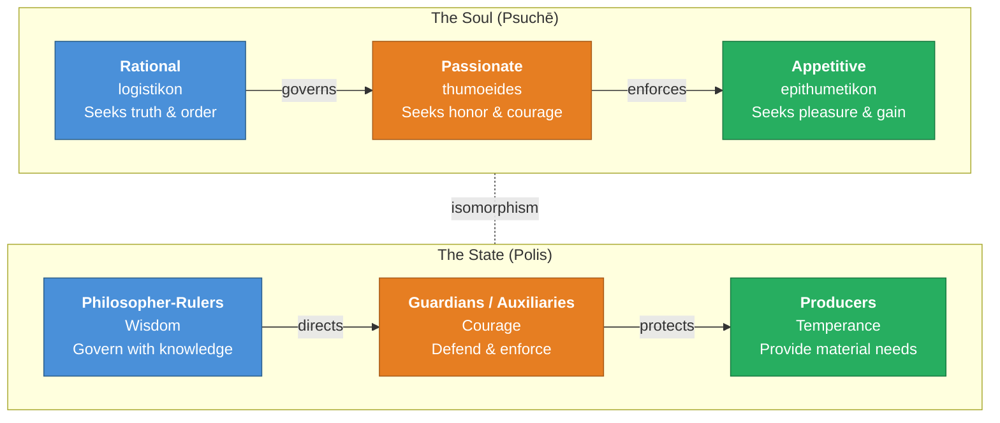
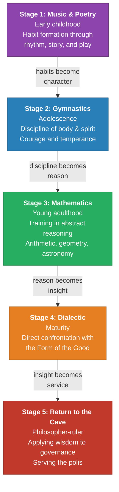

# Module 7 — The Philosopher King

Diotima of Mantinea stands at the threshold of the Telesterion, the great initiation hall at Eleusis, watching a procession of candidates file into the torchlit darkness. Each has undergone months of purification — fasting, ritual baths, abstention from certain foods and words. They have traveled from across the Greek world: merchants from Miletus, soldiers from Corinth, farmers from the Peloponnesian countryside. Some walk with the confident stride of those who believe they already know what awaits them inside. Others shuffle forward with the hesitant gait of people who suspect that whatever they are about to encounter will dismantle the certainty they have carried since childhood.

Diotima has seen this before. She has watched hundreds of initiates cross this threshold, and she has observed something that never ceases to unsettle her. The ones who enter with the most rigid confidence are often the ones most shattered by the mysteries. The ones who enter trembling sometimes emerge radiant, as though they had always known the secret and merely needed permission to remember it. She has come to believe that the transformative power of initiation does not consist in the injection of new knowledge. It consists in the *removal* of false knowledge — the stripping away of assumptions that had calcified into identity.

She thinks of a young Athenian she once questioned about the nature of beauty. He began by praising a particular face, then a particular statue, then the beauty of laws and institutions. She pressed him: was beauty itself located in any of these things, or did these things merely *participate* in something larger? The young man — she remembers his name was Socrates — fell silent for a long moment. Then he laughed. "I thought I knew," he said, "and now I see that I did not."

Diotima watches the last of the initiates disappear into the hall. She knows that some of them will emerge transformed, carrying a vision of something eternal that will reorganize their entire understanding of what a human life is for. She also knows that some will emerge unchanged, having witnessed the same symbols and heard the same words without any corresponding shift in their inner architecture. The ritual is identical for all of them. The outcome is not.

She has spent decades trying to understand why. Is the difference a matter of innate capacity? Of prior preparation? Of some quality of attention that some souls possess and others lack? She once believed the answer lay in love — in *eros*, the driving force that compels the soul upward from the beautiful body to the beautiful soul to the beautiful itself. But lately she has wondered whether love is sufficient. Whether, without a certain kind of education — a deliberate, structured, communal reshaping of how a person sees — even the most loving soul will remain trapped in the cave of its own assumptions.

She turns away from the Telesterion and walks into the cool evening air. The question she carries into the dark is one that will haunt political philosophy for the next two and a half millennia: *If the soul requires transformation before it can perceive truth, who has the authority to design and administer that transformation — and what happens to those who refuse it?*

---

## The Indictment

In 1945, Bertrand Russell published *A History of Western Philosophy*, a sweeping survey that earned him the Nobel Prize in Literature and the enduring irritation of every scholar who thought he had oversimplified their favorite thinker. Russell's treatment of Plato is particularly sharp. "It has always been correct to praise Plato but not to understand him," he writes. "This is the common fate of great men. My object is the opposite. I wish to understand him, but to treat him with as little reverence as if he were a contemporary English or American advocate of **totalitarianism**."

You can feel the sting of that sentence even now. Russell wrote it in the shadow of fascism and Stalinism, and he meant every word. For Russell, the *Republic* is a blueprint for a police state. The philosopher king is a dictator with better credentials. The censorship of poetry, the controlled breeding program, the rigid class structure — all of it pointed, in Russell's reading, toward a regime that would have made Mussolini nod in recognition.

It is an indictment that has stuck. Walk into any university seminar on Plato today and someone will raise the totalitarianism objection within the first fifteen minutes. It has become almost reflexive, a way of signaling critical sophistication: *Of course* Plato was brilliant, but look at the politics he proposed.

But pause for a moment and consider what Russell is actually doing. He is judging a fourth-century BCE Athenian by the standards of mid-twentieth-century British liberalism. He is assuming that the political vocabulary he inherited — democracy, freedom, individual rights — represents the final and correct framework for evaluating all political arrangements, across all cultures and all centuries. This is not understanding. This is projection.

**Consider this:** When you evaluate a historical thinker's political views, you face a choice. You can judge them by your own framework and declare them wanting. Or you can try to reconstruct the problems they were actually trying to solve, and assess whether their solutions were coherent given their premises. Russell chose the first path. Let us try the second.

> [!TIP]
> **Stop and Think:** Russell's critique of Plato relies on the assumption that individual liberty is the highest political value. But is that assumption universal, or is it the product of a specific historical moment? What other values might a society place above individual liberty — and would that automatically make it "totalitarian"?

---

## The Soul Mirrors the State

To understand why Plato proposed a state governed by philosophers, you need to recall his psychology. The soul, as you encountered it earlier, has three parts: the **rational** (*logistikon*), the **appetitive** (*epithumetikon*), and the **passionate** (*thumoeides*). Reason seeks truth and order. Appetite seeks pleasure and sustenance. Spirit seeks honor and recognition. When these three are in harmony — when reason governs, appetite obeys, and spirit enforces — the individual soul is just. When they are in conflict, the soul is in turmoil.

Plato's political theory is not an afterthought bolted onto this psychology. It *is* this psychology, scaled up. The just state, like the just soul, has three parts: the philosopher-rulers (reason), the auxiliaries or guardians (spirit), and the producers (appetite). Each class corresponds to a faculty of the soul. Each has its proper function. Justice in the state, like justice in the individual, consists in each part performing its function and not encroaching on the others.

*Figure 7.1 — The isomorphism between soul and state in Plato's Republic. Each class of citizen corresponds to a faculty of the soul, and justice in both domains requires that reason govern.*

This is not a metaphor. Plato means it literally. The state is the soul writ large. If you want to understand justice in the individual, look at justice in the state. If you want to understand corruption in the state, look at corruption in the individual. The two are reflections of one another.

Now, here is the crucial move. If the soul requires reason to govern — if an individual ruled by appetite alone is unjust and miserable — then a state ruled by appetite alone (which is what Plato believed democracy amounts to) is similarly unjust. The question is not *whether* the state should be governed by reason. The question is *how* to ensure that it is.

> [!TIP]
> **Stop and Think:** Plato's analogy between soul and state implies that a political system reflects the psychological condition of its citizens. Can you think of modern examples where a society's dominant values seem to mirror its citizens' psychological tendencies? Does consumer democracy, for instance, reflect an appetitive soul?

---

## The Case Against Democracy

You may find Plato's critique of democracy uncomfortable. Good. It is meant to be.

Plato does not attack democracy because he despises ordinary people. He attacks it because he has observed what happens when governance is divorced from expertise. Consider his argument step by step.

First, there is the problem of competence. A democracy, by definition, gives political power to every citizen regardless of their understanding of the issues at stake. You would not let a passenger vote on the flight path of the aircraft they are riding in. You would not let a patient vote on their own surgical procedure. Yet democracy asks every citizen to weigh in on matters of war, economics, justice, and education — matters that require, Plato argues, the same kind of specialized knowledge that surgery or navigation requires.

Second, there is the problem of the **tyranny of the majority**. Even if every citizen could be consulted (which Plato notes is impossible — infants, the incapacitated, and the imprisoned cannot participate), unanimous agreement is virtually nonexistent. What passes for democratic decision-making is actually majority rule, which means that a minority's preferences are systematically overridden. How is this different from tyranny? The tyrant imposes his will on the many; the majority imposes its will on the few. The mechanism differs. The coercion does not.

Third — and this is the argument that cuts deepest — Plato points to the historical record. The same Athenian democracy that elevated Pericles turned on him. The same democratic assembly that celebrated Socrates sentenced him to death. "Concerning whom I may truly say," Plato writes in the *Phaedo*, "that of all the men of his time whom I have known, he was the wisest and justest and best."

Read that sentence again. The democracy that prided itself on its freedom killed its best citizen. For Plato, this is not an accident. It is a *symptom*. A state governed by appetite — by the fluctuating passions and short-term desires of the majority — will inevitably destroy what is finest in its midst, because excellence is threatening to those who lack it.

> [!TIP]
> **Stop and Think:** Plato argues that democracy killed Socrates. Modern democracies have their own histories of persecuting dissenters — consider McCarthyism, the internment of Japanese Americans, or the suppression of minority voices in parliamentary systems. Does this vindicate Plato's critique, or does it merely show that democracy requires vigilance?

---

## The Social Contract Before Hobbes

Here is something that surprises many readers of the *Republic*: Plato advances a version of **social contract** theory more than two thousand years before Hobbes, Locke, and Rousseau made it the foundation of modern political philosophy.

"A State arises out of the needs of mankind," Plato writes. "No one is self-sufficing, but all have many wants." This is not a mystical claim about divine ordination or natural hierarchy. It is a pragmatic observation. People form communities because they cannot survive alone. The farmer needs the blacksmith's tools; the blacksmith needs the farmer's grain; both need the builder's shelter and the doctor's remedies. Division of labor is the origin of the polis.

This matters because it establishes a principle: the state exists to serve human needs. If it fails to do so — if the government frustrates the very interests that brought people together in the first place — then "either the government will be replaced or the social organization will fall to pieces." Plato is not defending the state as an end in itself. He is defending a *particular kind* of state — one governed by reason — as the best means to the end of human flourishing.

The distinction is critical. Russell accuses Plato of treating citizens as instruments of the state. But Plato's actual argument runs in the opposite direction: the state is an instrument of the citizens' deepest needs. The philosopher king does not rule for his own benefit. He rules because someone must, and because only someone who has been educated to perceive the Good can direct the polis toward it.

This raises an uncomfortable question for defenders of liberal democracy. If the state exists to serve human needs, and if human needs include the need for wisdom, justice, and the cultivation of virtue, then is a state that refuses to promote these goods — on the grounds that doing so would be paternalistic — actually fulfilling its contract with its citizens? Or is it abdicating its most fundamental obligation?

> [!TIP]
> **Stop and Think:** The social contract is usually associated with Enlightenment thinkers who used it to justify individual rights. Plato uses a similar starting point to justify philosopher rule. Does the same premise — "the state arises from human needs" — really support both conclusions? What additional assumption does Plato need to get from "the state serves human needs" to "philosophers must rule"?

---

## Paideia: Education as the Solution

The answer to the philosopher king puzzle is **paideia** — a Greek word that means something richer than "education" and something more structured than "culture." Paideia is the deliberate, communal process by which a society shapes its members toward excellence. It is not schooling in the modern sense, though it includes schooling. It is not merely training in skills, though it includes that too. Paideia is the transformation of the soul — the reorientation of a person's desires, habits, and perceptions so that they naturally tend toward what is good.

Plato's account of early education in the *Republic* is striking in its modernity. He describes children learning through play, absorbing good order so deeply that it becomes second nature. "When they have made a good beginning in a play," he writes, "and by the help we have given have gained the habit of good order, then this... will accompany them in all their actions and be a principle of growth to them.... Thus educated, they will invent for themselves any lesser rules which their predecessors have altogether neglected."

Read that carefully. Plato is not describing indoctrination. He is describing *internalization* — the process by which external rules become internal values. A child who has been raised well does not obey the law out of fear of punishment. She obeys it because she has developed the capacity to *see* why the law exists. She does not need to be told every rule; she can derive new rules from the principles she has internalized.

This is the difference between a subject and a citizen. A subject obeys because he is compelled. A citizen obebs because she understands. And the goal of paideia is not to produce subjects. It is to produce citizens — people whose reason has been cultivated to the point where they can govern themselves.

*Figure 7.2 — The stages of paideia in Plato's Republic. Each stage builds on the previous one, transforming raw potential into the capacity for wisdom and governance.*

> [!TIP]
> **Stop and Think:** Plato's educational program is explicitly designed to produce philosopher-rulers. But consider: every modern educational system also has a vision of the "ideal citizen" it is trying to produce. Is compulsory public education fundamentally different from Plato's paideia, or does it merely differ in the *content* of what it instills?

---

## The Philosopher King and the Cave

You encountered the Allegory of the Cave earlier in this chapter. Now you can see its political implications. The philosopher is the prisoner who has escaped the cave, seen the sun, and understood that the shadows on the wall are not reality. The philosopher king is the prisoner who, having seen the sun, *returns to the cave* — not because he wants to, but because the other prisoners need him.

This is the part of Plato's argument that is most often ignored by his critics. The philosopher does not *want* to rule. He would rather remain in the light, contemplating the eternal forms. But he returns because he owes a debt to the community that educated him. His governance is not an act of power-seeking. It is an act of service.

The philosopher is not so much a tutor or instructor as an **educator** — one who leads the pupil to a confrontation with the otherwise camouflaged truths of the eternal universe. The pilgrimage can begin only after a renunciation of the world of sense, only after the dialectical method has revealed the contradictions and sophistries that hitherto had passed for wisdom. Thus, in the most basic respects, the solution to the problem of governance is education, understood as acculturation.

Notice the radical implication. For Plato, the solution to political problems is not institutional design, constitutional checks and balances, or electoral mechanisms. It is *the transformation of the people who inhabit the institutions*. A corrupt person in a well-designed institution will find ways to corrupt the institution. A wise person in a poorly designed institution will find ways to make it serve justice. The variable that matters most is not the structure. It is the soul.

---

## Is Modern Democracy Any Less "Totalitarian"?

Here is where Russell's critique comes back to haunt not Plato, but us.

Every modern liberal democracy engages in compulsory education. Children do not choose whether to attend school. They do not choose the curriculum. They do not choose whether to learn the national language, the national history, the national values embedded in the textbooks they are assigned. We call this "education." Plato called it paideia. The mechanism is identical: the state, acting through institutions it controls, reshapes the minds of its citizens according to a vision of what those citizens should become.

Every modern state restricts speech in ways that Plato would recognize. Laws against obscenity, libel, treason, indecent exposure, and discrimination on racial, sexual, or religious grounds — each of these proscriptions entails the constriction of personal freedom, and some are based on explicitly paternalistic and moral foundations. Plato would be among the first to recognize that "totalitarianism" is not an approach restricted to any specific form of government.

Consider **genetic counseling**. In many countries, the state provides — and sometimes requires — genetic screening before marriage or reproduction. The stated goal is the health of future citizens. The unstated implication is that the state has a legitimate interest in the biological composition of its population. This is eugenics with a gentler name. Plato proposed something similar in the *Republic*: selective breeding to produce the best possible guardians. We recoil at his version. Do we recoil at ours?

Or consider the regulation of media. Plato wanted to censor Homer because he believed that stories about gods behaving badly would corrupt the young. Modern democracies regulate content through age restrictions, broadcast standards, and platform moderation policies. The justifications differ. The underlying logic — that the state has a right and a duty to protect citizens from harmful ideas — is the same.

None of this means that Plato was right about everything. His class system was rigid, his treatment of women inconsistent, his proposals for the guardian class often draconian. But the question Russell raises — *Is Plato a totalitarian?* — turns out to be far less useful than the question it displaces: *Is any state that seeks to shape its citizens' minds and values totalitarian, or is that simply what governance requires?*

> [!TIP]
> **Stop and Think:** If every state shapes its citizens through education, media regulation, and moral legislation, then the difference between Plato's philosopher king and a modern democratic government may be less about *whether* the state shapes souls and more about *who decides* how they are shaped. Is that distinction sufficient to make democracy non-totalitarian? Or is it merely a difference in who holds the power of paideia?

---

> [!IMPORTANT]
> **The Philosopher King and the Price of Wisdom**
>
> Plato's political theory is not an authoritarian fantasy bolted onto an otherwise brilliant philosophy. It is the *logical consequence* of his psychology and metaphysics. If the soul has a rational part that can perceive eternal truth, and if most people live dominated by appetite and passion, then governance by the wise is not tyranny — it is justice. The philosopher king does not impose his will. He perceives the Good and directs the polis toward it, just as reason in the well-ordered soul directs the appetites and passions toward their proper ends.
>
> The discomfort you feel reading this is itself instructive. It reveals the depth of your own commitment to democratic values — values that, as Plato would point out, you did not arrive at through pure reason but through the paideia of your own culture. You were taught to value liberty, equality, and individual rights. These are not self-evident truths. They are the shadows on *your* cave wall. Whether they are the *right* shadows — whether they correspond to something real and eternal, or merely to the preferences of a particular historical moment — is a question that Plato would insist you have not yet asked seriously enough.

---

## Speaking of...

**Diotima of Mantinea** — the priestess who taught Socrates about love — occupies a peculiar position in the history of philosophy. She is the only female figure in Plato's dialogues who is presented as a genuine intellectual authority, and her teaching on the ascent from particular beauty to the Form of Beauty is arguably the most important passage in the *Symposium*. Some scholars have argued that she is a fictional character invented by Plato to give his ideas the authority of a religious tradition older than philosophy itself. Others have pointed out that women served as priestesses and oracles throughout the Greek world, and that a female teacher of wisdom would not have been implausible to Plato's audience. What is certain is that Diotima's teaching — that love begins with the body but must ascend to the soul, and from the soul to truth itself — is the foundation on which Plato builds his entire educational theory. The philosopher king is the ultimate product of the process Diotima describes: a soul so thoroughly transformed by love of wisdom that it can perceive the Good directly, and can therefore govern others not by force but by understanding.

---

You have now seen how Plato's psychology leads inexorably to his political theory. The tripartite soul demands governance by reason; the cave demands that the enlightened return to help the prisoners; the social contract demands that the state serve human needs — and human needs, in Plato's view, include the need for wisdom. But Plato did not build his system alone. In the next module, you will encounter the thinker who both completed and overturned Plato's project — the student who dared to disagree with the master on nearly everything, and who in doing so created the other great pillar of Western psychology. His name was Aristotle, and he had a very different answer to the question of what it means to be human.

---

## References

Plato. *Republic*. Translated by Benjamin Jowett. Book II, 369; Book IV, 425.

Plato. *Phaedo*. Translated by Benjamin Jowett. 118.

Plato. *Symposium*. Translated by Alexander Nehamas and Paul Woodruff. Indianapolis: Hackett, 1989.

Russell, Bertrand. *A History of Western Philosophy*. New York: Simon & Schuster, 1945.

*Module 7 of 8 complete.*