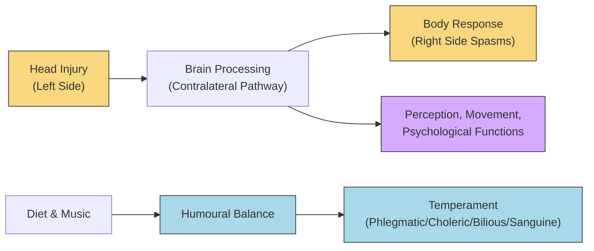
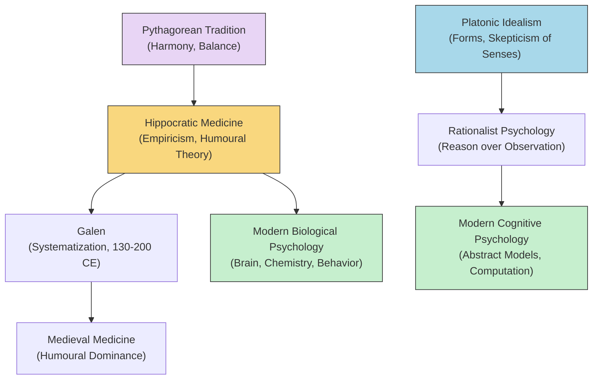

# Chapter 2: Psychology in the Hellenic Age

## Module 8: The Physician's Eye

---

A man is dying in a stone-walled room on the island of Cos. His family has carried him here because they have heard of the physicians who practice near the temple of Asclepius — men who do not pray over fevers but who *watch* them. The patient's left arm jerks and stiffens. His face pulls to one side. A young physician kneels beside him, not chanting, not appealing to the gods, but observing — noting the side of the head where the swelling is worst, cataloging the foods the man ate three days ago, measuring the rhythm of his seizures against the phases of the moon. He writes it all down on a wax tablet.

This is roughly 400 BCE. Across the same island, or perhaps in Athens itself, Plato is teaching his students that the body is a prison and that true knowledge comes from turning away from the senses. But here, in this sickroom, a different revolution is underway. The physician does not look away from the body. He looks *into* it. He treats the humors — the blood, phlegm, yellow bile, black bile — as substances whose balance determines not just physical health but temperament, mood, even the capacity to reason.

The question that should trouble you is this: how did a civilization produce Plato's distrust of experience and Hippocrates' devotion to it at nearly the same moment in history? And which tradition — the philosopher's or the physician's — gave psychology its real foundation?

> **But wait — you might ask:** If Plato and Hippocrates were contemporaries, why don't we hear about this tension more often?

We do, actually. It just wears different clothes. The argument between "what reason tells us" and "what observation shows us" has never ended. You are living inside it right now.

---

### Hippocrates and the Empirical Turn

**Hippocrates** is difficult to date precisely. Plato's dialogues reference Hippocratics, which places Hippocrates slightly before Plato. Scholars traditionally assign his **floruit** — the period of his greatest activity — to around 400 BCE. What survives of his work we owe largely to **Galen** (c. 130–200 CE), though the oldest manuscripts claiming to translate Galen were copied by authors living eight centuries after Galen himself. So the chain of transmission is long, and you should hold that in mind: much of what we call "Hippocratic" medicine is a layered tradition, not a single voice.

What matters for your understanding of psychology is not the biographical puzzle but the *method*. The Hippocratic approach was **empiricism** in its most literal sense — knowledge drawn from what the senses report, gathered systematically, tested against outcomes. While philosophers debated the nature of the Good, physicians were compiling handbooks of symptoms, therapies, and results. While Plato argued that all discourse must begin with self-evident truths, Hippocrates and his followers regarded such **hypotheses** — in the Platonic sense of axiomatic starting points — as dangerous to the care of patients.

This was not a minor disagreement. It was a fundamental split in how one approaches the question "What can we know about human beings?"

---

### The Humoural Theory: Personality as Chemistry

Here is where medicine intersects with what you would now call personality psychology. The **humoural theory** held that the body contains four cardinal fluids — blood, phlegm, yellow bile (choler), and black bile (melancholy) — and that the relative balance of these fluids determines a person's **temperament**.

- A person dominated by phlegm was **phlegmatic**: calm, unexcitable, steady.
- A person dominated by yellow bile was **choleric**: hot-tempered, energetic, driven.
- A person dominated by black bile was **melancholic**: reflective, sad, creative.
- A person dominated by blood was **sanguine**: optimistic, social, warm.

The justification for these categories was not rigorously empirical in the modern sense. It was based on what you might call **family resemblances** — people noticed that temperament seemed to run in families, that certain body types correlated with certain moods. This is observation, but it is not experiment. Still, it was a remarkably modern instinct: to look at the body's chemistry as the ground of personality.

> [!TIP]
> **Stop and Think:** The humoural theory is obviously wrong as chemistry. But consider its structure: it claims that personality has a biological basis, that temperamental types are relatively stable, and that they are partly inherited. How different is this, *structurally*, from modern claims about serotonin levels, dopamine pathways, or the heritability of the Big Five personality traits? Where does the analogy hold, and where does it collapse?

Notice, too, the political shadow this theory cast. If temperament is biological and inherited, then certain people are naturally suited for certain roles. Plato's *Republic* used a similar logic to justify its rigid social hierarchy. The humoural theory lent indirect support to **eugenic** thinking — the idea that you could breed better citizens by selecting for the right temperaments. This is a cautionary tale about what happens when a biological theory of personality escapes the clinic and enters the legislature.

---

### Contralateral Function: Hippocrates' Neuroscience

Among the most striking Hippocratic observations is this: injuries to one side of the head produce spasms on the *opposite* side of the body. This is the principle of **contralateral** brain function — the fact that each hemisphere of the brain primarily controls the opposite side of the body.

Think about what it took to notice this. You are a physician in 400 BCE. You have no brain imaging, no electrodes, no animal models in the modern sense. You have a patient with a head wound and a twitching leg on the other side. You see enough cases to recognize the pattern. You write it down.

Hippocratic treatises also discuss the venous supply to the brain and display what the source text calls "a nearly modern respect for the role of this organ in perception, movement, and any number of psychological processes and functions." This is significant because it positions the brain — not the heart, not the soul — as the seat of mind. Aristotle, as you will see, disagreed and placed rational capacity in the heart. The Hippocratics were, on this point, closer to the truth.

*Figure 8.1: The Hippocratic model linked brain injury sites to opposite-side body effects (contralateral function) and linked humoural balance to temperament — two separate but coexisting frameworks for understanding mind and body.*

---

### Philosophy vs. Medicine: The Great Divergence

Before Plato's Academy hardened the boundary between philosophical speculation and empirical inquiry, medicine and philosophy were, as the source text puts it, "handmaidens to each other." The Pythagoreans had woven geometry, ethics, and theology into a single fabric. Early Greek physicians shared this integrated conception of nature — disease was a disruption of harmony, and harmony was a philosophical as much as a medical concept.

But **Platonic idealism** changed the terms of engagement. Plato's central message included skepticism toward the evidence of experience. The "true forms" replaced observable nature as the subject matter of philosophical importance. This was, for medicine, a dead end. You cannot treat a patient by contemplating the Form of Health. You have to look at the patient.

> [!TIP]
> **Stop and Think:** Imagine you are a physician in Plato's Academy. Your teacher insists that sensory experience is unreliable and that only rational deduction from first principles yields knowledge. Your patient is feverish. What do you do — trust the theory or trust the patient? This is not a hypothetical dilemma. Versions of it recur whenever a discipline must choose between its canonical framework and its observational data.

The Hippocratics chose the patient. They specifically rejected the Platonic version of hypothesis — the demand that all reasoning begin from self-evident truths — as "antithetical to the good care of patients." In place of axioms, they built a **veritable handbook of symptoms, therapies, and results**. Through Galen's translations and commentary, this empirical tradition influenced medical practice for over two thousand years.

---

### What Medicine Required of Psychology

Here is the deeper point, the one that makes Hippocrates matter to you as a student of psychology's history. The Hippocratic tradition did not merely observe bodies. It *required* of any psychological theory that it address itself to biological facts.

This is a demand that psychology has spent much of its history trying to evade — and much of its history trying to meet. When you encounter a theory of mind that floats free of the body, that speaks of the soul or the self without reference to what the brain does, you are hearing the Platonic voice. When you encounter a theory that insists cognition depends on neural architecture, that emotion has hormonal substrates, that behavior is shaped by the body's chemistry — you are hearing the Hippocratic voice.

> [!TIP]
> **Stop and Think:** Modern psychology is divided into subfields — cognitive, biological, clinical, social, developmental. Which of these subfields are more Hippocratic in spirit (observation-first, body-grounded)? Which are more Platonic (theory-first, abstract)? Is the division clean, or does every subfield contain both traditions in tension?

---

### The Pythagorean Remnant

One thread connects Hippocratic medicine back to the philosophical traditions you have already encountered: **Pythagoreanism**. The Pythagoreans treated disease as a lack of harmony — a concept borrowed directly from their theory of music and mathematics. Hippocrates and his famous oath may owe substantial debts to Pythagorean teaching. Treatment through specific foods and music was not uncommon; diet was integral to therapy.

This means that even the most empirical branch of Greek medicine carried a philosophical inheritance. The humours had to be in *balance*. Health was *harmony*. The body was not just a machine to be repaired but a system to be tuned. You can hear echoes of this in modern "holistic" medicine, in the language of "work-life balance," in the persistent human intuition that well-being is a matter of getting the proportions right.

> [!TIP]
> **Stop and Think:** The Pythagorean idea that health is harmony sounds poetic. But is it actually a testable claim? Could you operationalize "harmony" in a way that a modern researcher could measure? Think about what it would take to turn this metaphor into a hypothesis.

---

### Galen and the Long Afterlife

You cannot discuss Hippocratic medicine without mentioning **Galen** (c. 130–200 CE), the Greek physician working in the Roman Empire who became the chief transmitter of Hippocratic thought. Galen did not merely copy; he systematized, annotated, and extended. His commentaries on Hippocrates were so influential that for centuries, "Galenism" and "Hippocratic medicine" were nearly synonymous in the Western world.

The chain is remarkable: Hippocrates observed, Galen codified, medieval physicians memorized, and the humoural theory persisted as the dominant framework of Western medicine until roughly the seventeenth century. That is over two thousand years of continuous influence from a set of ideas grounded in observation but not yet in experiment. It is a testament to the power of a coherent framework — and a warning about how long such a framework can survive beyond its evidence.

> [!TIP]
> **Stop and Think:** The humoural theory dominated Western medicine for roughly 2,000 years. Modern psychological theories — behaviorism, psychoanalysis, cognitive science — have each dominated for decades at most. Why might psychological frameworks have shorter half-lives than medical ones? Is it because psychology is less mature, because its subject matter is more complex, or because the culture around it changes faster?

---

*Figure 8.2: Two streams flow out of the Hellenic age — the Hippocratic-empirical tradition and the Platonic-rationalist tradition. Both feed into modern psychology, but through very different channels.*

---

> [!IMPORTANT]
> **The Physician's Eye.** Hippocrates and his followers did something revolutionary: they looked at the human body without flinching, without turning to the gods or the Forms for answers. They recorded what they saw, compiled it into handbooks, and treated patients based on outcomes rather than axioms. Their humoural theory was wrong in its specifics but structurally modern in its assumption that temperament has biological roots. Their observation of contralateral brain function anticipated neuroscience by two millennia. And their insistence that any psychological theory must reckon with biological facts remains the central challenge of the discipline today. The tension between Plato's distrust of experience and Hippocrates' devotion to it is not a historical curiosity — it is the living argument at the heart of every psychology classroom.

---

### Speaking of empirical observation and its limits...

You have now spent eight modules inside the Hellenic world. You have watched Thales water the seeds of naturalism, Heraclitus and Parmenides argue about change and permanence, the Pythagoreans number the cosmos, Democritus split the atom, Socrates turn philosophy inward, Plato build a republic of the mind, and Hippocrates open the body to inspection. What you have not yet encountered is the figure who tried to synthesize all of it — the student of Plato who broke with his teacher over the question of where knowledge lives, who wrote on logic, biology, politics, poetry, and the soul, and who arguably did more to define the questions of psychology than anyone before Freud.

Aristotle is waiting. And when you meet him, you will discover that the argument between the physician's eye and the philosopher's reason did not end with Hippocrates. It simply found a new arena.

---

### References

- Galen. (c. 170 CE). *On the Natural Faculties*. (A. J. Brock, Trans., 1916). Harvard University Press.
- Hippocrates. (c. 400 BCE). *The Hippocratic Corpus*. (W. H. S. Jones & E. T. Withington, Trans., 1923–1931). Harvard University Press (Loeb Classical Library).
- Jouanna, J. (1999). *Hippocrates*. (M. B. DeBevoise, Trans.). Johns Hopkins University Press.
- Lloyd, G. E. R. (1979). *Magic, Reason and Experience: Studies in the Origin and Development of Greek Science*. Cambridge University Press.
- Nussbaum, M. C. (1978). *Aristotle's De Motu Animalium*. Princeton University Press. (For the Hippocratic background to Aristotle's biology.)
- Temkin, O. (1991). *Hippocrates in a World of Pagans and Christians*. Johns Hopkins University Press.

---

*Module 8 of 8 complete. Take time with the 'Stop and Think' prompts before moving to the next chapter.*
