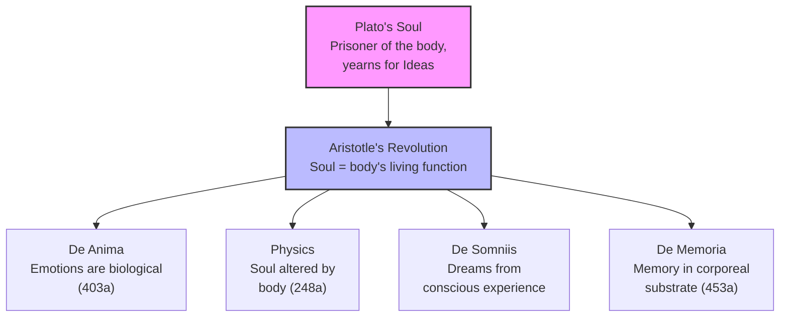

# Chapter 3 · Module 1

# Aristotle's Revolution

The year is 367 B.C. A seventeen-year-old from Stageirus, a small town on the eastern edge of the Chalcidice, arrives in Athens carrying a letter of introduction from the Macedonian court. His father, Nicomachus, was personal physician to King Amyntas II — the grandfather of Alexander the Great. The boy is bright, well-connected, and headed for the most prestigious school in the Greek world: Plato's Academy.

His name is Aristotle, and he will stay for twenty years.

For the first decade or so, he is a Platonist through and through. He writes dialogues (now lost) that echo the master's voice. He refers to the Ideas as "we" do — part of the same intellectual family. But something is shifting. When Plato dies in 347 B.C. and the Academy passes to Plato's cousin Speusippus, Aristotle leaves Athens. Over the next twelve years — marrying, teaching the young Alexander, reassessing everything he thought he knew — he undergoes a transformation so thorough that the man who returns to Athens in 335 B.C. to found his own school, the Lyceum, is no longer recognizable as a Platonist.

What happened in those twelve years? How does a devoted student of the Ideas become the first thinker to ground psychology in biology?

---

## The Student Who Outgrew the Teacher

You might think of Aristotle as Plato's successor — the next link in a tidy chain of Greek philosophy. That picture is misleading. Aristotle did not continue Platonism. He *transformed* it, and the transformation was so radical that it reshaped every field it touched.

The differences begin with method. Plato's preferred instrument was the **dialectic** — a late-night conversation, a back-and-forth of questions and arguments, conducted among friends in the Academy. Aristotle, living in the age of Alexander's empire, recognized that dialectical method was not enough. The world needed systematic knowledge, scripted lectures, empirical research. Where Plato's *Republic* politely argued a constitution into being, Aristotle examined 158 different and actual constitutions, analyzing their premises and the factual evidence behind them.

The differences extend to content. Where Plato's *Timaeus* would content itself with an explanation of space perception based on a "spurious kind of reason," Aristotle devoted entire books to vision, touch, taste, sensory integration, and the senses of nonhuman animals. The gap between general principles and factual information — a gap the Platonists accepted — was precisely what Aristotle's teaching aimed to fill.

> [!TIP]
> **Stop and Think:** Think of a teacher or mentor whose worldview you once shared completely. What made you start questioning it? Was it a single moment, or a gradual erosion? Aristotle's break with Plato took over a decade — and he never stopped respecting the man even as he rejected the philosophy.

---

### The Grammar of a Breakup

One of the most revealing signs of Aristotle's departure from Platonism is not a philosophical argument but a grammatical shift. In the earlier version of his *Metaphysics*, when discussing the Ideas, Aristotle uses the first-person plural: "we" believe in the Ideas. In the later version, the same passages use the third-person plural: "they" believe in the Ideas. The Platonists have become *other people*.

This is not mere rhetoric. It signals a fundamental reorientation. Aristotle came to believe that the Platonists had made a critical error: they took the universal — the general concept — and gave it a separate, independent existence. Socrates, Aristotle argued, had never done this. Socrates retained the connection between a universal class and its perceptible instances. But the later Platonists dissolved that connection, placing the Ideas in a realm apart from the world of experience.

Aristotle would resist this. His revolution was to ground philosophy in the observable facts of animal and inanimate nature — not in a separate sphere of ideal forms.

> [!TIP]
> **Stop and Think:** When you learn a new word — say, "democracy" — do you feel you understand it better from reading its definition, or from seeing it practiced (or violated) in real life? Aristotle would say the latter. Understanding begins with the world as it is, not as we imagine it should be.

---

### De Anima: The Soul Gets a Body

Aristotle's most sustained discussion of human and nonhuman psychology appears in the treatise **De Anima** (*On the Soul*), a work whose conjectures are intended to be fully "compatible with experience" (402b). From the very first chapter, Aristotle identifies the emotions — anger, courage, appetite — and the sensations as conditions of the soul that can only exist through the medium of a body.

This was a radical claim. For Plato, the soul was a prisoner of the body, yearning to escape to the world of Ideas. For Aristotle, the soul is not trapped in the body. It *is* the body's living function. Emotions are "properties deriving from the material body" (403a). The soul's feelings are to be understood as expressions of biological processes, not as shadows of a higher reality.

Throughout his works, Aristotle reinforces this physiological orientation. In his *Physics*, he argues that the affairs of the soul are brought about "by alterations of something in the body" (248a). In his treatise on sleep and dreams (*De Somniis*), he offers the surprisingly modern hypothesis that dreams are the result of our conscious experiences and emotions. In *On Memory and Reminiscence*, recollection is described as "searching for an image in a corporeal substrate" (453a). No predecessor — not the pre-Socratics, not Plato — had grounded psychology so thoroughly in biology.

*Figure 3.1: Aristotle's break — the soul is no longer a prisoner but the body's living principle.*

---

### The Four Faculties of the Soul

Aristotle was not satisfied with any of the traditional theories of the soul, and he devoted Book I of *De Anima* to a critique of them. He concluded that their shared deficiency was the assumption that the soul has only one function. In fact, he argued, biological systems exist in varying degrees of complexity, and for each essential function there must be a corresponding psychic principle.

He identified four faculties:

1. **Nutritive** — the basic capacity for growth and sustenance, shared by all living things
2. **Perceptive** — the capacity for sensory experience, shared by all animals
3. **Locomotor** — the capacity for movement, present in most animals
4. **Universalizing** (**epistemonikon**) — the capacity to grasp abstract principles, unique to human beings

The hierarchy is crucial. Any animal possessing an advanced faculty automatically has the less advanced ones. A human being has all four. A dog has the first three. A plant has only the first. Each faculty may express itself in varying degrees — perception may be limited to touch, or all five senses may be well developed. Rationality may be mere imagination, or it may include the powers of calculation.

> [!TIP]
> **Stop and Think:** Aristotle's hierarchy puts plants, animals, and humans on a continuum rather than treating them as fundamentally different kinds of beings. What are the implications of this for how we treat other species? Does a shared faculty create a shared moral claim?

---

### The Common Sense: How Experience Becomes Whole

Consider a cup of coffee. It is hot, lightly sweetened, dark brown, liquid. Your specialized sensory organs respond to each attribute separately: temperature, taste, color, consistency. But your experience is not of separate attributes. You experience *coffee* — a unified whole, distinct from any other dark, hot, sweet liquid.

How does this happen? Aristotle proposed that in addition to the five senses, there exists a **common sense** (**koine aisthesis**, *sensus communis*). This is not a sixth sense. It is a process common to all the senses by which experiences are forged from the separate contributions of different sense organs. It is what allows you to see *and* taste *and* feel the coffee as a single, coherent object.

After reviewing the senses in *De Anima* Book II, Aristotle turns to the mind itself. If knowledge is not innate — if the Ideas are not present before birth — then how does thought begin? His answer was to distinguish actual from potential: mind has the potential for thought, but actualization requires the world. In a sentence that anticipates John Locke by two millennia:

> What it thinks must be in it just as characters may be said to be on a writing tablet on which as yet nothing actually stands written: this is exactly what happens with mind. (429b-430a)

The mind starts empty. Experience fills it. But the process is not passive — the mind actively organizes what the senses provide.

> [!TIP]
> **Stop and Think:** Aristotle describes the mind as a blank tablet. But he also says the mind *actively* organizes sensory data. These two claims seem to pull in opposite directions. Can they both be true? What determines what gets written on the tablet?

---

### The Unresolved Question

To this day, scholars debate the extent of Aristotle's commitment to materialism. Was it truly his position that all aspects of mind can be reduced to properties of the body? Much of *De Anima* supports this conclusion, but there are telling exceptions.

Most intriguingly, Aristotle asserts that the universalizing faculty — **epistemonikon** — "does not move" (*epistemonikon ou kineitai*). Since, on Aristotle's account, the very concept of matter is equated with motion, this faculty appears to be incompatible with the essence of matter. If that reading is correct, Aristotle's theory of mind is not uniformly materialistic. It is dualistic at the highest level of rational activity.

The issue remains controversial. What is not controversial is the magnitude of the break. Aristotle was the first thinker to specify the domain of psychology and to frame explanations within that domain in terms of the biology of organisms. Everything that follows in this chapter — his theories of learning, knowledge, ethics — grows from this single, revolutionary move.

> [!TIP]
> **Stop and Think:** Aristotle may have been a materialist about emotion, memory, and perception — but a dualist about abstract reason. Does this mixed position seem inconsistent to you, or does it match your own experience of having a body *and* a mind that sometimes seems to transcend it?

---

### From Soul to System

Aristotle's *De Anima* did more than redefine the soul. It established a research program. If the soul is biological, then psychology is a natural science. If emotions are bodily processes, they can be studied. If memory is a corporeal trace, it can be investigated. If the mind starts as a blank tablet, then experience and education shape everything.

This is the revolution. Not a single idea, but a method: observe, classify, explain — and never separate the mind from the body it inhabits. Aristotle did not abandon the questions Plato asked. He changed the terms in which they could be answered.

> [!IMPORTANT]
> Aristotle's greatest contribution to psychology was not a specific theory but a *shift in orientation*. By insisting that the soul's affections are "properties deriving from the material body," he made psychology a biological science. The soul is not a ghost in a machine — it is the machine's living principle. Every subsequent theory of mind, from the Stoics to the cognitive scientists, either builds on or reacts against this foundational move.

---

## Speaking of Aristotle's Revolution...

You have probably encountered Aristotle's name so many times that it has lost its charge. But consider what it means that a single thinker invented embryology (by breaking open chicken eggs at different stages of development), determined the shape of the earth (by observing its shadow on the moon), catalogued 158 constitutions, wrote the first systematic treatises on logic, ethics, politics, rhetoric, poetics, physics, biology, and psychology — and did most of this in a thirteen-year window at the Lyceum.

The sheer range is staggering. And the key insight — that the mind must be studied as part of the body, not apart from it — is one that modern neuroscience is still validating. When a brain scanner shows that fear activates the amygdala, or that memory consolidation depends on hippocampal replay, it is confirming what Aristotle argued in the fourth century B.C.: the soul's affections are properties deriving from the material body.

That said, Aristotle's unresolved dualism — the suggestion that *epistemonikon* might transcend matter — haunts us still. The "hard problem of consciousness" is, in a sense, Aristotle's problem. How does a physical brain give rise to abstract thought? He asked the question. We are still working on the answer.

---

But understanding the soul is only the beginning. If the mind starts as a blank tablet, what gets written on it? Aristotle had a theory about that too — one grounded not in contemplation but in repetition, habit, and the simple pleasure of getting it right. That is where we turn next: to Aristotle's laws of learning and memory.

---

## References

Jaeger, W. (1934). *Aristotle: Fundamentals of the History of His Development*. Clarendon Press.

Aristotle. (ca. 350 B.C.). *De Anima* (On the Soul).

Aristotle. (ca. 350 B.C.). *Physics*.

Aristotle. (ca. 350 B.C.). *De Somniis* (On Dreams).

Aristotle. (ca. 350 B.C.). *De Memoria et Reminiscentia* (On Memory and Reminiscence).

Aristotle. (ca. 350 B.C.). *Metaphysics*.

Robinson, D. N. (1995). *An Intellectual History of Psychology* (3rd ed.). University of Wisconsin Press.

*Module 1 of 7 complete.*
