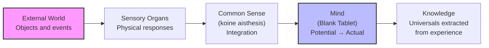

# Chapter 3 · Module 2

# Learning, Memory, and the Blank Slate

Imagine you are a student at the Lyceum in 330 B.C. The morning lecture is over, and you are sitting in the colonnade, trying to recall the sequence of arguments Aristotle just presented. You remember the first point clearly — something about the nutritive soul. The second point follows from it, but only because you heard the first. The third is harder. You rewind mentally, searching for the thread, and suddenly the whole chain snaps into place: nutritive → perceptive → locomotor → universalizing. One link pulls the next.

Aristotle, watching from a distance, would smile. What you just experienced is exactly the mechanism he described in his treatise *On Memory and Reminiscence*. Memory is not a mysterious gift. It is a biological process, governed by repetition and association. And you just demonstrated it.

But Aristotle would also warn you: memory alone is not knowledge. The mind may start as a blank tablet, but what gets written on it — and how — depends on something more than repetition. It depends on pleasure, on pain, and on the body's own way of sorting what matters from what does not.

---

## The First Theory of Learning

If Aristotle's *De Anima* gave psychology its biological foundation, his treatises on memory and learning gave it its first systematic laws. And the laws are startlingly simple.

In *On Memory and Reminiscence*, Aristotle proposed that **repetition** is the source of the strength of memories. Sensations set up certain motions within the soul. These motions subside over time, but if they have been produced often enough, they can be re-created — or at least a likeness of them can be re-created — under comparable conditions in the future. Through repetition, by custom or habit, certain movements reliably follow or precede others.

This is the foundation of **associationism** — the idea that learning is the process of forming connections between mental events. When you attempt to recall a sequence of events, you must find the beginning of the appropriate series. Once you do, an entire train of previously established associations is set in motion. Think of it like a row of dominoes: tip the first, and the rest follow.

> [!TIP]
> **Stop and Think:** Think about how you learned multiplication tables, a poem, or a song. Was it through a single exposure, or through repetition? Aristotle would say the repeated motions left traces in your body — traces that can be reactivated. Does that match your experience?

---

### The Pleasure Principle

Aristotle did not stop at repetition. In his *Physics*, he advanced a claim that pushed his psychology further from Plato and closer to a biological account of morality: "All moral excellence is concerned with bodily pleasures and pains" (247a).

This is a remarkable statement. It means that even our moral sentiments — our sense of right and wrong — are ultimately traceable to sensory experience. To the principle of associationism, Aristotle added a **pleasure principle**: things that bring pleasure are sought; things that bring pain are avoided. This pattern is established in infancy and is therefore very difficult to alter.

If all we possessed of Aristotle's works were his treatises on the soul and on memory, we would conclude that his theory of knowledge was empiricist, his theory of learning associationistic, and his psychology essentially a form of behavioral biology. In a word, his psychology would be more or less contemporary.

> [!TIP]
> **Stop and Think:** Aristotle claims that moral excellence is rooted in bodily pleasures and pains. Does this reduce morality to selfishness — or does it explain why moral habits feel *good* to maintain? Consider a habit like honesty. Is it maintained because it avoids the pain of guilt?

---

### The Blank Tablet

The most famous image from Aristotle's psychology comes from *De Anima* (429b-430a), where he describes the mind prior to experience:

> What it thinks must be in it just as characters may be said to be on a writing tablet on which as yet nothing actually stands written.

This is the passage that John Locke would echo two thousand years later with his *tabula rasa* — the blank slate. The mind starts empty. Experience fills it. Without sensory input from the outside world, there would be nothing for the perceptual-cognitive processes to work on. The external world must cause physical responses in the sensory organs, and these responses come to depict, represent, or stand as codes for the objects that cause them.

But Aristotle's blank tablet is not entirely passive. The mind has the *potential* for thought — it is not nothing, but rather a capacity waiting to be actualized by the world. The tablet has a surface ready to receive characters. The question is: what determines which characters get written?

*Figure 3.2: Aristotle's empiricist pathway — from external world to knowledge, through the senses and the active mind.*

---

### From Sensation to Knowledge

If the mind starts empty, how does it ever move beyond raw sensation? Aristotle's answer unfolds in his *Posterior Analytics*, where the subject shifts from psychology to scientific methodology. In *De Anima*, the emphasis is on perceptual knowledge — how the senses take in the world. In the *Posterior Analytics*, the question becomes: how do we arrive at truths that are "commensurately universal and true in all cases" (87b)?

The answer cannot be perception alone. Perception is always of a particular thing, at a particular time and place. But scientific knowledge is of the general — the universal law that covers every particular instance. To get from the particular to the universal, the mind must do something more than sense. It must *reason*.

Aristotle was well aware of the challenge posed by Heraclitus, who argued that the sensible world is in constant flux — "no one enters the same river twice." The Academy had turned away from the senses in part because of this argument. But Aristotle, characteristically, did not abandon the senses. He insisted that while the senses detect the particular, their "content is universal" (100b) — meaning that the mind is able to construct the universal from the data of experience.

> [!TIP]
> **Stop and Think:** You have seen many dogs — large and small, furry and hairless, calm and frantic. Yet you recognize each as a "dog." How did you get from the individual dogs to the universal concept? Aristotle says the mind *extracts* the universal from the particulars. What does that extraction process feel like to you?

---

### The Ten Categories

Aristotle's solution to the problem of knowledge involved a framework that would influence philosophy for over two millennia. In his *Categories*, he identified ten ways in which any object or event can be known:

1. **Substance** (what a thing is)
2. **Quality** (what it is like)
3. **Quantity** (how much or how big)
4. **Relation** (how it compares to other things)
5. **Place** (where it is)
6. **Time** (when it is)
7. **Position** (how it is arranged)
8. **State** (what condition it is in)
9. **Action** (what it does)
10. **Affection** (what is done to it)

These categories are not derived from perception. They are the mental dispositions — the organizing principles — according to which the world of matter and the world of knowledge become integrated. Were the categories not available *prior* to the act of perceiving, objects could not be classified by time, place, quality, and the rest.

This seems to push Aristotle back toward nativism — the idea that some knowledge is innate. But Aristotle occupies a middle position. We do not have the categories at birth. We have the *capacity* for them, which is actualized through experience. The tablet is blank, but it is not featureless. It has a structure ready to receive.

> [!TIP]
> **Stop and Think:** Aristotle says the mind must already have organizing principles (categories) before it can make sense of experience. But he also says the mind starts as a blank tablet. Is this a contradiction — or is there a difference between having *principles* and having *knowledge*?

---

### The Architecture of Memory

Aristotle's theory of memory is not just about storage. It is about *retrieval*. The key insight is that memories are linked by association — and that recalling one memory activates the chain of associations connected to it. This is why, when trying to remember a sequence, you must find the beginning. The whole train of associations follows from there.

He also noted that memory is vulnerable to biological disruption. Children, the elderly, and the diseased all show memory deficits, and these are to be explained in terms of biological anomalies — not as failures of the soul, but as breakdowns in the body's mechanisms of storage and retrieval.

This biological orientation is what makes Aristotle's memory theory so modern. When we talk about "working memory," "encoding," and "retrieval cues," we are using vocabulary that Aristotle would not have recognized — but the underlying logic is the same. Memory is a physical process, governed by repetition, association, and the body's own rhythms.

> [!TIP]
> **Stop and Think:** Aristotle says you must find the beginning of a sequence to recall the rest. Try it: can you recite the alphabet starting from the middle? Most people cannot — they need the starting link. What does this tell you about how memory is organized?

---

### The Limits of Empiricism

If Aristotle's theory of learning and memory were the whole story, we would call him a strict empiricist — someone who believes all knowledge comes from experience. But his other works — on logic, ethics, politics, and rhetoric — narrow the gap between his thought and Plato's. The mind is not just a recording device. It is a reasoning instrument, equipped with capacities that go beyond what the senses provide.

The senses detect the particular. The mind extracts the universal. Learning begins with sensation but does not end there. Aristotle's theory is empiricist in foundation but rationalist in aspiration. The blank tablet is filled by experience — but the hand that writes on it belongs to reason.

> [!IMPORTANT]
> Aristotle's laws of learning — repetition, association, and the pleasure principle — were the first systematic attempt to explain how the mind acquires knowledge through the body. But his theory is not reductive. The mind starts empty, yet it is not passive. It has the *potential* for thought, actualized by experience but not determined by it. This tension between empiricism and rationalism — between what the world gives and what the mind makes of it — is the central problem of psychology, and Aristotle was the first to frame it clearly.

---

## Speaking of Learning and Memory...

You use Aristotle's laws every day, whether you know it or not. When you study for an exam by reviewing flashcards, you are applying the principle of repetition. When a smell triggers a vivid childhood memory, you are experiencing associative recall. When you choose to practice a skill because getting it right feels satisfying, you are following the pleasure principle.

The modern science of learning has confirmed and extended these insights. Hermann Ebbinghaus's forgetting curves in the 1880s showed that memory decays predictably over time but can be strengthened through spaced repetition — a direct validation of Aristotle's claim. Cognitive psychology's emphasis on "schemas" and "scripts" echoes Aristotle's idea that the mind organizes experience into structured patterns.

What has changed is not the basic logic but the level of detail. Aristotle could describe the *architecture* of memory — association, repetition, retrieval. Modern neuroscience can describe the *mechanism* — synaptic potentiation, hippocampal replay, prefrontal control. The framework is Aristotelian. The implementation is neural.

---

Aristotle's theory of learning tells us *how* the mind acquires knowledge. But it leaves a deeper question unanswered: how does the mind go from particular experiences to universal concepts? How does a child who has seen one cat come to understand what "cat" means — not just this cat, but all cats, everywhere, including the ones she has never seen? That is the problem of universals, and it is where Aristotle's philosophy gets truly interesting.

---

## References

Aristotle. (ca. 350 B.C.). *On Memory and Reminiscence*.

Aristotle. (ca. 350 B.C.). *Posterior Analytics*.

Aristotle. (ca. 350 B.C.). *Categories*.

Aristotle. (ca. 350 B.C.). *Physics*.

Ebbinghaus, H. (1885). *Über das Gedächtnis*. Duncker & Humblot.

Robinson, D. N. (1995). *An Intellectual History of Psychology* (3rd ed.). University of Wisconsin Press.

*Module 2 of 7 complete.*
