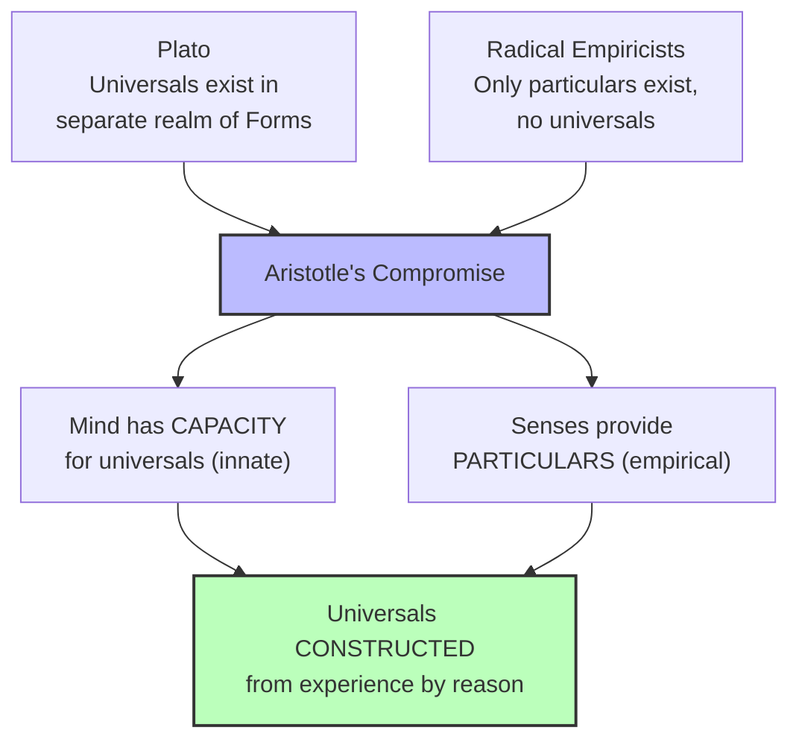

# Chapter 3 · Module 3

# How Do We Know Anything?

A three-year-old is sitting on the kitchen floor. The family cat — a large, gray tabby — walks past. The child points and says "Cat!" The parent smiles. The next day, a friend visits with a Siamese — small, cream-colored, slender. The child looks at it, hesitates, then says "Cat!" again.

How? The two animals share almost nothing in common visually. The gray tabby is twice the Siamese's size. Their colors, shapes, and temperaments are utterly different. Yet the child has generalized from one instance to the whole category. She knows what a "cat" is — not just *this* cat, but *all* cats, including the ones she has never seen.

This is the problem that Aristotle spent some of his most brilliant pages trying to solve. It is called the **problem of universals**, and it is not merely an abstract puzzle. It is the question of how the human mind goes from the particular to the general — from *this* dog to "dog," from *this* act of kindness to "kindness" itself. Every concept you have ever formed, every category you use to make sense of the world, is an instance of this problem. And Aristotle's solution — subtle, compromised, and profoundly influential — reshaped the history of philosophy.

---

## The Cat Problem

The problem of universals is ancient, but it is easiest to grasp through a child learning to name things. The first step is simple: show the child the family pet and say "cat." Repeat this often enough, and the child will learn to say "cat" whenever that particular animal appears. But what happens when a different cat — a Siamese, a Persian, a stray — enters the picture?

If the child says "cat" again, what was learned in the first place? Not the *features* of the specific animal, since the new cat has different features. The child must have learned something more abstract — a concept, a class, a universal — that covers all particular cats despite their differences.

The temptation is to attribute this to "stimulus generalization." But to generalize, the child must already be in mental possession of some class or genus over which particular instances can be generalized. In other words, explaining the performance by assuming the very "universal" we set out to explain gets us nowhere. The question remains: where does the universal come from?

> [!TIP]
> **Stop and Think:** Try teaching someone what "bird" means using only specific examples. A robin is a bird. A penguin is a bird. A bat is not. But the robin flies and the penguin does not. How do you convey the universal category without just listing particulars? Aristotle struggled with exactly this problem.

---

### Plato's Answer: The Separate Realm

Plato had an answer, and it was bold. The universal — the Idea or Form — exists in a separate, eternal realm. The particular cat we see is merely a shadow, an imperfect copy of the ideal "Cat" that exists outside space and time. We recognize particular cats because our souls encountered the Idea of Cat before birth. Knowledge, on this account, is *recollection* — remembering what the soul once knew in the world of Forms.

Aristotle found this unsatisfying. Not because he denied the reality of universals, but because he objected to placing them in a realm apart from the world of experience. As he put it in the *Metaphysics*:

> Socrates did not make the universals or the definitions exist apart; they, however, gave them separate existence, and this was the kind of thing they called Ideas.

"Them" are the later Platonists. "They" — not "we," as it once was. Aristotle had left the Academy.

---

### Aristotle's Compromise: Neither Pure Nativism nor Pure Empiricism

Aristotle's solution unfolds in the *Posterior Analytics*, his treatise on scientific methodology. The work begins with a declaration: "All instruction given or received by way of argument proceeds from preexistent knowledge" (99b-100a). It ends by addressing what "preexistent" means.

His position is a careful compromise. First, he scorns the nativistic account — the idea that we are born with knowledge:

> Now it is strange if we possess them [states of knowledge] from birth, for it means that we possess apprehensions more accurate than demonstration and fail to notice them.

Then he notes the compelling element of nativism:

> If on the other hand we acquire them and do not previously possess them, how could we apprehend and learn without a basis of pre-existent knowledge?

His answer: we do not have knowledge at birth (rejecting the Platonic theory of Ideas), but we do have the **capacity** for knowledge, which is subsequently actualized through sense perception. The senses detect the particular, but their "content is universal" (100b) — meaning that the mind is able to construct the universal from the data of experience.

This is neither orthodox Platonism nor radical empiricism. It is a compromise of the sort found in Plato's own *Theaetetus*. The senses do not convey knowledge per se, but they convey that from which reasoning can extract knowledge.

*Figure 3.3: Aristotle's solution to the problem of universals — neither pure nativism nor pure empiricism.*

---

> [!TIP]
> **Stop and Think:** Aristotle says we do not have knowledge at birth, but we have the *capacity* for it. Think of a skill you learned — riding a bicycle, reading, playing an instrument. Did the capacity feel innate, or was it entirely built from scratch? What does your experience suggest about the nativism-empiricism debate?

### The Syllogism: From General to Particular

Aristotle's answer to the problem of knowledge was not just psychological. It was logical. He invented the **syllogism** — a form of reasoning in which a conclusion follows necessarily from two premises:

- **Major premise:** All persons are mortal.
- **Minor premise:** Socrates is a person.
- **Conclusion:** Socrates is mortal.

Socrates is not said to be mortal merely because he died. He was known to be mortal *while he lived*. His death is not a mere fact but a *reasoned* fact. Scientific knowledge, on Aristotle's account, differs from perception by possessing the general (universal) principles that cover each and every particular instance.

This is what Aristotle called **demonstration** — not in the modern sense of experimental demonstration, but in the sense of rational or logical demonstration. The major premise may be a law of nature, the minor premise a fact of nature, and the conclusion a necessary and demonstrated truth.

> [!TIP]
> **Stop and Think:** When you say you "know" something, do you mean you have experienced it directly, or that you can reason about it from general principles? Aristotle would say both count — but they count differently. Perception gives you the particular. Reason gives you the universal. Which feels more like *real* knowledge to you?

---

### Why Purpose Matters

The search for general laws, Aristotle argued, is guided by a feature that distinguishes his theory of knowledge from most modern ones: its **teleological** character. To explain a phenomenon requires more than identifying its antecedent cause. It requires identifying its *purpose* — the very point of it, how it fits into the larger scheme of things.

As he put it in the *Physics*:

> It is absurd to suppose that purpose is not present because we do not observe the agent deliberating. Art does not deliberate. If this shipbuilding art were in the wood, it would produce the same results by nature.

A physical-causal law cannot supply the full explanation of an event, because the causal law will not reveal the goal or plan or purpose to be realized by such lawful relationships. Nature is not wasteful or pointless. The orderliness of the heavens, the cycle of the seasons, the sequence of birth, growth, death, and decay — the entire spectacle of nature conveys evidence of intelligent design.

To explain anything completely, therefore, is to demonstrate how it fits into the grand design. And this calls for rational powers and methods that go beyond mere observation.

> [!TIP]
> **Stop and Think:** Modern science largely abandoned teleological explanations — we explain the heart's function through evolution, not through "purpose." But when you ask "why did you choose that career?" you are asking for a final cause, not an efficient one. Has teleological explanation really disappeared — or just moved from nature to human behavior?

---

> [!TIP]
> **Stop and Think:** When you solve a math problem, are you discovering a truth that was already there, or constructing one that did not exist until you worked it out? Aristotle would say you are doing both — the truth is in the world, but the knowledge is in the mind. Does that distinction matter?

### Knowledge Beyond the Senses

Aristotle was a tireless observer — he invented embryology by breaking open chicken eggs at different developmental stages, and he determined the shape of the earth by observing its shadow on the moon during eclipses. This was not a scholar who thought logic was a substitute for data-gathering.

But he was a philosopher first. He knew the difference between mere facts and demonstrative proofs. The most developed forms of human knowledge are not confined to the discovery of general laws. They must go beyond these to an essentially metaphysical inquiry into reasons and purposes. The categories — substance, quality, quantity, relation, place, time, position, state, action, affection — are the exhaustive frameworks by which any object or event can be known. They are the mind's way of making the world intelligible.

And this brings us back to the three-year-old and the cat. The child does not merely *see* the cat. She categorizes it — as a substance (it is a thing), with qualities (it is soft), in a place (on the kitchen floor), at a time (now). The universal "cat" is not a Platonic Form floating in a separate realm. It is a concept constructed by the mind from the data of experience, organized by the categories that the mind brings to experience.

> [!IMPORTANT]
> The problem of universals is not a relic of ancient philosophy. It is the problem of how the human mind goes from the particular to the general — from this dog to "dog," from this kindness to "kindness." Aristotle's solution was revolutionary: the mind is not born with knowledge, but it is born with the *capacity* to construct universals from experience. The senses provide the raw material. The mind provides the architecture. Knowledge is neither pure discovery nor pure invention — it is the product of a collaboration between the world and the mind that apprehends it.

---

## Speaking of Universals...

You form universals every day without thinking about it. When you walk into a room and recognize the object in front of you as a "chair" — even though it looks nothing like the chair in your kitchen — you are performing the same feat as the three-year-old identifying the Siamese as a "cat." You have abstracted the essential features of "chair" from countless particular chairs, and you apply that abstraction instantly, unconsciously, and (usually) correctly.

Modern cognitive science has given this process a name: **prototype theory**, developed by Eleanor Rosch in the 1970s. Rosch argued that we organize categories around the best or most typical example — a "prototype" — and judge new instances by their similarity to that prototype. A robin is a more "birdy" bird than a penguin. A sedan is a more "chairy" chair than a beanbag.

Aristotle did not use the word "prototype," but his solution to the problem of universals anticipated the core insight. The mind constructs the universal from the particulars. The particular cat teaches the child what "cat" means. The next cat refines the concept. Over time, the concept becomes general enough to cover all cats — and specific enough to exclude all dogs. Knowledge grows by experience, but it is organized by the mind.

---

Aristotle's theory of knowledge tells us how the mind acquires and organizes information. But what about the person doing the acquiring? Is the mind at birth a fixed thing — a blank tablet with a predetermined structure — or does it develop and change over a lifetime? Aristotle had a theory about this too, and it put him at odds with Plato in a way that would echo through the centuries.

---

## References

Aristotle. (ca. 350 B.C.). *Posterior Analytics*.

Aristotle. (ca. 350 B.C.). *Metaphysics*.

Aristotle. (ca. 350 B.C.). *Categories*.

Plato. (ca. 369 B.C.). *Theaetetus*.

Rosch, E. (1975). Cognitive representations of semantic categories. *Journal of Experimental Psychology: General*, 104(3), 192–233.

Robinson, D. N. (1995). *An Intellectual History of Psychology* (3rd ed.). University of Wisconsin Press.

*Module 3 of 7 complete.*
