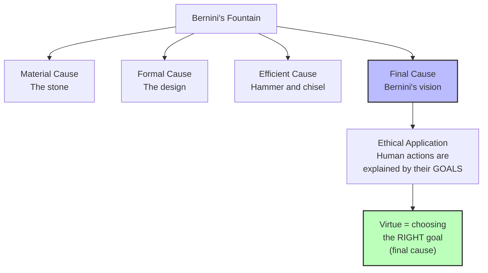

# Chapter 3 · Module 4

# Aristotle's Ethical Psychology

A young Athenian soldier stands in formation at the edge of a battlefield. His hands are trembling. His mouth is dry. Every instinct tells him to run. But he holds his ground, raises his shield, and advances.

Is this courage? Aristotle would say: *it depends*.

If the soldier acts from a sudden surge of passion — rage at the enemy, fear of disgrace — then his action is not virtuous, because it is involuntary. True courage, for Aristotle, requires *intention* and *choice*. The virtuous person is one who acts virtuously because he intends to; virtue is his goal, the final cause of his behavior. The soldier who holds his ground because he has cultivated the habit of courage over years of training — *that* soldier is virtuous.

This distinction — between passion-driven action and habit-formed virtue — is the foundation of Aristotle's ethical psychology. And it leads to a vision of human development that is at once more optimistic and more demanding than anything Plato imagined. You are not born virtuous. You are not enlightened in a flash. You become virtuous the way you become a skilled musician: through practice, repetition, and the slow, patient work of building character.

---

## A Developmental Mind

Plato's psychology was essentially binary. Since the Ideas are eternal and present in the soul before birth, there are only two possible psychological states: ignorance or enlightenment. The senses contribute nothing to true knowledge, and so the experiences of a lifetime may leave the old person as deep in the cave as a child.

Aristotle rejected this. Drawing on his associationist psychology and his biological orientation, he advanced a **dynamic theory of psychological development**. He emphasized the role of practice, rewards, and punishments in learning and memory. He noted the differences among the young, the mature, and the aged in emotion, reason, courage, loyalty, and motivation. He knew that senility brought a decline of perception and, consistent with his larger theory, that this necessarily produced changes in all spheres of intellectual endeavor.

For Aristotle, growth and decay were the abiding correlates of the natural world, including human psychological prowess. While some rational principle may survive the grave, the individual soul and its more prosaic faculties would not. Things that exist, exist for a purpose, and our purpose is to be, to become, to reason, and to die.

> [!TIP]
> **Stop and Think:** Plato saw two states — ignorance and enlightenment. Aristotle saw a lifelong process of development and decline. Which model better describes your own experience? Have you ever had a sudden "enlightenment" moment, or has your understanding always grown gradually?

---

### The Four Causes

To understand Aristotle's ethics, you first need to understand his theory of **causation** — because for Aristotle, explaining anything means identifying its cause, and there are four distinct senses of "cause."

Consider Bernini's "Fountain of the Rivers" in Rome's Piazza Navona:

1. **Material cause** — the stone from which it is made
2. **Formal cause** — the form or design that makes the stone a fountain rather than a lump
3. **Efficient cause** — the hammer and chisel that shaped the stone, blow by blow
4. **Final cause** — Bernini's vision, the goal or purpose for which the fountain was created

The final cause is the teleological element in Aristotle's theory. And it is the one that matters most for ethics. When we ask "why did she do that?" we are asking for a final cause — the goal or intention behind the action. The cause of a praiseworthy or blameworthy action is an ulterior goal or purpose. The goal itself need not be objectively good; it may be only *apparently* good.

Aristotle reasoned that since final causes are common in human affairs — and human affairs are part of nature — nature, too, must possess final causes. Birds build nests *in order to* care for their young. The heart pumps blood *in order to* sustain life. Purpose is not something we project onto nature. It is something we discover there.

*Figure 3.4: Aristotle's four causes — and why the final cause matters most for ethics.*

---

### Virtue Is Not Born, It Is Made

Armed with this framework, Aristotle made a claim that broke sharply with the Socratic tradition: "None of the moral virtues rises in us by nature" (*Nicomachean Ethics*, II, Ch. 1, 19-20).

This is a direct rejection of the idea that virtue is innate — that some people are simply born good. In its place, Aristotle offered an empiricist alternative: "We are made perfect by habit." The word **ethics** itself comes from the Greek **ethos**, which means habit or an exercised skill. Virtue is not a gift. It is a *practice*.

The virtuous person is one who acts virtuously because he intends to — virtue is his goal, the **final cause** of his behavior (1105b). This is what Aristotle called a **behavioristic criterion**: we judge virtue by what people do, not by what they feel. Behavior controlled by the passions lacks the element of rational choice. Even animals can act from impulse. Only humans can act from principle.

This led Aristotle to a strict position on the emotions. Acts impelled by passion are involuntary, and therefore the passions do not figure in an account of virtue (1106a). This was one of the bases upon which he denied to nonhuman animals such virtues as courage and temperance. A dog may be brave, but it cannot be *virtuous* — because virtue requires intention, and intention requires reason.

> [!TIP]
> **Stop and Think:** Aristotle says virtue comes from habit, not nature. But he also says virtue requires intention — you must *choose* to act well. Is there a tension here? Can a habit be intentional? Think about a skill you have practiced until it became "second nature." Did it stop being a choice?

---

### The Golden Mean

Aristotle's most famous contribution to ethics is the doctrine of the **golden mean**: virtue is "a mean between two vices" (1107a) — excess and deficiency.

- **Courage** is the mean between recklessness and cowardice
- **Generosity** is the mean between prodigality and miserliness
- **Temperance** is the mean between self-indulgence and insensibility

Vice, in the person and the State, is invariably an expression of excess or deficiency — an extreme expression of that which in moderate degree is an absolute good. The good monarchy, transformed by excess, becomes tyranny. Aristocracy becomes oligarchy. Timocracy, in which political power is based on property, becomes democracy (1160b).

The golden mean is not a compromise or a halfway point. It is the *right* amount — the amount that a practically wise person would choose in the circumstances. It requires judgment, not just rule-following. And it is acquired through practice, not through contemplation.

> [!TIP]
> **Stop and Think:** Think of a virtue you admire — honesty, patience, generosity. Can you identify the excess and deficiency that flank it? Is it possible to be *too* honest? Too patient? Too generous? Aristotle would say the answer is always yes — and finding the mean is the work of a lifetime.

---

### From Individual to State

In the *Nicomachean Ethics*, Aristotle declares that "man is a political creature whose nature is to live with others" (1169b). Every action of the individual and every action of the State aims at some good; otherwise, the action is involuntary and to be judged as accidental or performed in ignorance.

This is not a separate theory from his psychology. It is the *same* theory, applied at a larger scale. The individual soul and the political community share the same structure: both are organized around purposes, both aim at the good, both are governed by law and habit. If Plato's *Republic* was an enlarged model of the individual soul, Aristotle's *Politics* treats the individual as a preliminary stage leading to a discussion of the State.

The balance he sought between citizen and State depended on his view of human nature. He considered persons to be innately rational, inquisitive, and social — and therefore capable of endorsing discipline, self-sacrifice, and principled governance. Only those lacking reason — the "natural slave," children, the insane — would rebel.

Here we must be honest about the limits of Aristotle's vision. His defense of "natural slavery" and his exclusion of women from full citizenship are not incidental to his system. They follow from his assumptions about who possesses the full range of rational faculties. These views were contested even in antiquity, and they have been rightly rejected. But they remind us that even the greatest thinkers are products of their time — and that the golden mean does not automatically produce justice.

> [!TIP]
> **Stop and Think:** Aristotle believed that some people lacked the rational capacity for self-governance. This belief was used to justify slavery and the exclusion of women for centuries. How do we separate the valuable insights of a thinker from the harmful assumptions embedded in their system? Is it enough to say "they were a product of their time"?

---

> [!TIP]
> **Stop and Think:** Aristotle's "natural slave" argument was used to justify slavery for centuries. Yet his broader system — that virtue comes from habit, that law should serve the public good — was used to argue *against* slavery. Can the same philosophical system produce both oppression and liberation? What determines which parts get emphasized?

### Constitutionalism: The Integrated Vision

Aristotle's most enduring contribution to political thought was **constitutionalism** — the idea that the State should be ruled by law, and that law should be ruled by an ethics whose first principle is the welfare of the citizens, understood in terms of their realizing their full human potentials.

It is this interconnection of society, law, ethics, and the public good that comprises constitutionalism — and that installs Aristotle's psychology as perhaps the most integrated and systematic ever developed. Psychology, ethics, and politics are not separate disciplines. They are facets of a single inquiry into the nature of human flourishing.

> [!IMPORTANT]
> Aristotle's ethical psychology rests on a single, powerful insight: virtue is not a gift of nature or a flash of enlightenment. It is a *habit* — formed by practice, guided by reason, and expressed in the choices we make. The golden mean is not a formula but a way of life, requiring judgment, effort, and the willingness to aim at the good even when it is difficult. But the system that produces this insight also contains assumptions about who is capable of virtue — assumptions that Aristotle himself would not have questioned, and that history has had to correct.

---

## Speaking of Ethics and Habit...

You already know Aristotle's ethical psychology, even if you have never read a word of it. When a parent tells a child to "practice being kind," they are applying Aristotelian ethics. When a coach says "character is what you do when no one is watching," they are invoking Aristotle's behavioral criterion. When a therapist helps a client build "healthy habits" to replace destructive ones, they are working within Aristotle's framework.

The modern science of habit formation — popularized by researchers like Charles Duhigg and James Clear — confirms Aristotle's basic insight. Habits are formed through repetition, reinforced by reward, and resistant to change. The neural pathways that underlie habitual behavior are literally carved into the brain by practice. Aristotle could not have described the mechanism, but he understood the principle.

What Aristotle added — and what the habit-formation literature often omits — is the ethical dimension. A habit is not just a routine. It is a *disposition* — a **hexis** — that shapes your character. The person who practices honesty becomes honest. The person who practices courage becomes courageous. Virtue is not a feeling. It is a way of being, built one choice at a time.

---

Aristotle's psychology — biological, developmental, ethical, and political — was the most integrated system of its kind ever produced. But it was also the last great product of the classical Greek world. The world that produced it was about to change. Alexander's empire had spread Greek culture across three continents, but the city-states that had nurtured philosophy were losing their independence. New questions were emerging — not about the good life, but about how to survive in a world you could not control. The Stoics and the Epicureans were waiting in the wings.

---

## References

Aristotle. (ca. 340 B.C.). *Nicomachean Ethics*.

Aristotle. (ca. 340 B.C.). *Politics*.

Aristotle. (ca. 350 B.C.). *Physics*, Book II.

Aristotle. (ca. 350 B.C.). *Posterior Analytics*.

Robinson, D. N. (1995). *An Intellectual History of Psychology* (3rd ed.). University of Wisconsin Press.

*Module 4 of 7 complete.*
