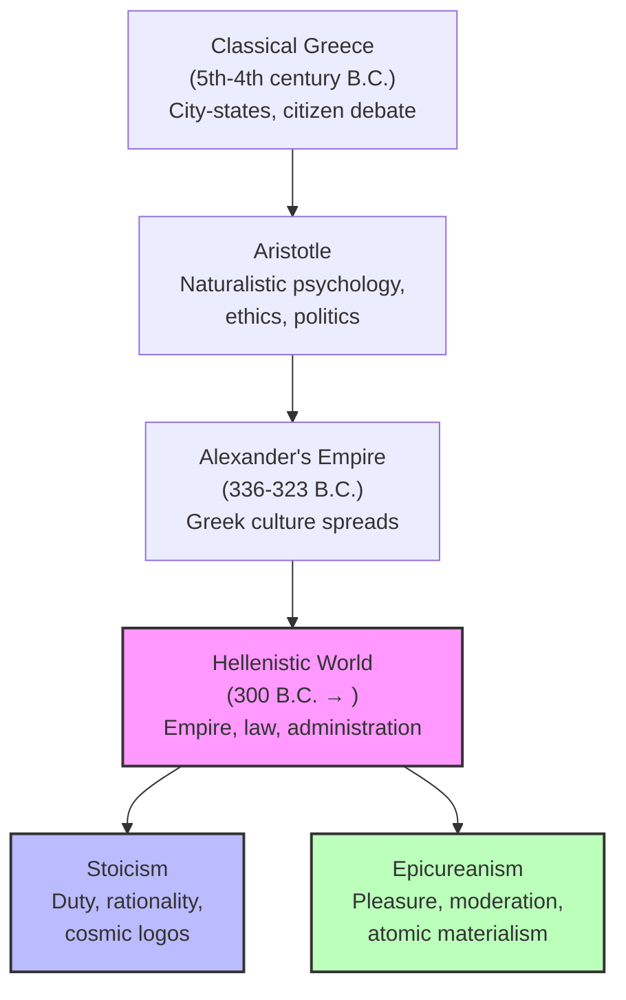

# Chapter 3 · Module 5

# The World After Aristotle

The year is 300 B.C. Alexander the Great is dead. His empire has fractured into rival kingdoms. The city-states of classical Greece — Athens, Sparta, Thebes — are no longer the centers of power. The new capitals are Alexandria, Antioch, Pergamon — cities built by generals and administrators, not by philosophers and poets.

In Athens, the Lyceum still operates, but its founder has been dead for two decades. The Academy still teaches Plato, but its audience has changed. The young men streaming into these schools are not citizens of independent city-states debating the best constitution. They are subjects of empires, living under laws they did not make, navigating a world of vast wealth and sudden violence. The old questions — What is justice? What is the good life? — have not disappeared. But they have acquired a new urgency. In a world you cannot control, what is left?

Two answers emerge, almost simultaneously, from the same city. Both are rooted in Aristotle's naturalism. Both take human nature as the model for ethics. And both will shape Roman civilization — and through it, the Western world — for centuries to come. They are Stoicism and Epicureanism.

---

## Aristotle's Shadow

No figure from antiquity until the seventeenth century would be as important to the history of psychology as Aristotle. His most general contribution was to locate the intellectual and motive features of mind in the natural sciences, while reserving the moral and political dimensions of human life to a much enlarged conception of nature itself.

At the level of basic processes, his psychology was biological and ethological, grounded in considerations not unlike those Darwin would develop centuries later. He proposed the first laws of learning, loosely drawn around the principle of association and fortified by principles of reinforcement. He consistently emphasized the part played by early experience, education, practice, habit, and life within the *polis* in the formation of psychological dispositions.

But Aristotle's influence was mixed. Subsequent scholars invested his works with unchallengeable authority — for which, of course, Aristotle is not to blame. He promoted a rationalistic attitude in those who would seek the first principles of things. But this orientation was extended to matters that Aristotle himself treated empirically and understood to be beyond the reach of logical certainties. As one critic put it: "Practically every advance in science, logic, or in philosophy has had to be made in the teeth of the opposition from Aristotle's disciples."

> [!TIP]
> **Stop and Think:** Aristotle's followers turned his provisional conclusions into dogma. Has this happened with other influential thinkers — Darwin, Freud, Einstein? Why do disciples often become more rigid than the masters they follow?

### The Political Shift

The world that produced Aristotle — the world of the independent *polis* — was gone. What replaced it was empire: vast, impersonal, governed by law and administration rather than by citizen debate. The pre-Socratics had developed their philosophies in a climate of commerce and growing prosperity. Socrates and Plato flourished in the aftermath of Athens's humiliating defeat by Sparta. Now, in the age of empires, a new kind of philosophy was needed.

There is a regularity, Robinson notes, with which materialistic philosophies prosper in periods of empire, while spiritualistic-idealistic philosophies emerge in the wake of destruction. With notable exceptions, intellectuals are apologists as well as critics, and systems of thought are very often rationalizations of the prevailing facts of life. The influence operates in both directions: political and economic forces shape philosophy, and philosophy works to maintain or modify those institutions that define a period.

By 300 B.C., the Western world was imperialist. Its defining ethic was expansionism. Its language was the language of law, administration, and finance. The voices of philosophy that spoke for this period were those of the Stoics and the Epicureans.

> [!TIP]
> **Stop and Think:** Think of a major political change in your own lifetime — a revolution, a new government, a shift in global power. Did it change the way people thought about themselves and their purpose? How does politics shape philosophy?

*Figure 3.5: From the classical polis to the Hellenistic schools — the political shift that produced Stoicism and Epicureanism.*

---

### Rivals Who Agreed on More Than They Admitted

Stoicism and Epicureanism are usually presented as rival philosophies, and in their foundational arguments they were. But the similarities are more striking than the differences — especially in their earliest forms.

Both were responses to the increasingly influential schools of the **Cynics** and **Skeptics** — schools that had elevated Socrates' modest admission of ignorance to metaphysical heights, fashioning clever arguments to prove that nothing can be known about anything. The initial motivation for both Zeno (the founder of Stoicism) and Epicurus was to restore philosophy to respectability in the face of this skepticism.

Both were based on a natural-science perspective that may be called **physicalism**. Both were **monistic** — conceiving of the universe as ultimately reducible to a single substance or force. For the Epicureans, that substance was atoms. For the early Stoics, it was something akin to fire or ether — a "creative fire" they called **logos**, which could be translated as "word," "plan," or "reason."

Both sought to develop all-inclusive systems whose basic principles were as applicable to physics as to ethics. Where the Socratics tended to ignore the material world and focus on abstract problems, and where Aristotle had kept physics and ethics apart, the Stoics and Epicureans proposed a philosophical unity not seen since the pre-Socratics. Nature was the model for life and for government. Human laws were to be patterned on natural law.

> [!TIP]
> **Stop and Think:** Two rival philosophies, both claiming to ground ethics in nature, both seeking to explain everything from atoms to politics. What does it tell you about the Hellenistic world that such ambitious, all-encompassing systems were so appealing? What need were they filling?

> [!TIP]
> **Stop and Think:** Both Stoics and Epicureans believed that philosophy should be a way of life, not just an intellectual exercise. When was the last time a philosophical idea changed how you actually behaved? Is there a gap between what you believe and how you live?

---

### Why Rome Listened

The philosophies taught by Zeno and Epicurus in Athens came to have their greatest impact not on the Greek but on the Roman mind. Though both evolved in Athens, they were not Athenian in their principal features. Each carried traces of Platonic and Aristotelian influence, but Zeno and Epicurus were ethicists more than natural philosophers. Their philosophies drew inspiration from nature such that government, reason, perception, and the entirety of the human enterprise were to be comprehended in terms of natural law.

The Stoic emphasis on duty, rationality, and cosmic order appealed to the Roman aristocracy's self-image as rulers of a lawful empire. The Epicurean emphasis on moderation, friendship, and withdrawal from political turmoil appealed to those who had seen what empire could do to the soul. Both philosophies conduced to a life of order, harmoniousness, civility, and modesty — qualities the Roman elite aspired to, even when they failed to achieve them.

Cicero stamped Roman law with Stoic reasonableness, even as he criticized Stoic philosophy. Nero traduced the lessons of Epicurus into a grotesque caricature. The philosophies were tools — sometimes used wisely, sometimes badly, but always present in the intellectual toolkit of the Roman world.

> [!IMPORTANT]
> The Aristotelian legacy is not a single idea but a *method* — observe, classify, explain, and never separate the mind from the body or the individual from the community. But legacy is also distortion. Aristotle's followers turned his provisional conclusions into dogma. The Stoics and Epicureans inherited his naturalism but applied it to a different world — a world of empires, not city-states. The questions changed. The method endured.

---

## Speaking of Legacy and Distortion...

You live in a world shaped by Aristotle's legacy, even if you have never read a page of his work. The structure of the modern university — with its departments of biology, psychology, political science, ethics — reflects his division of knowledge. The idea that knowledge should be grounded in observation, not just argument, is his. The concept of constitutionalism — that law should serve the public good — is his.

But you also live in a world distorted by his legacy. The idea that some people are "naturally" suited to serve — Aristotle's defense of "natural slavery" — was used to justify slavery in the Americas for centuries. The claim that women lack full rational capacity was used to exclude them from education and citizenship. These are not incidental errors. They are the consequences of a system that claimed universal authority while resting on particular assumptions.

The lesson is not to reject Aristotle. It is to read him critically — to take what is valuable and to name what is harmful. That is, in fact, exactly what the Stoics and Epicureans did. They inherited Aristotle's naturalism, but they applied it to a world he never imagined.

> [!TIP]
> **Stop and Think:** If you could take one idea from Aristotle's system and one from the Stoics or Epicureans, what would they be? Which parts of a philosophical system survive the passage of time — and which parts get left behind?

---

Aristotle grounded psychology in biology. The Stoics and Epicureans inherited that naturalism — but they pushed it further, asking not just how the mind works but how we should *live* in a world governed by natural law. Their answers began, as Aristotle's did, with sensation. But they ended in very different places.

---

## References

Rist, J. M. (1969). *Stoic Philosophy*. Cambridge University Press.

Cornford, F. M. (1957). *From Religion to Philosophy*. Harper & Row.

Robinson, D. N. (1995). *An Intellectual History of Psychology* (3rd ed.). University of Wisconsin Press.

*Module 5 of 7 complete.*
