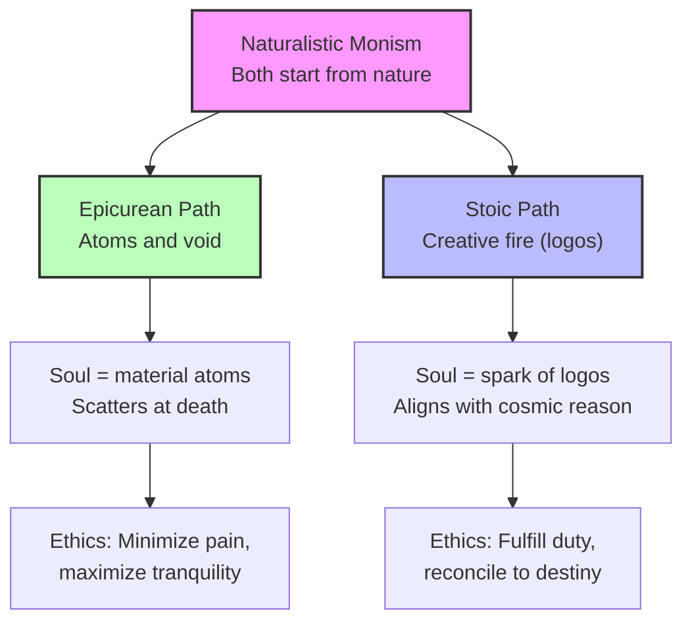

# Chapter 3 · Module 6

# The Physics of the Soul

Imagine holding a handful of sand. Each grain is different — some coarse, some fine, some sharp, some smooth. But they are all sand. Now imagine that everything in the universe — your hand, the sand, the air, your thoughts, your feelings — is made of the same kind of thing: tiny, indivisible particles moving through empty space. Your soul, too, is made of atoms. When you die, those atoms scatter. There is nothing left.

This is the world Epicurus described. And it is a world that should, by all rights, be terrifying. If the soul is material, there is no immortality. If the universe is random, there is no cosmic plan. If atoms are all there is, then meaning is not built into the structure of reality.

Epicurus's response to this terrifying picture was not despair. It was *tranquility*. If death is just the dispersal of atoms, there is nothing to fear from it. If the gods are not watching, there is no one to appease. If pleasure and pain are the body's way of sorting experience, then the good life is one that minimizes pain and maximizes the quiet pleasures of friendship, moderation, and understanding.

The Stoics began from a similar naturalism but arrived at a very different destination. Where Epicurus saw atoms and void, the Stoics saw **logos** — a rational principle, a creative fire, a cosmic plan. The soul was not a collection of particles but a spark of the divine reason that pervades all things. And the good life was not withdrawal but *duty* — aligning your will with the rational order of the universe.

---

## The Material Soul

Epicurus (341-270 B.C.) was born on Samos and educated in Asia Minor by teachers versed in Plato and Democritus. From Democritus, he inherited **atomism** — the idea that all of nature is nothing but aggregations of particles of matter distributed in infinite space. From Plato, he inherited the conviction that philosophy must address how to live.

His psychology begins with a bold claim: all knowledge originates in sensation. Aristotle would not have rejected this, though he would not have meant the same thing by it. For Epicurus, the material organization of the body is such that experience becomes recorded in memory and can be revived in the form of concepts. By association, these concepts come to stand for the items originally given in experience. The frequent pairing of an actual apple with the word "apple" results in the **expectation** (*prolepsis*) of an apple when the word is heard.

Since our only mode of verification is experience itself, questions regarding the truth or validity of experience are meaningless. All experience is the outcome of interactions — collisions — between material entities: between the matter of the world and the matter of the sense organs.

The soul itself is a type of material organization made up of common elements — fire, wind, and air — and a fourth unnamed element that makes it possible for stimulation to be distributed over and within the body. This last element is the most subtle, but it is material nonetheless. As a result of its activity, we have the capacity for pleasure and for pain.

> [!TIP]
> **Stop and Think:** Epicurus says the soul is made of atoms. If that is true, what happens to "you" when you die? His answer: nothing — because there is no "you" left to experience anything. Does this view make death less frightening, or more?

> [!TIP]
> **Stop and Think:** If your soul is material, then your thoughts are physical events. Does that make them less *real*? Does the materiality of the mind diminish its significance — or does it make the mind even more remarkable?

---

### The Stoic Alternative: Fire and Reason

The Stoics began from a similar starting point — a naturalistic, monistic worldview — but their metaphysics diverged sharply. Where Epicurus saw atoms and void, the early Stoics saw a single, all-pervading substance: a "creative fire" they called **logos**.

Logos could be translated as "word," "plan," "reason," or "the very point of something." The Stoics thought of the divine in the same physicalistic terms — not as a separate, transcendent God, but as the rational principle woven into the fabric of nature itself. The universe is not random. It is ordered, purposeful, and rational. And the human soul is a fragment of this cosmic reason.

The major Stoic spokesmen — Zeno of Citium (336-265 B.C.), Cleanthes (331-232 B.C.), and Chrysippus (280-206 B.C.) — developed this vision into a comprehensive system. Later Stoics of the Christian era, including Seneca, Epictetus, and Marcus Aurelius, would adapt it to new circumstances. But the core idea remained: the soul is rational because the universe is rational.

*Figure 3.6: Same starting point, different destinations — Epicurean and Stoic psychologies diverge from shared naturalism.*

---

### How Knowledge Begins

Despite their different metaphysics, the Stoics and Epicureans arrived at strikingly similar epistemologies. Knowledge on the Epicurean account begins with sensation. On the Stoic account, it also begins as the mental image — **phantasia** — of the sensory event.

Both subscribe to a form of associationism. Both propose that elementary sensations give rise to general concepts — what the Stoics called **katalepseis**. Through repeated experience, the mind forms concepts that stand for categories of things. A child sees many dogs and forms the concept "dog." The mechanism is the same in both schools, even if the underlying physics is different.

The Stoics went further in proposing criteria of validity for our perceptions. They advocated a kind of statistical test based on clarity and utility. They did not go so far as to claim that nature itself was statistical, as the Epicureans did, but they were often content to accept that our knowledge of nature did not rise above the level of probability.

> [!TIP]
> **Stop and Think:** Both the Stoics and Epicureans agreed that knowledge starts with sensation and builds through association. But they disagreed about what lies beneath — atoms or logos. Does the foundation matter if the epistemology is the same? Can two different metaphysics produce the same psychology?

---

### The Soul as Disease: Stoic Views of Emotion

Central to Stoic thought is an ethics of rationality — an ethics that pits the emotional side of life against the powers of reflection and self-control. Even the word **pathos**, which might generally be taken to mean "emotion," was intended within Stoic contexts to be regarded as a kind of disease of the soul — something on the way toward psychopathology.

Plato and Aristotle had both emphasized the tension between rational and impulsive forces. Aristotle, however, recognized that both were part of the nature of animal life and that what mattered was how rational creatures are disposed to express the passions. The Greek for "disposition" is **hexis** — one may have either a good or a bad hexis for anger, love, or any other emotion. One's character is expressed to a considerable extent by one's disposition toward a given emotion.

It is with Stoicism that this line of argument concludes with a renunciation of emotion itself. The Stoic ideal is **apatheia** — not apathy in the modern sense, but freedom from the disturbances of passion. The properly rational person does not suppress emotions. He transcends them.

The Epicureans, though they reached this conclusion by different reasoning, arrived at a remarkably similar position. The passionate state, they argued, is a kind of madness. The goal is happiness, which in the last analysis is freedom from pain. Since the quest for fame, power, and riches usually leads to frustration and grief, the recommendation is for moderation and the abandonment of vain ambition.

> [!TIP]
> **Stop and Think:** The Stoics called emotions "diseases of the soul." The Epicureans called passion "a kind of madness." Both recommended something like emotional detachment. Is this wisdom — or repression? Think of a time when strong emotions led you astray. Would Stoic detachment have helped? Would something have been lost?

> [!TIP]
> **Stop and Think:** Modern therapy often teaches people to "sit with" difficult emotions rather than suppress them. How does this differ from Stoic apatheia? Is there a difference between transcending an emotion and ignoring it?

---

### The Shared Foundation

Despite the apparent incompatibility of their metaphysics — atoms vs. logos, randomness vs. cosmic plan — the Stoic and Epicurean psychologies converge at the level of daily life. Both present nature as the model for life and for government. Both base their ethical canons on the quest for happiness. Both accept the "pleasure principle" as entirely natural and as ordained by the laws of our nature.

At a global level of analysis, early Epicurean and Stoic psychologies both present human mental life as something that takes the data of experience as primary, and from these data proceeds to form general concepts in such a manner as to organize conduct around the goals of happiness and harmonious contentment. For both, human nature is the mirror of nature — to be understood in the same terms employed in the description of nature.

Epicurus and Lucretius were more explicit than Zeno in tracing pleasure and pain to our material organization. But both schools accepted that the properly functioning sense organ responds to what is there, and that the mind's task is to organize that input into a livable life.

> [!IMPORTANT]
> The Stoics and Epicureans started from opposite metaphysical premises — cosmic reason vs. atomic randomness — and arrived at strikingly similar psychologies. Both grounded knowledge in sensation, built concepts through association, and sought happiness through moderation and self-knowledge. The lesson is not that metaphysics does not matter. It is that the human mind has a way of finding workable answers regardless of the theoretical foundation. The physics of the soul may be debated. The need for tranquility is not.

---

## Speaking of Materialism and Meaning...

You live in an age that is, in many ways, more Epicurean than Stoic. Modern neuroscience describes the mind in material terms — neurons, neurotransmitters, electrochemical signals. The soul, if we still use the word, is understood as an emergent property of the brain's physical processes. When the brain dies, the person is gone. There is no separate, immaterial substance that survives.

This is, more or less, what Epicurus argued twenty-three centuries ago. And the emotional response it provokes — a mixture of liberation and vertigo — is the same one his contemporaries must have felt. If the soul is material, then this life is all there is. That can be terrifying. Or it can be clarifying.

The Stoic response is equally alive. When someone says "everything happens for a reason" or "accept what you cannot control," they are channeling Stoic philosophy. When cognitive behavioral therapy teaches patients to identify and challenge irrational beliefs, it is applying Epictetus's insight that "it is not things that disturb us, but our judgments about things." The logos may have been replaced by evolution and quantum mechanics. The need for a rational framework to make sense of suffering has not changed.

---

The Stoics and Epicureans agreed on psychology — sensation, association, concept formation. They disagreed on physics — atoms or logos. But the question that truly divided them was not about the soul's substance. It was about the soul's *purpose*. Should you withdraw from the world, as Epicurus counseled? Or should you engage with it, as the Stoics insisted? That is the question of ethics — and it is where we turn next.

---

## References

Epicurus. (ca. 300 B.C.). *Vatican Fragments*.

Lucretius. (ca. 55 B.C.). *De Rerum Natura*.

Zeno of Citium. Fragments, in *The Stoic and Epicurean Philosophers*, ed. W. Oates (1940).

Robinson, D. N. (1995). *An Intellectual History of Psychology* (3rd ed.). University of Wisconsin Press.

*Module 6 of 7 complete.*
