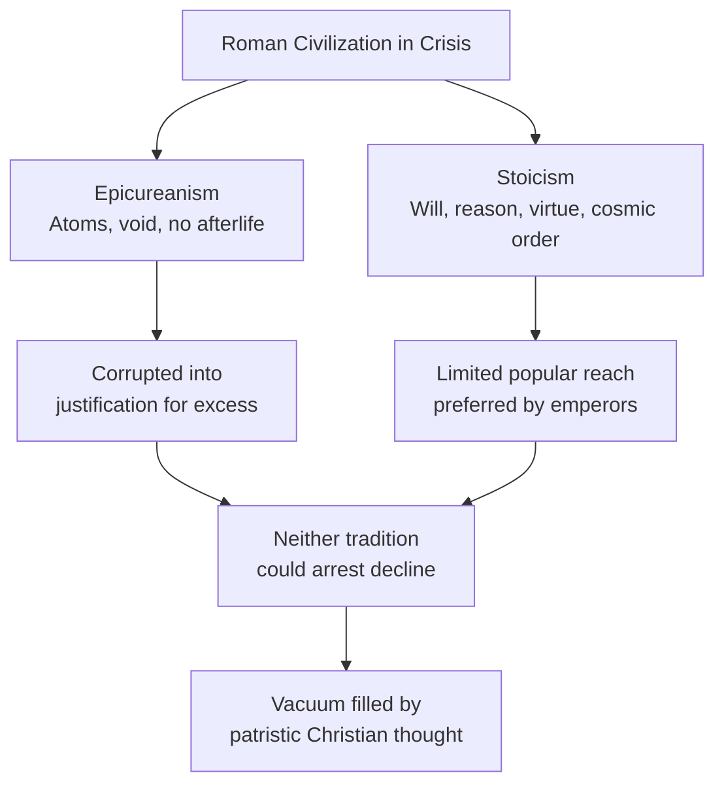

# Module 01 — The "Dark Ages" and the Patristic Mind

## Chapter 4: Patristic Psychology — The Authority of Faith

---

Imagine walking through the Roman Forum in the year 530 AD. You stand where Cicero once debated, where crowds gathered to hear senators argue the fate of republics. But the marble is cracked. Weeds push through the paving stones. Half the columns have been stripped of their bronze fittings, melted down to pay mercenaries. A goat grazes in the shadow of the Basilica of Maxentius. Nearby, a Greek-speaking merchant from Constantinople haggles with a Latin-speaking Gothic official, each struggling to understand the other. The merchant gestures toward a collapsed archway and mutters something about the glory days. The Gothic official shrugs — he was born here, this rubble is his home now, and he has never known anything different.

You have heard people call this era the "Dark Ages." You have probably used the phrase yourself. It rolls off the tongue so easily: a thousand years of superstition, ignorance, intellectual paralysis, everyone waiting around for the Renaissance to rescue them. But standing in this crumbling Forum, a different thought surfaces. The ruins around you are not the product of some sudden medieval stupidity. They are the result of centuries of political corruption, financial mismanagement, moral exhaustion, and military overreach — all of it happening while Roman emperors were still officially pagan, still sacrificing to Jupiter. The "darkness" did not arrive with Christianity. It was already there, humming beneath the gilded surface of empire. So who told you the story you believe, and why did they need you to believe it?

---

## Shattering the Myth

You have almost certainly encountered the narrative: a golden age of classical reason, followed by a long, dark tunnel of Christian superstition, and finally a glorious Renaissance that "rediscovered" what was lost. It is a clean story. It is also profoundly misleading.

The phrase "Dark Ages" owes its staying power to Renaissance humanists like Petrarch, who lived in the fourteenth century and needed to frame the centuries between Rome's fall and his own time as a wasteland. If the medieval period was "dark," then the Renaissance was a rebirth — literally, a renaissance — and Petrarch and his contemporaries could cast themselves as rescuers of civilization. It was a branding exercise, and it worked so well that you still hear historians, journalists, and university professors repeating it seven centuries later.

Recent scholarship has thoroughly dismantled this framing. A 2026 reassessment of early medieval Europe notes that the "Dark Ages" label persists in popular culture largely because it serves a satisfying narrative arc — decline, darkness, rescue — even though professional historians abandoned it decades ago. The label tells you more about the biases of the people who coined it than about the people who lived through it.

> [!TIP]
> **Stop and Think:** Consider a current event or historical period that you think you "know" well. Where did that knowledge actually come from? A textbook? A documentary? A social media post? How confident are you that the source did not have its own agenda?

What actually happened between roughly 500 and 800 AD was not intellectual paralysis. It was a transition — messy, violent, and genuinely painful, but not empty. The period produced the invention of the university, the construction of over a hundred Gothic cathedrals, and the codification of Roman law. These are not the achievements of a civilization in intellectual coma.

The real culprits of the early decline were structural: political corruption in Roman cities, financial mismanagement, moral decay among the ruling class, and relentless external invasions. The deified emperors — men who demanded worship — were, as Robinson notes, "of sorry character." The collapse was internal long before it was spiritual.

---

## Two Philosophical Responses to Empire's Decay

As Roman civilization frayed, two philosophical traditions offered competing frameworks for making sense of the chaos. Understanding them helps you see why **patristic** psychology — the psychological thought developed by the early Church Fathers — took the shape it did.

### The Epicurean Dead End

**Epicureanism** rested on a materialist foundation: the universe was nothing more than atoms moving through a void, colliding and combining by chance. There was no divine plan, no cosmic purpose. The best a human could do was seek moderate pleasure, avoid pain, and accept that death was simply the dissolution of atoms. The soul, being material, dissolved along with the body. No afterlife. No meaning beyond what you manufactured for yourself.

This philosophy had genuine appeal for a comfortable Roman elite. It freed them from religious obligation, from moral accountability, from any need to justify their appetites. But it offered almost nothing as a psychology. If your entire inner life is just atoms bouncing around, then despair, hope, courage, and cowardice are all equally meaningless chemical events. You cannot build a moral psychology on a foundation that denies the reality of moral experience.

> [!TIP]
> **Stop and Think:** If you were advising someone going through a devastating personal loss — a career collapse, a death in the family — would a purely materialist worldview give you the conceptual tools to help them process their suffering? What would be missing?

By the second century AD, Roman upper-class culture had taken Epicurean materialism and twisted it into something Epicurus himself would have despised. What began as a philosophy of modest, reflective living became, through what Robinson calls "a deft corruption," a justification for sexual promiscuity, moral laxity, and general debauchery. Nero's reign (54–68 AD) had already set the tone. Philosophy was no longer a guide to living well; it was a costume worn by the powerful to dignify their appetites.

### The Stoic Counterargument

Against this backdrop, the **Stoic** tradition — **Stoicism** — offered a radically different picture of the human mind. Epictetus, born a slave in Phrygia (modern-day Turkey), became one of the most influential Stoic voices. His teachings, recorded in the *Discourses*, shaped not only later Christian psychology but the personal philosophy of Emperor Marcus Aurelius himself.

Epictetus insisted on several ideas that would prove foundational to psychological thought:

- **We are social beings by nature.** You do not choose to need other people; it is built into what you are.
- **Philosophy must be lived, not merely discussed.** He had open contempt for philosophers whose teachings contradicted common sense.
- **The will is real and essentially spiritual.** This was not a minor metaphysical claim. It was a direct challenge to the Epicurean denial of a meaningful soul.
- **Reason occupies the center of human life.** Perception, when guided by reason, is reliable. The individual will can withstand princes and kings.
- **Goodness is the purpose of human existence.** Wealth and power are transient; virtue is not.

Most striking, Epictetus added something the earlier Stoics had not emphasized: **monotheism** — the belief in a single, rational, providential God. This was a bridge. It connected Stoic moral psychology to the emerging Christian worldview, making the transition from pagan philosophy to patristic theology less a rupture and more a rechanneling.

Rome's official philosophy remained Stoical well into the third century. Marcus Aurelius — the philosopher-emperor — modeled his personal ethics on Epictetus's *Discourses*. But Stoicism's influence on the educated public was limited. The literati preferred Horace, Martial, and Juvenal: poets of wit, satire, and cynicism, not moral transformation.

> [!TIP]
> **Stop and Think:** Epictetus argued that you can resist any external power — even a king — through the strength of your will. Think of a time you felt powerless. Did you discover an inner resistance you did not expect? How does that experience map onto what Epictetus described?

---

## The Tools That Failed

Here is the puzzle that frames everything in this chapter: by the second and third centuries, Rome had two philosophical remedies available, and neither worked.

**Stoic resignation** offered virtue, independence, and inner freedom. But it asked people to accept suffering as part of a rational cosmic order — a hard sell when your city is being sacked, your taxes are ruinous, and the emperor is a capricious tyrant.

**Skeptical indifference** offered ridicule and detachment. But detachment from a collapsing world is not the same as the strength to rebuild it.

Neither tradition could arrest the empire's internal decay. The Roman world did not fall because Christianity silenced reason. It fell because the institutions, economies, and moral frameworks that had sustained classical civilization had already exhausted themselves. Christianity stepped into a vacuum, not a flourishing garden.

*Figure 4.1: Philosophical responses to Roman decline*

> [!TIP]
> **Stop and Think:** Consider a modern institution — a government, a corporation, a university — that you think is in decline. What are the available "philosophical remedies" today? Are they any more compelling than Stoic resignation or skeptical indifference were for second-century Romans?

---

## Why This Matters for Psychology

You might wonder why a psychology textbook spends time on the fall of Rome and the fate of Greek philosophy. The answer is straightforward: the questions Epictetus raised — about the nature of the will, the reliability of perception, the relationship between reason and emotion, the purpose of human life — are psychological questions. They are the same questions that cognitive scientists, clinical psychologists, and neuroscientists wrestle with today, just dressed in different vocabulary.

When the patristic thinkers — Augustine, Jerome, Boethius, and others — began constructing their own accounts of the human mind, they inherited Epictetus's Stoic framework, not Epicurus's materialist one. They kept the will. They kept the emphasis on reason. They kept the insistence that goodness matters. They replaced the Stoic cosmic logos with the Christian God, and they added something the Stoics had struggled with: a rich account of inner conflict, sin, and the possibility of transformation.

> [!TIP]
> **Stop and Think:** Epictetus, a former slave, taught that no external condition can destroy your inner freedom. In a world where social status determined everything, this was radical. Where in contemporary life do people underestimate their own capacity for inner resistance to external pressure?

The "Dark Ages" myth makes this intellectual continuity invisible. It draws a hard line between "classical reason" and "medieval superstition," as if the thinkers of the patristic period had nothing to contribute. In reality, they were doing something genuinely difficult: synthesizing Greek philosophy, Roman law, and Christian theology into a coherent account of what it means to be human. You will meet their answers — and the fierce debates among them — in the modules ahead.

---

## A Bridge to What Comes Next

You now have the landscape: a civilization in structural collapse, two philosophical traditions that could not save it, and a new intellectual force — Christian theology — stepping into the gap. But stepping into a gap is not the same as filling it. The Church Fathers had to decide what to keep from the pagan past and what to reject. They had to answer questions the Greeks never asked: What is the relationship between faith and reason? Can the soul be studied without studying God? Is the will free, or is it bound by sin? These were not abstract debates. They were arguments that shaped institutions, laws, education, and the very idea of what a human being is.

In the next module, you will encounter the thinkers who waged those arguments — and the price some of them paid for getting the answers wrong.

---

*Module 1 of 5 complete.*

---

## References

Robinson, Daniel N. *An Intellectual History of Psychology*. 3rd ed., University of Wisconsin Press, 1995.

"Beyond the 'Dark Ages': Rethinking Early Medieval Europe, 500–1000 CE." *Brewminate*, 13 Apr. 2026, brewminate.com/dark-ages-myth-early-medieval-europe/.
