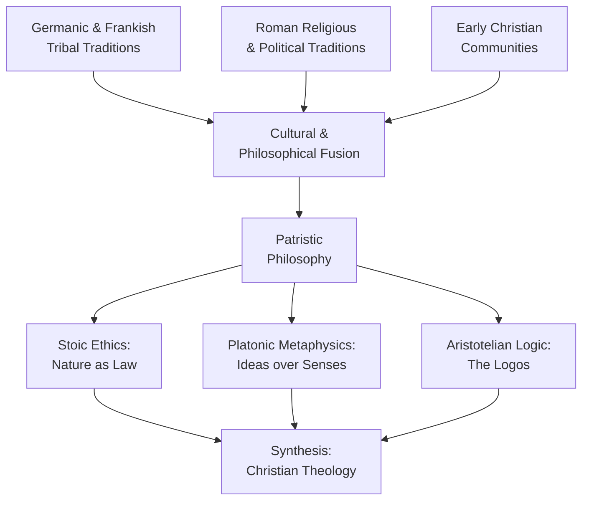

# The Rise of Christianity and the Convergence of Philosophies

The streets of Alexandria in the early third century smelled of salt air and incense. A young man named Plotinus sat in a lecture hall, listening to a teacher named Ammonius Sacas — a figure so obscure that almost nothing about him survives except the fact that he shaped the minds of thinkers who would reshape the Western world. Around Plotinus, the city hummed with a dozen languages, a dozen religions, and a dozen competing accounts of what the soul was and where it went after death. Greek merchants haggled near temples to Serapis. Jewish scholars debated scripture in synagogues that doubled as schools. Christian communities gathered in private homes, whispering about a resurrection that had scandalized Roman authorities. The old philosophical schools — Stoic, Platonic, Aristotelian — still attracted students, but their doctrines no longer stood in tidy isolation. They bled into one another, absorbed foreign ideas, mutated. You can almost feel the intellectual vertigo: a civilization that had once known what it believed now grasping at fragments, trying to assemble something whole from pieces that no longer fit the way they once did. What happens to a culture's understanding of the mind when the culture itself begins to dissolve?

## Rome's Fracture and the World That Emerged

The fall of Rome was not a single event. It was a slow, grinding process — waves of Germanic and Frankish tribal migrations that carried their own traditions, cultish beliefs, and spiritual practices into the Roman world. These newcomers did not simply conquer; they mixed. Roman attitudes collided with tribal customs. Christian communities, once persecuted, found themselves courted by leaders who needed peace more than purity. Changes worked in both directions: Christianity absorbed local practices, and local rulers absorbed Christian structures of authority.

This convergence did not happen in a vacuum. By the second and third centuries, the Roman elite had grown cynical. Traditional Roman religion — the old gods, the old rites — felt hollow to the educated classes. Tertullian's *De Spectaculis* had thundered against carnal Rome, promising a Day of Judgment that would expose the emptiness of gladiatorial spectacle and imperial pageantry. Meanwhile, the persecution of Christians under emperors like Nero, Trajan, and Marcus Aurelius did something unexpected: it gave the poor and hopeless a daring, romantic model. Martyrdom became a form of protest. Suffering became proof of conviction. The very cruelty meant to stamp out Christianity made it magnetic.

> [!TIP]
> **Stop and Think:** Why does persecution sometimes strengthen a movement rather than destroy it? Consider movements in your own culture or era — do you see parallels?

You might wonder whether Christianity simply filled a vacuum left by dying traditions. The reality is more complex. Christianity did not just replace what came before; it *absorbed* it. The new religion proved astonishingly flexible, taking philosophical tools from rival systems and repurposing them for its own theological ends. This absorptive capacity — this willingness to borrow without surrendering core commitments — is what gave the Patristic period its distinctive intellectual character.

*Figure 4.1: The Cultural Convergence of Late Antiquity*

## The Great Borrowing: Stoic, Platonic, and Aristotelian Threads

Early Christian thinkers faced a problem. They had faith, revelation, and community — but they did not yet have a systematic philosophy. The Greek philosophical tradition, by contrast, had spent centuries refining concepts of the soul, the good life, and the structure of reality. Rather than reject this inheritance wholesale, the Patristic philosophers did something pragmatic: they borrowed.

From **Stoicism**, they took the conception of nature as law — the idea that the universe operates according to rational principles that humans can discern and follow. Stoic ethics, with their emphasis on duty, self-mastery, and living in accordance with nature, mapped neatly onto Christian ideals of virtue and self-discipline. The Stoic mandate that the true philosopher live an exemplary life became, in Christian hands, a mandate that the true believer live a holy one.

From **Platonism**, they received something even more consequential: the ultimate reality of ideas over senses. Plato's claim that the physical world is a shadow of a deeper, immaterial reality gave Christian theologians a framework for understanding the soul's relationship to God. If the material world is secondary — a cave wall of flickering shadows — then the soul's true home lies beyond it. Christianity went beyond mere Stoic resignation here. It took the Platonic celebration of death — the idea that death frees the soul from its bodily prison — and gave it a destination: reunion with the Creator.

From **Aristotelian** teaching, the Patristic thinkers assimilated the concept of the **Logos** — the underlying rational principle of the universe. In Greek philosophy, Logos referred to the ordered logic of reality, the structure that makes the cosmos intelligible rather than chaotic. Early Christians, reading the Gospel of John ("In the beginning was the Word"), identified Christ himself as the Logos incarnate. A philosophical concept became a theological one.

> [!TIP]
> **Stop and Think:** When a new religion borrows concepts from older philosophies, does it distort those concepts or fulfill them? Can you think of a modern example where one tradition reinterprets another's core idea?

The eloquence of early religious philosophers made this synthesis persuasive. Origen's devotion to an existence devoid of lust was so extreme that he documented it through self-inflicted emasculation — a detail that horrifies modern readers but that revealed, to his contemporaries, the depth of his commitment. These were not armchair theologians. They staked their bodies on their beliefs.

This borrowing was selective. Against all late philosophies, the Patristic thinkers rejected **materialism** — the philosophical position that reality consists solely of matter and its interactions. For them, the immaterial was not just real but *more* real than the material. This rejection became a defining boundary: you could borrow from Stoics, Platonists, and Aristotelians, but you could not be an Epicurean. Matter was not the final word.

## Plotinus and the Bridge Between Worlds

If any single figure embodies the intellectual ferment of this period, it is **Plotinus** (205–270 CE). Born in Egypt, educated in Alexandria under Ammonius Sacas — the same teacher connected to Tertullian's circle — Plotinus eventually settled in Rome, where he taught and wrote. His student Porphyry, an Athens-educated Syrian who also settled in Rome, compiled Plotinus's lectures into the *Enneads*, the foundational text of what later scholars would call **Neo-Platonism**.

Neo-Platonism was not simply Plato repackaged. It was a systematic metaphysics that arranged all of reality in a hierarchy emanating from a single, transcendent source — the One. Below the One stood Intellect (Nous), then Soul (Psyche), and finally Matter, the lowest and most impoverished level of existence. Plotinus left no ambiguity about his view of matter:

> "Matter is not Soul; it is not Intellect, is not Life, is no Ideal Principle, No Reason-Principle; it is no limit or bound, for it is mere indetermination; it is not a power — for what does it produce?"

For Plotinus, matter was not evil in a moral sense — it was worse. It was *nothing*. It was the absence of form, the negation of meaning, the point where reality thins out into mere potential without actuality. This position had profound implications for psychology. If matter is nothing, then the body — which is material — is nothing. The soul, which is immaterial, is everything. The entire drama of human existence becomes a story of the soul trying to escape its material prison and return to the One.

This is **ontological dualism** in its starkest form: a sharp, unbridgeable divide between the material and the immaterial, with all value concentrated on the latter. You can see why Christian theologians found Plotinus irresistible. His system gave them a philosophical vocabulary for describing the soul's journey toward God — a vocabulary far more sophisticated than anything the early Church had developed on its own.

> [!TIP]
> **Stop and Think:** Plotinus ranked matter as the lowest form of reality. How might this view shape someone's attitude toward the body, toward physical pleasure, toward the natural world? What are the psychological consequences of believing that what you can touch and see is, at bottom, nothing?

The world of thought was becoming scattered. Old philosophical systems were dividing into sects and absorbing notions their classical authors would have found bizarre. Plotinus himself was a figure of contradictions: he at times challenged Christian teaching, yet at other times defended **monotheism**, the immateriality and immortality of the individual soul, and the essential "evil" of mere matter. He stood at a crossroads, defending ideas that Christianity would later claim as its own while resisting the religion that would eventually absorb his legacy.

## The Rejection of Materialism as Philosophical Boundary

What gives the Patristic period the quality of a distinct age is not just what its thinkers believed but what they refused to believe. The rejection of materialism served as a kind of philosophical boundary marker — a line drawn in the intellectual sand that separated acceptable speculation from dangerous error.

This rejection was not arbitrary. The materialist traditions — Epicureanism chief among them — offered a vision of the universe as atoms in void, with no purpose, no divine plan, and no immortality for the soul. For Patristic thinkers, this was not merely wrong; it was existentially intolerable. A universe without immaterial reality was a universe without meaning. And a soul that dissolved at death was not worth saving.

The irony is that the very sophistication of Greek materialism made it a target worth taking seriously. Epicurean physics was rigorous. Its ethics were humane. Its account of the natural world was, in many respects, ahead of its time. But the Patristic philosophers could not accept its conclusion — that consciousness is just what matter does when arranged in certain ways. For them, consciousness was a window onto the immaterial, a flicker of the divine trapped in flesh.

> [!TIP]
> **Stop and Think:** The Patristic thinkers rejected materialism because they believed it drained the universe of meaning. Modern neuroscience often describes consciousness as a product of brain chemistry. If they are right, does that make life meaningless? Or can meaning survive without immaterial reality?

This rejection created an intellectual alliance across otherwise incompatible traditions. Stoics, Platonists, and Aristotelians disagreed about almost everything else — the nature of God, the structure of the soul, the path to wisdom — but they agreed that reality could not be reduced to matter alone. Against the materialists, they stood united. This unity-through-opposition would shape Western psychology for over a millennium.

## The Search for Unity in a Fracturing World

The major figures of the Patristic period were not simply theologians defending a new religion. They were philosophers searching for something older and, in their eyes, more urgent: a philosophical unity that might restore a cultural unity. The Roman world was fracturing — politically, socially, intellectually. Old certainties were dissolving. New beliefs competed for allegiance. In this environment, the Patristic thinkers reached back to the classical philosophers not out of nostalgia but out of necessity.

They sought to reestablish the authority of cardinal tenets developed by Plato, Aristotle, and the Stoics — tenets expressive of a greater culture that had once known what it believed about the soul, the good, and the structure of reality. Christianity, in their hands, became not a rejection of philosophy but its fulfillment. The scattered fragments of Greek wisdom would be reassembled, purified, and pointed toward a single transcendent goal.

This project was, in a sense, the first great act of intellectual synthesis in Western history. It would not be the last. Every era of cultural crisis produces its own synthesizers — thinkers who reach across dividing lines to forge new wholes from broken parts. The Patristic philosophers did it with Stoic ethics, Platonic metaphysics, and Aristotelian logic. Later centuries would do it with different materials. But the impulse is the same: when the world falls apart, you build a new one from the pieces that survive.

> [!TIP]
> **Stop and Think:** Can philosophical unity actually restore cultural unity? Or does the attempt to impose a single worldview on a diverse society create new fractures? Think about a contemporary debate — political, scientific, or religious — where competing frameworks struggle for dominance.

The scattered world that Plotinus inhabited — Egyptian-born, Alexandrian-trained, Roman-based — was a world in motion. Ideas traveled faster than empires. A concept born in Athens could reshape theology in Carthage within a generation. The Patristic period was the moment when Western thought stopped being purely Greek and started becoming something stranger, richer, and more conflicted: a tradition that claimed the authority of reason while insisting that reason alone was not enough.

---

## References

Robinson, D. N. (1995). *An Intellectual History of Psychology* (3rd ed.). University of Wisconsin Press.

Gerson, L. P. (2016). "Neoplatonism." In E. N. Zalta (Ed.), *Stanford Encyclopedia of Philosophy*. Stanford University. https://plato.stanford.edu/entries/neoplatonism/

*Module 2 of 4 complete.*

---

The thinkers you have just met — Plotinus, Origen, Tertullian — built their systems from borrowed parts. But borrowing raises a question that none of them fully answered: when you take a concept from one tradition and place it inside another, does it stay the same? The next module examines what happened when these borrowed ideas collided with the authority of scripture and the demands of institutional Church power — and how the psychology of the soul became, for the first time, a matter of public policy.
