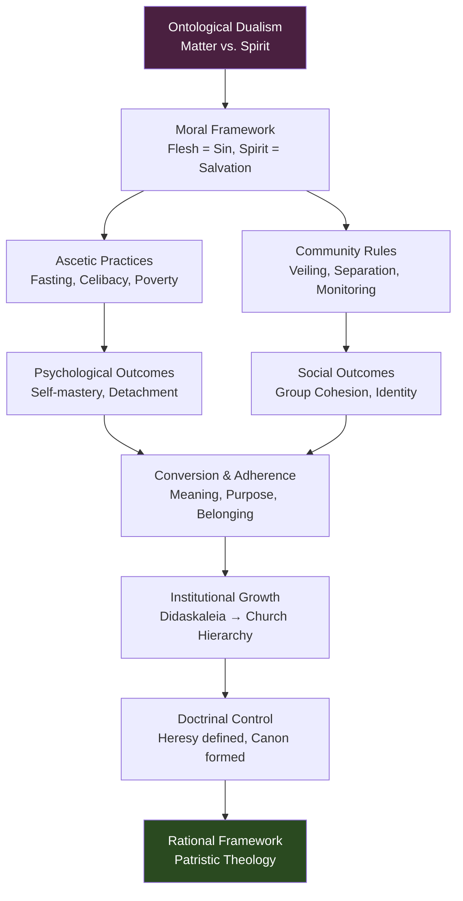

# Module 03: Faith, Community, and the Early Church

Imagine walking through the streets of Antioch in the fourth century. The markets still hum with Greek — the old language of philosophy and rhetoric — but something has shifted. Near the edge of the city, a man lives alone in a small stone cell. He eats once a day, speaks to almost no one, and spends his hours in prayer. The locals call him a saint. He calls himself a sinner. His body is thin, his eyes bright with something you can't quite name. You ask him why he punishes himself, and he looks at you with genuine confusion. "Punish?" he says. "I am *freeing* myself." A few streets away, a woman of considerable wealth has given away everything she owns. She now tends to the sick and the dying in a house she does not own, wearing clothes she did not choose. She smiles constantly. You want to understand: what psychological architecture could make suffering feel like liberation? What belief system transforms deprivation into the highest form of flourishing? You look for the philosophy behind it, but the practitioners wave philosophy away. They don't want arguments. They want God. And yet, you notice, they *do* argue — fiercely, endlessly — about what God actually wants. The question that follows you out of Antioch is this: how does a movement that distrusts the intellect build the most enduring institution in Western history?

---

## The Architecture of Radical Dualism

To understand the psychology of the early Church, you need to understand the worldview that held it together: **dualism** — specifically, the ontological claim that reality divides into two fundamentally opposed domains, matter and spirit. This wasn't new. Plato had separated the world of Forms from the world of appearances. The Gnostics had gone further, treating the material world as a prison. But the early Church Fathers took this framework and gave it a moral urgency the Greeks never quite intended.

Here's the logic. If the world of matter is ruled by Satan — as many early Christians believed — then your body is contested territory. The soul wants to ascend toward God; the flesh pulls it downward into sin. Every sensory pleasure becomes a potential trap. Food, drink, sexual desire, even comfort itself — all are vectors through which the material world reasserts its claim on you. The body, left unchecked, becomes not a temple but what Robinson calls "something more akin to a kennel." For the flesh-eaters among the ascetics, the inner world becomes "an abattoir."

> [!TIP] Stop and Think
> Modern psychology treats the body and mind as deeply integrated — exercise improves mood, gut bacteria influence cognition. But the early Christians saw them as enemies. Where do *you* locate yourself — in your body, in your mind, or somewhere in the tension between them?

This wasn't abstract theology. It had immediate behavioral consequences. If matter is the enemy, then renunciation of material pleasures becomes a spiritual discipline. You don't fast because food is unhealthy. You fast because hunger reminds you that you are not your body. You don't choose celibacy because sex is dirty. You choose it because desire is a chain linking you to the wrong world. The psychological move is extraordinary: by rejecting what the body wants, you assert sovereignty over it. You prove — to yourself and to God — that your will is stronger than your appetite.

The dualism also explained suffering. If the material world is inherently fallen, then pain is not a problem to be solved but a condition to be transcended. The early Christians didn't need a theodicy in the philosophical sense. Suffering was simply what matter *does*. The real question was whether your soul would rise above it or be crushed by it.

---

## Asceticism as Psychological Practice

**Asceticism** — from the Greek *askesis*, meaning "training" or "exercise" — was the practical expression of this dualistic worldview. But calling it mere self-denial misses the point. Asceticism was a *technology of the self*, a systematic program for reshaping who you were.

Consider the practices: fasting, celibacy, sleep deprivation, isolation, poverty. Each one targeted a different dimension of human desire. Fasting attacked hunger and the pleasures of the body. Celibacy attacked sexual desire and the pull of intimate attachment. Isolation attacked the need for social approval and human connection. Poverty attacked the craving for security and status. Taken together, they constituted a comprehensive assault on what we would now call the reward system — the constellation of neural circuits that drive us toward pleasure and away from pain.

> [!TIP] Stop and Think
> Think of a time you deliberately denied yourself something you wanted — a dessert, a day off, a purchase. What happened psychologically? Did the denial feel like loss or like control? The early ascetics would say that the feeling of control *was* the gain.

The reach of these practices, however, was uneven. The lower classes were generally not expected to pursue such extremes. A barmaid's conduct was judged by different standards than the wife of a wealthy patron. Some larger enclaves of asceticism developed in places that had been centers of Greek culture — Antioch being a notable example — where philosophical traditions of self-mastery found new religious expression. Local hermits and gurus emerged, saintly persons known for good works and radical self-denial. Some insisted that even marriage tied one too firmly to "the business of this world."

The sensualists among the early faithful were handled with particular care. Women were required to be veiled and carefully monitored. Socializing between unmarried men and women was discouraged. Life, in this view, was a trial or test — one failed by the many, with eternal damnation waiting. It was not a framework that tolerated whim or impulse.

---

## The Psychology of Conversion and Community

The early Church didn't grow through philosophical argument. It grew through something more psychologically potent: the offer of a new identity within a community of mutual obligation.

Robinson identifies eight fundamental principles that the early Church offered without compromise:

- Every person is the child of God
- There is only one God
- We are made to serve God in this world and, through good works, to live eternally in His light
- The soul is the essence of human life
- Neglect of the soul is a sin to be punished
- No force on earth can affect God's plan
- God's goodness is the cause of all things
- God sacrificed His only Son for human redemption

Read these not as theology but as psychology. Each one addresses a specific human vulnerability. "Every person is the child of God" answers the question of worth — you matter, not because of what you own or who your parents are, but because of what you *are*. "Eternal life" answers the terror of death. "God as Father of all" answers the experience of abandonment and oppression. For a slave in the Roman Empire, the claim that you are the child of the one true God is not metaphor. It is revolution.

> [!TIP] Stop and Think
> Consider the eight principles above. Which one would resonate most powerfully with someone living in poverty, someone grieving a loss, or someone facing injustice? How does each principle function as a psychological intervention?

The appeal was not abstract. Robinson frames it with precision: to an empire torn by tyrants, the Church offered brotherhood; to a mass facing hunger and plague, eternal life; to the oppressed and slave, the reassuring genealogy of God as Father of all; to the pagan and criminal, redemption. This is not philosophy. This is what modern psychologists might call *meaning-making at scale* — a shared narrative that transforms individual suffering into participation in something transcendent.

---

## The Didaskaleion and the Structure of Authority

Christianity did not begin with institutions. It began with study groups. The faithful gathered in **didaskaleia** (singular: **didaskaleion**) — small study-groups centered not on texts but on a living teacher. The leader, rather than a canon of scripture, was the authority. This is a psychologically significant detail. The early Christians were not readers debating interpretation. They were followers building attachment to a person.

This model had strengths and weaknesses. On the strength side, it created deep loyalty and communal bonds. The didaskaleion was not a school in the Greek sense — it was closer to what we might call a support group, a space where shared belief reinforced shared identity. On the weakness side, it produced fragmentation. With numerous such groups operating independently across the Roman Empire, unity was impossible. Different teachers taught different things. The community "was scarcely united."

> [!TIP] Stop and Think
> Think about how you learn best — from a textbook, from a lecture, or from a mentor you trust. The early Church bet on the mentor model. What are the psychological advantages and risks of placing authority in a person rather than a document?

Unification, when it came, was "at the price of interpretive license." Some teaching had to be rejected. The technical term for this rejected teaching is **heresy** — from the Greek *hairesis*, meaning "choice" or "faction." The irony is sharp: a movement that began with individual spiritual experience eventually required the suppression of individual interpretation. To become an institution, the Church had to decide which choices were permissible and which were not. The psychological freedom that drew people in had to be constrained to hold them together.

---

## Anti-Intellectualism and the Faith-Philosophy Tension

One of the most psychologically interesting features of early Christianity is its ambivalence toward reason. Robinson notes that many early followers were poorly educated. Tertullian — one of the most influential early Church Fathers — contributed what Robinson calls "a sneering anti-intellectualism." Philosophy had failed. It had produced endless disagreement and no salvation. A philosophical foundation required argument and public discourse, and the early Christians were suspicious of both.

**Patristic scholars** — the **Church Fathers** who shaped Christian doctrine in the first five centuries — inherited this tension. They needed to make Christianity intelligible to educated pagans, but they distrusted the tools of pagan education. The result was a paradox: men trained in Greek rhetoric and philosophy using those very tools to argue that rhetoric and philosophy were insufficient.

> [!TIP] Stop and Think
> Have you ever encountered a belief system that claimed to be beyond reason while simultaneously using reason to defend itself? How do you reconcile "trust faith over argument" with "here is my argument for why you should trust faith"? This tension is not unique to early Christianity — it appears in many modern contexts as well.

By the fifth century, however, the paradox had resolved itself — not through logic, but through institutional confidence. With the authority that comes from success, the Church Fathers built "a studiously rational framework by which the Christian view of human nature might be taught in psychologically meaningful terms." They didn't abandon reason. They domesticated it, putting it in service of conclusions that had already been reached through faith. The intellect became a tool, not a guide. This is a psychological move with enormous consequences: it allowed the Church to engage with philosophy without being governed by it.

---

## The Psychology of Institutional Faith

The following diagram maps the psychological architecture of early Christian community, showing how dualistic beliefs generated specific practices, which in turn produced specific psychological outcomes:

*Figure 1: From dualistic belief to institutional theology — the psychological pathway of early Christianity.*

---

## A Modern Research Anchor

The early Christians believed that practices of self-denial — fasting, celibacy, voluntary poverty — strengthened the soul. Modern psychology has investigated a strikingly parallel claim: that religiousness is associated with enhanced self-control and self-regulation.

McCullough and Willoughby (2009), in a comprehensive review published in *Psychological Bulletin*, examined the relationship between religion and self-control across dozens of studies. Their central finding was that religiousness — measured through affiliation, practice, and belief — was consistently and positively associated with self-control and self-regulatory capacity. They proposed two pathways: first, that religious practices (such as prayer, meditation, and fasting) directly exercise self-regulatory "muscles," much as the ascetics believed; second, that religiousness provides a framework of values and goals that makes self-control *motivationally coherent* — you don't resist temptation in a vacuum, you resist it because it serves a larger purpose.

The implications for understanding Patristic psychology are direct. The ascetic practices of the early Church — which seem extreme or even pathological to modern observers — may have functioned as a form of psychological training. The monk who fasted didn't just demonstrate piety; he may have been building the very self-regulatory capacity that McCullough and Willoughby's review identifies. The early Church's insistence on renunciation wasn't merely punitive. It was, in a sense the practitioners themselves might not have articulated, *functional*.

> [!TIP] Stop and Think
> McCullough and Willoughby found that the *practice* of religion predicted self-control more reliably than mere *belief*. What does this suggest about the early Church's emphasis on ascetic discipline over theological sophistication? Were the Church Fathers, perhaps without knowing it, building a self-regulation training program?

---

## References

- McCullough, M. E., & Willoughby, B. L. B. (2009). Religion, self-regulation, and self-control: Associations, explanations, and implications. *Psychological Bulletin*, 135(1), 69–93.
- Robinson, D. N. (1995). *An intellectual history of psychology* (3rd ed.). University of Wisconsin Press.

---

*This concludes Module 03. The early Church had built a community, a set of practices, and a psychological framework — but it had not yet confronted the full challenge of reconciling faith with the philosophical traditions it had inherited. In the next module, we turn to the great synthesis: how Augustine of Hippo would attempt to fuse Christian faith with Neoplatonic philosophy, creating a psychological vision that would dominate Western thought for a millennium. What happens when the Church's anti-intellectualism meets a mind that cannot stop thinking?*
