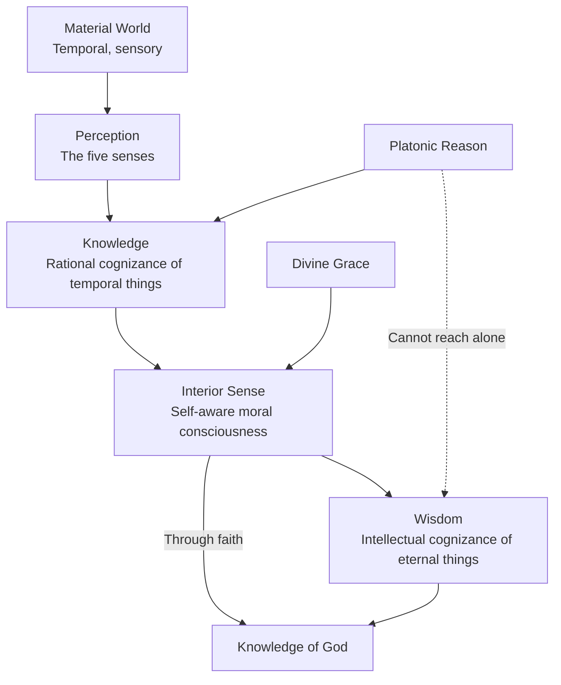

# Module 04 — Augustine and the Problem of Knowledge

## Chapter 4: Patristic Psychology — The Authority of Faith

---

It is the year 386 AD, and a thirty-two-year-old man is sitting in a garden in Milan, weeping. He has spent the better part of his adult life chasing intellectual prestige. He has mastered rhetoric, studied Aristotle's *Categories* (and found them more confusing than illuminating), read the Platonists with genuine excitement, and built a career as a public speaker of considerable reputation. He has also maintained a mistress for over a decade, fathered a son, and broken a promise to his mother that he would convert to Christianity. Now, sitting under a fig tree, he is at war with himself. His mind tells him that the Christian account of reality is true — that God exists, that the soul is immortal, that the material world is not the final word. But his habits pull him in another direction. He wants to be good. He also wants to keep doing what he has always done. Suddenly, from a neighboring house, he hears a child's voice — some say a boy, some say a girl — chanting in Latin: *Tolle, lege. Tolle, lege.* "Take up and read. Take up and read." He opens a copy of Paul's Epistle to the Romans, reads a passage about abandoning the works of darkness, and feels, as he later writes, "a light of relief" flood his heart. The man is Augustine of Hippo. The book he will write about this crisis — the *Confessions* — will become the most influential autobiography in the history of Western thought. But here is the question that drives everything he wrote afterward: How did that inner voice — the one that knew the truth before his reasoning mind could prove it — actually work?

---

## Reason, Faith, and the Misleading Label of "Neo-Platonism"

You will encounter, in almost any survey of intellectual history, the claim that early Christianity was simply **neo-Platonism** dressed in religious clothing. Scholars point to Origen, to Plotinus, to Augustine himself, and say: look, they borrowed Plato's ideas wholesale. This is not entirely wrong, but it is dangerously incomplete.

Start with the fundamental difference. Platonism is rationalism at its purest. For Plato, the path to truth runs through dialectical reasoning — through rigorous, structured argument, the mind can be led to knowledge that already latently exists within the soul. The Platonic soul wanders the universe in search of True Forms, cycling through incarnations, gradually remembering what it once knew. The good life is contemplative and introspective. The Republic is the ideal state not because it serves God but because it gives the philosopher the clearest possible view of human nature.

Christianity reverses nearly every one of these commitments. The Christian soul does not wander; it confronts God directly and takes up eternal life with Him. The Christian life is not contemplative but active — a life of action, reform, and moral transformation. And most critically, for the Christian, faith comes first. Knowledge does not begin with reasoning your way to truth; it begins with believing, and from that belief flows a transcendental awareness of God. Reason is a guiding light, but it is not the light. Faith is the light *and* the path.

> [!TIP]
> **Stop and Think:** Think about something you know to be true but that you did not arrive at through logical argument — perhaps a moral conviction, a sense of trust in someone, or an intuition about a situation. Did reason lead you there, or did you start with something more like faith and then find reasons afterward?

This is not a trivial distinction. It produces two radically different psychologies. If reason is primary, then the mind is a calculating machine, and the good life is the life of careful thought. If faith is primary, then something deeper than calculation is at work — an inner awareness that grasps truths the rational mind cannot reach on its own.

Augustine himself credited Cicero's lost *Hortensius* with awakening his philosophical appetite. He found Aristotle's *Categories* more harmful than helpful. He praised the Platonists for recognizing that truth is incorporeal — not a physical thing you can touch or measure — but he praised Paul still more for identifying this truth with the grace of God. The Platonists, in Augustine's view, had glimpsed something real. They just had not gone far enough, because the Son of God had not yet presented Himself to the Hellenes. The life of Jesus changed the equation entirely.

---

## The "Interior Sense": Augustine's Theory of Consciousness

Here is where Augustine becomes genuinely interesting for psychology. He did not simply argue that faith is superior to reason. He tried to describe the mechanism by which the soul knows itself.

Augustine's most original contribution is what he called the **interior sense** — a nonsensory inner awareness of truth, of error, of the moral right, of personal obligation, and of personal identity. This is not perception in the ordinary sense. You do not see it with your eyes or hear it with your ears. It is the mind's awareness of its own operations. In modern psychological language, this maps remarkably well onto what cognitive scientists now call **metacognition** — the ability to think about one's own thinking, to monitor and evaluate one's own cognitive processes.

But Augustine's interior sense is more than metacognition in the modern, narrow sense. It is a moral consciousness. Consider the passage from the *Confessions* where he describes his struggle with sexual temptation:

> "You commanded me to abstain from sleeping with a mistress... But there still live in that memory of mine images of the things which my habit has fixed there. These images come into my thoughts and though, when I am awake, they are strengthless, in sleep they not only cause pleasure but go so far as to obtain assent and something very like reality... how does it happen that even in our sleep we do often resist and, remembering our purpose and most chastely abiding by it, give no assent to enticements of this kind?"

Read that carefully. Augustine is describing something very specific: an inner awareness that can judge the content of perception — even the distorted, wishful perception of dreams — and refuse to endorse it. The senses deliver images. Habit reinforces them. But something else — the interior sense, the moral consciousness — evaluates those images and decides whether to assent. This is not mere thinking. It is thinking about thinking, with a moral dimension attached.

> [!TIP]
> **Stop and Think:** Have you ever had a dream that disturbed you — not because of its content, but because part of you seemed to know, even within the dream, that something was wrong? That inner watcher, the part that evaluates even your sleeping thoughts, is remarkably close to what Augustine was describing. What does it tell you about the structure of your own mind?

What makes this genuinely remarkable is Augustine's insistence that this interior sense is *self-aware*. It does not merely perceive the world; it perceives itself perceiving. It is aware of each of the separate senses — sight, hearing, touch — as they operate, and it is simultaneously aware of itself being aware. This is not a passive mirror reflecting the world. It is an active, recursive process: the mind watching itself watch. Modern cognitive science has spent decades trying to explain exactly this capacity — the ability to represent one's own mental states — and Augustine was describing it in the fourth century.

### Research Anchor: Modern Metacognition and Augustine's Interior Sense

A 2021 review in *npj Science of Learning* by Fleur, Bredeweg, and van den Bos defines metacognition as comprising both "the ability to be aware of one's cognitive processes (metacognitive knowledge) and to regulate them (metacognitive control)" (Fleur et al., 2021). The authors note that metacognition involves monitoring one's own learning and thinking — evaluating whether you truly understand something or merely feel familiar with it. Neuroscience research has linked metacognitive capacity to the prefrontal cortex, particularly the anterior prefrontal cortex, which appears to support the brain's ability to represent and evaluate its own cognitive states. Augustine could not have known about the prefrontal cortex, but his description of the interior sense — an inner faculty that perceives itself perceiving, judges the content of the senses, and exercises moral authority over what the mind endorses — anticipates this framework with striking precision. The difference is that Augustine embedded this capacity in a theological structure: the interior sense works because God designed it to work, and its full activation requires grace. Modern cognitive science strips away the theology but preserves the core insight: the mind is not merely a passive receiver of information. It is an active monitor of its own processes, capable of self-evaluation and self-correction.

---

## Knowledge, Wisdom, and the Limits of Reason

Augustine drew a sharp line between two concepts that are often blurred together — a distinction that became foundational for **epistemology**, the philosophical study of knowledge. In his formulation, **knowledge** is "a rational cognizance of temporal things" — the ability to understand the world as it presents itself to the senses and to reason. It is what you use to navigate daily life, to solve practical problems, to understand cause and effect in the physical world. **Wisdom**, by contrast, is "an intellectual cognizance of eternal things" — an understanding of truths that transcend time, space, and sensory experience.

This distinction carries enormous implications for psychology. If knowledge is all there is — if the mind can only process what the senses deliver — then human understanding is permanently bounded by the material world. You can know a great lot about how things work, but you cannot know why anything matters. You can catalogue the facts of existence but never grasp its meaning.

Faith and reason, on this account, are different faculties. Reason is genuinely valuable; Augustine never denied that. But reason alone cannot equip you with what he called "sublime knowledge of the eternal." It can get you to the threshold. It can clear away errors and false assumptions. It can even, as the Platonists demonstrated, lead you to recognize that truth is incorporeal. But it cannot carry you across. For that, something else is required — grace, faith, the interior sense activated by divine contact.

> [!TIP]
> **Stop and Think:** Is there a difference between knowing how something works and understanding why it matters? Consider a scientific discovery — say, the structure of DNA. You can know the molecular facts. But does that knowledge, by itself, tell you anything about the meaning of life, the nature of consciousness, or the existence of God? Where does one kind of knowing end and the other begin?

---

## The Incorporeal Mind: Augustine's Dualism

In Book X of *De Trinitate*, Augustine made an argument that would shape Western psychology for over a millennium: the mind is incorporeal. It is not a thing in the way that a stone or a brain is a thing. It does not occupy space. It cannot be weighed or measured. Yet it directs the material senses, processes their input, and exercises judgment over what they deliver.

This is **dualism** in its classical form — the claim that mind and body are fundamentally different kinds of entities. The mind, while not a substance in the physical sense, is able to have commerce with the world of material things. But — and this is Augustine's crucial point — the fact that the mind interacts with the physical world does not make it physical. He rebuked the Epicureans for precisely this confusion: they assumed that because the mind deals with material objects, the mind must itself be material. Augustine argued this was like saying that because a judge deals with criminals, the judge must be a criminal.

Set free of sensory deceit, Augustine argued, the mind can know itself, reflect on itself, and love itself. Only through this self-knowledge can it find God. The mind is the closest thing to God that exists within human experience — not because the mind is God, but because the mind, like God, is incorporeal, self-aware, and capable of love.

*Figure 4.1: Augustine's epistemological framework — how the mind relates to truth*

> [!TIP]
> **Stop and Think:** Modern neuroscience treats the mind as a product of brain activity — electrochemical processes in neural tissue. Augustine treated the mind as something fundamentally non-physical that nonetheless interacts with the physical. Which view gives you better tools for understanding your own inner experience? Is there a way to reconcile them?

---

## Divine Grace and the Problem of Universal Truths

Here is a problem that Augustine had to solve, and his solution reveals the depth of his psychological thinking.

The Platonic theory of knowledge depends on **anamnesis** — the idea that the soul possessed knowledge of universal truths before birth and must *remember* them. This is why Plato valued dialectic so highly: the right question, asked in the right way, can trigger the soul's memory of what it once knew. But this creates a direct conflict with Christian theology. If God creates each individual soul anew — if every soul is, as it were, freshly minted — then how can it possess universal truths at all? There was no prelife in which to learn them.

Augustine's answer is the voice of the Divine. Each soul, at the moment of its creation, receives access to universal truth not through memory of a past life but through the direct speech of God to and through that soul. It is by the grace of God that the human mind receives knowledge of the eternal. The interior sense — that self-aware, morally charged consciousness — works because God designed it to hear His voice. Human freedom means you can choose not to listen. But the word is ever present. It does not depend on your effort, your education, or your philosophical sophistication. It depends on your willingness to attend.

This is what makes early Christian philosophy a **transcendental psychology** — a psychology that insists all human beings, as children of God, share in divine wisdom. Through faith, we can elevate our comprehension to a cosmic level. The Christian pledge is that faith, conferred by grace, equips the believer with the answer to the ultimate questions: Where did we and the universe come from? What is our destiny?

The implications for human equality are profound. The Hellenic perspective — even the Aristotelian one — judged human nature in conservative terms. Some persons were considered "natural slaves." Even the philosopher could only get so far in this earthly life. Christianity demolished this hierarchy. Every person is "a brother in Christ." Every soul is comprehended by God's mercy and love. This is not merely a theological claim. It is a psychological one: it says that the capacity for wisdom is universal, that no soul is inherently inferior, and that the barriers to understanding are moral and volitional, not intellectual.

> [!TIP]
> **Stop and Think:** Modern education systems often sort people by "ability" — tracking, streaming, standardized tests. Augustine argued that the capacity for the deepest knowledge is universal, distributed equally by God, and limited only by the individual's willingness to listen. Is there any truth to this view? What would education look like if we actually believed it?

---

## The Psychological Shift: From Truth to Transmission

What makes the early Christian problem of knowledge distinctive is that it was not primarily about *uncovering* truth. The truth, for Augustine, was already given — revealed by God, accessible through faith, confirmed by the interior sense. The real problem was *transmitting* it: readying the pagan for the light of faith. How do you prepare a mind that has been shaped by materialism, sensory habit, and philosophical error to receive a truth that transcends all of those?

This question drove Christian scholars to inquire more deeply into the psychological factors governing human judgment and conduct than any Greek philosopher had done. The *Confessions* are the landmark text of this shift. Augustine perfected the practice of public disclosure — confession of guilt, freely made resolution, detailed self-examination. His attention was given over to that side of the self that the Socratic dialectic had ignored: the irrational, habitual, emotionally charged dimension of human psychology that resists correction even when the mind knows better.

This is why Augustine matters for psychology in a way that Plato and Aristotle do not. The Greeks studied the rational mind. Augustine studied the mind in conflict with itself — the mind that knows the truth and cannot bring itself to act on it, the mind that is haunted by images it did not choose, the mind that wakes from a dream and asks: *Why did I almost assent to that?* He did not have the vocabulary of cognitive science, but he was asking the same questions.

---

## References

Fleur, Damien S., et al. "Metacognition: Ideas and Insights from Neuro- and Educational Sciences." *npj Science of Learning*, vol. 6, no. 13, 2021, doi:10.1038/s41539-021-00089-5.

Robinson, Daniel N. *An Intellectual History of Psychology*. 3rd ed., University of Wisconsin Press, 1995.

---

*Module 4 of 6 complete.*

---

You have seen how Augustine reoriented the problem of knowledge — from uncovering truth to transmitting it, from the mind's rational powers to its interior, self-aware, morally charged depths. But knowing the truth and acting on it are different things. Augustine knew this better than anyone. He had sat in that Milan garden, known what was right, and still hesitated. The question that haunted him — the question of free will, of why a soul that can see the light sometimes chooses to look away — is the subject of the next module.
