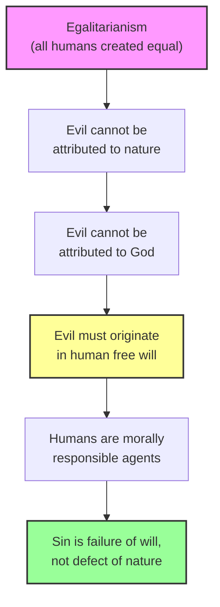
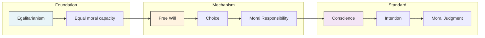

# Module 05: Augustine and the Problem of Conduct

---

Imagine you are a Roman citizen in the fourth century. You have just converted to Christianity, and the change is unsettling in ways you did not anticipate. Before, morality was straightforward: obey the laws, honor the gods of the state, and act virtuously in public. Caesar's guards could see your deeds. Your neighbors could judge your reputation. The entire apparatus of Roman civic life kept you in line through visible reward and punishment.

But now something has shifted. You kneel in a dimly lit church and hear the bishop preach that God sees not only what you do but *why* you do it. The act of giving alms means nothing if performed for vanity. The brave soldier's sacrifice is hollow if motivated by pride rather than love. An invisible judge weighs invisible intentions, and there is no corner of your mind dark enough to hide from this scrutiny.

You leave the church troubled. If God sees everything — every motive, every secret desire — then what room is left for your own judgment? And if your will is truly free, as the bishop insists, then the sins you commit are genuinely *yours*. You cannot blame fate, or the stars, or the alignment of the planets. The burden is enormous. You begin to wonder: is free will a gift or a punishment?

This was the psychological landscape Augustine of Hippo inhabited and shaped. The problem of conduct — how to live rightly, and why we fail to do so — became the central question of his moral psychology. And his answer would set the terms of debate for over a thousand years.

---

## The Egalitarian Rupture

To appreciate what the Patristic philosophers accomplished, you need to understand just how radical their starting point was. Before Christianity, the dominant intellectual traditions of the ancient world assumed that human beings were *naturally* unequal.

Plato built his ideal republic on the premise that people are born with different kinds of souls. His "men of gold" were destined to rule; his "men of bronze" were destined to serve. This was not metaphor — it was a literal psychology. Your soul's composition determined your capacities, your role in society, and your moral potential. The Peripatetics, following Aristotle, went further: some people were "natural slaves," constitutionally incapable of reasoning on their own. They could follow orders, but they could not generate rational principles. This was presented not as cruelty but as natural fact.

Against this backdrop, the Patristic claim of **egalitarianism** — the doctrine that all human beings are created equal by God — was genuinely shocking. Augustine stated it plainly in *The City of God*: God gave humanity dominion over the animals, not over other humans. The rational creature made in God's image was never intended to rule over fellow rational creatures.

This was not a minor adjustment. It was a complete reversal of the psychological assumptions that had governed Greco-Roman thought for centuries. Whatever surface resemblances existed between Platonic and Patristic philosophy, this single difference — natural equality as a divine endowment — changed everything downstream. It changed theories of justice, principles of education, and the very way you would explain why people go wrong.

> [!TIP] **Stop and Think**
> Consider how different your assumptions about human nature would be if you genuinely believed that some people are born incapable of moral reasoning. How would that affect your attitude toward punishment, education, or social policy?

---

## The Burden of Egalitarianism

Here is the paradox: equality makes the problem of evil *harder*, not easier.

If you accept Plato's framework, explaining human vice is simple. Some people have base souls. Their appetites dominate their reason because that is how they were made. Evil is, in a sense, natural — a consequence of inferior constitution. You do not need to ask deep questions about why a bronze-souled person behaves badly. Their nature explains it.

But if all human beings are equal — if every person possesses the same divine endowment of reason and moral capacity — then the explanation for evil collapses. You cannot blame nature, because nature is good and equally distributed. You cannot blame God, because attributing evil to divine authorship is heretical. You are left with a terrifying conclusion: evil must come from the human will itself.

This is why **free will** became the linchpin of Patristic psychology. Without it, the entire moral framework falls apart. If humans are not free to choose, then their sins are not their sins — they are God's design, and God becomes the author of evil. Only by asserting that the will is genuinely free could the Patristic philosophers preserve both divine goodness and human moral responsibility.

The logic is tight: egalitarianism demands free will, and free will demands moral responsibility. You cannot have one without the others.

*Figure 5.1: The logical chain from egalitarianism to moral responsibility. Each step follows necessarily from the Patristic commitment to human equality.*

---

## Free Will Versus Foreknowledge

But free will created a new problem — one that had haunted philosophy since at least Epicurus and that Cicero had addressed with uncomfortable honesty.

The problem is this: if your will is genuinely free, then your future choices are not yet determined. But if God is **omniscient** — if He knows all things, including the future — then your future choices are already known. And if they are already known, are they truly free? Cicero's solution was blunt: you can have free will, or you can have divine foreknowledge, but you cannot have both. He chose free will and quietly set aside God's omniscience.

Augustine refused to make this trade. His response was characteristically bold: he accused Cicero of possessing reason but lacking wisdom — the kind of wisdom that faith provides. Augustine argued that the choice between free will and divine foreknowledge was a false dilemma. The religious mind, he insisted, "chooses both, confesses both and maintains both by the faith of piety."

His reconciliation worked like this: God's knowledge of the future does not *cause* your choices any more than your memory of the past *caused* events that already happened. God exists outside of time. He sees your future choices the way you see the present — not by compelling them, but by knowing them. You still choose freely. God simply knows what you will choose.

Augustine added a crucial refinement: conditions may limit what you *can* do, but they never limit your capacity to *want* to do what is right. "Our wills also have just so much power as God willed and foreknew that they should have." Even in chains, you can desire justice. Even in poverty, you can choose generosity. The will's freedom is not about the range of external options but about the direction of internal desire.

> [!TIP] **Stop and Think**
> If someone could perfectly predict every choice you will make tomorrow — without influencing those choices in any way — would your choices still be "free"? What does freedom actually require?

---

## The Will as Moral Center

This brings us to the core of Augustine's moral psychology: the problem of conduct is fundamentally a problem of will.

Getting someone to behave rightly — in the Patristic framework — means getting them to recognize three sets of obligations: obligations to themselves as children of God, obligations to God as their creator, and obligations to others as fellow brothers and sisters. When the will aligns with these obligations, the person acts rightly. When it does not, the result is sin.

And here is what makes Augustine's account psychologically sophisticated: sin is not natural. Nature does not counsel us to seek evil. When we do wrong, we are not following our nature — we are making ill use of a good nature. This is a subtle but critical distinction. The Platonist says your base nature explains your bad behavior. Augustine says your nature is good, and your bad behavior is a *perversion* of that nature through a corrupted will.

This shifts the entire weight of moral explanation from biology to psychology, from constitution to choice. It is a **determinism**-busting move: your character is not fixed by the kind of soul you were born with. It is shaped, moment by moment, by the choices your will makes.

> [!TIP] **Stop and Think**
> Think about a time you did something you knew was wrong. Did it feel like your "nature" compelled you, or like your will chose poorly? Does the distinction Augustine draws feel real to your lived experience?

---

## Intention, Conscience, and the All-Seeing God

Conversion to Christianity solved the problem of conduct in a way that Roman civic religion never could. The Roman citizen could evade Caesar's notice — you could commit a crime in private, hide your cowardice behind closed doors, perform public virtue while harboring private vice. The social system worked on visibility: reward the brave act everyone can see, punish the cowardice that gets caught.

But the Christian God saw everything. Not just actions but *motives*. Not just what you did but *why* you did it. This was a radical expansion of moral accountability. It meant that **conscience** — the inner moral consciousness — became the true court of judgment. You could fool your neighbors. You could fool the magistrate. You could even fool yourself, for a time. But you could not fool the omniscient God who knew the deepest recesses of your intention.

This created a psychological framework where the *motive* behind an act mattered more than the act itself. Giving alms to the poor out of genuine compassion was virtuous; giving the same alms out of a desire for public admiration was sinful. The external behavior was identical. The internal reality was opposite.

The practical implication was profound: moral development became an inward project. You could not simply perform the right actions and call yourself good. You had to cultivate the right *desires*, the right *intentions*, the right orientation of the will. Augustine's famous dictum captures this: "If a man does not pay his debt by doing what he ought, he pays it by suffering what he ought." The moral ledger is settled not by outcomes but by the will's alignment with duty.

> [!TIP] **Stop and Think**
> Imagine two people donate money to a disaster relief fund. One does it out of genuine empathy; the other does it for a tax deduction and social media praise. The money is the same, the impact is the same. Is one act morally better than the other? Why or why not?

---

## Does Believing in Free Will Actually Change Behavior?

Augustine argued that belief in free will is essential for moral responsibility. Nearly two millennia later, psychologists began testing whether this belief actually affects how people behave.

In a landmark 2008 study, Kathleen Vohs and Jonathan Schooler at the University of British Columbia conducted a series of experiments with striking results. Participants who read passages arguing that free will is an illusion — that human behavior is fully determined by prior causes — subsequently cheated significantly more on a math task than those who read neutral passages. The researchers found that reducing belief in free will measurably increased dishonest behavior, and that this effect was mediated by participants' decreased sense of personal agency (Vohs & Schooler, 2008).

A 2026 review by Gabriel Andrade, published in *Frontiers in Psychology*, synthesized the accumulated evidence on this question. The review confirmed that diminishing belief in free will increases dishonesty and reduces empathy, while stronger beliefs in personal agency are associated with greater self-control, healthier lifestyle choices, and stronger prosocial attitudes. However, the review also noted an important caveat: strong agency beliefs can simultaneously increase stigma toward those facing challenges like obesity or mental illness, since individuals may be blamed for conditions perceived as within their control (Andrade, 2026).

Augustine would not have been surprised by these findings. His entire moral psychology rested on the premise that what you believe about your own freedom shapes how you act. If you believe you are free, you accept responsibility. If you believe you are determined, you disclaim it. The empirical data suggests he was onto something real — though the downstream consequences of that belief are more complicated than even Augustine anticipated.

> [!TIP] **Stop and Think**
> If simply *reading* an argument against free will can increase cheating, what does that tell you about the relationship between philosophical beliefs and everyday behavior? Should we be careful about what ideas we expose people to?

---

## The Architecture of Moral Psychology

Augustine's framework brought together several ideas that, taken as a whole, constitute a remarkably coherent moral psychology. Let's see how the pieces fit:

*Figure 5.2: Augustine's moral psychology as a three-layer architecture — foundation, mechanism, and standard.*

The foundation is egalitarianism: everyone starts with equal moral capacity. The mechanism is free will: your choices determine your moral character. The standard is conscience and intention: what matters is not what you do but why you do it. Together, these form a system where moral failure is always personal, always the result of a corrupted will, and always — in principle — correctable through the reorientation of desire.

This was a psychology that took inner life seriously. For Augustine, the most important battles were not fought on battlefields or in courtrooms but in the silent negotiations between desire and duty that every person wages within themselves.

---

## References

- Andrade, G. (2026). Agency, justice, and morality: Exploring the intersection of belief in free will, the just world hypothesis, and health behavior. *Frontiers in Psychology*, 17, 1750010. https://doi.org/10.3389/fpsyg.2026.1750010
- Augustine of Hippo. (426 CE/1998). *The City of God* (H. Bettenson, Trans.). Penguin Classics.
- Robinson, D. N. (1995). *An intellectual history of psychology* (3rd ed.). University of Wisconsin Press.
- Vohs, K. D., & Schooler, J. W. (2008). The value of believing in free will: Encouraging a belief in determinism increases cheating. *Psychological Science*, 19(1), 49–54.

---

*This concludes Chapter 4, Module 05: Augustine and the Problem of Conduct.*

*But Augustine's framework left a question hanging — one that would define the next major chapter in psychology's intellectual history. If the will is free and sin is its failure, what exactly is the relationship between human effort and divine grace? Can a person, through sheer force of will, save themselves? Or is the will itself in need of rescue? The debate between Augustine and a British monk named Pelagius would split the Christian world and, in doing so, give psychology one of its most enduring questions: how much of who you become is up to you?*
