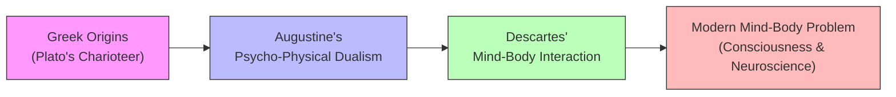
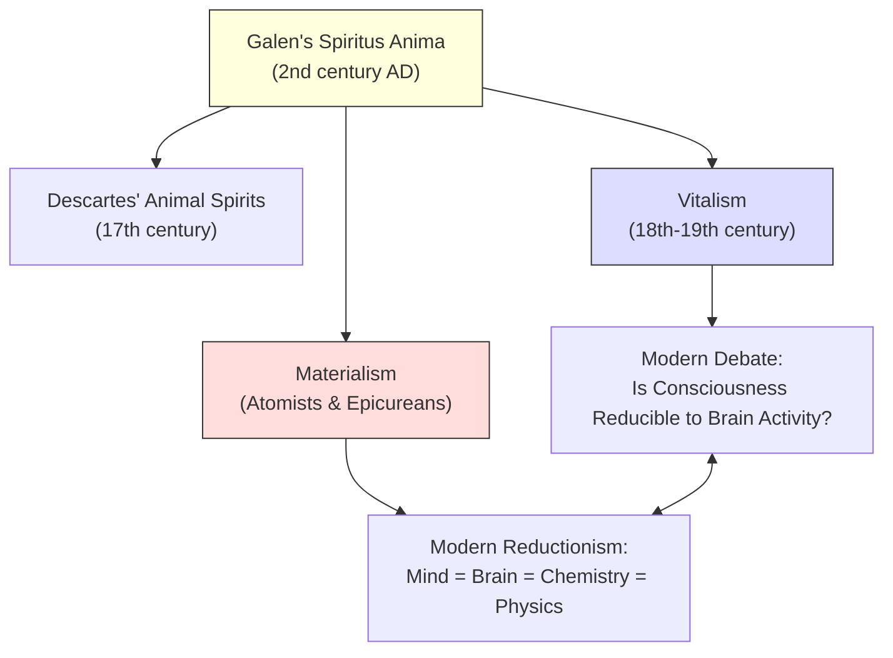

# Chapter 4: Patristic Psychology — The Authority of Faith
## Psychology · History of Psychological Thought

---

You are standing in a monastery library somewhere in sixth-century Ireland. Rain hammers against stone walls. A monk hunched over a candle copies a manuscript — not Scripture, but a crumbling Greek text on logic by Aristotle. Outside, warlords fight over scraps of a collapsed empire. Inside, this single scholar is preserving a thread of rational inquiry that, without him, might vanish entirely. Across the Mediterranean, in Galen's tradition, physicians still practice on patients — cutting, observing, recording — while the Church debates whether the body even matters. Two worlds, two methods, two visions of what it means to understand a human being. One insists truth comes from faith and inner conviction. The other insists truth comes from evidence and the scalpel. Which approach would you trust to explain why you love your child, why you grieve, why you make the choices you do?

---

## The Five Pillars of Patristic Psychology

You already know that Augustine shaped Western Christianity. What you might not realize is how deeply his ideas shaped Western *psychology* — not as a formal discipline yet, but as a set of assumptions about what minds are, how they work, and what they're for. His influence wasn't a single argument. It was a constellation of five distinct contributions, each one pulling psychology in a particular direction. Some of those directions were liberating. Others were dead ends that took centuries to escape.

Here's the subtle wrong belief worth confronting: people tend to think of the Patristic period as purely anti-intellectual — a thousand years of darkness where thinking stopped. That's not quite right. The Patristics *did* think, intensely and creatively. The problem was *what* they thought about, and what they decided was beneath their attention.

### Natural Equality: A Revolutionary Idea

The first contribution was the most radical. Before Christianity, most ancient societies assumed a natural hierarchy — some people were born to rule, others to serve. Aristotle defended slavery as natural. Plato sorted souls into gold, silver, and bronze. The Patristics broke this wide open. They argued that every human being, regardless of birth, possesses a soul of equal worth before God. This idea of **natural equality** — the doctrine that all persons share a fundamental moral and spiritual status — was genuinely new in the Western world. It wasn't a Greek idea. It wasn't a Roman idea. It came from theology, and it changed everything downstream: human rights, democratic theory, the very notion that every person deserves dignity.

But there was a cost. By locating this equality in the soul rather than in observable human capacities, the Patristics made it easy to dismiss the physical, measurable world as secondary. If what truly matters about you is your immortal soul, why bother studying your brain?

> [!TIP]
> **Stop and Think:** Think about a time you felt genuinely treated as an equal — at work, in a friendship, in a community. Where did that expectation of equal treatment come from? Can you trace it back to a philosophical or religious source?

### Individual Responsibility and the Birth of Conscience

The second contribution picked up where Greek philosophy left off and carried it further. Plato and Aristotle both discussed virtue and moral character, but they focused on the *kind of person* you should become. The Patristics shifted the spotlight to *individual actions and their moral weight*. Augustine's fierce debate with the monk Pelagius crystallized this. Pelagius argued that human beings could achieve moral perfection through their own effort, independent of God's help. Augustine fired back: moral freedom is a God-given endowment, and every person is individually responsible for how they use it. The consequence? **Conscience** — the inner sense of moral right and wrong that you carry with you — became a central concept in psychology. Before the Patristics, conscience existed as a Greek word (*syneidesis*). After them, it became a psychological fact demanding explanation.

### The Mind-Body Problem: Augustine's Most Durable Gift

The third contribution is the one you're probably most familiar with, even if you don't know its Patristic origins. The Patristics insisted on **psycho-physical dualism** — the idea that the mind (or soul) is fundamentally different from the body, made of different "stuff," obeying different rules. The Greeks invented this distinction; Plato's *Phaedra* imagines the soul as a charioteer驾驭 unruly horses of the body. But Augustine solved the problem so convincingly that his solution held for over a thousand years. The soul was immaterial, eternal, and capable of apprehending truth directly. The body was material, decaying, and full of sensory illusions. The **mind-body problem** — how do an immaterial mind and a material body interact? — became *the* central puzzle of psychology and philosophy for the next two millennia.

*Figure 6.1: How a Patristic solution became a two-thousand-year-old problem. Augustine's dualism was so persuasive that philosophers spent centuries trying to undo it.*

> [!TIP]
> **Stop and Think:** When you feel nervous before a big presentation, is that a mind event or a body event? Can you cleanly separate the butterflies in your stomach from the anxious thoughts in your head? What does your answer reveal about your own implicit dualism?

### Anti-Intellectualism: The Darkest Legacy

The fourth contribution was the most damaging. By treating daily experiences as trivial — mere distractions from the eternal — the Patristics continued Plato's suspicion of the senses and pushed it further. Perception was suspect. Observation was unreliable. The material world was a fallen world, unworthy of serious study. This produced what Robinson calls "modest, sometimes virulent, anti-intellectualism." If the highest truths are known through faith and inner illumination, then the scholar peering through a microscope is wasting time that could be spent in prayer. This attitude didn't kill science outright — Galen's tradition survived — but it created a cultural atmosphere in which empirical investigation was, at best, a low-status activity and, at worst, an act of spiritual pride.

### Intuitionism: The Interior Sense

The fifth contribution is the most psychologically interesting. The Patristics believed the mind possesses a power to achieve direct, transcendental awareness of truth — an **intuitionism** rooted not in sensory experience but in what they called the "interior sense," the "light of faith," or "grace." This idea didn't die with the Patristics. It survives today in theories of the unconscious, in the belief that moral sensibilities are innate, and in the popular conviction that you can "just tell" when someone is lying. More profoundly, the Patristics argued that it's not enough to observe behavior. An action can only be truly *known* when you understand the intention behind it. They were, in Robinson's phrase, "not behaviorists."

This intuitionist tradition carries a darker implication too. If the interior sense fails — if someone cannot perceive moral truth — that failure is evidence of a psychological or spiritual *defect*. The Patristics were, in effect, presenting a theory of deviancy as disease.

> [!TIP]
> **Stop and Think:** Have you ever "just known" something was wrong without being able to explain why? A gut feeling about a person, a situation, a decision. How would Augustine have explained that intuition? How would a modern neuroscientist?

---

## Galen's Empiricism: The Physician Who Demanded Evidence

While the Church Fathers wrestled with eternity, physicians got on with the business of keeping people alive. Galen of Pergamon — active in the second century AD but enormously influential throughout the Patristic period — represents a completely different tradition. He didn't ask "What does God intend for the human soul?" He asked "What causes this patient's fever, and how do I cure it?"

Galen's most important psychological work, *On the Natural Faculties*, is essentially a manifesto against armchair theorizing. He attacked untested hypotheses and the very idea that an untested hypothesis has any place in biology. His position wasn't radical empiricism — he didn't reject theory altogether. He wrote that it was "not our habit to employ this kind of demonstration alone, but to add thereto cogent and compelling proofs drawn from obvious facts... which can actually be recognized by the senses." In other words: think all you want, but show me the data.

This insistence on evidence over logic — accepting the data of experience even when they contradict a beautiful theory — was genuinely unusual for his era. Most ancient philosophers trusted reason over observation. Galen trusted observation over reason when the two disagreed. Centuries later, when medieval scholars reintroduced observation and experiment, they owed a direct debt to this physician who insisted on watching the world before explaining it.

### Spiritus Anima: The Vital Force

Galen wasn't a materialist. He opposed the extreme Epicureans and Stoics who argued that human beings are nothing more than material entities responding to external stimulation. Instead, he proposed a life principle — **spiritus anima** — a vital force that animates living things and distinguishes them from dead matter. This concept would echo forward through history, reappearing in Descartes' "animal spirits" and in the broader philosophical movement known as **vitalism**: the belief that life and its psychic attributes cannot be explained by the laws of physics and chemistry alone, but require some extraphysical, life-giving principle.

The opposing camp — **materialism** — insisted that the laws of the physical world are sufficient to explain everything about living things, including consciousness and thought. From Galen onward, this tension between vitalism and materialism became one of the defining arguments of psychology. It's still alive today, dressed in modern clothes: can a sufficiently complex computer be conscious? Is the mind *just* the brain? When neuroscientists map every synapse, will they have explained the experience of seeing red or hearing a symphony?

*Figure 6.2: The vitalism-materialism tension that Galen crystallized still echoes in every neuroscience conference debate about consciousness.*

> [!TIP]
> **Stop and Think:** When you watch a surgeon repair a heart, is the patient just a very complex machine? Or is there something about being alive — experiencing, feeling, choosing — that no mechanical description can fully capture? Where do you stand, and why?

---

## Galen's Nativism and the Nature-Nurture Debate

Here's where Galen becomes unexpectedly modern. He rejected the **tabula rasa** — the idea, later championed by John Locke, that we begin life as a blank slate, gaining all knowledge and character through experience. Galen argued instead for **nativism**: the philosophical and psychological position that certain capacities, dispositions, and knowledge are inborn rather than acquired. Nature, he wrote, "skillfully moulds everything during genesis and provides for creatures after birth, employing faculties of affection and forethought for offspring, and sociability and friendship for kindred."

Think about what that means in practice. A mother's fierce protectiveness isn't learned from a parenting book. An infant's preference for human faces over random patterns isn't the result of socialization. The capacity for friendship, the pull of emotion, the foundations of social instinct — Galen argued these are built into the organism from the start, products of what he called "natural faculties" that exist by nature and do not come into being through experience.

This wasn't a minor disagreement with the empiricists. It was a fundamental claim about human nature: we arrive in the world already equipped with psychological machinery. Experience matters — Galen didn't deny that — but it operates on material that was already shaped before birth.

| Position | Core Claim | Key Thinker | Era |
| :--- | :--- | :--- | :--- |
| **Nativism** | Capacities are inborn; nature provides the blueprint | Galen | 2nd century AD |
| **Empiricism** | The mind begins blank; experience writes upon it | Locke | 17th century |
| **Modern synthesis** | Genes and environment interact dynamically | Turkheimer & others | 21st century |

*Table 6.1: The nature-nurture debate isn't a modern invention — it's been running since antiquity, with each era adding new evidence and new complexity.*

In a 2024 book, *Understanding the Nature-Nurture Debate*, behavioral geneticist Eric Turkheimer argued that the old question — is it nature or nurture? — has been fundamentally transformed by modern genetics. Twin studies consistently show that psychological traits are roughly 50% heritable, but Turkheimer emphasizes that heritability doesn't mean immutability. Genes don't operate in a vacuum; they respond to environments, and environments shape how genes express themselves. The debate Galen started — are we born this way, or made this way? — hasn't been resolved. It's been *dissolved* into a more sophisticated question: how do nature and nurture continuously co-construct each other?

> [!TIP]
> **Stop and Think:** Think of a trait you're confident you were born with — maybe a temperamental tendency, a talent, or a fear. Now think of something you're equally sure you learned. How clean is that division? Can you identify where nature ends and nurture begins in either case?

Galen also pioneered the use of living animals in surgical experiments — work that caused enormous suffering. His conscience was undisturbed by this, partly because prevailing Stoic philosophy drew a sharp line between humans and animals, and partly because the religious framework of the era didn't extend moral concern to non-human creatures. It's a reminder that scientific brilliance doesn't guarantee ethical sensitivity. The tools of inquiry and the morality of inquiry are separate questions.

---

## In Practice: What These Two Traditions Left Behind

The Patristic legacy and Galen's alternative aren't just historical curiosities. They're the two root systems of modern psychology.

When you walk into a therapist's office and talk about your intentions, your inner conflicts, your sense of who you are — you're operating in the Patristic tradition. The emphasis on individual responsibility, the belief that behavior can only be understood through the motives behind it, the conviction that there's more to a person than what's observable from the outside — all of this traces back to Augustine and his contemporaries.

When you read a research paper with controlled experiments, statistical analyses, and claims about what the data show — you're operating in Galen's tradition. The insistence that hypotheses must be tested against evidence, that observation trumps logic when the two conflict, that the natural world can be studied systematically — this is Galen's legacy.

Neither tradition alone is sufficient. Pure intuitionism leads to unfalsifiable claims about the soul. Pure materialism leads to a psychology that can't account for meaning, intention, or the felt quality of experience. The tension between them — between the inner life and the observable world, between faith in reason and faith in evidence — is not a problem to be solved. It's the engine that drives psychological inquiry forward.

> [!IMPORTANT]
> The deepest lesson of the Patristic period isn't that faith and science are enemies. It's that psychology needs *both* the question "What does this mean?" and the question "What does the evidence show?" — and that no era has found a comfortable way to hold both at once.

---

## Speaking of Ancient Debates That Won't Die...

- A mother in Lagos insists her toddler's stubbornness is "just how she came" — a temperament she was born with. Her own mother says the child simply needs firmer discipline. Galen would side with the mother. Locke would side with the grandmother. Modern genetics would say they're both partly right and mostly asking the wrong question.

- A software engineer in Seoul meditates daily and reports sudden moments of clarity — solutions to problems arriving "out of nowhere." He'd struggle to explain it in purely material terms. Augustine would recognize it immediately: the interior sense, the light of the mind apprehending truth directly.

- A forensic psychologist in São Paulo evaluates a defendant's criminal behavior and insists that understanding the *intention* behind the act matters as much as the act itself — for sentencing, for rehabilitation, for justice. The Patristics made exactly this argument fifteen hundred years ago, and the legal systems of most countries still reflect it.

---

The monasteries preserved more than Scripture. They preserved the Greek philosophical tradition, Roman law, and the radical idea that every human being possesses inherent dignity. But a new intellectual order was forming — one that would attempt to reconcile faith and reason in a systematic way, borrowing tools from Aristotle that had been forgotten for centuries. The Scholastics were coming, and with them, a psychology that tried to be both devout and logical, faithful and rigorous. Whether that ambition could succeed — and at what cost — is the question that opens the next chapter.

---

## References

1. Turkheimer, E. (2024). *Understanding the Nature-Nurture Debate*. Cambridge University Press.
2. Robinson, D. N. (1995). *An Intellectual History of Psychology* (3rd ed.). University of Wisconsin Press.

---

*Module 6 of 6 complete. Take time with the "Stop and Think" prompts before moving to the next chapter.*
