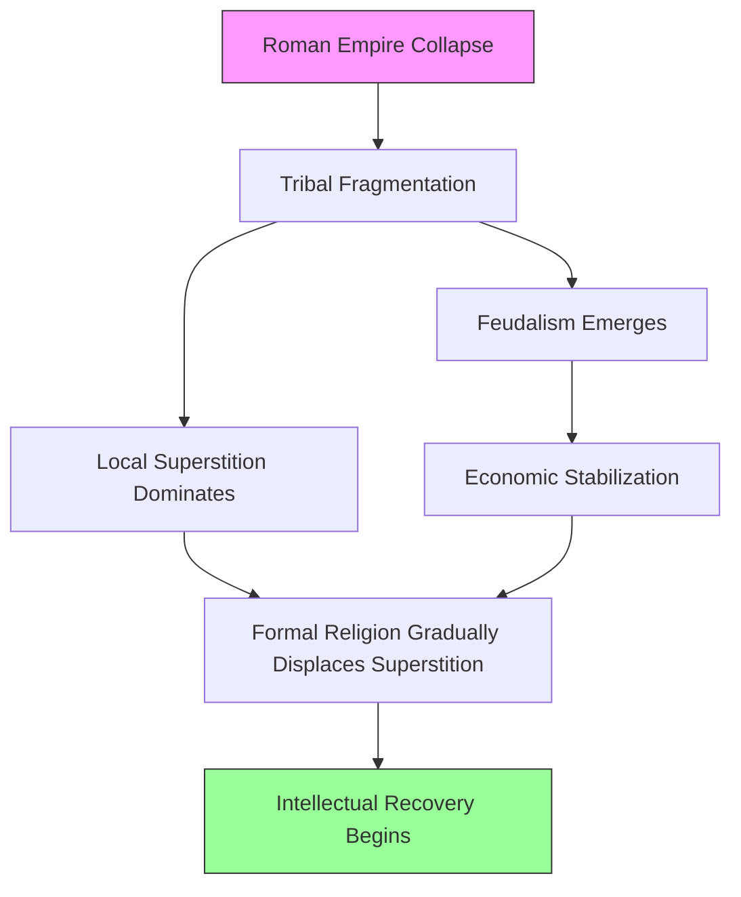
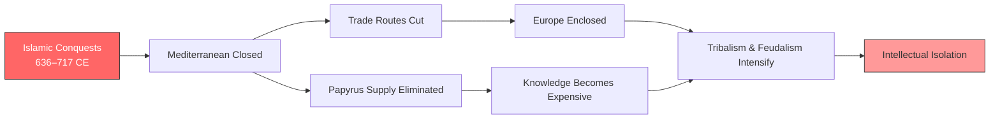
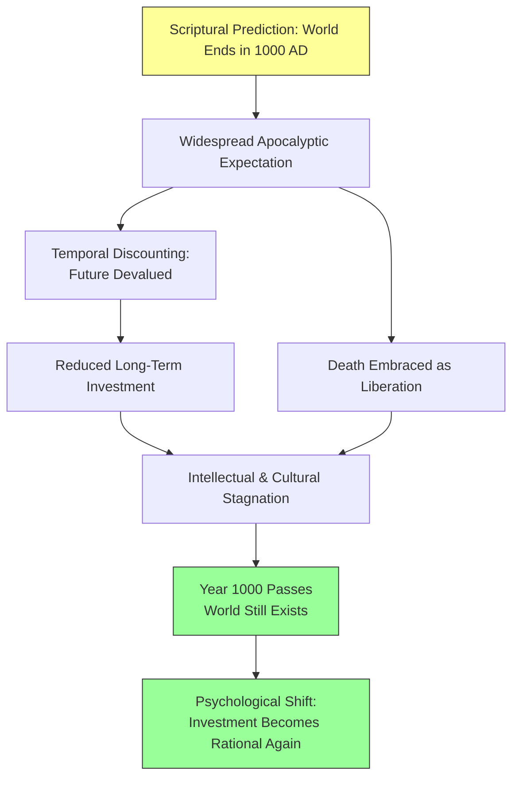

# Chapter 5: Scholastic Psychology — The Authority of Aristotle
## Psychology · History of Psychology · The Medieval Period

---

You are a monk in a stone monastery somewhere in northern Europe, around the year 850. The papyrus your order once used for copying manuscripts has not arrived in decades. The supply from Syria — the only supply — was cut off when Arab armies swept across the eastern Mediterranean. You scrape animal skins into thin sheets instead, working by the light of a single tallow candle. The text you are copying is a fragment of Boethius, himself already three centuries dead, translating Aristotle, who lived a thousand years before you. You do not know if the world will last another century. The local priest has told the village that Scripture predicts the end of all things in the year 1000. You have never traveled more than thirty miles from where you were born. You have never seen a clock. Time, for you, is not a river with measurable currents — it is a vast, undifferentened ocean, and you are drowning in it.

Outside the monastery walls, a feudal lord collects grain from serfs who entered his service through a ritual handshake — a physical transfer of obligation that binds them to the land. Beyond the lord's territory, tribal warlords carve Europe into shifting parcels. To the south, the Mediterranean — once Rome's great connecting highway — has become a wall. Saracen fleets blockade the sea. To the north, Danish raiders burn coastal villages. To the east, Islam has swallowed Persia, Syria, Egypt, and North Africa. Europe is enclosed, terrified, and running out of ink.

But here is the puzzle: centuries later, this same enclosed, terrified, fragmented Europe would produce the universities, the Gothic cathedrals, and the philosophical revolution of Scholasticism. How does a civilization that has lost its roads, its paper supply, its sense of time, and its confidence in the future — how does that civilization become the birthplace of modern intellectual life?

---

## A World Without Edges

You already know the popular story of the Middle Ages: a thousand years of darkness between the fall of Rome and the Renaissance, where nothing much happened except plague, prayer, and peasant misery. It is one of the most persistent myths in Western education — and one of the most misleading. (Later in this chapter, we will encounter **Scholasticism**, the rigorous intellectual method that emerged from this supposedly dark period — and **Nominalism**, the philosophical position that would eventually crack it open.)

The word "medieval" literally means "middle age." It was coined by Renaissance scholars who wanted to position themselves as the heirs of classical greatness, with a long, embarrassing gap in between. The label stuck, and with it came the assumption that the period was a homogeneous blur of intellectual stagnation. But the historian Daniel Robinson points out something crucial: the medieval period is post-imperial and pre-national simultaneously. It is a world after the collapse of something enormous — the Roman Empire — and before the emergence of anything recognizable as France, England, or Spain. Every feature of the period is a feature *in transition*. That is what makes it so difficult to study, and so fascinating.

Consider what "heterogeneity" means in this context. From the sixth to the eleventh centuries, Europe was not a unified culture grinding forward in lockstep. It was a patchwork of tribal customs, local superstitions, competing religious practices, and fragmenting political allegiances. Superstition was not a fringe phenomenon — it was the dominant mode of thinking about the world. And superstition, by its nature, resists homogeneity. A thousand villages meant a thousand local spirits, a thousand magical rituals, a thousand slightly different explanations for why the harvest failed.

> [!TIP]
> **Stop and Think:** Think about a time when you moved to a new city, started a new job, or entered a new social group. How long did it take before you understood the unwritten rules — the local slang, the social expectations, the "way things are done here"? Now imagine that experience scaled up to an entire continent losing its central authority, its roads, its written laws, and its common currency — all at once. What kind of psychological world would that produce?

### The Salic Laws: When Justice Was a Price List

Formal religions take hold only after dislodging the superstitious mind, and that process was painfully slow. What replaced the Roman legal system was not a sophisticated jurisprudence but something far more basic. The **Salic laws** — the legal code of the Salian Franks, one of the Germanic tribes that overran Roman territory — were simple sentences indicating fixed penalties for specific acts. Kill a female child, and you owed 200 solidi. Kill a woman of childbearing age, and the price jumped to 600. Kill a pregnant woman, and you owed 900.

Notice what these laws encode: not a theory of justice, not a concept of rights, not an abstract principle of fairness — but a *price list* for human life, calibrated by reproductive value. This is the legal psychology of a society that thinks in terms of direct, tangible consequences. There is no courtroom drama, no appeal to precedent, no philosophical debate about the nature of guilt. There is only: *you did this, you owe this much*. It is the psychology of a world that has lost the capacity for abstraction and replaced it with arithmetic.

*Figure 5.1: The long chain from imperial collapse to intellectual recovery — each link depended on the one before it.*

---

## Feudalism: The Psychology of Obligation

The word **Feudal system** (or **Feudalism**) gets thrown around in history classes as if everyone knows what it means. But the popular image — lords in castles, peasants in fields, a simple hierarchy of power — misses the psychological reality entirely. Feudalism was not just a political arrangement. It was an *economic* system that restructured how human beings understood obligation, loyalty, and survival.

Here is how it actually worked. When a conquering warlord arrived in a territory, his followers expected payment. But there was no central treasury, no tax system, no coinage stable enough to serve as currency. So the warlord distributed land — or more precisely, the *right to extract value* from land. The feudal lord who received this grant became, in economic terms, the equivalent of a Roman governor. But there was a critical difference: under Rome, the governor served the state. Under feudalism, the lord *was* the state, at least locally.

The serf — the peasant bound to the land — entered this system through a ritual of physical contact. Something was actually passed from lord to serf: a clod of earth, a twig, a handshake. This was not mere ceremony. It was a form of sanctuary — a tangible, physical act that created a psychological bond. The serf traded freedom for protection. The lord traded obligation for labor. And both understood the exchange in physical, bodily terms: *I touched your hand, and now I am yours.*

> [!TIP]
> **Stop and Think:** Consider the modern job contract you sign when starting employment. It is a legal document, abstract and impersonal. Now imagine instead that your employer clasped your hand, looked you in the eye, and gave you a physical object — a key, a tool, a token — and said, "From this moment, I feed you, and you serve me." How would that change the psychological weight of the commitment? Would it feel more binding, or more like a trap?

Robinson quotes a medieval saying that captures the psychology perfectly: *"All men labour and serve, and the serf is a freeman of the Lord, and the freeman is a serf of Christ."* Everyone was bound to someone. Freedom was not the absence of obligation but the quality of it. A serf served a lord; a lord served Christ; Christ served the will of God. Obligation was not a burden — it was the structure of reality itself.

### The Privatization of Everything

Behind feudalism lay something Robinson identifies as a *privatization of life and property* unlike anything in classical Rome or Greece. In the Roman world, public life was the highest life. The forum, the senate, the public bath — these were where identity was constructed. Under feudalism, identity was constructed in the household, the manor, the local parish. The world shrank to the size of what you could see from your front door.

This psychological contraction had enormous consequences. When your entire world is your village, your lord, and your parish church, your sense of cause and effect narrows accordingly. If the harvest fails, you do not investigate soil chemistry — you blame the neighbor who gave you a strange look last Tuesday. If a child falls ill, you do not consult a physician — you look for the local wise woman who might have cast a spell. The scale of your world determines the scale of your explanations.

---

## The Shadow of Islam: When the Sea Became a Wall

The single most consequential event for medieval European psychology was not a battle or a plague. It was a series of conquests that, over less than a century, closed the Mediterranean Sea.

Between 636 and 717, the forces of Islam overcame Persia (651), Syria (636), Egypt (642), North Africa (698), and Spain (711), and blockaded Constantinople itself (717). The Mediterranean — which had been, as the historian Henri Pirenne described it, *"the familiar and almost 'family' sea which once united all the parts of this commonwealth"* — became a barrier. Europe did not merely lose access to trade routes. It lost access to the *idea* that the world was connected.

The consequences were not just economic. They were psychological. Syria had been the major source of papyrus — the material on which Western knowledge was recorded. From 650 until the eleventh century, that supply was virtually eliminated. Europe had to switch to parchment, made from animal skins — expensive, labor-intensive, and scarce. Every page of knowledge now cost an animal's life. The economics of writing changed, and with them, the psychology of who could afford to think.

*Figure 5.2: How the Islamic conquests reshaped European psychology — not through direct conflict, but through the slow strangulation of connection.*

A 2010 study by Stanford art historian Suzanne Lewis examined how apocalyptic expectation functioned not merely as a suppressor of creative thought but as a *major creative force* in early medieval culture. Lewis argued that the visual representations of the Book of Revelation in illuminated manuscripts — the monsters, the dragon, the Beast from the Abyss — were not passive responses to fear but active intellectual engagements with the idea of the end of time. The medieval mind, faced with the apparent collapse of civilization, did not simply freeze. It channeled its terror into art, narrative, and symbolic systems. Fear, it turns out, is not the opposite of creativity. It is sometimes its raw material.

> [!TIP]
> **Stop and Think:** Think about a period in your own life when you felt genuinely uncertain about the future — maybe during a health scare, a financial crisis, or a period of political instability. Did you withdraw and do nothing? Or did you find yourself suddenly focused, compelled to create, to plan, to make meaning? The medieval experience suggests that existential fear does not simply shut down the mind. It redirects it.

### The Enclosed Continent

To the north, Danes and Saxons raided and settled. From Spain, Saracen fleets controlled the western Mediterranean. In the east, Islam was supreme. Europe collapsed inward, toward a safe center — and that center degenerated into tribalism, which evolved into the feudal system.

This was not a minor geographic adjustment. It was a psychological catastrophe. When the Mediterranean was open, a merchant in Gaul could reasonably believe that the world extended beyond the horizon. When it closed, the horizon became the edge of reality. And when your reality shrinks to the size of a village, your psychology changes with it. Cause and effect become local. Time becomes vague. Ambition becomes survival.

---

## Time Without a Clock

Perhaps the most profound psychological consequence of the early medieval period was the loss of *metrical time* — time as something measurable, divisible, and reliable.

For the medieval mind, Robinson explains, time had only two divisions: the brief and insignificant span of sinful earthly life, and the cosmically enduring duration of the soul's suffering or joy in eternity. There were no clocks, no calendars organized around agricultural cycles, no schedules. A medieval peasant did not think, "I have three hours before sunset to finish planting." He thought, "The light is here, so I work. The light is gone, so I stop." Time was not a resource to be managed. It was a condition to be endured.

The poet who wrote *"Every day, every hour, thus without ceasing I must finish my life, and recommence / In this death uselessly alive"* was not being melodramatic. He was describing the lived experience of a mind without temporal structure. Without a sense of time reinforced by empirical regularities — predictable seasons, reliable harvests, stable institutions — the concept of natural causes fails. If you cannot predict *when* things will happen, you cannot develop the habit of asking *why* they happen. The medieval mind was, as Robinson puts it, scientifically backward — not because medieval people were stupid, but because their environment did not train them to think in terms of cause and effect.

> [!TIP]
> **Stop and Think:** Try this experiment. For one day, hide every clock and resist checking the time on your phone. Notice how your sense of the day changes. Do you become more anxious, or more relaxed? Do you plan ahead, or live entirely in the present? Now multiply that experience across an entire lifetime — across an entire civilization — and you begin to grasp the medieval relationship with time.

Alcuin, the scholar who served Charlemagne, captured the medieval sense of human transience with devastating precision: *"What is man? The slave of death, a passing wayfarer. How is man placed? Like a lantern in the wind."* That image — a lantern in the wind — is not just poetry. It is a psychological portrait. A mind that sees itself as a flickering flame in an incomprehensible darkness does not build laboratories. It builds cathedrals.

---

## The Apocalypse That Never Came

The medieval Church wielded enormous political power, but its moral and religious lessons struggled to penetrate the superstitious, tribal world it was trying to govern. Death was not merely an event to be feared — it was a *theme* to be embraced. Death as freedom, as liberation, as rebirth, as escape, as *good* — these ideas pervaded medieval thought. If earthly life was merely a lantern in the wind, then extinguishing the lantern was not a tragedy. It was a release.

Scripture was interpreted as predicting the world's end in the year 1000 — an event they called the **Apocalypse**, from the Greek word meaning "unveiling" or "revelation." This was not a fringe belief held by a few apocalyptic sects. It was the mainstream expectation of an entire civilization. And the psychological consequences were immense. If the world is ending soon, why invest in the future? Why build roads, establish schools, cultivate new crops, or copy old manuscripts? The end-times expectation created a massive temporal discount — a psychological tendency to devalue anything that would pay off in the long term, because there was no long term.

*Figure 5.3: How the expectation of apocalypse can paralyze a civilization — and what happens when the deadline passes without event.*

Then the year 1000 came and went. The world did not end. And something remarkable happened. The run of competent philosophers in the West begins with St. Anselm (1033–1109). Robinson is tempted, he admits, to connect this intellectual resumption with the simple fact that *Christians were still alive after 1000 AD*. The joke is half-serious. When the apocalypse fails to arrive, the future suddenly exists again. And when the future exists, it becomes rational to invest in it — to build, to think, to write, to question.

> [!TIP]
> **Stop and Think:** Think about a deadline you were certain you could not meet — an exam, a project, a personal crisis. When it passed and you survived, did you notice a sudden burst of energy and motivation? The medieval experience of the year 1000 suggests that civilizations, like individuals, can become paralyzed by the expectation of catastrophe — and liberated by its absence.

> [!TIP]
> **Stop and Think:** Here is a harder question. We live in an era of existential anxieties — climate change, pandemics, artificial intelligence, nuclear weapons. Do you think these modern fears affect intellectual productivity the same way the fear of apocalypse affected medieval Europe? Or is the relationship between fear and creativity more complex than simple paralysis?

---

## The "Dark Age" Debate: Darkness or Regrouping?

Was the early medieval period truly a "dark age"? The answer depends on what you mean by darkness.

If you mean a period of decline in literacy, urban life, trade, and institutional complexity — then yes, the centuries from roughly 500 to 1000 were darker than what came before and what came after. Roman cities shrank. Roman roads crumbled. Roman law fragmented. The volume of written text produced in Western Europe plummeted. By almost any measurable standard, the lights dimmed.

But Robinson offers a more nuanced reading. From Boethius (480–524) to John the Scot (ca. 810–877), achievements were indeed negligible by the standards of classical philosophy. Yet this interval was also a period of *regrouping*. Monks in Ireland — at the far western edge of civilization, where Roman influence had been lightest — preserved Hellenic language and learning. Kings and popes, however imperfectly, sought foundations for peaceful coexistence. And Arab and Jewish scholars, working in the intellectual centers of Córdoba, Baghdad, and Cairo, began the work that would eventually invigorate European thought.

The irony is sharp: the civilization that Europe feared most — Islam — became the civilization that preserved and transmitted the very Greek philosophy that Europe would eventually use to rebuild itself. Aristotle was not recovered from dusty Roman libraries. He was recovered from Arabic translations, brought back to Europe through Spain and Sicily. The shadow of Islam, which had enclosed Europe and strangled its trade, also kept alive the intellectual tradition that Europe would eventually claim as its own.

> [!IMPORTANT]
> The medieval period was not a void. It was a chrysalis — a period of apparent inactivity during which the materials for transformation were being gathered, preserved, and slowly reassembled. The darkness was real, but so was the gathering of light.

---

## Speaking of Fear and Civilization...

- A farmer in rural Bangladesh, watching river levels rise each monsoon season, makes decisions about crop planting that mirror the medieval peasant's relationship with time — short-term survival overrides long-term planning.
- A tech worker in Seoul, told that artificial intelligence will eliminate her job within five years, faces the same temporal discounting the medieval mind faced: if the future is uncertain, why invest in it?
- A community in the Amazon, watching illegal loggers destroy the forest that sustains them, experiences the same enclosed, shrinking world that medieval Europeans felt when the Mediterranean closed — the horizon contracting, the options narrowing, the future becoming harder to see.

---

The centuries of fear and enclosure eventually gave way to something unexpected. Charlemagne — a Frankish king with a taste for learning and a talent for empire-building — would attempt what Rome had once achieved: a unified Christian civilization with schools, laws, and a common intellectual tradition. His coronation on Christmas Day, 800 AD, was not just a political event. It was a psychological one — a declaration that the future existed, that the world had not ended, and that it was worth building for. But the road from Charlemagne's palace school to the philosophical revolution of Scholasticism was long, winding, and filled with surprises. The next step begins with a king who could barely write his own name — and the scholar who taught him to try.

---

## References

1. Lewis, S. (2010). Encounters with Monsters at the End of Time: Some Early Medieval Visualizations of Apocalyptic Eschatology. *Different Visions: New Perspectives on Medieval Art*, 2. https://doi.org/10.61302/FSQU1802
2. Jedwab, R., Khan, A. M., Russ, J., & Zaveri, E. D. (2021). Epidemics, pandemics, and social conflict: Lessons from the past and possible scenarios for COVID-19. *World Development*, 147, 105629. https://doi.org/10.1016/j.worlddev.2021.105629
3. Robinson, D. N. (1995). *An Intellectual History of Psychology* (3rd ed.). University of Wisconsin Press.

---

*Module 1 of 8 complete. Take time with the "Stop and Think" prompts before moving to the next module.*
