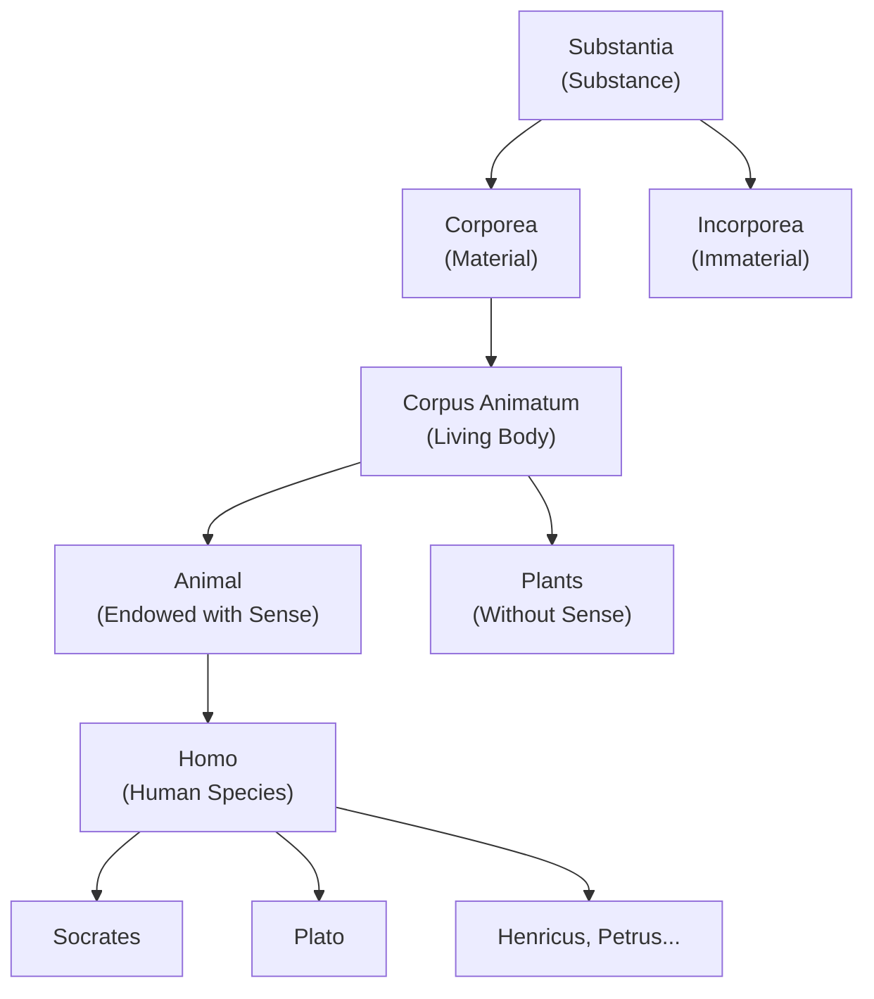
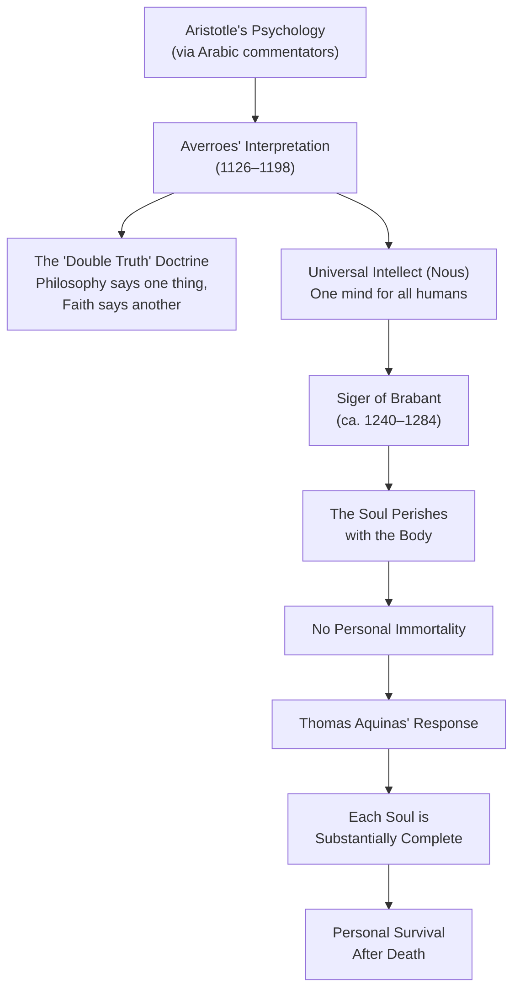

# Module 3: The Aristotelian Renaissance and Porphyry's Tree

Sometime around the year 300 CE, a Neoplatonist philosopher named **Porphyry** wrote an introduction to Aristotle's *Categories*. It was a modest text — a student handbook, really, meant to help beginners navigate one of the most difficult works in the ancient canon. Porphyry himself probably thought little of it. He was far more interested in his massive commentary on Plato, his attack on the Christians, his treatise on how to eat vegetarian without offending the gods.

But that little introduction — the *Isagoge* — would become one of the most influential texts in the history of Western thought. Not because of what Porphyry said in it, but because of a question he raised and then refused to answer.

"Do genera and species exist in their own right," Porphyry asked, "or do they exist only in thought? If they exist in their own right, are they bodily or bodiless? Do they exist separately from sensible things, or in and about them?"

He declined to answer. "This is a very deep question," he wrote, "and requires a longer investigation."

That investigation would last roughly a thousand years. And it would shape everything the medieval world believed about the mind, the soul, and the nature of reality itself.

---

## The Tree That Summed Up a Civilization

In *The World of Medieval Learning*, Anders Pilz reproduces a remarkable illustration from Peter of Spain's 1514 edition of the *Isagoge*. It is called **Porphyry's Tree** — and it is, as Pilz notes, the single illustration "that can sum up the referential system of the medieval scholar."

Picture it. At the base of the tree stand two individuals: **Socrates** (labeled "Sortes") and **Plato**. Between them, like roots reaching downward into the soil of particularity, are the names of other specific persons — Henricus, Petrus — each one a unique, unrepeatable human being. These individuals, as individuals, fall outside any classification. You cannot classify a specific person. You can only classify a *kind*.

Above the individuals rises the first universal: **homo** — the species "human." Every individual person is a member of this class. Socrates is human. Plato is human. Henricus and Petrus are human. They share something — a common nature — that makes them all members of the same species.

But "human" is not the end. Combined with nonhuman creatures, the species *homo* arises from the larger class **animal** — a genus that includes both rational creatures (humans) and irrational ones (dogs, horses, fish). Above animal stands **corpus animatum**, the living body — a class that includes everything alive, whether endowed with sense (animals) or without sense (plants). Higher still is **substantia** — substance — formed by the most fundamental ontological distinction in the Aristotelian system: **corporea** (material) versus **incorporea** (immaterial).

*Figure 3.1 — Porphyry's Tree: the medieval classification of reality from universal substance down to particular individuals. The tree is read top-down as ontological descent, bottom-up as the ascent from particulars to the most general categories of being.*

Now turn the tree upside down — which is how medieval readers often encountered it, with the roots of substance at the top and the branches of individual persons at the bottom. Read this way, the tree traces the **ontological pedigree** of every existing thing. Socrates is a human. Human is a species of animal. Animal is a kind of living body. Living body is a kind of substance. And substance — **substantia** — is the universal class into which everything having real existence falls.

The entire apparatus is forged from **Aristotle's ten categories**: substance, quantity, quality, relation, place, time, position, state, action, and passion. These categories were Aristotle's attempt to map every possible way something can *be*. Porphyry's Tree doesn't use all ten, but it captures the essential structure — the hierarchy of classification that runs from the most abstract universal down to the most concrete particular.

> [!TIP]
> **Stop and Think:** This tree looks like a flowchart, and in some ways it is one — a decision tree for classifying anything that exists. But it is also something more: a *metaphysical map*. It claims that reality itself has a structure, that this structure is hierarchical, and that the mind can grasp it through reason. Does your own experience of the world support this? When you look at a dog, do you first see "dog," then "animal," then "living thing"? Or do you first see *this* dog — this particular, specific creature — and only later slot it into categories?

## The Question That Split a Civilization

Porphyry's unanswered question — do genera and species exist in their own right, or only in thought? — sounds abstract. It is not. It is the most practical question in the history of psychology, because it asks: **what is the relationship between the mind and reality?**

If universals (genera and species) exist *independently of the mind* — if "human" and "animal" and "substance" are real features of the world, existing whether or not anyone thinks about them — then the mind's job is *discovery*. The mind looks outward, finds the structure that is already there, and registers it. Knowledge is a mirror held up to nature. This is **realism**.

If universals exist *only in the mind* — if "human" and "animal" are names we attach to groups of similar things for our own convenience, but have no independent existence — then the mind's job is *creation*. The mind looks at a world of unique, individual things and imposes order on it. Knowledge is a lamp, not a mirror. This is **nominalism**.

The debate between these two positions consumed the medieval intellectual world. It was not a polite academic disagreement. It was a war over the nature of truth, the authority of the Church, the fate of the soul, and the limits of human knowledge. Every major thinker of the period — from Augustine to Ockham — was forced to take a side.

### The Realist Position

The realists argued that universals are real — that they exist independently of any individual mind. When you recognize that Socrates and Plato are both human, you are not *inventing* a category. You are *perceiving* a shared nature that genuinely exists in both of them. The universal "human" is not a mental label; it is an ontological fact.

This position had deep roots in **Plato's theory of Forms**. For Plato, the Form of Humanity — the perfect, eternal, unchanging essence of what it means to be human — existed in a realm beyond the physical world. Individual humans were imperfect copies of this Form. The medieval realists didn't always go this far. Some held that universals exist *in* particular things (a moderate realism, closer to Aristotle). Others held that universals exist *before* particular things, in the mind of God (an extreme realism, closer to Plato). But all realists agreed on one thing: universals are not mere names. They are real.

The Church, predictably, favored realism. If universals are real, then doctrines like the Trinity — three persons sharing one divine nature — make ontological sense. If universals are just names, the Trinity starts to look like a word game.

### The Nominalist Challenge

The nominalists argued the opposite: only individual entities are real. Universals are merely class-names — **nomina** — useful for organizing our experience, but possessing no independent existence. There is no "humanity" floating around somewhere. There are only humans: Socrates, Plato, Henricus, Petrus. The word "human" is a label we attach to them because they resemble each other. The resemblance is real; the universal is not.

The most dangerous early nominalist was **Peter Abailard** (1079–1142), the brilliant, arrogant, and ultimately tragic philosopher who dared to argue that universals are nothing more than concepts — mental constructs that we form by abstracting common features from individual things. Abailard did not deny that Socrates and Plato share something. He denied that this "something" exists independently of the mind that perceives it.

This was explosive. If universals are mental constructs, then what about God? Is "God" a universal — a concept formed by abstracting common features from individual experiences of the divine? Abailard didn't go that far, but the implication was clear, and his enemies seized on it. He was condemned, twice. He was castrated. He ended his days in a monastery, writing hymns.

> [!TIP]
> **Stop and Think:** This debate is not ancient history. When a psychologist today asks whether "intelligence" is a real thing or just a label we attach to a cluster of behaviors, they are asking Porphyry's question. When a cognitive scientist asks whether categories like "bird" or "furniture" exist in the world or only in the mind, they are asking Abailard's question. The medieval debate over universals is the *direct ancestor* of modern research on concepts, categories, and classification.

## Aquinas and the Impossible Synthesis

Among those who write general histories of Western thought, there is a tendency to reduce Augustine to "neo-Platonism" and **Thomas Aquinas** to "Aristotelianism." The respect in which this is arguably valid is the respect in which we might reduce all philosophy to Platonism or Aristotelianism. The label captures something real, but it misses almost everything important.

**Thomas Aquinas** (1225–1274) has been the intellectual voice of the Roman Church since the fifteenth century. His two major works — the **Summa Theologiae** and the **Summa Contra Gentiles** — derive inspiration from Aristotle. But derivation is not duplication. One could not reconstruct Thomistic thought merely from Aristotelian thought. Aristotle wrote for a Greek city-state in the fourth century BCE. Thomas wrote for a universal Church in the thirteenth century CE. They undertook their works in vastly different intellectual climates with vastly different orientations and objectives.

What Thomas attempted was something Aristotle never had to: a reconciliation of pagan philosophy with revealed religion. Aristotle's universe was self-sufficient. It didn't need a creator God, a plan of salvation, or a promise of immortality. Thomas's universe — the Christian universe — required all three. The challenge was to take Aristotle's framework, which was fundamentally secular, and make it carry the weight of Christian theology without breaking it.

This was not a mechanical operation. It required genuine philosophical creativity — the kind of synthesis that doesn't merely combine two systems but produces a third that is irreducible to either.

### The Man and His Moment

If we are to comprehend the medieval view of psychological man, we must focus on Thomistic psychology. Thomas was not the only or even most influential figure — Augustine's shadow loomed larger in many quarters, and later figures like Duns Scotus and William of Ockham would challenge his system from within the Scholastic tradition. But Thomas's works included all the perspectives prevailing in his age. He was a *cataloguer* of medieval thought as much as a contributor to it. The Summa Theologiae is not just a theological treatise; it is a comprehensive map of the thirteenth-century intellectual landscape, with every major position represented, examined, and either incorporated or refuted.

Thomas had at his disposal something no earlier Christian thinker had possessed: **complete Latin translations of Aristotle**. For centuries, the West had known Aristotle only through fragments, through Boethius's partial translations, through secondhand reports. The recovery of the full Aristotelian corpus — much of it through Arabic translations, mediated by scholars like **Avicenna** (980–1037) — was the intellectual earthquake of the twelfth and thirteenth centuries. It was as if a civilization that had been working with scattered pages suddenly received the entire library.

But the library came with baggage. The Arabic commentators had interpreted Aristotle in ways that were philosophically sophisticated but theologically dangerous. And no commentator was more dangerous than **Averroes**.

## The Five Great Problems

Thomas Aquinas faced five fundamental problems — five questions that no previous thinker had satisfactorily answered and that the Church desperately needed resolved. Each one cut to the heart of what it means to be a human being with a soul, a mind, and a relationship to God.

### 1. Can Man Know God?

By Thomas's time, the question of God's knowability had become acute. **Peter Abailard** — the same Abailard who championed nominalism — had listed **158 theological questions** answered contradictorily by Scripture and the Church Fathers. One hundred and fifty-eight. Not minor quibbles, but fundamental questions about the nature of God, the soul, morality, and salvation — answered in opposite ways by authorities the Church claimed were infallible.

Abailard's response had been to reject the real existence of universals and adopt nominalism: only individual entities are real, universals are merely class-names. By Aquinas's time, this had produced a creeping skepticism toward doctrine and a growing demand for **rational authority** — the insistence that claims about God must be supported by reason, not merely by revelation or tradition.

Thomas's answer was characteristically balanced. Yes, man can know God — but only partially. Reason can demonstrate God's existence (the famous Five Ways), but it cannot comprehend God's essence. Faith fills the gap. The intellect can reach *toward* God, but it cannot close the distance entirely. This was not a retreat from reason; it was a precise delineation of reason's boundaries.

### 2. What Are Our Duties to God?

Assuming we know what man can know of God, what remains is man's obligation to self, State, and fellow man. This sounds straightforward, but in the thirteenth century it was anything but. The relationship between spiritual duty and temporal obligation — between what you owe God and what you owe your king — was the central political question of the age. The investiture controversies, the Crusades, the conflicts between popes and emperors — all turned on this question.

Thomas argued for a natural law tradition: moral obligations are not arbitrary commands but follow from human nature itself. Because humans are rational, social animals, they are *naturally* inclined toward certain goods — life, knowledge, society, and rational conduct. These inclinations, grounded in Aristotle's teleological framework, form the basis of natural law. Duty to God is not opposed to duty to self and others; it is the *completion* of those duties.

### 3. What Is Sin?

In the ninth century, the pope couldn't provide Charlemagne with an official liturgy. The Church's practices were so disorganized, so regionally variable, that the most basic rituals — baptism, marriage, the Mass — differed from diocese to diocese. By the thirteenth century, intense efforts had rendered Christian practices uniform. The Holy Roman Empire required laws, agreements, and first principles. Roman civil law — the **ius gentium**, the law of nations — was revived as a framework for governing a complex, multi-ethnic empire.

But civil law had to be reconciled with belief far more detailed than at Justinian's time. The concept of sin had to be refined so that all could be aware of specific obligations. Thomas's contribution was to integrate Aristotelian ethics — the idea of virtue as a habit of right action — with Christian theology. Sin, for Thomas, is not merely a violation of divine command; it is a *defect* in the rational will, a failure to act according to one's nature as a rational being. This made sin intelligible in philosophical terms, not just theological ones.

### 4. What Is the Nature and Status of the Human Will?

Scripture granted freedom of will while insisting God caused all things. This was not a minor tension. If God is the cause of all things, then every human action — including every sin — is ultimately caused by God. But if humans have free will, then their actions are *their own*, not God's. How can both be true?

Augustine's resolution — that God foreknows human choices without causing them — was not complete enough for thirteenth-century minds. The problem had become more pressing because of the revival of Aristotelian causation. Aristotle's system of four causes (material, formal, efficient, and final) seemed to leave no room for an uncaused human choice. If every event has a cause, and God is the first cause, then free will appears to be an illusion.

Thomas's answer drew on a distinction that would become central to Scholastic psychology: God causes the *existence* of the will, but the will's *acts* belong to the will itself. God is the efficient cause of the will's being; the will is the efficient cause of its own choices. This was not a logical proof of free will — it was a *framework* within which free will and divine causation could coexist without contradiction.

### 5. What Is the Right Form of Life for Man?

This was the most dangerous question, because it led directly to the problem of **Averroism**.

Some interpretations of classical works — particularly those transmitted through Arabic commentators — tended toward the conclusion that the soul dies with the body. Thomas needed to fashion an explanation that would not be caught in logical traps set by **Averroes** (1126–1198), whose commentaries on Aristotle taught what many Christians considered unwarranted antirealist and materialistic conclusions.

The Averroist threat was not abstract. **Siger of Brabant** (ca. 1240–1284), a professor at the University of Paris, was teaching that the individual soul perishes with the body. Only the abstract intellect — the **nous** — survives, and it is the same in all people. There is no personal immortality. There is no individual survival after death. The "you" that you experience as yourself is a temporary expression of a universal intellect that belongs to no one and everyone.

This was, from the Church's perspective, a catastrophe. If the soul perishes with the body, then the entire Christian promise of salvation is meaningless. There is no heaven, no hell, no judgment, no resurrection. There is only the universal mind, thinking through us and then moving on.

*Figure 3.2 — The Averroist crisis: Arabic commentaries on Aristotle threatened the Christian doctrine of personal immortality. Thomas Aquinas mounted a philosophical defense that became the Church's official position.*

Thomas's response was philosophically ingenious. He argued that the human soul is not merely a *form* — not merely the organizing principle of the body — but a **subsistent form**: a form that can exist independently of the body it informs. The soul is not a universal intellect shared among all humans. Each individual soul is *substantially complete* — it possesses, in itself, the capacity for thought, will, and personal identity. When the body dies, the soul does not dissolve into a cosmic pool of intellect. It persists, as *this* soul, as the soul of Socrates or the soul of Plato, carrying with it everything that made that person a unique individual.

This was Thomas's most original contribution to psychology, and it was driven entirely by the need to counter Averroism. Without the threat of Siger of Brabant, Thomas might never have developed his theory of the subsistent soul. The heretic, in this case, forced the orthodox thinker to become a better philosopher.

## The Research Anchor: Are Categories Real?

> [!IMPORTANT]
> **Modern Connection — Prototype Theory and the Legacy of Porphyry's Tree**
>
> The question Porphyry raised — do genera and species exist in their own right, or only in thought? — has never been settled. In the 1970s, the psychologist **Eleanor Rosch** challenged the classical view of categories (which descends directly from Aristotle and Porphyry) with her **prototype theory**. Rosch demonstrated that people do not classify objects by checking whether they match a set of necessary and sufficient features — the classical model. Instead, they judge how closely an object resembles a *prototype*, a best example of the category. A robin is a more "typical" bird than a penguin, even though both are equally birds.
>
> This finding has been interpreted in both realist and nominalist directions. Realists argue that prototype effects reflect the statistical structure of the real world — categories have fuzzy boundaries because nature is messy, not because categories are mental inventions. Nominalists argue that prototypes are cognitive constructions — mental representations shaped by experience, culture, and language, not mirrors of an independent reality. The debate continues in cognitive science, and it is, at bottom, the same debate that Porphyry's question launched seventeen hundred years ago. (See: Internet Encyclopedia of Philosophy, "Universals"; Rosch, E. "Cognitive Representations of Semantic Categories," *Journal of Experimental Psychology: General*, 1975.)

## Substance, Accident, and the Architecture of Being

Before we leave Porphyry's Tree, we need to understand a distinction that runs through all of Scholastic psychology: the difference between **substance** and **accident**.

**Substance** (*substantia*) is what a thing *is* — its essential nature, the core of its being. A human being's substance is its rational animal nature. Strip away everything that can change — height, weight, hair color, mood, memory — and what remains is the substance: the *this-ness* of the thing, the individual nature that persists through change.

**Accident** (*accidens*) is everything else — the properties that a substance *has* but that do not define it. Socrates can be tall or short, bald or hairy, angry or calm. These are accidents. They belong to Socrates, but they are not *what Socrates is*. He remains Socrates whether he is young or old, happy or sad.

This distinction matters for psychology because it determines what happens to the soul after death. If the soul is a substance — if it is what the person *is* — then it can survive the loss of the body, which is merely the material substrate in which the soul's accidents inhere. If the soul is an accident — a property of the body, like height or temperature — then it perishes with the body, just as heat perishes when the fire goes out.

Thomas argued that the soul is a substance. Averroes argued (or was interpreted as arguing) that individual intellect is an accident — a temporary manifestation of the universal nous. The stakes could not have been higher. This was not a dispute about philosophical terminology. It was a dispute about whether *you* will survive your own death.

> [!TIP]
> **Stop and Think:** The substance-accident distinction still shapes how psychologists think about personal identity. When we ask "what makes you *you*?" we are asking a question about substance. Is it your memories? (These can be lost.) Your body? (This changes completely over a lifetime.) Your personality? (This shifts with age, trauma, and experience.) If none of these are essential — if all of them are accidents — then what is the substance of a person? Or is there no substance at all — just a bundle of accidents, held together by the illusion of continuity?

## The Medieval Inheritance

According to the medieval classification of the sciences, psychology is merely a chapter of special physics — the study of the natural world applied to a particular kind of natural object. But it is, the medievals insisted, the *most important* chapter. For man is a **microcosm**: a miniature universe, containing within himself the material and the immaterial, the rational and the irrational, the mortal and the immortal. He is the central figure of the universe — the point at which the tree of Porphyry converges into a single, irreducible individual.

This is the legacy of Scholastic psychology: the conviction that the human being is not merely a body to be studied by physics, nor merely a soul to be saved by theology, but a *unity* of both — a composite being whose nature cannot be understood by either discipline alone. Thomas Aquinas, building on Aristotle, building on Porphyry, building on a thousand years of philosophical struggle, gave this conviction its most rigorous expression.

Whether the conviction is true is another matter. But its influence is beyond dispute. The idea that the mind is something real — not just a word, not just an accident, not just a byproduct of brain chemistry — is the foundation of psychology as a discipline. And it was forged in the heat of a medieval argument about a tree.

---

## Key Terms

| Term | Definition |
|------|-----------|
| **Porphyry's Tree** | A hierarchical classification of reality from universal substance down to individual persons, derived from Aristotle's categories via Porphyry's *Isagoge*. The medieval world's "referential system" for organizing all knowledge. |
| **Nominalism vs Realism** | The debate over whether universals (genera, species) exist independently of the mind (realism) or are merely names/concepts imposed by the mind on individual things (nominalism). |
| **Summa Theologiae** | Thomas Aquinas's masterwork (1265–1274), a comprehensive synthesis of Aristotelian philosophy and Christian theology. The intellectual voice of the Roman Church since the fifteenth century. |
| **Averroism** | The philosophical system derived from Averroes' commentaries on Aristotle, which taught that only the universal intellect survives death, denying personal immortality. The primary intellectual threat Thomas Aquinas sought to counter. |
| **Substance vs Accident** | Substance (*substantia*) is what a thing fundamentally *is*; accident (*accidens*) is a property a thing *has* but that does not define its essential nature. The distinction determines whether the soul can survive bodily death. |

---

## References

- Abailard, P. *Logica Ingredientibus*. In *Peter Abailard: Philosophical Writings*, ed. P. Spade. Indianapolis: Hackett, 1994.
- Aquinas, T. *Summa Theologiae*. Trans. Fathers of the English Dominican Province. New York: Benziger Bros., 1947.
- Averroes (Ibn Rushd). *The Incoherence of the Incoherence*. Trans. S. Van Den Bergh. London: Luzac, 1954.
- Copleston, F. *A History of Philosophy*. Vol. 2: *Medieval Philosophy*. Westminster, MD: Newman Press, 1950.
- Kretzmann, N., Kenny, A., & Pinborg, J., eds. *The Cambridge History of Later Medieval Philosophy*. Cambridge: Cambridge University Press, 1982.
- Pilz, A. *The World of Medieval Learning*. Oxford: Blackwell, 1981.
- Porphyry. *Isagoge*. Trans. E.W. Warren. Toronto: Pontifical Institute of Mediaeval Studies, 1975.
- Robinson, D.N. *An Intellectual History of Psychology*. 3rd ed. Madison: University of Wisconsin Press, 1995.
- Rosch, E. "Cognitive Representations of Semantic Categories." *Journal of Experimental Psychology: General* 104, no. 3 (1975): 192–233.
- Weisheipl, J.A. *Friar Thomas d'Aquino: His Life, Thought, and Work*. Garden City, NY: Doubleday, 1974.

*Module 3 of 8 complete.*
