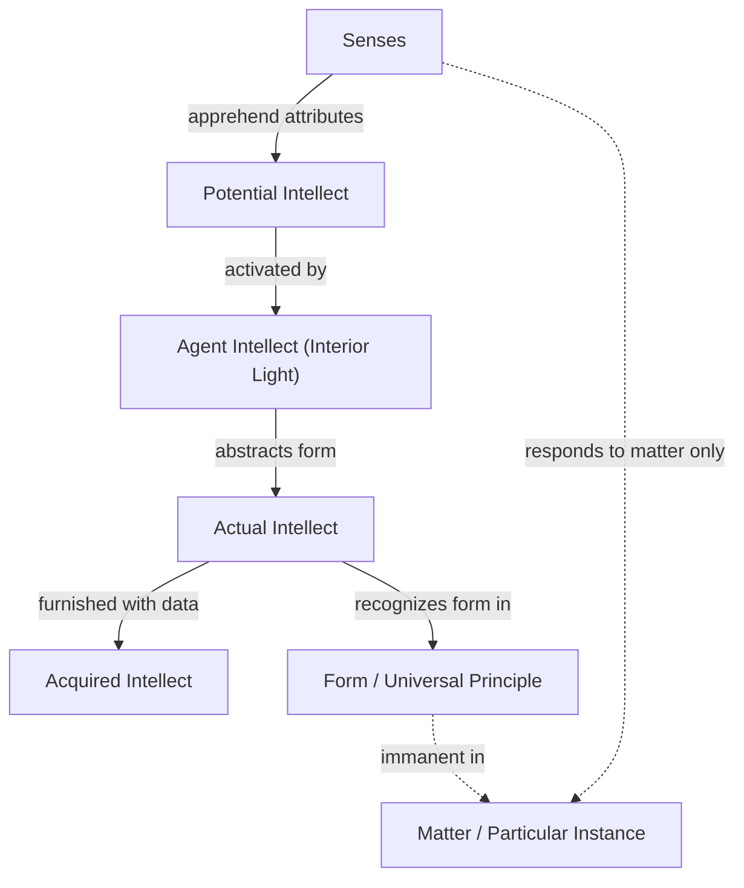

# Module 04: Thomas Aquinas and the Problems of Scholasticism

Imagine walking into the great library of the Abbey of Monte Cassino in the year 1260. Stone corridors echo with the shuffle of sandaled feet. At a heavy oak table sits a young Dominican friar, impossibly tall, his frame hunched over a manuscript of Aristotle's *De Anima* — a text that, just decades earlier, had been banned from the University of Paris as dangerous to Christian faith. Around him, other scholars whisper nervously. Aristotle teaches that the soul is the form of the body, that it cannot exist without the body. If that is true, what happens at death? Does the soul simply perish, as the Muslim philosopher Averroes had recently argued? Does only some abstract, universal reason survive — the same in every person, with no individual immortality?

The friar — Thomas Aquinas — is not panicked. He is methodically underlining passages, making careful marginal notes in a cramped, precise hand. He believes Aristotle can be saved. He believes reason and faith can occupy the same mind without tearing it apart. But the problem is enormous. Already, the scholar Peter Abelard has catalogued 158 questions to which Christian authorities have given flatly contradictory answers. How can you know God? What is sin? Do we truly have free will if God causes all things? These are not academic puzzles — they are questions about the architecture of human consciousness itself.

You are sitting across from Aquinas now, watching him work. He looks up, fixes you with a calm gaze, and asks: *How do you know what you know?*

He waits. You have no answer yet.

---

## From Platonic Shadows to Scholastic Facts

Until the thirteenth century, the medieval view of human nature was essentially Augustinian — and that meant Platonic. The Holy Trinity served as a metaphor for consciousness: sense, reason, and intellect as three distinct faculties, each yielding a different grade of knowledge. Only **intellect** (*nous*, *intellectus*) could discern truth itself.

**John Scotus Eriugena**, writing in the ninth century, built the most complete system on this foundation. In *De Divisione Naturae*, he reaffirmed the distinction between **attribute** (*accidens*) and **essence** (*substantia*). Your senses, he argued, apprehend only attributes — the material surface of things. Reason goes further, grasping the supra-factual order. But even reason is limited: it shows you relationships among things without reaching their true, nonphysical causes. Only when passive senses and active reason deposit their contents into the spiritual realm of intellect can fundamental truth be discerned.

> [!TIP]
> **Stop and Think:** If your senses only ever give you "surfaces" — attributes rather than essences — how would you ever know you were being deceived? What would Eriugena say about the difference between a vivid dream and waking perception?

The twelfth-thirteenth century revival decisively rejected this extreme idealism. The Scholastic philosophers were willing to treat perceptible realities as **facts that expressed truths** — not shadows to be dismissed, but genuine data for the intellect to work with. This reorientation changed everything.

---

## Anselm and the Psychology of Proof

The transitional figure was **St. Anselm** of Canterbury. In his *Dialogus de Veritate*, Anselm credited the senses with accurate reflection of facts while condemning the "interior sense" for deceiving itself — generating false opinions *about* sensation. Truth, properly speaking, is perceived by the mind alone, but the mind makes use of the accurate neutrality of the senses.

This distinction led to his famous **Ontological Argument**: what the mind is capable of entertaining is, by that fact, real. If a faculty exists, there must be a corresponding item in nature. The mind can comprehend "that than which there can be nothing greater" — God. Therefore, God exists. The argument is not just theology; it is a psychological claim about the reliability of cognitive architecture.

> [!TIP]
> **Stop and Think:** Anselm assumes that nature would not give you a faculty with no corresponding object. But what about imagination? You can imagine a unicorn. Does that mean unicorns exist? Where does Anselm's principle break down?

**Peter Lombard's** *Four Books of Sentences* reinforced the bridge: God is known *in His works*, through an intellect informed by perception. With this groundwork, the thirteenth century was ready for the grand synthesis.

---

## Aquinas and the Five Problems

Thomas Aquinas faced five enormous problems that defined Scholastic psychology:

1. **Can we know God?** Abelard had listed 158 contradictorily answered questions. The challenge was sharpened by **Nominalism** — the view that only individual entities are real and universals are merely class-names (*nomina*). If universals aren't real, how can we reason about God?

2. **What are our duties to God?**

3. **What is sin?** The concept had to be made precise so all believers could be aware of their specific obligations.

4. **What is the nature and status of the human will?** Scripture grants free will while insisting God causes all things. Reconciling these is a problem for any psychology of agency.

5. **What is the right form of life?** Averroes (1126–1198) taught that the soul perishes with the body. His disciple Siger of Brabant tempted Parisian scholars: only abstract reason survives, the same in all people, with no individual immortality.

Aquinas's solution began with a sharp distinction: factual knowledge of the senses is one thing; knowledge of principles that only reason can embrace is another. Experience tells you *about* things; reason comprehends universals. From particulars, reason **abstracts** universals. Reason is a faculty of the soul; the soul itself is an intellectual principle.

Against Plato, sensations are factual and important. On death, the nutritive and sensitive faculties cease — they require a body — but **will and intellect survive**.

---

## The Four Species of Intellect

The Scholastics distinguished several species of intellect, each representing a stage in the journey from ignorance to knowledge:

- **Potential intellect**: the raw power of thought before it has been activated — your mind's capacity before you've ever thought about anything.
- **Actual intellect**: the intellect operating on perceived facts — actively thinking about what has been sensed.
- **Acquired intellect**: the mind furnished with data and reflective powers — a mature intellect that has accumulated knowledge.
- **Agent intellect** (*agens intellectus*): the active principle by which potentiality becomes realized — the "light" that makes thought actual.

> [!TIP]
> **Stop and Think:** The agent-intellect is described as an "interior light" — something that enables the mind to see forms within material things. How is this different from simply paying attention? Is there a modern psychological concept that captures what the Scholastics meant?

The actual intellect abstracts *form* from *appearance*. Senses embrace only attributes; intellect discerns form. The form exists in the matter as a principle, but senses respond only to the matter, not the principle. Knowledge is therefore an abstraction based on principles of matter — but the principles themselves are immaterial.

For Aquinas, the **agent-intellect** is the gift of a providential God — an **interior light** by which human knowledge can reach fundamental principles. His famous dictum captures this confidence:

> *"Abstrahentium non est mendacium"* — "The abstraction is no lie!"

The connection between matter and principle is discovered, not invented.

*Figure 5.1: The Scholastic model of knowledge — from sensory attributes to abstracted forms through the agent-intellect.*

---

## Phantasms and the Limits of Rationalism

Human knowledge, the Scholastics insisted, is imperfect. We are imperfectly equipped to grasp divine essence. Faith has been made available so that reason's imperfections will not cause straying. Faith and reason do not conflict: "Science and faith cannot be in the same subject and about the same object."

But Scholastic rationalism faces a further limit. All people possess agent-intellect, but not in the same degree. Children and the sick have impoverished intellect. And during earthly life, the intellect can only understand by turning to **phantasms** — mental representations derived from sensations.

> [!TIP]
> **Stop and Think:** Aquinas says the intellect must always "turn to phantasms" to think. This means you cannot think abstractly without mental imagery. Try to think about "justice" without any image, example, or scenario. Can you do it? What does this tell you about the relationship between sensation and thought?

"Man is impelled in the consideration of intelligible things by being preoccupied with sensible things." You cannot think about universals without anchoring your thinking in particulars. The body is not a prison — it is the indispensable ground of intellectual activity.

This limitation has social consequences. Differences in knowledge capacity lead, in the Scholastic view, to governance by some and servility by others. Before Adam's sin, leadership was by common consent; slavery was repugnant. Through original sin, we fail — either by failing to perceive duty or by failing to act on it. Those privileged to know eternal law must lead those less fortunate.

> [!TIP]
> **Stop and Think:** The Scholastics linked intellectual capacity to social hierarchy — those who know more should rule. In many West African and South Asian oral traditions, wisdom is distributed among elders collectively rather than concentrated in a single intellect. How might the Scholastic model of the agent-intellect look different if it started from a communal rather than individual conception of knowledge?

---

## Faith, Reason, and Their Proper Domains

Aquinas's resolution of the faith-reason tension was elegant. He did not argue that faith is irrational, nor that reason is sufficient for everything. Instead, he insisted they operate on different planes. Reason can demonstrate truths about the natural world, abstract principles from experience, and even construct rational arguments for God's existence. But it cannot, by its own power, penetrate the divine essence or reveal mysteries of salvation.

Faith fills the gap that reason cannot bridge. Where reason can reach, it provides genuine knowledge. Where it cannot, faith provides genuine assurance. The two do not conflict because they do not compete for the same territory.

> [!TIP]
> **Stop and Think:** Aquinas says faith and reason cannot conflict because they address different objects. But in practice, scientific findings sometimes seem to challenge religious claims (e.g., the age of the earth, evolution). If Aquinas is right that they cannot conflict, whose fault is it when they seem to — reason's or faith's?

---

## Research Anchor: Abstraction in Medieval and Modern Cognitive Science

The Scholastic theory of abstraction — that the mind extracts universal principles from particular sensory experiences — finds a striking parallel in Eleanor Rosch's **prototype theory of categorization** (1970s). Rosch showed that humans learn categories not by memorizing definitions but by forming abstract prototypes from encounters with specific instances. A child learns "dog" not from a formal definition but by meeting many dogs and abstracting shared features.

Modern neuroscience has extended this insight. Studies using fMRI (e.g., Bowman & Zeithamva, *Journal of Neuroscience*, 2019) show that the brain's medial prefrontal cortex encodes abstract category representations distinct from sensory cortices encoding specific exemplars. The brain separates "form" from "matter" — storing the principle apart from the particular, just as the Scholastics described.

The parallel is instructive but reveals a divergence. For the Scholastics, the agent-intellect was an immaterial light ensuring abstraction yielded *truth* — the real connection between matter and principle. For modern cognitive science, prototypes are adaptive constructs shaped by evolutionary pressures and statistical regularities, with no guarantee of metaphysical truth. The Scholastics would say this is precisely the difference between knowing *about* things and knowing the *principles* of things — a distinction that remains productive in contemporary philosophy of mind.

---

## Key Terms

| Term | Definition |
|---|---|
| **Agent-intellect** (*agens intellectus*) | The active intellectual principle that transforms potential knowledge into actual knowledge — the "interior light" enabling abstraction |
| **Phantasms** | Mental representations arising from sensations; the intellect must turn to phantasms to think during earthly life |
| **Ontological argument** | The argument that the conceivability of a perfect being entails its existence; rests on the principle that nature furnishes no faculty without a corresponding object |
| **Abstraction** | The process by which the intellect extracts universal forms from particular sensory experience — discovery, not invention |
| **Interior light** | The divine illumination or agent-intellect by which the mind perceives eternal truths and abstracts principles from experience |

---

## References

Robinson, D. N. (1995). *An intellectual history of psychology* (3rd ed.). University of Wisconsin Press.

Bowman, C. R., & Zeithamva, N. R. (2019). Neural representations of abstract concepts from multiple psychological domains. *Journal of Neuroscience*, 39(21), 4066–4077.

---

The bridge Aquinas built between Aristotle and Augustine held for centuries — but it was built on a foundation that not everyone accepted. If the agent-intellect is truly immaterial, and if phantasms are truly material, how exactly do they interact? What is the mechanism by which an interior light illuminates a sensory image? The Scholastics had a framework, but the next generation of thinkers would ask whether the framework itself made sense — and the answers they gave would fracture the medieval consensus beyond repair.

*Module 4 of 8 complete.*
