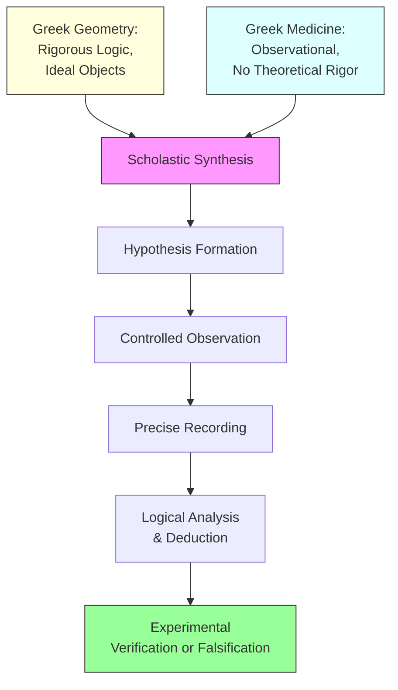

# Module 05: The Scholastic Theory of Knowledge

You are a student at the University of Oxford, sometime around 1260. The lecture hall is cold — stone walls, no fireplace, and the November wind finds every crack. Your master is reading aloud from a manuscript that arrived last term, a Latin translation of Aristotle's *Posterior Analytics*. The words are dense, the logic merciless. But then your master pauses, looks up from the text, and says something that changes the direction of European thought: the senses are not merely the servants of reason — they are its *origin*. Without them, the intellect has nothing. The maxim he quotes will become the foundation of Scholastic psychology: *Nihil est in intellectu quod non prius fuerit in sensu* — nothing is in the intellect which was not first in the senses. You copy the phrase into your notebook. You do not yet understand that you have just heard the seed of modern experimental science.

---

## 1. "Nothing in the Intellect Which Was Not First in the Senses"

The Scholastic system was not merely a philosophical architecture for reconciling faith and reason. It was a working psychology — one that examined **learning**, **memory**, **habit**, emotion, and language with genuine empirical curiosity. The guiding maxim — *"Nothing is in the intellect which was not first in the senses"* — anchored Scholastic applied psychology in observation. Medieval students relied on **similarity** (grouping like with like) and **vividness** (attaching striking imagery to dry facts) to strengthen memory. Domestic pets were trained through sweets and cuffings — reward and punishment administered through the senses. Dreams attracted casual interest as phenomena where the senses, unmoored from waking objects, produced imagery the intellect struggled to interpret.

But the maxim was not simple empiricism. As we saw in Module 04, the intellect performs **abstraction**: it extracts universal forms from particular sensory data. The maxim does not reduce knowledge to sensation; it insists that sensation is the *necessary starting point*. Without the senses, the intellect has nothing to work with — no raw material from which to abstract principles. The mind is not a self-sufficient source of knowledge. Whatever the intellect grasps — however abstract, however universal — must ultimately trace its origin back to sensory experience.

The maxim thus served as both a philosophical principle and a practical research directive: to understand the mind, begin with the body's commerce with the world.

> [!TIP]
> **Stop and Think:** Consider how you learned to recognize the emotion "anger." You did not study a formal definition. You encountered anger — in your parents' faces, in classmates' voices, in the flushed skin and raised volume of heated arguments. Your intellect abstracted a universal concept from dozens of particular sensory encounters. Could you have learned what anger means without ever *seeing* it? What does that tell you about the relationship between the senses and understanding?

> **Key Term: Induction (Logical Method)** — The process of reasoning from particular observed instances to general principles or laws. Unlike deduction, which moves from universal premises to particular conclusions, induction moves from the specific to the general. For the Scholastics, induction was the logical backbone of empirical inquiry — the method by which sensory particulars yielded intellectual universals.

---

## 2. Grosseteste and the Invention of Experimental Methodology

**Robert Grosseteste** (c. 1170–1253), Bishop of Lincoln and the first chancellor of Oxford University, appears to have been the first medieval writer to recognize and systematically address two fundamental methodological problems: **induction** and **experimental verification and falsification**. In doing so, he set out the first systematic theory of experimental investigation — transforming the Greek geometrical method into something recognizably modern.

The intellectual context matters. Aristotle's principal failing as a scientist lay in his attachment to a kind of idealism inherited from Plato: he demanded rational justification — **final cause** explanation — even for ordinary scientific facts. His model of scientific explanation was demonstrative, logically structured, and formal. Yet as a naturalist, Aristotle was also a careful observer: he catalogued the habits of the animal kingdom, urged Alexander the Great to send back specimens from his campaigns, and reflected on lunar eclipses. In these activities, he captured the spirit of modern science.

The problem was that these two Aristotelian impulses — the rationalistic and the observational — had historically remained **dissociated**. Greek geometry provided rigorous logical structure but dealt with ideal objects. Greek medicine was observational, correlational, and clinical, but lacked theoretical rigor. Each tradition had something the other needed.

Grosseteste and his colleagues at Oxford, along with Albertus Magnus and others at Paris, succeeded in **joining these dissociated elements**. Aided by recent translations of Greek studies in optics and Euclid's mathematical essays, they set out deliberately to establish scientific proofs through experimental procedures — **bringing logical analysis to bear upon nature only after recording natural events with precision**.

The religious orthodoxy of the period had, paradoxically, a **salutary effect** on this enterprise. Peter Lombard had offered convincing arguments for finding God in His works — a theological directive to study nature. Grosseteste had no doubt about the Final Cause (God) and therefore could examine **efficient causes** without fear of heresy. The certainty of God's existence as Final Cause freed the investigator to focus on proximate, mechanistic causes in nature.

What Grosseteste recognized was that Greek medicine's methods — observational, correlational, practical — were useful in **any branch of inquiry**, not just clinical practice. But the resulting factual knowledge could not be of scientific consequence unless it was **rationally tied to a general theory**. The necessary procedure was: enter the observational domain with a **hypothesis**, record events predicted by that hypothesis, then **deduce the chain of effects**. This is, in essence, the modern scientific method.

*Figure 5.1: The Scholastic synthesis — Grosseteste's method fused Greek geometry's logical rigor with Greek medicine's observational practice, producing the hypothetico-deductive method.*

> **Key Term: Final Cause vs. Efficient Cause** — A **final cause** is the *purpose* or *end* for which something exists (in Aristotelian-Thomistic thought, ultimately God's design). An **efficient cause** is the *proximate mechanism* that produces an effect. The Scholastic distinction allowed scientists to investigate *how* nature works (efficient causes) while leaving *why* it exists (final cause) to theology.

> [!TIP]
> **Stop and Think:** Imagine you notice that plants near a window grow faster than plants in the corner of the room. You could explain this by saying "plants desire sunlight" (a final cause — purpose). Or you could measure light intensity, control water and soil, and track growth rates under different conditions (efficient causes — mechanisms). Which approach would Grosseteste have endorsed, and why? What does it mean for psychology that we can investigate *how* the mind works without settling *why* it exists?

> **Key Term: Verification vs. Falsification** — **Verification** is the process of confirming a hypothesis by observing predicted outcomes. **Falsification** is the process of disproving a hypothesis by observing outcomes it cannot accommodate. Grosseteste recognized both as essential to experimental science — a remarkably modern insight that anticipates Karl Popper's 20th-century philosophy of science by seven centuries.

---

## 3. Roger Bacon and the Marriage of Reasoning with Experience

**Roger Bacon** (c. 1214–1292), the Franciscan friar and Oxford scholar, took Grosseteste's methodological insights and gave them their most forceful expression. In his *Opus Majus*, Bacon articulated a theory of knowledge that placed experience at the center without abandoning reason:

> *"Without experience nothing can be sufficiently known. For there are two modes of acquiring knowledge, namely by reasoning and experience. Reasoning draws a conclusion and makes us grant the conclusion, but does not make the conclusion certain, nor does it remove doubt so that the mind may rest on the intuition of truth, unless the mind discovers it by the path of experience."*

This passage is remarkable for its precision. Bacon does not reject reasoning — he acknowledges that it can compel assent. But reasoning alone **cannot make a conclusion certain**. Certainty requires the path of experience. The syllogism can show that a conclusion follows from its premises, but it cannot guarantee that the premises themselves are true. Only controlled observation can do that.

Bacon demonstrated this principle in practice. He used a **stone prism to separate sunlight into its spectrum** — a concrete experiment that yielded undeniable, immediate facts about the nature of light. This was not armchair reasoning; it was the disciplined application of observation to settle a question that pure logic could not.

For Bacon, **reason** works **with perception** to forge certain knowledge. This is not the certain knowledge of the syllogism — it is **empirically certain knowledge**, something neither Plato nor Aristotle was willing to endorse with enthusiasm. Plato distrusted the senses; Aristotle trusted them enough to catalogue nature but not enough to treat observation as the arbiter of theory. Bacon bridged this gap: reason and experience are not rivals but **collaborators**, each compensating for the other's limitations.

> **Key Term: Experimental Method (Scientific)** — A systematic procedure in which hypotheses are tested through controlled observation and measurement. The experimental method requires: (1) a clear hypothesis, (2) controlled conditions, (3) precise recording of observations, and (4) logical analysis of results. Grosseteste theorized it; Bacon practiced it.

> [!TIP]
> **Stop and Think:** Bacon argued that reasoning alone cannot remove doubt — only experience can make knowledge certain. Think about a belief you held confidently until you actually *tested* it. Maybe you believed a shortcut was faster until you timed both routes. Maybe you thought you understood how a recipe worked until you tried cooking it. What happened to your certainty when experience contradicted pure reasoning? Is there a domain in your life where you still rely on reasoning without verification?

---

## 4. Duns Scotus and the Logic of Induction from Repeated Instances

**John Duns Scotus** (c. 1266–1308), the third major figure of the Oxford school, addressed a problem that neither Grosseteste nor Bacon had fully resolved: the **logical justification of induction**. If we observe a phenomenon in many instances but not in all, what right do we have to generalize?

Scotus's answer was elegant:

> *"Even though a person does not experience every single individual, but only a great many, still he knows infallibly that it is always this way and holds for all instances. He knows this in virtue of this proposition: 'Whatever occurs in a great many instances by a cause that is not free, is the natural effect of that cause.'"*

The key phrase is **"a cause that is not free."** Scotus is distinguishing between events produced by **natural necessity** and events produced by **free choice** (human will or divine intervention). When an event occurs repeatedly and its cause is not a free agent acting arbitrarily, we are entitled to infer that it is a **natural effect** — that it will always occur under those conditions. The regularity is not accidental; it reflects the operation of natural causes operating according to their nature.

This is a sophisticated epistemological argument. It does not claim that induction is infallible in all domains — only in the domain of natural causation. It provides a **logical foundation** for the experimental method: if nature operates through necessary causes, then repeated observation can reveal those causes with certainty.

Scotus also contributed to the psychology of knowledge by refining the Scholastic understanding of how the intellect moves from particular observations to universal principles. His emphasis on the role of **repeated instances** anticipates modern statistical reasoning — the idea that confidence in a generalization increases with the number of confirming observations.

> [!TIP]
> **Stop and Think:** Scotus argued that if something happens repeatedly and its cause is "not free," we can generalize with certainty. But consider: every swan Europeans had ever observed was white — until they reached Australia and found black swans. Was Scotus's principle wrong, or was the problem that they had not identified the cause correctly? What does this tell you about the relationship between *frequency* of observation and the *quality* of your causal understanding?

---

## 5. The Oxford School's Contribution to Modern Scientific Method

Grosseteste, Bacon, and Scotus — collectively the **"Oxford school"** — had begun to delimit a new approach to epistemology that would be made official by **William of Ockham** and that would eventually flower into the modern scientific method. Their collective contribution can be summarized as a series of interlocking commitments:

1. **Empirical grounding** — Knowledge begins with the senses. The Scholastic maxim ("Nothing in the intellect which was not first in the senses") is not merely a philosophical slogan but a research directive. Observe first; theorize second.

2. **Hypothetico-deductive method** — Enter the observational domain with a hypothesis. Record events predicted by that hypothesis. Deduce the chain of effects. This procedure — Grosseteste's great innovation — transforms passive observation into active investigation.

3. **Experimental verification and falsification** — A hypothesis is not confirmed by its logical elegance but by its empirical consequences. Both confirmation and disconfirmation are essential. Bacon's prism experiment exemplifies this: the spectrum is not deduced from theory but discovered through controlled observation.

4. **Inductive logic** — Repeated observation of a phenomenon, when its cause is not a free agent, yields certain knowledge of natural law. Scotus provided the logical justification that made induction more than a hopeful gamble.

5. **The union of reason and experience** — Neither alone is sufficient. Reason without experience is empty; experience without reason is blind (a formulation Kant would later make famous, but which the Oxford school had already articulated in substance).

These commitments represent a **genuine epistemological revolution** — not the wholesale overthrow of Aristotelianism, but its **transformation**. Aristotle had provided the logical tools (the syllogism, the theory of causes) and the observational spirit (the naturalist's curiosity). The Oxford school fused these into a unified method that could generate reliable knowledge about the natural world.

> [!TIP]
> **Stop and Think:** The Oxford school's five commitments feel obvious today — of course you test hypotheses, of course you observe before theorizing. But try to imagine a world where these principles are *new*. In that world, if you wanted to know why bread rises, you would consult an authority (Aristotle, Scripture) rather than experimenting with yeast. What intellectual habits do you hold today that might feel just as obvious to people 700 years from now — and might be just as revolutionary once someone challenges them?

The consequences for psychology were indirect but profound. A methodology that could reliably investigate light, motion, and the habits of animals could eventually be turned upon the mind itself. The Scholastic theory of knowledge was, in this sense, a **precondition** for the emergence of scientific psychology — a discipline that would not arrive for centuries but that could not have arrived at all without the epistemological foundations the Oxford school laid down.

---

The Oxford school's legacy is not a set of answers. It is a *method* — a way of interrogating nature that refuses to accept authority as evidence, that insists on observation before theory, and that demands both confirmation and the possibility of disconfirmation. Roger Bacon captured the spirit of it when he wrote that reasoning alone "does not make the conclusion certain, nor does it remove doubt." That sentence could hang in every laboratory and every psychology department in the world. It is the voice of a medieval friar telling you: do not trust your argument until the world has tested it for you.

---

## References

1. Robinson, D. N. (1995). *An Intellectual History of Psychology* (3rd ed.). University of Wisconsin Press.
2. Crombie, A. C. (1953). *Robert Grosseteste and the Origins of Experimental Science, 1100–1700*. Oxford University Press.
3. Easton, S. C. (1952). *Roger Bacon and His Search for a Universal Science*. Columbia University Press.
4. Sidebottom, E. (2013). Roger Bacon and the beginnings of experimental science in Britain. *Journal of the Royal Society of Medicine*, 106(6), 243–245. https://doi.org/10.1177/0141076813492544
5. Klocker, H. R. (1963). Duns Scotus and the Experimental Method. *The New Scholasticism*, 37(4), 469–477. https://doi.org/10.5840/newscholas196337437

---

*Module 5 of 8 complete.*
