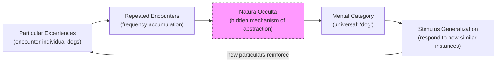

# Module 06: Ockham's Psychological Synthesis

## Overview

William of Ockham (c. 1287–1349) represents a decisive turning point in the history of psychology. Where his Scholastic predecessors — Aquinas, Duns Scotus, Albertus Magnus — addressed human reason as an adjunct to theology, Ockham made psychology itself the primary instrument of inquiry. He proposed specific psychological principles in a rigorously theoretical manner, then brought those principles to bear on religious and metaphysical questions. Others took theological truths as their starting point; Ockham began with human psychological dispositions and asked how theological conceptions come into being. This reversal — from theology-first to psychology-first — marks the beginning of the end of Scholasticism and the threshold of the Renaissance.

---

## 1. Habitus: The Acquired Disposition

At the core of Ockham's psychology lies the concept of **habitus** — an acquired disposition, a perfected state or condition of the individual. A habitus represents a qualitative change in the person: one becomes able to do easily, perceive readily, or behave effortlessly what initially was difficult or incomplete.

> **Key Term: Habitus** — An acquired disposition or perfected state through which an individual comes to perform, perceive, or respond with ease what was once effortful. It is not innate but built through repeated experience, and it can be lost through disuse or conflict.

Since a habitus disposes the individual toward conduct of a certain sort, it must either be present as a condition of birth or acquired through experience. Ockham argues forcefully that **habits must be acquired** — they are fundamentally dispositions toward specific objects. His reasoning is characteristically concrete: "We cannot be born with the habit of dressing neatly, since nothing in our intrauterine life is able to anticipate fashion." All our habits are results of experience; **none is innate, including moral habits or virtues.**

This claim is more radical than it might first appear. It sweeps away the Augustinian inheritance of innate moral knowledge, the Thomistic natural law inscribed in reason, and the Platonic recollection of eternal truths. For Ockham, even virtue must be learned.

> **Stop and Think #1:** Ockham argues that no habit is innate — not even moral virtue. If moral character is entirely acquired through experience, what does this imply about moral responsibility? Can we hold someone fully accountable for a character they did not choose but were shaped into by circumstances beyond their control?

### Aristotle's Influence and Ockham's Departure

Ockham's position has clear Aristotelian roots. Aristotle's associationistic theory of learning was itself empirical — the newborn soul as a **tabula nuda** (*Nicomachean Ethics*, Book III), with knowledge of principles gained through experience (*Posterior Analytics*, Book II).

> **Key Term: Tabula nuda** — The Aristotelian version of the "blank slate": the newborn soul as a bare surface, unmarked by any content, upon which experience writes. Distinct from the later Lockean *tabula rasa* in that Aristotle grants the soul innate faculties even while denying innate content.

But Aristotle is not entirely consistent on this point. In the *Categories*, habit is rendered as essentially changeless; in the *Metaphysics*, habits of a certain sort are described as inherent. Ockham is not merely an Aristotelian — his theory is **far less compromising in its empiricism**, more specific in distinguishing between:

- **Instincts** — innate, fixed behavioral patterns
- **Physiological dispositions** — bodily tendencies rooted in nature
- **Habits** — intellectual, gradual, and changeable through disuse or conflict

This three-way distinction is a significant psychological contribution. It separates what nature provides from what experience builds, and it recognizes that intellectual habits (unlike instincts) are fragile — they can weaken, conflict with one another, or be replaced.

> **Stop and Think #2:** Ockham distinguishes instincts from intellectual habits, arguing that only the latter are acquired and changeable. How does this three-part taxonomy — instincts, physiological dispositions, habits — compare to the modern nature-versus-nurture debate? Has psychology actually advanced beyond Ockham's framework, or merely relabeled it?

---

## 2. Nominalism Applied to Psychology

Ockham's nominalism — the philosophical position that universals have no existence outside the mind — has direct and profound implications for psychology.

Consistent with nominalism, Ockham argues that the habitus conduces to a given act, is disposed to particular objects, and is strengthened by specific exercise. **The mind — not nature — creates general categories** including acts and objects of perceptibly similar nature. By abstraction, or what modern behaviorists might call **stimulus generalization**, the mind relates habitually to objects that resemble each other.

> **Key Term: Stimulus generalization** — A concept from modern behaviorist psychology (associated with Pavlov and Skinner) describing the tendency for a conditioned response to be elicited by stimuli resembling the original conditioned stimulus. Ockham's account of how the mind groups similar particulars under a single habit anticipates this principle by six centuries.

The critical move: there is **no universal outside the mind** (*extra animam*). What we call a universal is a product of the mind, constructed after frequent experience with particulars. The category "dog" does not exist in some Platonic heaven or in the fabric of nature itself — it exists because the mind has encountered many particular dogs and formed a disposition to respond to them similarly.

This is a radical departure from both Platonism (where universals are real and prior to experience) and Thomism (where universals exist in things, and the intellect discovers them through abstraction). For Ockham, the universal is a **mental achievement**, not a metaphysical given.

> **Stop and Think #3:** Ockham insists that universals — general categories like "dog" or "justice" — exist only in the mind, not in nature. If all general categories are mental constructions built from particular experiences, how do two people ever mean the same thing by a word? Does Ockham's nominalism lead inevitably to radical subjectivism, or can shared experience rescue common meaning?

---

## 3. Natura Occulta: The Hidden Nature of Abstraction

Ockham acknowledges a profound difficulty: if universals are mental constructions, how exactly does the mind create them? What is the mechanism by which frequent encounters with particulars give rise to a general category?

Ockham's answer is deliberately modest. He avoids speculating on the underlying process, describing it as **natura occulta** — a process of hidden or secret nature.

> **Key Term: Natura occulta** — Literally "hidden nature." Ockham's term for the mechanism by which the mind creates general categories from repeated experience with particulars. He declines to explain *how* this happens, treating it as a process whose internal workings are not yet accessible to inquiry.

This is not intellectual laziness — it is methodological honesty. Ockham recognizes that describing a phenomenon is not the same as explaining it, and that positing a mechanism without evidence would violate his own principle of parsimony. The mind *does* generalize; we can observe that it does; but the inner process remains hidden. This restraint anticipates the modern scientific distinction between describing a regularity and explaining its causal basis.

*Figure 1. Ockham's model of category formation. The dashed border on "Natura Occulta" represents Ockham's honest acknowledgment that the mechanism remains hidden — a parsimony he refuses to violate with speculative explanation.*

> **Stop and Think #4:** Ockham labels the mechanism of abstraction *natura occulta* — "hidden nature" — and refuses to speculate beyond what observation permits. Compare this restraint to modern cognitive science's use of terms like "implicit learning" or "statistical inference." Has the hidden nature been revealed, or have we simply given it more sophisticated names?

---

## 4. Passions, Appetites, and Moral Psychology

Ockham also discoursed on **passions and appetites** which, through association with habits, motivate behavior of an appetitive variety.

> **Key Term: Appetite (philosophical)** — In the Aristotelian-Scholastic tradition, appetite is the soul's natural inclination toward what is perceived as good. It encompasses both sensory appetite (desire, anger, fear) and rational appetite (will). For Ockham, appetitive behavior is shaped by acquired habits, not innate moral knowledge.

While insisting that some acts of the will are moral, Ockham argued these are **subjectively moral** — they are acts of the will. Moral acts, like other habits, are acquired and cannot be by necessity. This has a striking implication: **moral virtue is not natural.** It is built through experience, shaped by habituation, and subject to the same processes of strengthening and decay as any other habitus.

Any absoluteness in morality, Ockham argued, must derive from God — not from our experiences. This preserves a role for theology while radically repositioning its relationship to psychology: God provides the absolute moral framework, but the individual's moral character is entirely a product of lived experience. We are not born good or bad; we become so.

> **Stop and Think #5:** Ockham separates the absolute moral framework (which comes from God) from the individual's moral character (which comes from experience). This creates a dual-source model of morality. Is this position stable? If our moral habits are entirely experiential but moral truth is divine, how can we ever be confident that our acquired morals align with the absolute standard?

---

## 5. Ockham as Bridge to the Renaissance

William of Ockham is a fitting conclusion to the Scholastic period. His emphasis on human psychology serves as introduction to the Renaissance. Consider the historical frame: Dante died in 1321, Ockham in 1349.

**Dante** was the last spokesman for the romantic tone of medieval life — allegory real, fact suspect, nature threatening. His universe is one of symbolic correspondences, where the literal and the figurative are fused, and nature is a veil over divine meaning.

**Ockham** is one of the first spokesmen of the coming age — an age of confidence, individualism, and grandness, but also of "natural magic," witch-hunts, superstition, and attempts to forge a scientific worldview. His focus on **experience, experiment, and natural causation** points directly toward the empirical spirit of the Renaissance and, eventually, the scientific revolution.

The transition is not clean. The Renaissance would combine Ockham's empiricism with occultism, his parsimony with extravagance, his naturalism with superstition. But the direction was set: psychology would henceforth be understood as a discipline grounded in experience, not revelation — a human science, not a divine one.

---

## Summary

Ockham's psychological synthesis is remarkable for its systematic empiricism and its methodological restraint. His core contributions include:

- **All habits are acquired** — none innate, including moral virtues — making psychology fundamentally an empirical science
- **The mind creates universals** — nominalism applied to psychology means general categories are mental achievements, not metaphysical givens
- **Natura occulta** — honest acknowledgment that the mechanism of abstraction remains hidden, anticipating modern scientific modesty about unexplained regularities
- **Moral psychology as habituation** — virtue is built through experience, not inscribed by nature or revelation
- **Bridge to the Renaissance** — Ockham's focus on experience, parsimony, and natural causation inaugurates the empirical spirit that would eventually transform psychology into a science

Ockham did not complete the transformation — that would take centuries. But he drew the map.

---

## References

Robinson, D. N. (1995). *An intellectual history of psychology* (3rd ed.). University of Wisconsin Press.

Dubova, M., Gigerenzer, G., Lombrozo, T., et al. (2025). Is Ockham's razor losing its edge? New perspectives on the principle of model parsimony. *Proceedings of the National Academy of Sciences*. — This paper reexamines parsimony in light of modern successes with highly complex models (e.g., protein folding, climate forecasting). The authors argue that parsimony and complexity play complementary roles: parsimony remains a valuable proxy for predictive accuracy, interpretability, and resource efficiency, even as its absolute authority is tempered by context-sensitive modeling practices. Ockham's medieval intuition — do not multiply entities beyond necessity — remains structurally operative in how scientists select between competing theories, seven centuries later.

---

*Module 6 of 8 complete.*
