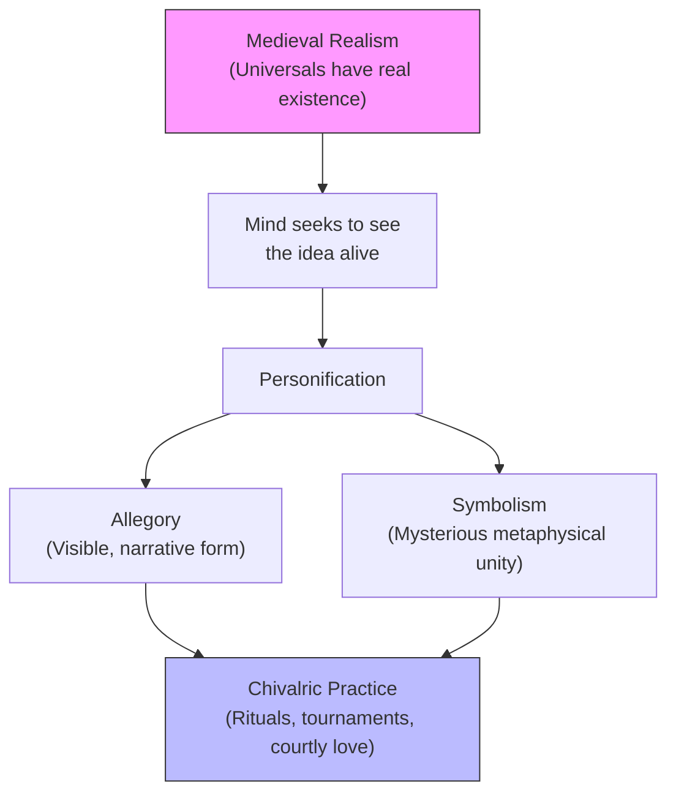

# Module 07: Chivalry, Honor, and the Ideal Life

## Overview

Scholasticism was the *academic* psychology of the Middle Ages. But the medieval world had another psychology — one that operated not in the lecture hall but in the court, the tournament, and the battlefield. This was **chivalry**: the *popular* psychology of the age. If Scholasticism embodied the medieval mind at its most disciplined, chivalry embodied it at its most extravagant. Huizinga captures the paradox precisely — chivalry was "an aesthetic ideal assuming the appearance of an ethical ideal," sustained by heroic fancy and romantic sentiment rather than by rational argument. This module examines how that ideal functioned as a psychological system, tracing its roots in allegory, courtly love, hierarchical cosmology, and the Scholastic theory of free will and moral responsibility.

---

## 1. Chivalry as Popular Psychology: The Aesthetic Disguised as Ethical

The medieval citizen perceived the world as a set of established, immutable arrangements — hierarchical, with the Church supreme. Unless one served God directly as cleric or knight, one's position was of diminished significance. Chivalry was the psychology of the *elite*: a code that defined the good life exclusively for those at the top of the social order.

Huizinga's formulation deserves careful parsing. An aesthetic ideal concerns *beauty, form, and spectacle*. An ethical ideal concerns *right action and moral obligation*. Chivalry fused the two so completely that the knight's pursuit of honor, valor, and sacrifice became indistinguishable from the pursuit of beauty. The result was **identity-based motivation** — one acted morally not because of a rational calculation but because moral action was constitutive of who one *was*. The pageantry was the point. The ritual was the reason.

> **Key Term: Chivalry** — A medieval social and ethical code governing knightly behavior, combining martial valor, religious piety, courtly manners, and romantic devotion into a single ideal of noble life. Psychologically, it functioned as the popular counterpart to Scholasticism — a lived philosophy expressed through ritual and action rather than argument and abstraction.

---

## 2. Allegory vs. Symbolism: How the Medieval Mind Blended Fact and Metaphor

To comprehend chivalry, we must understand the cognitive habit that made it possible: the medieval tendency to treat metaphors as realities. Huizinga draws a crucial distinction:

> "All realism, in the medieval sense, leads to anthropomorphism. Having attributed a real existence to an idea, the mind wants to see this idea alive, and can only effect this by personifying it. In this way, allegory is born. It is not the same thing as symbolism. Symbolism expresses a mysterious connection between two ideas; allegory gives a visible form to the conception of such a connection."

**Symbolism** asserted a deep metaphysical unity between ideas — its image was one of impeccable order, architectonic structure, hierarchic subordination. Every piece of nature fit its intended slot; every event fulfilled the prophecy of the symbol. Embracing all nature and all history, symbolism gave a conception of the world of more rigorous unity than modern science can offer.

**Allegory** went further by making that unity *visible*. If "Justice" is a real feature of the cosmos (as medieval realism held), then the mind naturally seeks to *see* it. Allegory personifies the abstraction — puts a face on it, gives it a voice, makes it walk and act within a narrative.

> **Key Term: Allegory vs. Symbolism** — Symbolism expresses a mysterious connection between two ideas; allegory gives visible, narrative form to that connection by personifying abstractions. Both treat metaphors as real, but allegory makes them concrete and perceptible.

> **Key Term: Anthropomorphism (Medieval Context)** — Not merely attributing human qualities to non-human entities, but the broader cognitive tendency to make abstract ideas *alive* by giving them human form. Within medieval realism, this was not a fallacy but a legitimate mode of knowing.

*Figure 1: How medieval realism generated both allegory and symbolism, which converged in chivalric practice.*

Love and death were dressed in rituals of unimaginable complexity. The world was worth noting only as a symbol of God's work. In literature, allegory reigned supreme — *Roman de la Rose* being the paradigmatic text, where the union of lovers is preceded by a legion of personified virtues, saints, and demons.

---

## 3. Courtly Love: Honor Before Pleasure

Nowhere was the fusion of aesthetics and ethics more visible than in **courtly love** — the elaborate code governing romantic relations among the medieval aristocracy. Pure sensuality could not be acknowledged directly; instead, it was disguised by a system in which honor came before pleasure, and suffering was the *condition* for desire.

> **Key Term: Courtly Love** — A medieval convention in which a knight's devotion to a noble lady was expressed through elaborate rituals of service, suffering, and idealization, with physical consummation deliberately deferred. Psychologically, it transformed erotic desire into a vehicle for moral refinement.

Courtly love performed several psychological functions simultaneously:

- **Sublimation** — Raw erotic energy was redirected into channels of devotion, service, and self-improvement. The knight who suffers for his lady becomes a more disciplined, more admirable knight.
- **Moral scaffolding** — By making pleasure contingent on honor, desire could not operate independently of the ethical framework. One could not simply *want*; one had to *deserve*.
- **Narrative structure** — The elaborate rituals (gazing, sighing, quests, trials) gave romantic experience a *plot* — a narrative arc transforming raw emotion into moral development.

The result was a psychology of desire in which **the object of desire was less important than the process of desiring**. The lady was idealized because she was unattainable; the suffering was the point, not the obstacle.

---

## 4. The Hierarchical Worldview: Classes as Divinely Intended

The chivalric ideal preserved the medieval belief in humanity as divine creation serving specific functions. Classes, since they existed, were *intended* — as the number "7," chosen by God for the planets, was sacred. The world was worth noting only as a symbol of God's work.

Faith is the light; reason the guide; suffering, honor, humility the way. With the pope as philosopher-king, knights as guardians, and symbols enjoying the ultimate reality of Ideas, the medieval mind created a republic where civilization was crumbling. The hierarchical order provided deep **ontological security** — the feeling that one's place in the world was not accidental but *meant*. This came at the cost of mobility, but it answered the question that modern egalitarian societies struggle with: "Why am I here?"

---

## 5. Free Will, Responsibility, and the Scholastic Theory of Sin

The chivalric ideal and Scholastic theory of conduct are parallel developments — both reflecting the same features of the High Middle Ages, expressed in different registers. At the heart of both lies a commitment to the reality of **free will** and the moral weight of human action.

How was the medieval world saved from Stoicism? The inclusion of a **personal, knowable God** made the critical difference. God endowed humans with free will — autonomy and indeterminacy. The price: **responsibility**. We can sin only because we can choose. Actions are worthy of praise or blame only to the extent they are voluntary.

> **Key Term: Appetitive vs. Intellectual Principle** — Animals possess only the appetitive principle (instinct and desire); humans possess both appetitive and intellectual principles, enabling reflection, moral evaluation, and voluntary choice. Sin occurs when the intellect fails, not when the will rebels.

The Scholastics granted animals only instinctive disposition — reflexive, not reflective. Man, as rational, can control appetites and resist actions. When we sin, it is not because will took control of reason but because **reason failed to note the evil attaching to pleasurable sensation**.

This has a subtle but important psychological implication: **sin is a cognitive failure, not a volitional one.** The will does not rebel against reason; reason fails in its duty to inform the will. Pleasure blinds the intellect to the moral character of an action. The sinner is not a rebel but a fool — someone who *would not* have chosen evil had they *seen* it clearly. This preserves the possibility of redemption: if sin is a failure of perception, then education, reflection, and grace can correct it.

---

## Stop and Think

1. **Aesthetic vs. Ethical Ideal**: Huizinga calls chivalry "an aesthetic ideal assuming the appearance of an ethical ideal." Can you think of a modern institution or cultural practice that similarly disguises aesthetic motivations as moral ones? What psychological consequences follow from this confusion?

2. **Allegory in Action**: If you were a medieval person who believed that "Justice" had real, independent existence, how would you *experience* encountering a judge in a courtroom? Would the judge seem to you like a mere representative of justice, or like justice itself made flesh? What does this tell you about the power of allegory?

3. **Honor Before Pleasure**: Courtly love required the knight to suffer before he could desire. Modern dating culture often inverts this — pleasure comes first, commitment later. What psychological trade-offs does each system involve? Which produces a more stable psychology of desire?

4. **Ontological Security**: The hierarchical worldview gave every person a divinely assigned place. Modern society offers freedom but often leaves people asking "Why am I here?" Is the loss of ontological security an acceptable price for social mobility? What psychological resources do modern individuals use to answer that question?

5. **Sin as Cognitive Failure**: The Scholastics argued that sin results from reason failing to perceive evil, not from will overpowering reason. How does this compare to modern ideas about addiction, temptation, or "knowing better but doing it anyway"? Does treating moral failure as a perception problem change how we think about blame and redemption?

---

## References

- Huizinga, J. (1924). *The Waning of the Middle Ages*. Edward Arnold.
- Robinson, D. N. (1995). *An Intellectual History of Psychology* (3rd ed.). University of Wisconsin Press.
- Travaglino, G. A., Friehs, M.-T., Kotzur, P. F., & Abrams, D. (2024). Identification with honor-relevant groups and reputational concerns: A three-wave longitudinal study. *British Journal of Social Psychology*. https://doi.org/10.1111/bjso.12782

---

*Module 7 of 8 complete.*
