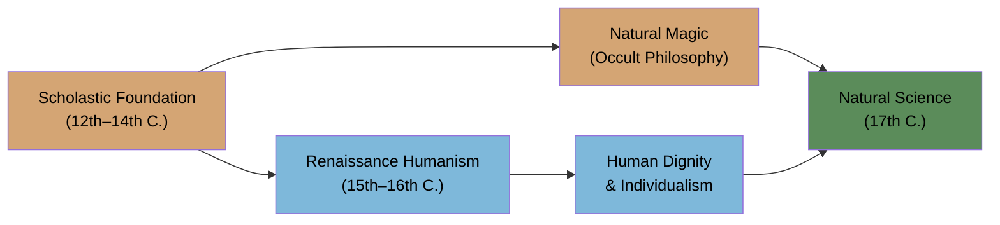
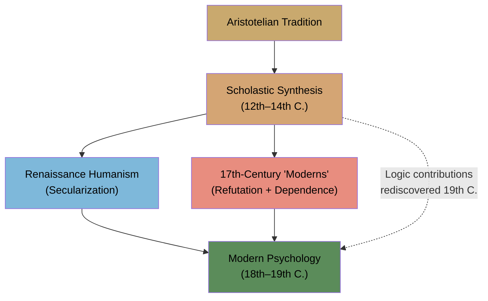

# Module 08 — The Legacy of Scholasticism and the Road to the Renaissance

**Chapter 5: Scholastic Psychology — The Authority of Aristotle**
*An Intellectual History of Psychology* (Robinson, 3rd Ed., 1995)

---

## The Most Inventive Centuries

The two and a half centuries beginning in 1100 were among the most inventive in Western history. Scholars like Roger Bacon, Robert Grosseteste, John Duns Scotus, and William of Ockham did not merely inherit an intellectual tradition — they defined the experimental approach that would eventually become the hallmark of modern science.

What is often overlooked is how far this spirit of inquiry extended. Even heads of state participated in the new learning. Frederick II, Holy Roman Emperor (1194–1250), addressed scientific questions to both Christian scholars and Arab intellectuals. His experiments were remarkably empirical in spirit: he blindfolded predatory birds to test whether they located prey by smell or sight; he reared children in silence to determine whether Hebrew was the innate universal language; he tagged fish to determine their longevity.

Frederick II was not common among political leaders — but he appears in the earliest chapter of scientific learning. He did not reject Scholasticism, nor did the Renaissance. He was a product of it.

> **Stop and Think #1:** Frederick II's experiments — blindfolding hawks, isolating children, tagging fish — sound strikingly modern. What does it tell us about Scholasticism that an emperor embedded within its intellectual culture would design empirical tests of natural phenomena? Does this challenge the popular image of the "Dark Ages"?

---

## What Scholasticism Actually Was

Scholasticism was not a single body of truths. It was not rigid methods. It was not a tailor-made Christianity. It was a movement, as diverse as other isms. What unified it was a commitment to reason's central position — defended on grounds as psychological as theological:

- Man was the animal with **free will, reason, and intellect**
- Made in the **divine image**
- Born in **sin**
- Known by his **works**

These were not abstract doctrines. They were claims about human nature — about what kind of being a person is, and what capacities define the human condition. In this sense, Scholastic philosophy was always, at its core, a psychology.

---

## From Scholasticism to Renaissance Humanism

The themes the Scholastics developed would be expanded and secularized as Renaissance humanism. The translation was not abrupt but gradual:

| Scholastic Foundation | Renaissance Expression |
|---|---|
| Humans made in divine image | **Human dignity** as an inherent quality |
| Experimentation within spiritual framework | **Natural magic**, then natural science |
| Children of the Divine | Capacity to **challenge pope and king alike** |

The chivalric ideal — honor, courage, service — translated into human dignity. Experimentation, still spiritual in tone, appeared first as natural magic, then emerged as natural science proper. As children of the Divine, humans would claim the authority to challenge earthly powers.

**Figure 1.** *From Scholastic foundations to the Scientific Revolution: the path was not a rejection but a transformation. Scholastic themes of experimentation and human rationality were secularized through Renaissance humanism and natural magic, converging in the natural science of the 17th century.*

---

## The Scholastic Contribution to Psychology

The Middle Ages set the stage for modern psychology. As a period that discovered experimental science and human reason, it brought psychology closer to modern expression — paradoxically — by removing it further from its purely transcendental heritage.

That the Scholastics did not reinvent modern psychology is understood by their unwillingness to take the decisive step: **viewing mind as object.** The Renaissance fared no better. Both traditions treated mind as something to be reasoned *about*, not something to be studied empirically *as a phenomenon.*

Yet the Scholastics were more concerned with **systematizing** than manipulating nature. They recognized systematic experimental science but did not initiate experimental programs. They were rationalists to the core — a generally impractical sort, as Robinson notes.

### The Unrivaled Record in Logic

The Scholastic record is remarkable: the period 1150–1300 hosted more original contributions to logic than any comparable period since Greek antiquity. These contributions were not reviewed until the late nineteenth and early twentieth centuries — buried not by their inadequacy but by the Renaissance's need to construct its own mythology of rebirth after darkness.

> **Stop and Think #2:** The Scholastics produced more original logic than any period since ancient Greece — yet this was not recognized for over 500 years. What does this tell us about how intellectual traditions get remembered, forgotten, and rediscovered? Who controls the narrative of "progress"?

---

## Psychological Questions the Scholastics Faced

Scholarship in the thirteenth and fourteenth centuries came closer to modern psychology issues than any comparable period until the late eighteenth century. Scholastic analyses of the following were **sophisticated, deep, suggestive, and mature:**

- **Nativism and environmentalism** — What is innate, what is acquired?
- **Sensationism and conceptualism** — Does knowledge begin in the senses or in concepts?
- **Free will and deterministic behaviorism** — Are human actions chosen or caused?
- **Mind-body materialism and dualism** — Is the mind physical or something beyond?
- **Individualism and social determinism** — Is the person autonomous or shaped by society?

These are not medieval curiosities. They are the permanent questions of psychology. That the Scholastics engaged them with rigor and nuance means that the 17th-century thinkers who claimed to break with Scholasticism were, in many cases, continuing the same conversation.

> **Stop and Think #3:** The list of Scholastic psychological debates — nativism vs. environmentalism, free will vs. determinism, materialism vs. dualism — reads like a modern psychology textbook's table of contents. Why do these questions persist across centuries? Is it because they have no answers, or because each era must answer them anew?

---

## The Language of Philosophy

The Scholastics recognized more fully than most the need for **linguistic analysis** as the first step in evaluating philosophical arguments. Before you can answer a question, you must understand what the question means — a principle that would not be fully appreciated again until the linguistic turn of twentieth-century philosophy.

More completely than Aristotle himself, they examined rival philosophies of science and sought to understand the distinct functions of **observation, logic, and hypothesis.** They did not merely inherit Aristotle's method; they interrogated it.

> **Stop and Think #4:** The Scholastics insisted that linguistic clarity must precede philosophical inquiry — a position that anticipates Wittgenstein by 700 years. If we took this principle seriously today, how would it change the way psychological debates are conducted?

---

## Why Scholasticism Matters

The age commands more respect the more we learn. We identify the "modern" period — the seventeenth century — with an age devoted to refuting Scholastic arguments. Yet Newton, Galileo, Descartes, Hartley, Hobbes, Bacon, and Locke either cite Scholastic sources or offer their theories against a Scholastic background. You do not spend centuries refuting what you consider trivial.

The Scholastic legacy is not a matter of specific doctrines surviving. It is a matter of **questions framed, methods proposed, and a commitment to reason established** that made the Scientific Revolution possible. The Renaissance did not emerge from a vacuum. It emerged from Scholasticism — by way of transformation, not rejection.

**Figure 2.** *The Scholastic legacy: a tradition that both Renaissance humanists and 17th-century moderns drew upon — one through secularization, the other through refutation that nonetheless preserved its questions. Scholastic logic contributions, rediscovered in the 19th century, fed directly into modern formal systems.*

> **Stop and Think #5:** The thinkers we celebrate as founders of modernity — Galileo, Descartes, Newton, Locke — defined themselves against Scholasticism. Yet they could not escape its questions, its methods, or its institutional structures. Can a tradition be most powerful precisely when its opponents think they have defeated it?

---

## References

Robinson, D. N. (1995). *An intellectual history of psychology* (3rd ed.). University of Wisconsin Press. — Chapter 5: Scholastic Psychology: The Authority of Aristotle.

---

*Module 8 of 8 complete. Take time with the "Stop and Think" prompts before moving to the next chapter.*

---

The Renaissance did not arrive as a clean break. It arrived as a transformation — carrying Scholastic questions about human nature into a world that now asked them without reference to divine authority. But the questions themselves remained: What is the human being? What is the relationship between mind and world? Can reason know nature? As the next chapter explores, the Renaissance answered these questions with a new vocabulary — of spirit, of nature, of the individual self — but the grammar was still, in many ways, Scholastic.
