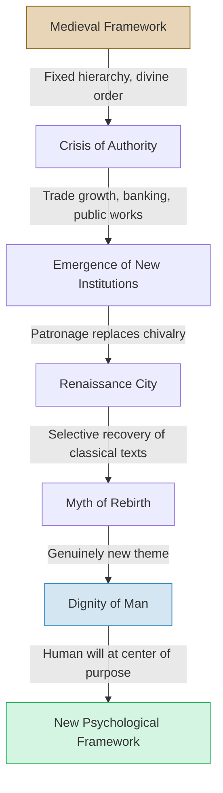

# Chapter 6: Nature and Spirit in the Renaissance

## Module 01: Was There a Renaissance?

Imagine standing in the Piazza della Signoria in Florence, sometime around 1470. The air smells of fresh-cut marble and baking bread. To your left, the Palazzo Vecchio towers above the square, its fortress-like stone bulk softened by arched windows that a previous generation would have considered frivolous. To your right, a bronze statue of Perseus holds up the severed head of Medusa — Benvenuto Cellini's masterpiece, commissioned by Cosimo de' Medici, the banker who effectively rules this city without ever calling himself a ruler.

You are not in a medieval town. The walls around you do not serve primarily as defense. They serve as statements. The buildings assert something about the people who built them: that they have wealth, taste, and the ambition to leave a mark on the world. A merchant walks past in a doublet of dyed wool, discussing interest rates with his clerk. A painter emerges from a workshop, paint still under his fingernails, heading to a patron's villa to discuss the composition of an altarpiece. Somewhere nearby, a scholar pores over a newly recovered manuscript of Lucretius, a Roman poet whose atomist philosophy had been lost for a thousand years.

Everything here feels new. But is it?

That question has haunted historians for over two centuries. The people in this piazza would have told you they were recovering something ancient — the wisdom of Greece and Rome, buried under centuries of superstition and dogma. Nineteenth-century scholars like Walter Pater and John Ruskin agreed, calling this era a "rebirth." But the trade networks that made Florence wealthy, the banking systems that funded the Medici, the public works that transformed the skyline — none of these sprang from nowhere. They had roots stretching back through Charlemagne, through the Lombard kingdoms, through the slow machinery of medieval commerce.

So what actually changed? Was the **Renaissance** a genuine rupture with the past, or merely the next chapter in a story that had been unfolding for centuries? And if something truly *was* born — not reborn — what was it, and why does it matter for how we understand the human mind?

> [!TIP]
> **Stop and Think:** When you hear the word "Renaissance," what images come to mind? Leonardo da Vinci? Michelangelo? Now consider: would the people of fifteenth-century Florence have used that word to describe themselves? What does it mean when an era's self-image doesn't match what later historians see?

---

## The Medieval Town to the Renaissance City

The transformation was real, even if its boundaries were blurry. The **medieval town** had been organized around two principles: divine order and physical defense. Streets were narrow, walls were thick, and the tallest structure in any settlement was the church steeple — a constant architectural reminder that God occupied the highest position in the hierarchy of being.

The Renaissance city operated on different logic. Streets widened to accommodate commerce. Public squares expanded to host markets, civic ceremonies, and the display of art. Architecture became a form of self-expression rather than purely functional defense. The church remained important, but it now shared the skyline with merchant palaces, guild halls, and civic monuments.

This was not merely an aesthetic shift. It reflected a fundamental change in how people understood their relationship to the world around them. In the medieval framework, a person's place was assigned by God. You were born into a station — peasant, knight, priest, king — and your task was to fulfill the duties of that station with humility. The universe was a fixed hierarchy, and human ambition was, at best, a distraction from spiritual preparation.

The Renaissance city told a different story. Here, a merchant could rise to become the de facto ruler of a republic. An artist could achieve fame rivaling that of any duke. A scholar could gain patronage by demonstrating mastery of ancient languages and philosophies. The world, it seemed, was not a fixed stage on which everyone played a preassigned role. It was a workshop — a place where human beings could shape their circumstances.

> [!TIP]
> **Stop and Think:** Consider a modern parallel. Think about a town or neighborhood you know that has undergone rapid transformation — perhaps a former industrial area turned into a tech hub. How did the physical changes in the built environment reflect shifts in what people valued? Did the new buildings and spaces change how people behaved, or did changing values drive the physical transformation? The chicken-and-egg problem is not new.

---

## From Chivalry to Patronage

One of the most telling shifts involved the replacement of **chivalry** with **patronage** as the organizing principle of elite social life.

In the medieval world, the knight was the ideal figure. Chivalry was not merely a code of combat etiquette — it was a comprehensive worldview. The chivalric knight owed loyalty upward (to his lord and to God) and protection downward (to the weak and the innocent). His identity was defined by obligation, honor, and a willingness to die for causes larger than himself. The system was hierarchical, rigid, and deeply intertwined with the Church's vision of a divinely ordered society.

By the fifteenth century, this system had largely dissolved. The knight gave way to the **patron** — the wealthy individual who funded artists, scholars, architects, and scientists. Cosimo de' Medici did not ride into battle. He sat in his study and decided which painters deserved commissions, which scholars would receive manuscripts, and which architects would redesign the city's churches and libraries.

This shift was more than a change in who held power. It changed *what power meant*. The chivalric knight derived his status from lineage, martial prowess, and feudal obligation. The Renaissance patron derived his status from wealth, taste, and the ability to identify and support genius. Patronage introduced a kind of meritocracy — not a democratic one, but a system in which talent and intellectual achievement could elevate a person's standing in ways that birth alone could not.

The implications for psychology are significant. In a patronage system, the individual mind became valuable. A painter's unique vision, a philosopher's original argument, an engineer's innovative design — these were not mere decorations on a fixed social order. They were commodities, sources of prestige, and engines of social mobility. The human individual, with all their particular talents and eccentricities, began to matter in ways the medieval worldview had not anticipated.

> [!TIP]
> **Stop and Think:** Patronage still exists today, though we rarely call it that. Consider how venture capitalists fund tech startups, how wealthy donors name university buildings, or how streaming platforms commission original content. How do modern forms of patronage shape which ideas get developed and which languish? Are there ideas that struggle to find funding today — not because they are bad, but because they don't fit the patron's vision?

---

## Something Born, Not Reborn

Here is where Robinson's argument turns provocative. If the Renaissance was truly a "rebirth" of classical civilization, we would expect to find Renaissance thinkers enthusiastically embracing Greek and Roman philosophy. But the evidence is mixed at best.

**Lorenzo Valla**, perhaps the period's most celebrated philosopher, was — as Robinson puts it — "passionately contemptuous of nearly every Greek and Roman thinker," with the possible exception of Epicurus. **Marsilio Ficino** ran a neo-Platonist "Academy" in Florence, and **Pietro Pomponazzi** championed Aristotelianism. These figures were certainly interested in ancient philosophy. But compared to the "feverish philosophizing from the eleventh to thirteenth centuries" — the era of Thomas Aquinas, Albertus Magnus, and the great scholastic synthesis — the Renaissance's engagement with classical thought looks less like a revival and more like a selective raid.

What actually emerged was not a recovery of the old but the articulation of something genuinely new: the **dignity of man**.

This theme — that human beings are not merely creatures within a divine hierarchy but agents with the capacity and the right to shape the world according to their own will — had no precedent in classical thought. Plato's philosopher-kings ruled because they *understood* the eternal Forms, not because they asserted human autonomy. Aristotle's ethics were about fulfilling a natural function, not about creating new possibilities. The Stoics emphasized acceptance of fate, not mastery over it.

The dignity of man would not have found approval in Plato's Academy, or in Aristotle's Lyceum, or in the court of Marcus Aurelius. It would not have been welcome in the universities of the Schoolmen, either. It was a declaration that the world was made for human beings "to do with as they will" — a radical claim that placed the human will at the center of cosmic purpose.

Ficino captured this sentiment explicitly in 1474: "Universal providence belongs to God who is the universal cause. Hence, man, who provides generally for all things, both living and lifeless, is a kind of god... Our soul will sometime be able to become in a sense all things; and even to become a god."

> [!TIP]
> **Stop and Think:** The "dignity of man" sounds inspiring. But consider its shadow side. If the world exists for humans to use as they will, what happens to the natural environment? To other species? To cultures that don't share this anthropocentric worldview? The same philosophical move that empowered individual human agency also laid the groundwork for exploitation. Is empowerment always a double-edged sword?

---

## Renaissance Self-Image vs. Historical Reality

The tension between how the Renaissance understood itself and what actually happened is one of the most instructive puzzles in intellectual history.

Renaissance thinkers saw themselves as recovering a lost golden age. They insisted they were re-creating the classical outlook, rejecting what they considered the narrow perspective of their medieval predecessors. They recognized the evolutionary nature of the human condition — the idea that history moves through phases, that cultures rise and fall, that the present is not merely a pale reflection of a perfect past.

This self-image was, in important ways, accurate. The Renaissance *did* break with medieval assumptions about fixed hierarchy and divine assignment. It *did* introduce a historical consciousness that the medieval worldview largely lacked. And it *did* recover and disseminated classical texts that had been neglected or lost.

But the self-image was also a myth. The term "Renaissance" was invented by nineteenth-century scholars, not by fifteenth-century Florentines. The trade networks, banking systems, and public works that made the Renaissance possible had been developing continuously since the early Middle Ages. The "rebirth" narrative served a purpose — it allowed modern scholars to claim a direct lineage from classical civilization, skipping over the medieval centuries they found uninteresting or embarrassing.

The lesson here extends beyond historiography. How an era understands itself shapes what it can achieve. The Renaissance's belief that it was recovering classical wisdom gave it permission to experiment, to question authority, and to assert human agency. The myth was productive, even if it wasn't entirely true.

*Figure 6.1: The transition from medieval to Renaissance thought was not a simple rebirth but a complex process in which continuous institutional development intersected with a genuinely new philosophical theme — the dignity of man.*

> [!TIP]
> **Stop and Think:** Every era has a self-image that is partly myth. Consider our own time. We describe ourselves as living in the "information age" or the "age of AI." How much of that self-description is accurate, and how much is a productive myth that shapes our behavior and expectations? What would future historians say we got wrong about ourselves?

---

## Why This Matters for Psychology

You might wonder why a chapter on the Renaissance belongs in a psychology textbook. The answer lies in the shift from a worldview that defined human beings by their place in a divine order to one that defined them by their capacity for autonomous action.

The medieval framework understood the mind as a soul — a spiritual entity whose purpose was to know and serve God. The Renaissance introduced a different question: What can the human mind *do*? Not what is it *for* in a cosmic sense, but what are its powers, its limits, its potential for mastery over nature?

This question — the question of human capability and dignity — would drive the development of psychology for the next five centuries. It would lead eventually to empirical methods for studying the mind, to theories of cognition and perception, to the very discipline you are studying now. The Renaissance did not create psychology. But it created the conditions under which psychology could be conceived.

The Renaissance also established a pattern that would recur throughout the history of ideas: the productive tension between myth and reality, between how an era understands itself and what is actually happening. This tension is not a flaw to be corrected. It is a creative force. The Renaissance's myth of rebirth empowered genuine innovation. The dignity of man, whether historically justified or not, opened doors that had been closed for a millennium.

---

The story does not end here. The dignity of man was a powerful idea, but it was also an incomplete one. It asserted human agency without explaining how the mind actually works. It celebrated human capability without examining the mechanisms of thought, perception, and emotion. The next step would require something the Renaissance, for all its brilliance, had not yet fully developed — a systematic method for investigating the natural world, including the natural world of the human mind. That method would emerge from a different intellectual tradition, one rooted not in Florence but in the universities of northern Europe, and it would carry a name that still shapes how we think about knowledge itself.

---

## References

- Robinson, D. N. (1995). *An intellectual history of psychology* (3rd ed.). University of Wisconsin Press. — Chapter 6, "Nature and Spirit in the Renaissance," provides the foundational analysis of the Renaissance's self-image versus historical continuity.
- Burke, P. (1998). *The European Renaissance: Centres and peripheries*. Blackwell. — A comprehensive survey of the Renaissance as a pan-European phenomenon, examining how the movement spread beyond Italy.
- Cassirer, E. (1963). *The individual and the cosmos in Renaissance philosophy*. Harper & Row. — A classic philosophical analysis of how Renaissance thinkers reconceived the relationship between the individual and the universe.
- Kristeller, P. O. (1961). *Renaissance thought: The classic, scholastic, and humanistic strains*. Harper & Row. — Essential reading on the intellectual currents of the Renaissance, particularly the relationship between humanism and scholasticism.
- Grafton, A. (2000). *Leonardo's unfinished legacy: A study in the history of ideas*. Princeton University Press. — Examines the Renaissance's actual engagement with classical texts versus its mythologized self-image.

---

*Module 1 of 8 complete.*
