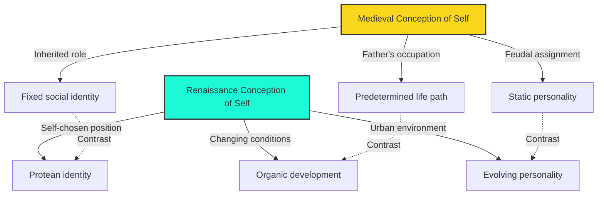

# Module 02: Humanism, Individualism, and the Renaissance City

---

Imagine walking through the streets of Florence in the early fifteenth century. The wool merchants argue prices in the shadow of Brunelleschi's dome. A notary's son studies Greek, not because his father did, but because he has decided that the ancient texts hold truths worth pursuing on his own terms. You notice something unfamiliar in the air — a conviction that who you become is not settled by the family you were born into, nor by the guild your father belongs to, nor by the feudal lord whose land you farm. **Humanism**, as these Florentines understand it, has nothing to do with charity drives or humanitarian relief. It is a fierce, competitive **individualism** — a belief that the **person** is **protean**, capable of self-fashioning, and that the city is the stage on which this self-fashioning occurs.

From a WEIRD perspective — Western, Educated, Industrialized, Rich, Democratic — this story feels familiar, even inevitable. We are so accustomed to the language of self-invention, personal branding, and urban opportunity that we forget these ideas had to be *invented*. The Renaissance did not simply inherit them; it constructed them, piece by piece, inside the particular economic, religious, and political conditions of the Italian city-state. To understand the psychology that emerged, you must first understand why the city mattered, why **individualism** was not yet "individualism" as we now use the term, and why **humanism** was unthinkable without Christianity even as it charted a new course for the self.

---

## What Renaissance Humanism Was — and Was Not

The word *humanism* carries heavy modern baggage. In contemporary usage, it often implies secularism, rationalism, or a generalized concern for human welfare. None of these captures what the Renaissance meant by the term. **Renaissance humanism** was, first and foremost, an intellectual program centered on the **litterae humaniores** — the "humane letters," comprising the study of Greek and Latin classics. It was a curriculum, not a creed; a method of education, not a moral philosophy of compassion (Robinson, 1995, p. 105).

This is a critical distinction for the history of psychology. When we hear "humanism," we instinctively reach for associations with **altruism**, charity, or humanitarian concern for the unfortunate. But Renaissance humanists were not, by and large, reformers of social conditions. When Florence introduced its first graduated tax for poor relief, the city's affluent citizens — many of them self-described humanists — stubbornly opposed it (Robinson, 1995, p. 107). The humanistic movement evolved from and was, in many ways, the concluding stage of **chivalry**: a cultural project through which the privileged classes worked toward noble ends while protecting their own **cultural, artistic, and intellectual prerogatives** (Robinson, 1995, p. 107).

> [!TIP]
> **Stop and Think:** If Renaissance humanism was not humanitarianism, what *was* its psychological appeal? Consider the difference between an intellectual identity organized around mastering ancient texts and a moral identity organized around relieving suffering. Which kind of identity would feel more empowering to an ambitious young scholar in fifteenth-century Florence? How does this distinction challenge the modern assumption that "humanism" and "compassion" are synonymous?

Nor was humanism anti-religious. This is perhaps the most persistent misunderstanding. **Humanism of the Renaissance is inconceivable without Christianity** (Robinson, 1995, p. 103). The church was the largest patron of learning, the primary employer of educated men, and the institutional framework within which classical texts were copied, preserved, and debated. Two of the most powerful Medicis became popes — **Leo X** and **Clement VII**. The humanist project did not reject faith; it redirected intellectual energy toward a broader classical scholarship than the Scholastics had permitted, while remaining embedded in a Christian worldview.

What Renaissance humanism *did* introduce was a new conception of the **individual self** — one that would eventually reshape how Western psychology thinks about personality, agency, and human development.

---

## The Protean Self: A New Conception of Personality

Medieval culture had its own sophisticated portraits of human character. Heroic epics featured finely crafted personalities — warriors of legendary virtue, saints of transcendent piety. But these personalities were, in a fundamental sense, *given*. Your father's occupation determined your future. Your social origins bore determinatively on the shape of your life. The feudal order assigned roles; the individual filled them (Robinson, 1995, p. 104).

The Renaissance broke with this assumption in a way that has profound psychological implications. **Personality** was now taken to be **protean and organic** — evolving as a result of changing conditions, taking on a fixed form only when the individual had settled on a position in society and *chosen* a form of life for himself (Robinson, 1995, p. 104). The self was no longer a static inheritance but a dynamic project.

This is a staggering shift. Consider what it means for the psychology of the person:

- **Agency replaces inheritance.** You are not defined by your father's guild membership. You define yourself through your choices.
- **Development replaces destiny.** Personality is not fixed at birth or by social station; it unfolds over time in response to conditions.
- **Context matters.** The self is not an isolated soul but an organism shaped by its environment — particularly the urban environment.

*Figure 2.1. The shift from a medieval to a Renaissance conception of personality. The medieval self was anchored to inherited social position; the Renaissance self was protean, shaped by choice and circumstance within the urban environment.*

> [!TIP]
> **Stop and Think:** The idea that personality is "protean and organic" anticipates modern psychological concepts like **growth mindset** (Dweck, 2006) and **possible selves** (Markus & Nurius, 1986). How does the Renaissance insight that the self evolves through chosen positions in society compare with contemporary developmental psychology's emphasis on identity formation? Is the Renaissance model too optimistic about the degree to which individuals can reshape themselves, or does modern psychology underestimate this capacity?

---

## The City as Psychological Incubator

The Renaissance self did not emerge in a vacuum. It required a particular kind of environment: the **city**. And no city was more central to this transformation than **Florence** — the quintessential Renaissance city, "chiefly the creation of the Medicis" (Robinson, 1995, p. 104), whose genius for finance spanned from **Cosimo the Elder** (1389–1464) to **Cosimo the Great** (1519–1574).

Why the city? Because the city provided conditions that neither the feudal countryside nor the monastic cloister could offer. **Leonardo Bruni**, chancellor of Florence, wrote the *History of the Florentines*, attributing the city's success to the fact that it did not labor under the stultifying regulatory influences of a Roman empire (Robinson, 1995, p. 105). Bruni's argument was not merely political; it was psychological. The city was the space in which a new kind of self could flourish.

The medieval town, by contrast, had room for only a handful of leading figures. The **Holy Roman Empire** was of a scale to embarrass all but regal initiative. Ordinary people were invisible within these grand structures. The Renaissance city offered something different:

| Feature | Medieval Town / Empire | Renaissance City |
|---|---|---|
| Social scale | Limited leadership roles | Fierce competition yielding visible heroes |
| Opportunity | Determined by birth | Open to talent and ambition |
| Fortune | Slow-moving, predictable | Sudden reversals possible |
| Identity | Anonymity for most | Anonymity when needed, celebrity when earned |
| Cultural life | Church-dominated | Diverse, competitive, patron-driven |

*Table 2.1. The psychological ecology of the Renaissance city compared with earlier social structures.*

The city sustained the growing sense of individualism and its limitless possibilities. It afforded **anonymity when needed** and **celebrity when earned** (Robinson, 1995, p. 105). This dual capacity — to disappear and to be seen — is psychologically essential for the development of a protean self. Anonymity provides the freedom to experiment; celebrity provides the reward for success. The city was, in effect, a laboratory for identity.

> [!TIP]
> **Stop and Think:** Consider the role of the city in modern psychological research. Urban environments are associated with both greater creativity and higher rates of mental illness (Lederbogen et al., 2011). The Renaissance city offered anonymity and opportunity in equal measure. Do contemporary megacities serve the same psychological function, or has the scale of modern urbanization overwhelmed the conditions that made the Renaissance city an incubator for individualism? What would Bruni make of Tokyo, Lagos, or São Paulo?

Bruni led his contemporaries to **reverence for their cities** and a commitment to attain greatness that only urban life allows (Robinson, 1995, p. 105). This is not mere civic pride. It is a psychological claim: that the environment shapes the self, and that a particular kind of environment — competitive, anonymous, culturally rich — is necessary for a particular kind of self to emerge. The city was not merely a backdrop for Renaissance individualism; it was its condition of possibility.

---

## Humanism as Intellectual Movement: The Humanities and Classical Scholarship

If the spirit of humanism was individualism, the term itself described the intellectual pursuits proper for enlightened urban members: the **humane letters** (*litterae humaniores*), or the "humanities" (Robinson, 1995, p. 105). The subjects were Greek and Latin classics, though Renaissance scholars were, as Robinson notes, "not much for careful philosophical analysis or originality" (p. 105). This is an important qualification. Renaissance humanism was a *scholarly* movement — devoted to the recovery, translation, and dissemination of ancient texts — rather than a *philosophical* movement devoted to generating new systems of thought.

As an intellectual movement, humanism was devoted to **broader classical scholarship than the Scholastics** had pursued. Where medieval Scholasticism had organized learning around Aristotelian logic and theological disputation, humanism cast a wider net: rhetoric, poetry, history, moral philosophy, and the Greek and Latin languages themselves became central to education. As a **moral instrument**, however, humanism was intended to protect the cultural, artistic, and intellectual prerogatives of aristocrats (Robinson, 1995, p. 107).

This dual character — broadening intellectual horizons while reinforcing social privilege — is essential for understanding the psychological legacy of humanism. The movement expanded what counted as knowledge, but it did not democratize access to that knowledge. The **humanities** were the province of the elite. The protean self was a self that could afford to be protean — one with the economic resources, social connections, and leisure to study Greek, commission art, and experiment with new forms of life.

> [!TIP]
> **Stop and Think:** Renaissance humanism broadened the curriculum but kept it elite. Modern universities claim to democratize the humanities, yet access to classical education remains stratified by socioeconomic status. Is the tension between intellectual breadth and social exclusivity inherent in any humanistic project? How does this tension shape whose "self" gets to be protean and whose remains fixed by circumstance?

> [!TIP]
> **Stop and Think:** Robinson observes that Renaissance scholars were "not much for careful philosophical analysis or originality." If humanism valued the recovery of ancient texts over the creation of new ideas, what does this tell us about the relationship between *tradition* and *innovation* in intellectual life? Can a movement that looks backward to classical sources simultaneously be a force for psychological innovation? Think about how modern psychology sometimes returns to Freud, James, or Wundt — is scholarship always partly an act of recovery?

---

## The Psychological Legacy

The Renaissance contribution to the history of psychology is not a specific theory or experiment. It is a *conception of the person* that made subsequent psychological theories possible. The idea that personality is protean — that the self is shaped by choice, circumstance, and environment rather than fixed by birth — is the precondition for developmental psychology, personality psychology, and much of clinical psychology. The idea that the city matters — that the environment shapes the self — anticipates ecological and contextual approaches to human behavior. The idea that classical scholarship can illuminate the human condition — that the humanities have psychological value — remains a live debate in psychology and education today.

But these ideas came with costs and contradictions. Humanism was elitist. It was not humanitarian. It celebrated individual achievement while protecting aristocratic privilege. Understanding these contradictions is not a reason to dismiss the Renaissance contribution; it is a reason to read it carefully, with attention to the social conditions that shaped it, and to ask what has changed — and what has not — in the centuries since.

---

## References

Robinson, D. N. (1995). *An intellectual history of psychology* (3rd ed.). University of Wisconsin Press. [Chapter 6: Nature and Spirit in the Renaissance — research anchor: Renaissance humanism, individualism, protean personality, litterae humaniores, Florence and the Medicis]

Dweck, C. S. (2006). *Mindset: The new psychology of success*. Random House.

Lederbogen, F., Kirsch, P., Haddad, L., Streit, F., Tost, H., Schuch, P., ... & Meyer-Lindenberg, A. (2011). City living and urban upbringing affect neural social stress processing in humans. *Nature*, *474*(7352), 498–501.

Markus, H., & Nurius, P. (1986). Possible selves. *American Psychologist*, *41*(9), 954–969.

---

*Module 2 of 8 complete.*
