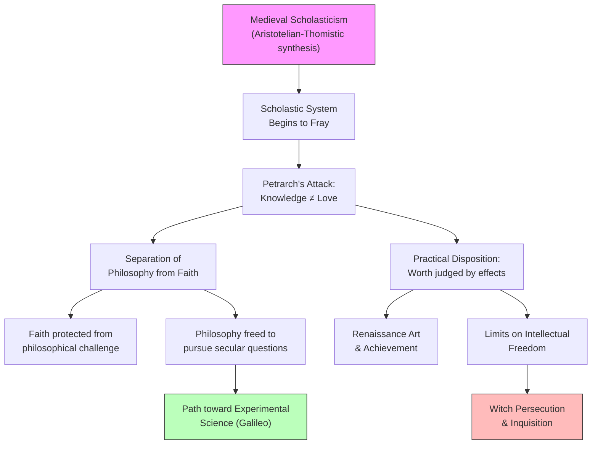

# Chapter 6 — Nature and Spirit in the Renaissance

## Module 3: Petrarch and the Skepticism Toward Intellect

---

In the summer of 1341, on the Capitoline Hill in Rome, Francesco Petrarca — known to history simply as Petrarch — was crowned poet laureate. The ceremony was ancient in its symbolism: a poet honored by the city, the city honored by the poet. But what made this moment extraordinary was the man himself. Petrarch was not merely a poet. He was, as more than one historian would later call him, the very father of the Renaissance.

Yet if you had asked Petrarch what he thought of the greatest minds of antiquity, you might have been surprised by his answer. Writing to his friend Donato in the letter that would become *On His Own Ignorance and That of Many Others*, he set out to prove the weaknesses and contradictions of the vaunted Greeks and Romans. His treatment of Aristotle was particularly devastating. Commenting on Aristotle's discussion of happiness — what Aristotle called *eudaimonia* — Petrarch wrote: "He knew so absolutely nothing of true happiness that any pious old woman, any faithful fisherman, shepherd or peasant is — I will not say more subtle, but happier in recognizing it... He saw happiness as much as the night owl does the sun."

Here was a poet, writing in the fourteenth century, dismissing the philosopher whom the medieval world had elevated to near-divine authority. And the dismissal wasn't based on logical argument. It was based on something far more radical: the conviction that knowing is not the same as loving, and that understanding is not the same as willing.

---

## The Poet Who Attacked Philosophy

Petrarch occupies an unusual position in intellectual history. No single work of his stands as a psychological treatise. He produced no system, no comprehensive theory of mind, no detailed analysis of perception or emotion. Like Voltaire after him and Diogenes before, his position was earned through influence — the daily effect of his letters, his connections among political and financial luminaries, and his talent for rebuking those who stood in the way of progress.

His "book" on his own ignorance was really a long letter to Donato. But in that letter, he articulated something that would define an entire era. He attacked the aloofness of Aristotle with a poet's passion, insisting that human beings can be happy only when in possession of faith and immortality — two properties conspicuously absent from Aristotle's treatises on eudaimonia. His authorities were not philosophers but Scripture: the Bible, St. Augustine, and Cicero.

Here is the critical move. Petrarch rejected Aristotle not because the philosopher was wrong about logic, metaphysics, or natural science. He rejected him because philosophy itself — the entire enterprise of rational inquiry into the human condition — failed to make men either good or happy.

> [!TIP]
> **Stop and Think:** Petrarch's complaint against Aristotle was not that Aristotle's reasoning was flawed, but that reasoning itself was insufficient for the good life. Is this a philosophical argument or an anti-philosophical one? Can you reject the authority of reason using reasons? What does this paradox reveal about the limits of purely intellectual approaches to human flourishing?

---

## The Cardinal Distinction

Petrarch's most famous line in this letter crystallizes his position in a single sentence:

*"It is one thing to know, another to love; one thing to understand, another to will."*

This is not a casual observation. It is a declaration of war against an entire intellectual tradition. For the Scholastic philosophers who dominated European universities, knowing and loving were not separate faculties — they were aspects of a unified rational soul. To know the good was to love it. To understand truth was to will it. This was the Aristotelian-Thomistic synthesis that had governed European thought for two centuries.

Petrarch broke that synthesis apart. He insisted that knowledge and love belong to different orders of experience. A person can know everything about virtue and still be vicious. A person can understand the structure of the cosmos and still be miserable. Knowledge, by itself, changes nothing. What matters is the heart — the will, the faith, the capacity for devotion.

This distinction — between intellect and will, between knowing and loving — would reverberate through the entire Renaissance and beyond. It would shape the Reformation, influence the development of modern psychology, and ultimately contribute to the separation of science from philosophy that defines the modern university.

> [!TIP]
> **Stop and Think:** Consider the modern distinction between "book smarts" and "emotional intelligence," or between academic knowledge and practical wisdom. Is Petrarch's fourteenth-century distinction — between knowing and loving — still alive in how we think about education and human development? Where do you see it operating today?

---

## Skepticism Toward Intellectualism

Here is one of the principal elements of Renaissance thought: a skepticism toward intellectualism. But this must be understood carefully. Petrarch's skepticism was not religious skepticism — quite the contrary. He sought to re-create a healthier climate of faith, not one clouded with Scholastic analysis.

His opponents were the Aristotelians whose contempt for Plato caused them to ridicule Christian belief or insist it be reconciled with logic. The opposition was not Christianity versus philosophy. It was medieval philosophy — the Aristotelian-Scholastic system — versus a simpler, more direct relationship with faith.

By the fourteenth century, Scholasticism had invited quasi-heretical factions who found the Aristotelian system congenial to the skeptic's mockery of those of simple faith. The elaborate logical apparatus that was supposed to defend Christianity had become, in practice, a weapon that could be turned against it. Petrarch saw this clearly. His solution was not to build a better argument but to remove belief from the reach of argument altogether.

This created a paradox that would haunt the Renaissance: the more effectively philosophy was separated from religion, the more freely philosophy could develop — but also the more freely it could be restricted. If faith is beyond reason, then any challenge to faith can be dismissed as mere intellectual presumption.

> [!TIP]
> **Stop and Think:** Petrarch wanted to protect faith by removing it from philosophical debate. But when faith is beyond argument, what happens to intellectual freedom? Can you protect a belief by placing it outside the reach of criticism, or does that very protection create new dangers? Consider how this tension plays out in modern debates about science and religion.

---

## Hostility Toward Speculation

Petrarch comes down emphatically against freedom of speech:

*"So sweet does the word Freedom sound to everyone that Temerity and Audacity please the vulgar crowd, because they look so much like Freedom. Thus the night owls insult the eagle with impunity."*

This passage reveals another characteristic of the age: suspicion, even hostility, toward philosophical speculation, and a reserved position on intellectual freedom. Petrarch and his contemporaries were of a decidedly practical disposition. The worth of a person or idea was judged by effects in practice — by what it produced, not by what it promised.

Given this orientation, it is less surprising that the entire Renaissance would fail to produce a philosophical system of the highest order. The Renaissance produced magnificent art, extraordinary architecture, revolutionary advances in navigation and engineering. But it did not produce an Aristotle, a Kant, or a Hegel. The practical temperament that drove its greatest achievements also limited its philosophical ambitions.

The conservatism toward intellectual freedom, taken to its extreme, would lead to dark consequences: the persecution of witches and the machinery of the Inquisition. When the worth of an idea is judged solely by its practical effects, and when those effects are defined by those in power, dissent becomes dangerous. The same emphasis on achievement that animated the monumental creations in art and architecture could also be used to justify the suppression of heterodox thought.

*Figure 6.3: The paradox of Petrarch's influence — separating philosophy from religion opened the path to experimental science but also created conditions for restricting intellectual freedom.*

---

## The Paradox of Progress

Petrarch sought to remove belief from philosophical debate but, at the same time, to restore the citizen to a life of participation and achievement proclaimed by the ancients. In separating philosophy from religion and giving the former a practical function, he was instrumental in furthering the late medieval development that would ultimately flower as the experimental science of Galileo.

This is the deepest paradox of Petrarch's legacy. A man who distrusted reason, who dismissed Aristotle's happiness as the vision of a night owl, who opposed freedom of speech — this same man helped create the intellectual conditions for modern science.

How is this possible? Because Petrarch did not merely attack philosophy. He redirected it. By insisting that ideas be judged by their practical effects, he shifted the ground of intellectual authority away from ancient texts and toward direct experience. The Scholastic tradition had deferred to Aristotle's authority on matters of natural philosophy. Petrarch's practical orientation — combined with the Renaissance emphasis on observation and achievement — gradually undermined that authority.

The authority of the Aristotelians, by the fourteenth century, had begun to retard and even repress philosophy and science. The modern world did not begin until this authority was overcome. To the limited extent this is true, Petrarch figures centrally.

> [!TIP]
> **Stop and Think:** Petrarch's emphasis on practical results helped undermine Aristotelian authority — and that helped create space for Galileo's experimental science. But Petrarch himself opposed intellectual freedom. Can progress sometimes come from people whose explicit values would, if fully implemented, prevent the very progress they enabled? Can you think of other historical examples of this pattern?

---

## Petrarch's Legacy for Psychology

Petrarch's skepticism toward intellect left a complex mark on how the West thinks about the mind. On one hand, his insistence that knowledge alone does not produce virtue or happiness anticipated themes that would recur in psychology for centuries — from the Romantic emphasis on feeling, to William James's pragmatism, to the modern research on the gap between knowing and doing.

On the other hand, his hostility toward speculation and his distrust of intellectual freedom created a pattern of anti-intellectualism that has periodically resurfaced in psychological thought — in behaviorism's dismissal of mental life, in the popular suspicion of "overthinking," in the recurring claim that psychology is "just common sense."

The tension Petrarch articulated — between knowing and loving, between intellect and will, between theory and practice — remains unresolved in contemporary psychology. Is psychological knowledge valuable in itself, or only insofar as it produces therapeutic or practical results? Should psychology aim to understand the mind, or to fix it? These questions, in their essence, are Petrarch's questions.

> [!TIP]
> **Stop and Think:** Modern psychology faces a version of Petrarch's dilemma: Should research be judged by its theoretical elegance or its practical applications? Consider the debate between "basic" and "applied" research in psychology. Is Petrarch's emphasis on practical effects still shaping how we evaluate the worth of psychological knowledge?

---

> [!IMPORTANT]
> Petrarch's legacy for psychology is not a theory or a method — it is a tension. By insisting that knowledge must prove its worth in practice, he helped liberate inquiry from the authority of ancient texts. But by placing faith beyond the reach of reason, he also created a model of intellectual restriction that would persist for centuries. Understanding this tension is essential for understanding how psychology eventually emerged as a discipline that must constantly negotiate between pure inquiry and practical application, between the life of the mind and the demands of the world.

---

There is more to this story, of course. If Petrarch redirected philosophy toward the practical, what happened when other Renaissance thinkers tried to reconnect it with the spiritual? The next figure in this drama — Marsilio Ficino — would attempt something ambitious: to recover an ancient tradition of natural magic and spiritual philosophy that might bridge the gap between Petrarch's separated domains. The result would reshape Renaissance thought in ways neither Petrarch nor his opponents could have anticipated.

---

## References

Petrarch, F. (1367–1370). *On His Own Ignorance and That of Many Others* (*De Sui Ipsius et Multorum Ignorantia*). In E. Cassirer, P. O. Kristeller, & J. H. Randall Jr. (Eds.), *The Renaissance Philosophy of Man* (pp. 47–133). University of Chicago Press, 1948.

Robinson, D. N. (1995). *An Intellectual History of Psychology* (3rd ed.). University of Wisconsin Press.

Kristeller, P. O. (1961). *Renaissance Thought: The Classic, Scholastic, and Humanistic Strains*. New York: Harper & Row.

---

*Module 3 of 8 complete.*
