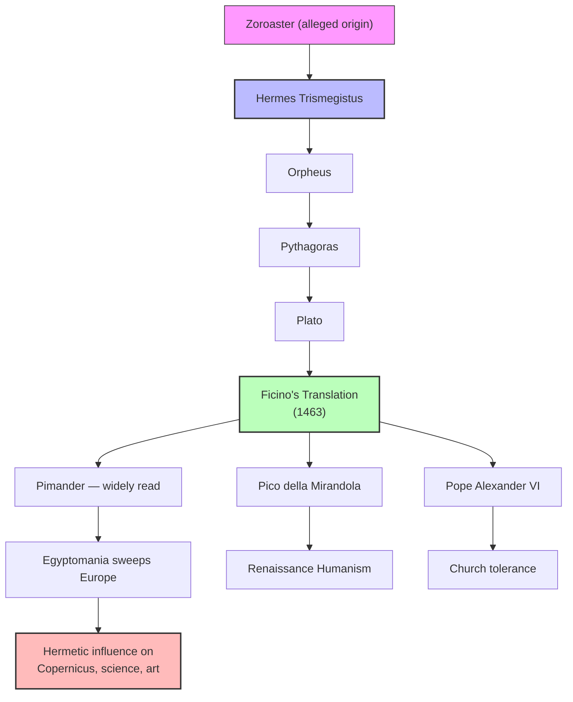
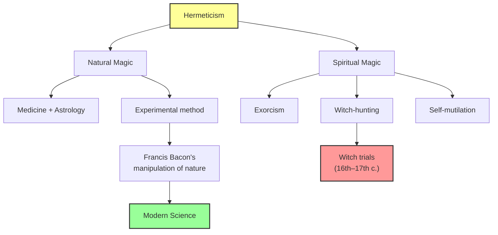

# Module 04 — Ficino, Hermeticism, and Natural Magic

**Chapter 6: Nature and Spirit in the Renaissance**
*An Intellectual History of Psychology* (Robinson, 3rd Ed., 1995)

---

## Learning Objectives

By the end of this module, you will be able to:

1. Explain Ficino's role at the Platonic Academy and how Renaissance Platonism challenged Aristotelianism.
2. Describe the Corpus Hermeticum and the wave of Egyptomania it unleashed.
3. Analyze Hermeticism's influence on early scientific thought, including Copernicus.
4. Distinguish between natural magic and spiritual magic and trace their divergent legacies.
5. Articulate how Hermetic ideas shaped Renaissance conceptions of human dignity and agency.

---

## 1. Ficino and the Platonic Academy

In 1462, Cosimo de' Medici established the **Platonic Academy** in Florence and selected **Marsilio Ficino** (1433–1499) to lead it. This institution became one of the intellectual engines of the Renaissance, though its Platonism was never a faithful re-creation of Plato's original philosophy. Rather, it served as a powerful counterweight to the Aristotelian scholasticism that had dominated European thought for centuries.

Cosimo kept Ficino extraordinarily busy with translation work, commissioning him to render Greek manuscripts into Latin. Among these commissions, one stood above all others: the **Corpus Hermeticum**, a collection of texts believed to contain the pre-classical and mystical secrets of the disciples of **Hermes Trismegistus**.

Ficino titled his translation **"Pimander"** (after the first treatise in the collection), and it became one of the most widely read manuscripts of the period. Its influence was vast — among its devout patrons was **Giovanni Pico della Mirandola**, and it was greeted tolerantly by **Pope Alexander VI** himself.

> [!TIP]
> **Stop and Think — Contextualization**
>
> The Platonic Academy of Florence was not a formal university but a loose intellectual circle centered on Ficino's villa at Careggi. Its meetings, often held on November 7 (supposedly Plato's birthday), combined philosophical discussion with Neoplatonic ritual and conviviality. Understanding this informal structure helps explain why Hermetic ideas could circulate so freely — they were not subject to the institutional gatekeeping of the medieval university system.

---

## 2. The Corpus Hermeticum and Egyptomania

The Renaissance love of antiquity rested on a particular belief: that the purest eras of human civilization had been those of Greece and Rome, and that history since then had been a story of steady deterioration. This **prisca theologia** (ancient theology) framework drove scholars to look ever further back in time, searching for the absolute essence of spiritual energy.

Egypt held deep fascination in this pursuit. The **Hermes legend** held that Hermes Trismegistus descended from **Zoroaster**, and that his intellectual lineage included **Orpheus**, **Aglaophemus**, and **Pythagoras**. Thus, the "divine" Plato himself was understood to derive his inspiration from Egyptian mystery religions. The Pimander appeared to confirm this genealogy and unleashed a wave of **Egyptomania** across European intellectual life.

The Hermes legend was not definitively debunked until **Isaac Casaubon** demonstrated in 1614 that the Hermetic texts were authored between 100–300 AD — centuries after the classical Greek period, not before it. By then, however, Hermeticism had already dominated the spiritual aspects of Renaissance life for over a century.

Ficino achieved something remarkable: he established nearly perfect compatibility between Hermetic themes and those of the **New Testament**. More importantly for the broader culture, the Hermetic texts offered an empowering possibility — that the individual could command supernatural powers and share in the Cosmic spirit. Egyptian priests, the texts claimed, had unearthed all necessary chants, discovered secret astrological configurations, and documented reliable number combinations. Those experienced in their ancient art could summon the forces of heaven.

> [!TIP]
> **Stop and Think — Deception and Influence**
>
> The Casaubon dating is a powerful case study in how historically unfounded ideas can exert enormous real influence. For over a century, European intellectuals organized their cosmology around texts they believed to be millennia older than they actually were. The *psychological* effects — on self-concept, on attitudes toward nature, on conceptions of human power — were real regardless of the texts' actual provenance. In the history of ideas, belief in authenticity can be as consequential as authenticity itself.

---

## 3. Hermeticism and the Birth of Modern Science

Hermeticism placed the **sun at the center** of cosmic concern, thereby allowing the earth to move — a principle that **Copernicus** explicitly acknowledged. This is one of the great ironies of intellectual history: a mystical, quasi-religious system contributed to the cosmological revolution that would eventually undermine both mystical and religious worldviews.

Hermeticism accorded the **magus** — the practitioner of natural magic — the status of **priest**. A fundamental tenet of the system was that **man is an agent of change**, a rational-spiritual force capable of altering nature's course. This was not merely a philosophical abstraction; it was a call to action.

Ficino articulated this vision with striking clarity:

> *"Man is something of a god; one who rules over animals, who provides for both the living and the lifeless, who instructs others... he is the god of all materials, for he handles, changes, and shapes all of them."*

This conception of human agency — the idea that humans could and should intervene in natural processes — planted seeds that would flower into experimental science. The **human dignity** of which Pico della Mirandola wrote in his famous *Oration* is directly indebted to this Hermetic revival.

> [!TIP]
> **Stop and Think — Historical Irony**
>
> Hermeticism simultaneously delayed and accelerated the Scientific Revolution. Its mystical framework kept many brilliant minds mired in astrological superstition and ritual obscurantism. Yet its core conviction — that humans have the right and the capacity to manipulate nature — provided essential ideological groundwork for the experimental method. Science does not emerge purely from rationalism; it also requires the *will* to intervene, which Hermeticism abundantly supplied.

---

## 4. Natural Magic vs. Spiritual Magic: The Fork in the Road

Ficino drew a crucial distinction between **two kinds of magic**:

| Type | Practitioners | Method | Outcome |
|------|--------------|--------|---------|
| **Demonic magic** | Those who merge with demons | Religious rituals, invocation | Supernatural power through spiritual entities |
| **Natural magic** | Those who work with nature | Subjecting natural materials to natural causes | Knowledge and manipulation of natural forces |

The noble form of natural magic, Ficino argued, **joins medicine with astrology** and is compatible with scripture. This was a politically and intellectually essential distinction — it allowed practitioners to claim legitimacy within a Christian framework while pursuing empirical investigation.

This fork in the road is one of the most consequential in intellectual history. The **competing alternatives of Nature and Spirit** were implicit in the Hermetic system from the beginning. Part of it — through "natural magic" — led ultimately to experimental science and Francis Bacon's recipes for the systematic manipulation of nature. The other part — through "spiritual magic" — was matched with exorcism, witch-hunting, and self-mutilation.

> [!TIP]
> **Stop and Think — Conceptual Fork**
>
> The Nature/Spirit fork illustrates a recurring pattern in intellectual history: a single conceptual system can generate both progressive and regressive outcomes simultaneously. Hermeticism preserved the worst of what was old (astrological hocus-pocus, ritual fever, superstition) while promoting the best of what was to come (empirical investigation, human agency, experimental method). Understanding this duality prevents the error of treating intellectual movements as wholly progressive or wholly reactionary.

---

## 5. Man as "God": Hermetic Origins of Renaissance Human Dignity

The Hermetic vision of human nature was radically elevated. Unlike the medieval Christian emphasis on human sinfulness and dependence on divine grace, Hermeticism portrayed humans as **cosmic agents** — beings who partake of the divine and can actively shape the world.

This vision had profound psychological implications:

- **Agency**: Humans are not passive recipients of fate but active shapers of reality.
- **Dignity**: Human rationality and spiritual capacity connect us to the cosmic order.
- **Responsibility**: With the power to alter nature comes the obligation to do so wisely.
- **Potential**: Human development is open-ended — we can ascend toward the divine.

These themes directly influenced Pico della Mirandola's *Oration on the Dignity of Man* (1486), often called the "manifesto of the Renaissance." Pico argued that God placed humans at the center of creation with the unique freedom to shape their own nature — to ascend toward the angelic or descend toward the bestial. This was Hermetic anthropology translated into Christian-philosophical language.

> [!TIP]
> **Stop and Think — Intellectual Lineage**
>
> The Hermetic conception of human dignity traveled through multiple channels: Ficino's translations, Pico's orations, and the broader Florentine intellectual circle. It influenced not only philosophy and theology but also art (Michelangelo's Sistine Chapel ceiling depicts a distinctly Hermetic-tinged God reaching toward Adam), literature, and eventually political theory. The idea that humans possess inherent dignity and cosmic significance — now enshrined in international human rights discourse — has roots that trace back, in part, to these Renaissance Hermetic revivals.

> [!TIP]
> **Stop and Think — Critical Evaluation**
>
> Robinson's assessment of Hermeticism is deliberately ambivalent. He acknowledges its intellectual contributions while noting that it "preserved the worst of what was old and promoted the best of what was to be new." Great artists were inspired by Hermetic tenets; others were driven to depravity. The witchcraft of the sixteenth and seventeenth centuries is partly its legacy. This ambivalence is not a flaw in Robinson's analysis — it reflects the genuine complexity of intellectual movements that resist simple moral categorization.

---

## 6. The Legacy: Science, Superstition, and the Human Image

Hermeticism's influence on psychology is indirect but significant. By establishing humans as rational-spiritual agents capable of understanding and manipulating nature, it laid groundwork for:

1. **The experimental method** — the conviction that humans *should* investigate and intervene in natural processes
2. **Humanistic psychology's distant ancestor** — the idea that human beings possess inherent dignity and creative capacity
3. **The psychology of agency** — the notion that individuals are not merely passive products of external forces but active shapers of their own destiny

At the same time, Hermeticism's darker legacy — superstition, ritual obsession, persecution of the "ungodly" — reminds us that elevated conceptions of human power can be weaponized. The same system that empowered the magus also empowered the witch-hunter.

The competing alternatives of Nature and Spirit, first crystallized in the Hermetic tradition, would continue to structure psychological thought for centuries — from the Enlightenment's confidence in reason, through Romanticism's fascination with the irrational, to contemporary debates about whether human behavior is best explained by natural science or by appeals to meaning and spirit.

---

## Summary

| Concept | Key Idea |
|---------|----------|
| Ficino and the Platonic Academy | Challenged Aristotelianism; translated Greek manuscripts for Cosimo de' Medici |
| Corpus Hermeticum | Ancient (actually 100–300 AD) texts attributed to Hermes Trismegistus; fueled Egyptomania |
| Hermeticism and Science | Placed sun at center; empowered the magus; influenced Copernicus and experimental method |
| Natural vs. Spiritual Magic | Fork leading to science (Bacon) vs. superstition (witch-hunting) |
| Human Dignity | Hermetic conception of humans as cosmic agents influenced Pico and Renaissance humanism |

---

## References

- Robinson, D. N. (1995). *An Intellectual History of Psychology* (3rd ed.). University of Wisconsin Press. Chapter 6.
- Yates, F. A. (1964). *Giordano Bruno and the Hermetic Tradition*. University of Chicago Press.
- Copenhaver, B. P. (1992). *Hermetica: The Greek Corpus Hermeticum and the Latin Asclepius*. Cambridge University Press.
- Pico della Mirandola, G. (1486/1965). *On the Dignity of Man* (C. G. Wallis, Trans.). Bobbs-Merrill.
- Kristeller, P. O. (1943). *The Philosophy of Marsilio Ficino*. Columbia University Press.

---

*Module 4 of 8 — Chapter 6: Nature and Spirit in the Renaissance*
