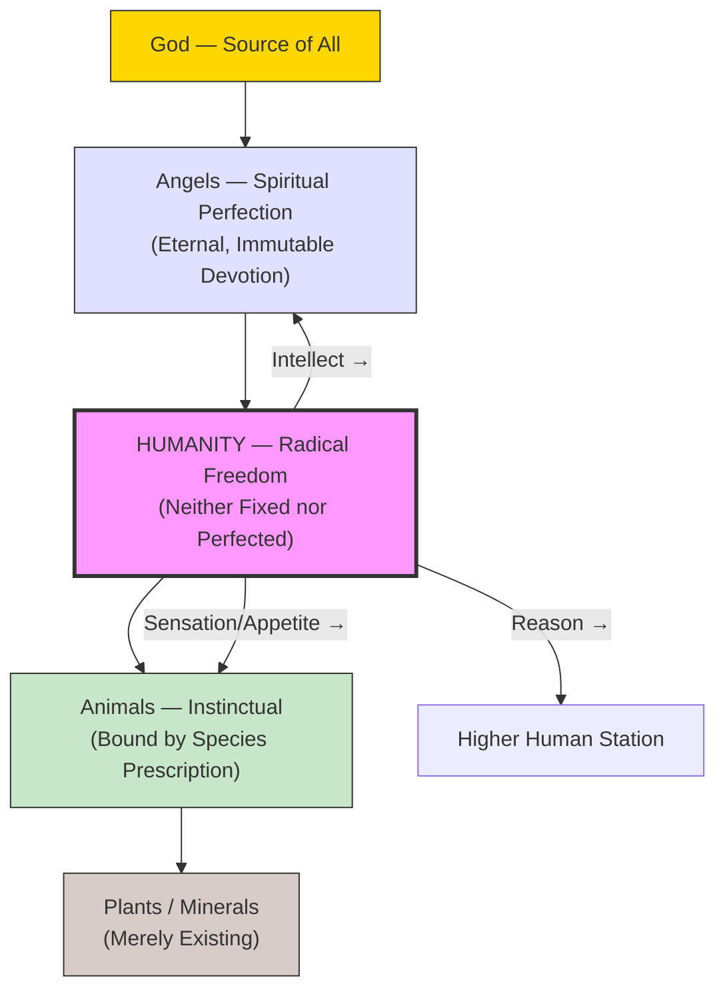

# Module 05: Giovanni Pico and the Dignity of Man

*Module 5 of 8*

---

In 1486, a twenty-three-year-old nobleman from the small Italian county of Mirandola arrived in Rome with an audacious plan. Giovanni Pico della Mirandola intended to defend nine hundred theses drawn from every philosophical and theological tradition he could find — Greek, Latin, Arabic, Hebrew, Chaldean — in a single public disputation. He had already composed an oration to open the event, a speech that would never be delivered at the intended gathering (Pope Innocent VIII condemned thirteen of the theses and the disputation was cancelled), but which would become one of the most celebrated texts of the Renaissance. The *Oration on the Dignity of Man* did something radical: it placed human freedom, not divine decree or natural constitution, at the center of what it means to be human. In doing so, Pico offered psychology its most optimistic charter — the claim that we are, in essence, chameleons, free to become whatever we choose.

---

## The Florentine Optimism

The Florentine humanists who shaped Renaissance thought shared a distinctive temperament: they were optimists. They believed in progress, in the capacity of human effort to improve the human condition, and in the idea that individuals could be agents of their own transformation. Marsilio Ficino had already laid important groundwork with his neo-Platonist synthesis, but Ficino's system retained a conservative, hereditarian quality — the soul's nature was in some measure fixed by its celestial origin. Pico took a different and bolder path.

Where Ficino saw fixed natures distributed across the cosmic hierarchy, Pico saw freedom. His *Oration* reimagined the entire created order as a graduated chain — minerals at the base, plants above them, animals higher still, then angels, and finally God — but with one extraordinary disruption: humanity was not assigned a fixed rung. God, Pico imagined, had completed the creation of every other being according to its prescribed nature, and then turned to the making of man with no template left:

> "On man when he came into life the Father conferred the seeds of all kinds and the germs of every way of life."

This was not merely theological poetry. It was a psychological claim of the first order. Pico was arguing that human nature is not determined in the way animal nature is determined. Animals are bound by instinct, fulfilling the narrow prescriptions of their species without deviation or choice. Angels, having attained spiritual perfection, are fixed eternally in their devotion to God. Humans alone occupy a position of radical indeterminacy — neither instinctive nor perfected, free to move in either direction along the moral and intellectual spectrum.

## The Chameleon Metaphor

Pico's most vivid formulation of this idea is the chameleon metaphor. Man, he writes, is God's chameleon — a creature whose nature is not given but made:

> "If sensitive, he will become brutish. If rational, he will grow into a heavenly being. If intellectual, he will be an angel and the son of God... Who would not admire this, our chameleon?"

The metaphor captures something psychologically profound. It suggests that the human being is not defined by a fixed essence but by a capacity for self-definition. The sensitive person — one who lives primarily through appetite and sensation — descends toward the animal. The rational person — one who employs logical thought and deliberation — ascends toward the angelic. The intellectual person — one who engages in contemplative, intuitive understanding — achieves something even higher, approaching union with the divine.

This is not simply a moral exhortation. Pico is advancing a psychological theory about the structure of human motivation and development. As individuals confront life's challenges, they can deploy different faculties: reason and intellect, which improve through exercise, or the more primitive apparatus of survival shared with lower forms. The choice, and the responsibility, is entirely theirs.

> [!TIP]
> **Pico's Chameleon and Modern Self-Determination Theory**
> Pico's claim that humans are uniquely free to shape their own nature anticipates Self-Determination Theory (Deci & Ryan, 2000), which holds that psychological well-being depends on the satisfaction of autonomy, competence, and relatedness — three needs that, when met, allow individuals to grow toward their fullest potential. Pico's "chameleon" is, in modern terms, a self-determining agent.

> [!TIP]
> **Freedom as Predisposition**
> Pico's argument that man is "predisposed to freedom" rather than to any particular end-state is a remarkably early articulation of what developmental psychologists call "open-ended development." Unlike animals whose behavioral repertoires are largely species-typical, humans exhibit prolonged plasticity — a point that connects Pico's Renaissance insight to modern neuroscience on cortical development and critical periods.

## Haeckel's Maxim and Pico's Psychology

Robinson draws an intriguing parallel between Pico's theory and Ernst Haeckel's famous maxim, "Ontogeny recapitulates phylogeny." The connection is not biological but structural. Haeckel claimed that the developmental stages of the individual organism replay the evolutionary history of the species. Pico's claim, transposed into psychological terms, is analogous: as each individual confronts life's challenges, they pass through — or choose among — levels of functioning that correspond to the broader hierarchy of creation. The person who lives by appetite recapitulates the animal. The person who lives by reason participates in the human. The person who lives by intellect approaches the angelic.

This is a developmental psychology in embryo. It suggests that growth is not automatic but requires effort and choice — that one must actively employ higher faculties to achieve higher stations. The implication is that stagnation and regression are as possible as progress, and that the outcome depends not on constitution or fate but on the individual's engagement with their own capacities.

> [!TIP]
> **Recapitulation as Psychological Metaphor**
> While Haeckel's biological recapitulation theory has been largely discredited, its psychological analogue persists. Piaget's stage theory, for example, proposes that individuals progress through qualitatively distinct modes of cognition. Pico's insight — that individuals can choose to operate at different levels of the hierarchy — adds a voluntarist dimension that Piaget's more automatic stage model lacks.

## Philosophical Syncretism

Pico's optimism extended beyond psychology to epistemology and metaphysics. He was convinced that all philosophical systems, when properly understood, ultimately agree on fundamental principles. This conviction drove the nine hundred theses project — an attempt to demonstrate the deep harmony among Plato and Aristotle, the Scholastics and the Arabians, the Kabbalists and the Church Fathers.

Where others saw contradiction, Pico saw complementarity. He did not reject Ficino's neo-Platonism; he assimilated it. He did not shun the skeptic; he engaged him in debate. He did not deny the Stoic doctrine of natural law's immutability; he simply excluded humanity from its reach, preserving freedom precisely where determinism seemed strongest. His method was not erasure but integration — taking the strongest elements of each tradition and weaving them into a coherent vision.

To the cynic who pointed at philosophers' notorious inability to agree, Pico offered a bold counter: Plato and Aristotle, Scotus and Thomas, Avicenna and Averroes — when properly understood, these thinkers were in substantial agreement. Their apparent contradictions were superficial, products of different emphases and vocabularies rather than genuine disagreements about the nature of reality.

This syncretic impulse has deep psychological significance. It reflects a belief that truth is not fragmented across traditions but unified, and that the human mind is capable of apprehending that unity. Pico's syncretism is, in a sense, a theory of cognition — an argument that reason, deployed properly, can reconcile apparent oppositions and arrive at comprehensive understanding.

> [!TIP]
> **Syncretism and Integrative Complexity**
> Pico's philosophical syncretism — his insistence that apparently contradictory systems can be harmonized — resonates with the construct of *integrative complexity* in contemporary political and cognitive psychology (Suedfeld & Tetlock, 1977). Individuals high in integrative complexity recognize multiple valid perspectives and synthesize them; those low in it see only black and white. Pico was, by this measure, a model of integrative thinking.

> [!TIP]
> **The Psychology of Intellectual Humility**
> Pico's willingness to engage every tradition — from Aristotle to the Kabbalah — without dismissing any outright reflects a form of intellectual humility that modern psychology associates with openness to experience (one of the Big Five personality traits) and with epistemic virtue. His approach anticipates contemporary arguments that intellectual progress requires genuine engagement with opposing viewpoints rather than straw-man dismissal.

## Man Between Beast and Angel: The Psychological Spectrum

The core of Pico's psychology can be represented as a spectrum — a vertical axis along which the human being is free to position themselves:

This diagram captures the essential structure. Humanity occupies the central, unstable position — the only point in the hierarchy that is not fixed. Every other being fulfills its nature automatically. Humans must *choose* their nature. This is both their glory and their burden: the freedom to ascend or descend, to become angelic or bestial, rests entirely on the exercise of their faculties.

The psychological implications are far-reaching. If human nature is not fixed, then the traditional Aristotelian definition of man as a "rational animal" is incomplete. Man is not defined by what he *is* but by what he *can become*. This is a teleology of possibility rather than essence — a vision that would resonate through centuries of psychological thought, from the Romantics' emphasis on self-creation to the existentialists' insistence that existence precedes essence.

## Gianfrancesco Pico and the Anti-Aristotelian Legacy

Giovanni Pico's influence extended beyond his own writings through his nephew, Gianfrancesco Pico della Mirandola (1469–1533). The younger Pico published the *Examen Vanitatis Doctrinae Gentium* in 1520, a work that mounted a sustained attack on Aristotle and on the Aristotelian tradition that dominated university philosophy. This work served as a model and inspiration for the next two centuries of anti-Aristotelianism — the intellectual movement that would eventually clear the ground for the new philosophy of the seventeenth century.

Gianfrancesco's critique was not merely negative. It built on his uncle's syncretic vision, arguing that Aristotle's system was not the final word on human nature and that the broader philosophical tradition offered richer, more adequate accounts of the human condition. In this sense, the anti-Aristotelian movement was itself an extension of Giovanni Pico's central insight: that human freedom and possibility cannot be captured by any single system, however comprehensive it may appear.

> [!TIP]
> **Anti-Aristotelianism and the Birth of Modern Psychology**
> The anti-Aristotelian tradition that Gianfrancesco Pico helped inaugurate was a necessary precondition for the emergence of modern psychology. Aristotle's biology and psychology — with their emphasis on fixed natures, teleological explanation, and species-typical behavior — had to be challenged before a science of individual difference, developmental change, and human freedom could take root. Giovanni Pico's *Oration* was one of the earliest and most eloquent challenges.

## Conclusion: The Charter of Human Freedom

Giovanni Pico della Mirandola's *Oration on the Dignity of Man* is not a work of psychology in any modern, technical sense. It is a philosophical and theological meditation on the place of humanity in the created order. Yet its psychological implications are profound and enduring. By locating human nature in freedom rather than essence, Pico opened a space for a psychology that takes seriously the capacity for self-transformation. By insisting that individuals can choose to operate at different levels — sensory, rational, intellectual — he anticipated developmental and humanistic approaches that emphasize growth, choice, and responsibility. And by arguing that all philosophical traditions ultimately converge on fundamental truths, he modeled the kind of integrative thinking that the study of the human mind requires.

The Florentine optimism that Pico embodied was not naive. It acknowledged the possibility of degradation — the chameleon can become brutish as well as angelic. But it insisted that the outcome is not predetermined, that the seeds of every way of life are present in each person, and that the exercise of reason and intellect can elevate human existence to its highest possibilities. This is, in the deepest sense, a psychological vision — one that continues to shape how we think about what it means to be human.

---

## References

- Deci, E. L., & Ryan, R. M. (2000). The "what" and "why" of goal pursuits: Human needs and the self-determination of behavior. *Psychological Inquiry, 11*(4), 227–268.
- Pico della Mirandola, G. (1486/1965). *On the Dignity of Man* (C. G. Wallis, Trans.). Bobbs-Merrill.
- Pico della Mirandola, G. F. (1520/1969). *Examen Vanitatis Doctrinae Gentium*. (Reprinted in modern editions.)
- Piaget, J. (1952). *The Origins of Intelligence in Children*. International Universities Press.
- Robinson, D. N. (1995). *An Intellectual History of Psychology* (3rd ed.). University of Wisconsin Press.
- Suedfeld, P., & Tetlock, P. E. (1977). Integrative complexity of communications in international crises. *Journal of Conflict Resolution, 21*(1), 169–184.

---

*Module 5 of 8 — Chapter 06: Nature and Spirit in the Renaissance*
