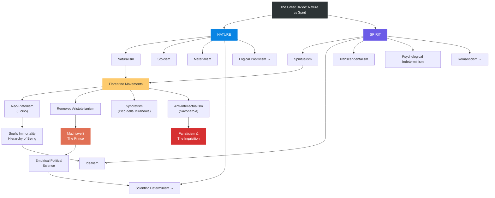

# Module 06: Nature vs Spirit — The Great Divide

> **Chapter 6 — Nature and Spirit in the Renaissance**
> *An Intellectual History of Psychology* (Robinson, 3rd Ed., 1995)
> Module 6 of 8

---

## The Perennial Categories

The entire history of discourse on human character — and by extension, on the proper method for studying human nature — may be summarized under two great headings: **Nature** and **Spirit**. Beneath the former cluster naturalism, Stoicism, materialism, and ultimately scientific determinism and logical positivism. Below the latter gather spiritualism, idealism, transcendentalism, psychological indeterminism, and Romanticism. These are not merely historical curiosities; they represent the permanent poles of a compass that every generation of thinkers must navigate.

What makes this division so remarkable is its persistence. Every century or so the balance of power shifts — one side gains ascendancy, the other retreats — but the essential positions remain stubbornly constant. The specific labels change: in the Hellenistic period the controversy was over the reality of Platonic Ideas; among the Scholastics it surfaced as the nominalist-realist antagonism; in the individualistic climate of the Renaissance it became a battle between neo-Platonists and Aristotelians; and in the eighteenth and nineteenth centuries it reappeared as the contest between "empiricism" and "idealism." But beneath the shifting terminology, the same fundamental question endures: Is human nature best understood as a product of material, observable forces, or does it point beyond itself to something transcendent?

> [!TIP]
> **The Persistence of the Nature-Spirit Divide**
> When studying any era's psychological thought, look first for the Nature-Spirit axis. Identifying where a thinker falls on this spectrum often reveals more than cataloguing their specific doctrines. The terminology shifts — materialism, empiricism, positivism on one side; idealism, transcendentalism, spiritualism on the other — but the underlying commitments remain remarkably stable across centuries.

---

## Aristotle's Shadow

To understand the Renaissance confrontation, one must first reckon with the extraordinary intellectual monopoly Aristotle had exercised for half a millennium. From roughly the fifth through the fifteenth centuries, the method of analysis was logic — specifically Aristotle's forms of demonstrative proof. Nature was described according to the Categories; truths were unearthed through the syllogism. This was Aristotle the rationalist, Aristotle the architect of formal reasoning, Aristotle who dominated the medieval curriculum so completely that he became known simply as "the Philosopher."

Yet this dominance came at a cost. The Aristotle of the *Historia Animalium* and other naturalistic works — the Aristotle who observed, catalogued, and drew empirical conclusions about the behavior of living creatures — was either ignored or never found during these centuries. Aristotle the ethologist and empiricist enjoyed only fleeting recognition by a handful of thinkers: Grosseteste, Roger Bacon, Duns Scotus. The Aristotelian tradition that ruled European thought was, in a profound sense, incomplete — it had inherited the logician but lost the naturalist.

From the earliest Patristic period, theologians had expressed concern about Aristotle's intellectual hegemony. Tertullian dismissed him as a mere pagan whose categories were irrelevant to Christian truth. Plotinus read him as something of an Epicurean — a philosopher of material substance unworthy of the highest metaphysical ambitions. With Augustine, Plato became the ancient of record, but philosophy itself was relegated to a secondary position on religious matters. Faith, not reason, was to be the foundation of Christian understanding.

The rediscovery of Aristotle in the twelfth and thirteenth centuries — through Arabic translations and commentaries, particularly those of Averroes — not only challenged the reigning Platonism but led to such veneration that his works soon served to arbitrate even questions of Scripture. Thomas Aquinas attempted to harmonize Aristotelian philosophy with Christian theology, producing one of the intellectual masterpieces of Western civilization. But by the fifteenth century, the faith Aquinas sought to defend through rational analysis had become, in many learned quarters, a mere branch of logic and rhetoric. Philosophy had not merely served theology; it had, in some quarters, supplanted it.

> [!TIP]
> **The Double Aristotle**
> Medieval Europe inherited only half of Aristotle — the logician of the *Organon* and the metaphysician of the *Categories* — while neglecting the empirical biologist of the *Historia Animalium*. This selective reception shaped the entire trajectory of Western thought. When Renaissance thinkers finally encountered the full range of Aristotle's works, the effect was destabilizing rather than enriching.

---

## The Four Florentine Movements

Within fifteenth-century Florentine intellectual circles, four distinct movements emerged in response to this Aristotelian legacy, each offering a different path for understanding human nature and the proper relationship between knowledge and truth.

**First**, there was a **revival of Platonism as a system**, promising to overcome Aristotelianism by returning to a philosophy that emphasized transcendent Ideas over material substance. Marsilio Ficino, under the patronage of Cosimo de' Medici, translated the complete works of Plato into Latin for the first time and established the Platonic Academy in Florence. For Ficino and his circle, Plato offered what Aristotle could not: a vision of reality that honored the soul's immortality, the hierarchy of being, and the ultimate intelligibility of the cosmos through participation in the Good.

**Second**, there was a **renewed Aristotelianism** equipped to meet neo-Platonist attacks. This was not a simple repetition of medieval scholasticism but an effort to recover Aristotle's full range — including his naturalistic and empirical works — and to demonstrate that his philosophy could account for the richness of human experience without recourse to Platonic abstractions.

**Third**, there was **Giovanni Pico della Mirandola's syncretism** — the audacious attempt to search all perspectives for truth and assimilate them into a grand Christian scheme. Pico's famous *Oration on the Dignity of Man* (1486) proposed that human beings occupy a unique position in the created order: without a fixed nature, free to shape themselves, capable of ascending to the divine or descending to the bestial. In his 900 Theses, Pico drew on Plato, Aristotle, the Hermetic tradition, Jewish Kabbalah, and Arabic philosophy, arguing that all genuine wisdom pointed toward the same underlying truth.

**Fourth**, there was a movement that was fundamentally **anti-intellectual** — away from books, argument, analysis, and proof. In its sincerest expression, this was Girolamo Savonarola's ceremonial "burning of the vanities," in which cosmetics, mirrors, musical instruments, and secular books were consigned to the flames as distractions from spiritual life. In its meanest form, it was the mob that burned Savonarola himself in 1498, turning the prophet of renunciation into a martyr of political violence.

> [!TIP]
> **Pico's Humanist Innovation**
> Giovanni Pico's syncretism was not merely eclectic borrowing. His claim that human beings have no fixed nature — that they are self-creating creatures positioned between angel and beast — represents one of the earliest and most radical statements of what would later become psychological indeterminism. This idea directly anticipates existentialist themes in the twentieth century: we are, as Sartre would later say, "condemned to be free."

---

## The Politicization of Philosophy

Between the extremes of piety and hatred stand figures like Lorenzo Valla and Gianfrancesco Pico, who demonstrate a crucial transformation in the intellectual landscape: philosophy had become relevant. Ideas had become politicized. Intellectuals had become warriors.

This was not merely an academic development. When philosophical positions carry political consequences, the stakes of intellectual disagreement change fundamentally. The authorities agreed to determine truth in their own manner: in 1478, the Spanish Inquisition was launched, establishing a precedent in which orthodoxy could be enforced not merely through argument but through institutional power, legal process, and ultimately violence. The philosopher's study was no longer a refuge from the world; it had become a site of political contestation.

The implications for the developing study of human nature were profound. If ideas about the soul, the will, and human dignity could be adjudicated by inquisitorial tribunals, then the freedom necessary for genuine inquiry was under threat. The Renaissance, which promised the liberation of the human mind, simultaneously created the apparatus for its suppression.

> [!TIP]
> **When Ideas Become Dangerous**
> The Spanish Inquisition of 1478 marks a watershed: the moment when philosophical positions about human nature could be treated as matters of legal and theological enforcement. This is not merely a historical curiosity — it illustrates a permanent risk in any society where intellectual inquiry touches on questions of power, identity, and authority. The psychology of belief has always been inseparable from the politics of belief.

---

## The Two Faces of Nature and Spirit

For two hundred years, Nature and Spirit would do battle across every domain of European culture. The Nature position affirmed man's dignity as a matter of record, his reason and power as nearly limitless, his body and artifices as beautiful, his life and city as reasonable, his mind as endlessly inquiring. The Spirit position offered an extra-terrestrial vision, a sense of wonder and fear, murky and ascetic renunciations of the material world.

Yet neither position was simple or pure. Nature and naturalism expressed themselves equally in art, architecture, political organization, and in ruthless exploitation of the weak, the dull, and the poor. Renaissance naturalism simultaneously elevated geometry to aesthetics and developed corruption and deceit to a science. The Aristotle of the *Metaphysics* could justify my success and your failure on the basis of final cause — the notion that everything has a purpose, and that the purpose of the inferior is to serve the superior. The Aristotle of the *Politics* and Plato's philosopher-king made Machiavelli's *Prince* almost syllogistically necessary.

---

## Machiavelli and the Logic of Power

Niccolò Machiavelli stands as the great exemplar of what happens when Nature's rationalism is applied without Spirit's moral constraints. His *Prince* (1513) is not, as popular caricature suggests, a manual for cruelty. It is something far more unsettling: a work of political science that derives practical maxims from the observation of human behavior as it actually is, rather than as it ought to be.

Machiavelli's method is fundamentally empirical. He observes how rulers acquire and maintain power; he identifies the regularities; he draws conclusions. When he advises the prince to be feared rather than loved, or to master the arts of deception, he is not celebrating wickedness — he is describing what works. The Aristotelian framework of final cause provides the philosophical justification: if the purpose of the state is stability and order, then the prince's actions must be judged by their effectiveness in achieving that end, not by their conformity to abstract moral principles.

This represents a crucial moment in the history of psychological thinking. Machiavelli effectively separates the descriptive from the normative, the "is" from the "ought" — a distinction that would become foundational for the development of scientific psychology centuries later. His portrait of human nature — acquisitive, fearful, easily manipulated, responsive to force and spectacle — would be echoed by Hobbes and, in modified form, by the behaviorist tradition.

---

## Spirit's Descent

Renaissance spiritualism reached the summit of the Christian ideal and sank to the depths of fanaticism. The contradictions within both Nature and Spirit would determine the diverging paths taken by philosophers in the seventeenth and eighteenth centuries and by psychologists in the nineteenth.

The poor and ignorant, compressed into bustling cities, had firsthand knowledge of what they were missing. Serving at the Banquet of Reason, they picked up fascinating morsels: human dignity, freedom of the will, final causes, necessary truths. These leftovers mixed poorly with Spirit. Final causes and necessary truths, when digested by those accustomed to simpler fare, create the sense of predestination and inevitability — the very opposite of the freedom they were meant to secure.

> [!TIP]
> **The Poverty of Abstraction**
> Robinson's observation about the "leftovers" of philosophy reaching the urban poor is a profound insight into how ideas transform as they move through social classes. Abstract doctrines of human dignity and free will, stripped of their philosophical context, could become instruments of fatalism and despair. This dynamic — ideas changing meaning as they change hands — remains central to understanding how psychological concepts function in popular culture.

---

## The Divide Illustrated

The following diagram maps the structural relationships between the Nature and Spirit traditions as they developed through the Renaissance period:

---

## The Legacy for Psychology

The Renaissance confrontation between Nature and Spirit established a template that would shape psychological inquiry for centuries to come. The Nature tradition, flowing through Machiavelli and later through Hobbes and the Enlightenment, would eventually produce the empirical, scientific approach to human behavior — the conviction that the mind, like the body, is a natural object subject to lawful regularities discoverable through observation and experiment.

The Spirit tradition, flowing through the neo-Platonists and later through Romanticism, would produce the conviction that human experience points beyond itself — that consciousness, meaning, and moral purpose cannot be reduced to material processes. This tradition would eventually inform the phenomenological and humanistic movements in psychology.

The contradictions Robinson identifies — naturalism that simultaneously elevates and exploits, spiritualism that simultaneously inspires and terrorizes — are not resolved by choosing one side. They are, rather, the permanent tensions within which psychological thinking must operate. The Renaissance did not settle the question of whether human nature is best understood through Nature or Spirit. It made the question inescapable.

> [!TIP]
> **The Unfinished Revolution**
> The Renaissance did not resolve the Nature-Spirit divide; it intensified it. Every subsequent development in psychological thought — from Hobbes's materialism to James's pragmatism, from Watson's behaviorism to Rogers's humanism — can be mapped onto this fundamental axis. Understanding the Renaissance confrontation is therefore not merely historical preparation; it is conceptual preparation for understanding the discipline itself.

---

## Key Terms

| Term | Definition |
|------|-----------|
| **Nature vs Spirit** | The perennial philosophical divide between materialist/empiricist and idealist/spiritualist approaches to understanding human nature |
| **Scientific determinism** | The view that all events, including human behavior, are determined by prior causes discoverable through scientific investigation |
| **Logical positivism** | A philosophical movement (previewed here) holding that meaningful statements must be either logically necessary or empirically verifiable |
| **Final cause** | Aristotle's concept that everything has a purpose or end toward which it naturally tends; used to justify social hierarchies |
| **Machiavelli** | Florentine political thinker whose empirical approach to power politics separated descriptive analysis from moral prescription |

---

## References

- Robinson, D. N. (1995). *An Intellectual History of Psychology* (3rd ed.). University of Wisconsin Press.
- Cassirer, E., Kristeller, P. O., & Randall, J. H. (Eds.). (1948). *The Renaissance Philosophy of Man*. University of Chicago Press.
- Machiavelli, N. (1513/1985). *The Prince* (H. C. Mansfield, Trans.). University of Chicago Press.
- Kristeller, P. O. (1961). *Renaissance Thought: The Classic, Scholastic, and Humanistic Strains*. Harper & Row.
- Pico della Mirandola, G. (1486/1965). *On the Dignity of Man* (C. G. Wallis, Trans.). Bobbs-Merrill.
- Ficino, M. (1482/2001). *The Book of Life* (C. Boer, Trans.). Spring Publications.

---

*Module 6 of 8 complete.*
