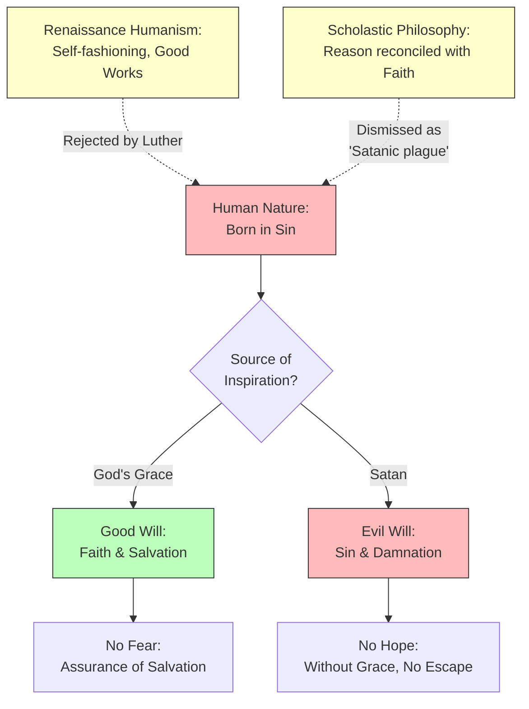

# Chapter 6 — Nature and Spirit in the Renaissance

## Module 7: Luther, Savonarola, and the Reformation

---

On the surface, Martin Luther and Girolamo Savonarola seem almost interchangeable. Both came from working-class families. Both entered the priesthood. Both were gifted students and avid readers of the classics. Both burned with passionate opposition to luxury, pomp, and clerical privilege. Both were defiant and belligerent. Neither gained materially from fame. Both were God-fearing Christians without a skeptical bone in their bodies.

But the resemblance runs deeper than biography. At a more profound level, both men were overcome by — and devoted to promoting — a mystical sense of life's meaning. Each instilled in the masses an intense hostility for all the trappings of high civilization. And each, in his own way, helped unleash forces that would reshape the psychological landscape of Western Europe.

To understand the Reformation as a psychological event — not merely a theological or political one — requires understanding these two figures not as abstract historical forces but as human beings whose inner lives became the engines of enormous cultural change.

---

## Savonarola: The Gladiator of God

Girolamo Savonarola (1452–1498) was a Dominican friar whose contempt for the Medici dynasty and the corruption of the Renaissance Church knew no limits. His rhetorical skill and the exemplary austerity of his life escalated him to de facto dictator of Florence — a remarkable ascent for a man whose only weapons were words and conviction.

Savonarola justified his actions on two grounds: Scripture and direct divine revelation. He claimed the authority to predict the fate of men and nations, drawing on what he described as visions granted to him by God. His most vivid inspiration was the apparition of a burning sword, commanding him to serve as God's gladiator. This was not metaphor for Savonarola. It was experience — as real to him as the cobblestones of Florence under his feet.

In 1497, he led the infamous "burning of the vanities" — a public conflagration of paintings, books, precious stones, cosmetics, and mirrors. These were not merely luxury goods in his eyes. They were symbols of an overly dignified humanity — of human beings who had presumed to elevate themselves through art and adornment rather than through submission to God. He imposed severe acts of denial on his clerical brothers, insisting that this model of self-mortification should be the standard for every Christian.

Here is the psychological core of Savonarola's project: the conviction that civilization itself is a form of vanity. The masterworks of Renaissance Florence — the paintings, the sculptures, the libraries — were not achievements to celebrate but temptations to destroy. The humanist project of Petrarch, Ficino, and Pico, which had sought to dignify human nature through learning and culture, was in Savonarola's eyes a satanic detour.

> [!TIP]
> **Stop and Think:** Savonarola's burning of the vanities was not random destruction — it was a carefully staged psychological event. What does it mean to destroy beauty in the name of virtue? Consider the psychology behind iconoclasm: Why does the deliberate destruction of cultural objects carry such emotional power, both for those who perform it and those who witness it? Can you identify modern parallels where material or cultural symbols are destroyed as acts of moral purification?

---

## Luther: The Psychology of Sin and Grace

Martin Luther (1483–1546) was directed to clerical life by a mystical experience of his own — a terrifying vision that left him, like Savonarola, with the unshakable conviction that he had been chosen for a divine mission. His poor origins, combined with these mystical experiences and an agile, restless mind, eventually located him as professor of theology at the University of Wittenberg.

Like Savonarola, Luther reviled the practice of taxing the poor to enrich the Church. The immediate catalyst for his break with Rome was John Tetzel's sale of indulgences — the practice whereby Christians could supposedly reduce their time in purgatory by purchasing certificates of forgiveness. Luther's Ninety-five Theses, nailed to the door of the Wittenberg church in 1517, were written in direct response to this practice.

But the Theses were merely the spark. At the core of a disagreement that would produce the Reformation were competing conceptualizations of Christianity itself — and at the heart of those competing conceptualizations lay fundamentally different views of human nature.

Luther's psychology is daringly straightforward. All he seeks to know about mankind can be found in the New Testament. Most of what he believes can ever be known is given by Paul. In his written debate with Erasmus on free will, he summarizes the contributions of Greek, Roman, and Scholastic philosophy as instances of the "plagues [Satan] has bred from philosophy."

Scripture tells Luther that God's will is the cause of all things. Therefore, the human will can count for nothing. This is not a casual theological preference. It is the foundation of an entire psychological system — one in which human agency is essentially an illusion, and the only question that matters is whether God has chosen to extend His grace to a particular soul.

> [!TIP]
> **Stop and Think:** Luther's denial of free will was not an abstract philosophical position — it was born from his own psychological torment. Luther reportedly suffered from what we would now call scrupulosity: an obsessive fear that he was not sufficiently righteous, that no amount of good works could ever earn salvation. His doctrine of predestination was, in part, a psychological solution to this torment. If salvation depends entirely on God's grace, then the anxious individual is freed from the impossible burden of earning it. Can you think of other cases where a psychological need has generated a philosophical or theological doctrine? Is this a weakness or a legitimate source of insight?

---

## The Attack on Reason

Luther's hostility toward philosophical reason went further than Petrarch's skepticism. Where Petrarch had gently dismissed Aristotle's account of happiness as inadequate, Luther declared war on Aristotle himself — and on the entire intellectual tradition that had elevated the philosopher to authority.

"What are the Universities, as at present ordered," Luther wrote, "but Schools of 'Greek fashion' and 'heathenish manners'... the blind heathen teacher, Aristotle, rules even further than Christ. My advice would be that the books of Aristotle be altogether abolished... God sent him as a plague for our sins."

This was not mere rhetoric. Luther meant it. The Scholastic tradition that had dominated European universities for three centuries was, in his eyes, a satanic corruption — a system in which human reason had presumed to sit in judgment over divine revelation. Aristotle, the architect of logical reasoning, was the chief architect of this corruption.

The fatalistic and predestinational refrains dominate Luther's reply to Erasmus:

*"What I am after in this dispute is to me something serious, necessary, and indeed eternal... Stop your complaining, stop your doctoring; this tumult has arisen and is directed from above."*

Here is the psychological import: for Luther, the debate about free will is not a debate at all. It is a settled question, settled by God Himself. To continue arguing is not intellectual persistence — it is spiritual presumption. Reason, applied to questions that God has already answered, becomes not a tool of inquiry but a symptom of sin.

> [!TIP]
> **Stop and Think:** Luther's dismissal of Aristotle anticipated a recurring pattern in the history of psychology: the periodic rejection of "armchair theorizing" in favor of some supposedly more authentic source of knowledge — whether revelation, experience, or experiment. Behaviorists dismissed introspection as unscientific. Psychoanalysts dismissed conscious reasoning as a defense mechanism. Each generation of psychologists has, in some form, declared that the previous generation's methods were "plagues bred from philosophy." Is this pattern a sign of progress, or of intellectual amnesia?

---

## Born in Sin: Luther's Psychological Foundation

Luther's psychology begins with a single, non-negotiable conviction: man is born in sin. This is not a metaphor or a theological abstraction. It is, for Luther, the most fundamental fact about human nature — more certain than any observation, more reliable than any argument.

Where medieval chivalry and Renaissance patronage had left room for good works — for the possibility that human beings could, through effort and virtue, contribute to their own salvation — Luther leaves none. His logic is ruthless: good works cannot be performed by an evil soul, and a good soul can be responsible for no evil. There is no middle ground. There is no gradual improvement. There is no ladder from sin to grace.

Central to Luther's psychology is the will. Our spiritual status is assessed in terms of intentions — intentions that are themselves inspired by either God or Satan. The will is not free. It is a battlefield. God's inspiration is grace. Without it, no hope exists. With it, no fear is warranted.

This creates a psychological framework of extraordinary starkness. There is no room for the Renaissance humanist's vision of the self-fashioning individual — Pico's chameleon who could choose to become whatever he wished. There is no room for the Ficinian project of elevating the soul through knowledge and practice. There is only the absolute dependence of the creature on the Creator.

*Figure 6.7: Luther's psychological framework — a stark division between grace and sin that leaves no room for the Renaissance humanist's vision of self-determination.*

---

## The Reformation as Psychological Event

The Reformation was, at its deepest level, a psychological revolution. It redefined what it means to be a human being — not in the Renaissance sense of celebrating human potential, but in the radical sense of reconfiguring the relationship between the individual and the absolute.

Luther's most politically consequential work, *On Christian Liberty*, was an inadvertent call to arms. Its central argument was deceptively simple: each Christian is spiritually free, answerable to God alone, requiring no priest, no bishop, no pope as intermediary. The message reached a large, eager audience — not because the masses had been waiting for a theology of grace, but because the political implications were revolutionary.

If each individual stands directly before God, then the entire apparatus of ecclesiastical authority — from the parish priest to the Roman pontiff — is unnecessary. And if the Church is unnecessary, then the feudal system that depended on the Church for its legitimacy is also threatened.

But Luther never intended a social revolution. When the Peasants' War erupted in 1524–1525 — when the German peasantry, inspired partly by Luther's rhetoric of spiritual freedom, rose up against their lords — Luther was furious. He quickly issued a polemic, *Against the Thievish, Murderous Hordes of Peasants*, calling on the princes to crush the rebellion without mercy.

Here is the contradiction that lies at the heart of the Reformation's psychological significance: the doctrine of spiritual freedom produced political authoritarianism. The insistence that each individual is answerable to God alone became, in practice, the insistence that each individual must submit to the secular authorities God had appointed. Freedom before God meant obedience before the state.

> [!TIP]
> **Stop and Think:** Luther's *On Christian Liberty* argued for the spiritual freedom of every believer, yet his response to the Peasants' War was a call for brutal suppression. Is this hypocrisy, or is it a coherent position? Consider the distinction Luther drew between spiritual and temporal authority. Can a person be "free" in one domain and entirely subject in another? How does this dual-structure of freedom and obedience compare to modern debates about the separation of "private belief" and "public behavior"?

---

## Luther's Contradictions and the Renaissance

Luther's life is an apt analogy for the contradictions of the Renaissance itself. His works bristle simultaneously with Dante's conservative awe toward monarchy and with Locke's dedication to liberal reform. They contain Pico's elevating recognition of every human soul alongside the Augustinian triviality of temporal affairs. They echo Valla's contemptuous rejection of Greek philosophy while preserving the Thomistic penchant for Aristotelian lines of reasoning.

This is not incoherence — or rather, it is the same incoherence that defines the Renaissance as a whole. The Renaissance was not a movement with a unified ideology. It was a collision of impulses: toward freedom and toward authority, toward reason and toward faith, toward the dignity of the individual and toward the submission of the individual to God.

Luther did not create the Reformation. He spoke its message. It was the message of an emerging class whose power was hundreds of years old but only recently sensed — the rising merchant and artisan class of northern Europe, who had outgrown the feudal structures that confined them but had not yet found the language to articulate their aspirations.

He never realized how far his spirit of rebellion would take the world. In opposing exploitation, he succeeded only by inducing even greater fear. As reason receded from debate, the rack, the stake, and the ax took over. The Reformation did not usher in an age of freedom. It ushered in an age of competing orthodoxies — each claiming divine authority, each willing to enforce that authority with violence.

> [!TIP]
> **Stop and Think:** Luther's contradictions — spiritual freedom paired with political authoritarianism, rejection of Church authority paired with insistence on biblical authority — are not merely personal failings. They are structural features of the Reformation itself. When one authority is overthrown, what determines whether the replacement is more or less liberating? Consider the psychological dynamics of rebellion: Does the act of rebelling against authority tend to produce people who respect freedom, or people who simply want to become the new authority? What does Luther's case suggest?

---

## The Reformation's Legacy for Psychology

The Reformation's psychological legacy extends far beyond Luther's specific doctrines. Three consequences deserve particular attention.

First, the Reformation intensified the interiorization of religious experience. By insisting that each individual stands directly before God, Luther made the inner life — the state of one's soul, the quality of one's faith — the central arena of human existence. This interiorization would eventually contribute to the development of modern introspective psychology, from Descartes's *cogito* to William James's *Varieties of Religious Experience*.

Second, the Reformation deepened the split between faith and reason that Petrarch had initiated. If Luther's attack on Aristotle was more extreme than Petrarch's, it was also more consequential. The universities of northern Europe, which had been modeled on the Scholastic tradition, were forced to reckon with a theology that declared their foundational texts to be satanic plagues. This created a vacuum that would eventually be filled by the new natural philosophy — the experimental science that would, by the seventeenth century, transform the European intellectual landscape.

Third, the Reformation established a model of psychological authority that persists to this day: the conviction that certain truths about human nature are accessible only through faith, revelation, or some form of direct experience — never through rational inquiry. This model would reappear in Romantic psychology, in existentialism, in the anti-intellectual strands of psychoanalysis, and in the contemporary suspicion of "overthinking."

The rack, the stake, and the ax — Luther's unintended legacy — were not merely instruments of political control. They were instruments of psychological control: tools for enforcing conformity of belief in an age when belief had become the most important thing about a person. When the stakes of inner conviction are eternal salvation or damnation, the pressure to conform becomes absolute. The Reformation did not free the human mind. It raised the psychological stakes of thought to their highest possible level.

---

> [!IMPORTANT]
> The Reformation, as seen through the lens of psychology, was not primarily a theological dispute about indulgences or the authority of the pope. It was a revolution in how human beings understood their own inner lives. Luther's doctrines of predestination and grace redefined the will as a battlefield between divine and demonic forces. His attack on reason elevated faith to the supreme psychological faculty. His insistence on individual spiritual freedom paradoxically produced new forms of authoritarian control. Understanding these dynamics is essential for understanding how psychology eventually emerged as a discipline that must constantly negotiate between the claims of faith and the claims of reason, between the authority of inner experience and the authority of rational inquiry.

---

The contradictions of the Reformation — freedom and authoritarianism, faith and reason, individual conscience and institutional control — would find their most extreme expression not in theology but in persecution. The same forces that drove Luther to attack the Church would drive others to attack suspected witches. The next module examines how the Renaissance psychology of sin and evil culminated in the witch trials — and what those trials reveal about the darkest possibilities of the human mind.

---

## References

Luther, M. (1517). *Ninety-five Theses*. In *Luther's Works* (Vol. 31). Fortress Press, 1957.

Luther, M. (1520). *On Christian Liberty* (*De Libertate Christiana*). In *Luther's Works* (Vol. 31). Fortress Press, 1957.

Luther, M. (1525). *Against the Thievish, Murderous Hordes of Peasants*. In *Luther's Works* (Vol. 46). Fortress Press, 1967.

Luther, M., & Erasmus, D. (1524–1525). *The Bondage of the Will* (*De Servo Arbitrio*) vs. *On the Freedom of the Will* (*De Libero Arbitrio*). In E. G. Rupp & B. Watson (Eds.), *Luther and Erasmus: Free Will and Salvation*. Westminster Press, 1969.

Robinson, D. N. (1995). *An Intellectual History of Psychology* (3rd ed.). University of Wisconsin Press.

Ozment, S. (1980). *The Age of Reform, 1250–1550: An Intellectual and Religious History of Late Medieval and Reformation Europe*. Yale University Press.

---

*Module 7 of 8 complete.*
