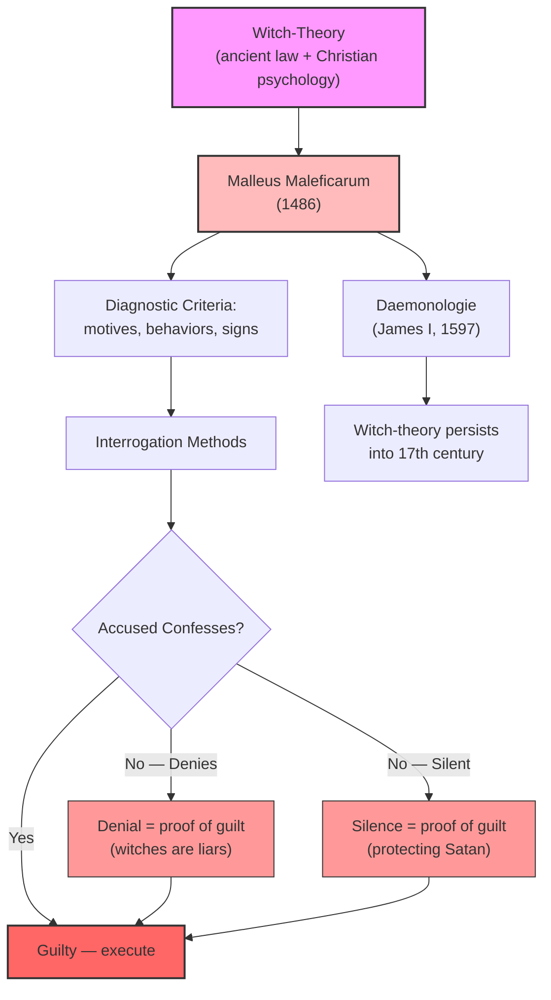
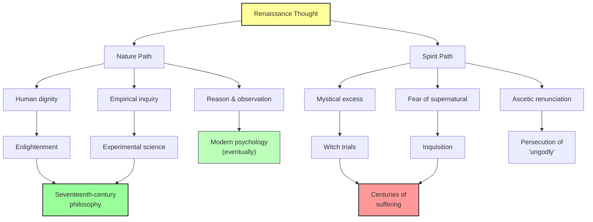

# Module 08 — The Witch Trials and Renaissance Psychology

**Chapter 6: Nature and Spirit in the Renaissance**
*An Intellectual History of Psychology* (Robinson, 3rd Ed., 1995)

---

## Learning Objectives

By the end of this module, you will be able to:

1. Explain why the witch trials belong to the Renaissance and early modern period, not the "Dark Ages."
2. Analyze the *Malleus Maleficarum* as a psychological document — a codified theory of persecution.
3. Describe the "witch-theory" as an amalgam of ancient legal principles and developed Christian psychology.
4. Articulate how the Nature/Spirit divide produced both enlightenment and fanaticism simultaneously.
5. Synthesize the Renaissance's dual legacy to psychology and bridge forward to Chapter 7.

---

## 1. The Chronological Shock: When Did the Witch Trials Happen?

Here is a fact that routinely surprises students, and that Robinson places with deliberate force: the fiercest chapters in the persecution and execution of witches occur **between 1400 and 1700**. This is *after* the so-called "Dark Ages" and "Middle Ages." The period of maximum witch-hunting overlaps with the Renaissance, the Elizabethan Age, and the Age of Newton.

This is not a trivial chronological correction. It demolishes one of the most comforting myths in intellectual history — the idea that superstition and persecution were medieval phenomena that the Renaissance gradually dispelled. The reality is precisely the opposite. The Renaissance *intensified* persecution. The same centuries that produced Michelangelo's Sistine Chapel and Copernicus's heliocentric model also produced the machinery for burning women at the stake.

The phenomenon was widespread across Europe. It was not confined to one region, one religious tradition, or one political system. Catholic and Protestant territories participated with equal enthusiasm. The witch trials were not an aberration — they were a central feature of early modern European culture.

> [!TIP]
> **Stop and Think:** We tend to associate the "Dark Ages" with superstition and persecution, and the Renaissance with enlightenment and progress. But the witch trials occurred *during* the Renaissance, not before it. What does this do to your mental timeline of intellectual progress? Is it possible that progress in art, science, and philosophy can coexist with — or even *enable* — systematic persecution?

---

## 2. The Malleus Maleficarum: A Psychology of Persecution

The handbook for the interrogation, trial, and punishment of witches was the **Malleus Maleficarum** (1486), written by Dominican Fathers **Heinrich Kramer** and **Jakob Sprenger**. More than a century later, King James I of England provided an echo in his own **Daemonologie** (1597). Both works rest on what Robinson calls the **"witch-theory"** — an amalgam of ancient legal principles and the developed psychology of the Christian West.

The *Malleus* is not merely a legal manual. It is a comprehensive psychological theory. It offers detailed accounts of how witches acquire their powers, what motivates them, how they think, how they recruit others, and how they can be detected. In modern terms, it is a diagnostic system — a set of criteria for identifying a class of persons deemed dangerous to the community, combined with a method for extracting confessions that confirm the diagnosis.

This is the key psychological insight: **the system was self-confirming**. The *Malleus* provided:

- A **theory of the accused's psychology** (they are motivated by malice, sexual desire, and allegiance to Satan)
- A **method of interrogation** designed to produce confessions consistent with that theory
- A **hermeneutic of resistance** — if the accused denies guilt, that denial is itself evidence of guilt (because witches are liars by nature)

The circularity is total. There is no response the accused can give that would count as evidence of innocence. Denial confirms guilt. Silence confirms guilt. Confession, extracted under torture, confirms guilt. The psychological architecture of the witch trial is a closed loop — a system that produces exactly the evidence it presupposes.

> [!TIP]
> **Stop and Think:** The *Malleus Maleficarum* created a system in which denial of guilt was treated as evidence of guilt. Can you think of modern contexts — in law, medicine, or everyday life — where this same circular logic operates? When someone's denial is interpreted as proof of the very thing they deny, what kind of epistemic trap has been created?

*Figure 6.8: The self-confirming logic of the witch trial — a closed psychological system in which no evidence can establish innocence.*

---

## 3. The Witch-Theory: Ancient Roots, Modern Consequences

Robinson's analysis reveals that the witch-theory was not a sudden invention of the Renaissance. It was an **amalgam** — a fusion of ancient legal principles with the specific psychological and theological commitments of the Christian West.

The ancient contribution was legal: the Roman concept of *crimen magiae* (the crime of magic) established that certain persons could be prosecuted for wielding supernatural powers against the community. This was not originally a religious idea — it was a civic one. Magic was dangerous not because it was heretical but because it threatened public order.

The Christian contribution was psychological and theological: the idea that human beings could enter into **compacts with Satan**, that the Devil actively recruited human agents, and that the spiritual warfare described in Scripture was literally occurring in the villages and towns of Europe. This transformed the ancient legal concept from a matter of public safety into a matter of cosmic significance.

The fusion was explosive. What had been a minor legal category became a comprehensive framework for understanding human evil. The witch was not merely a criminal — she (and the accused were overwhelmingly women) was a traitor to the human race, an agent of cosmic destruction, a being whose very existence threatened the spiritual order of the universe.

> [!TIP]
> **Stop and Think:** The witch-theory fused ancient legal concepts with Christian theology to create something more dangerous than either alone. This is a pattern worth recognizing: when a practical framework (law) merges with a totalizing worldview (theology), the result can be a system of persecution that feels both rationally justified and spiritually necessary. Can you identify other historical or contemporary examples where the fusion of practical authority and moral certainty produced systematic harm?

---

## 4. Nature and Spirit: The Diverging Legacies

Here we arrive at the central thesis of Robinson's chapter. The Renaissance created conditions for the witch-trial horror through the **convergence of Nature and Spirit** — and through their ultimate divergence.

**Nature**, with its emphasis on human dignity, reason, and empirical inquiry, could have led to enlightenment. And in many ways it did — the Renaissance's naturalistic orientation produced advances in anatomy, astronomy, navigation, and engineering. The humanist celebration of human capacity, the recovery of classical texts, the emphasis on observation and experience — all of these pointed toward a future of rational inquiry and human flourishing.

**Spirit**, with its mystical excesses, fear of the supernatural, and ascetic renunciations, led to persecution. The spiritual dimension of Renaissance thought — the Hermetic tradition, the revival of Neoplatonism, the apocalyptic anxieties of the Reformation — created a climate in which the invisible world was felt to be as real and as dangerous as the visible one. If demons were real, if Satan actively recruited human agents, if the spiritual order of the universe was under siege — then the persecution of witches was not cruelty. It was self-defense.

The tragedy is that these two legacies were not cleanly separated. They were intertwined in the same thinkers, the same institutions, the same historical moment. The Dominican order that produced the *Malleus Maleficarum* also produced Albertus Magnus, one of the great natural philosophers of the medieval period. The same culture that celebrated human dignity in Pico's *Oration* also burned human beings for consorting with demons.

*Figure 6.9: The Nature/Spirit divide — two paths emerging from the same Renaissance, leading to radically different destinations.*

> [!TIP]
> **Stop and Think:** Robinson argues that Nature and Spirit were not separate movements but intertwined dimensions of the same Renaissance culture. The same intellectual world that produced humanism also produced witch-hunting. What does this tell you about the relationship between "progressive" and "regressive" ideas? Are they always in opposition, or can they grow from the same root?

---

## 5. The Renaissance's Dual Legacy to Psychology

The chapter closes with an observation that functions as both a summary and a provocation: **the Renaissance preserved the worst of what was old and promoted the best of what was to be new.**

The worst of what was old: superstition, persecution, fear of the unknown, the willingness to destroy human beings in the name of spiritual purity. These were not Renaissance inventions — they are as old as civilization itself. But the Renaissance gave them new institutional forms, new intellectual justifications, and new tools of enforcement.

The best of what was to be new: individualism, empirical inquiry, human dignity, the conviction that human beings can understand and shape their own nature. These too had ancient roots — in Greek philosophy, in Roman law, in the humanistic traditions of multiple cultures. But the Renaissance brought them together in a way that made modern psychology possible.

This duality is the Renaissance's true legacy to psychology. Not a single achievement, not a unified theory, not a clean narrative of progress — but a **contradiction**. The same intellectual movement that empowered the individual also empowered the persecutor. The same culture that celebrated human dignity also systematically destroyed it.

For psychology, this means that the discipline's origins are not purely rational, not purely empirical, not purely humanitarian. Psychology was born in a world where reason and fanaticism, humanism and persecution, Nature and Spirit coexisted — and where the boundaries between them were never as clear as we might wish.

> [!TIP]
> **Stop and Think:** Robinson presents the Renaissance as a period that preserved the worst of the old and promoted the best of the new — *simultaneously*. If this is true, then the history of ideas is not a story of steady progress but of persistent contradiction. How does this view challenge the way psychology's own history is typically told — as a march from superstition to science? What contradictions within contemporary psychology might future historians identify?

---

## 6. The Bridge to the Seventeenth Century

The contradictions within Renaissance thought — between humanism and fanaticism, between reason and faith, between Nature and Spirit — did not resolve themselves. They were **inherited**. The seventeenth and eighteenth centuries would be shaped by the need to choose, or at least to navigate, between the diverging paths the Renaissance had opened.

Philosophers in the seventeenth century — Descartes, Hobbes, Locke, Spinoza — would each attempt, in different ways, to establish the foundations of knowledge on secure ground. Some would turn to reason alone; others to experience; others to a combination of both. But all were responding, directly or indirectly, to the Renaissance's unresolved tension between what can be known through Nature and what must be taken on faith through Spirit.

Psychologists in the nineteenth century would face a version of the same tension: Is the mind a natural object, subject to the same laws as the rest of nature? Or is it something irreducible — spiritual, free, beyond the reach of scientific method? The debate between Naturwissenschaften and Geisteswissenschaften, between natural science and human science, is the Renaissance's Nature/Spirit divide carried forward into the age of laboratories and statistics.

---

## Summary

| Concept | Key Idea |
|---------|----------|
| Chronological correction | Witch trials (1400–1700) occurred during the Renaissance, not the "Dark Ages" |
| *Malleus Maleficarum* | A self-confirming psychological system: denial of guilt = proof of guilt |
| Witch-theory | Amalgam of ancient Roman law and Christian theology; persecuted women as cosmic traitors |
| Nature vs. Spirit | Nature → enlightenment and science; Spirit → persecution and fanaticism |
| Dual legacy | The Renaissance preserved the worst of the old and promoted the best of the new *simultaneously* |

---

## References

Robinson, D. N. (1995). *An Intellectual History of Psychology* (3rd ed.). University of Wisconsin Press. Chapter 6.

Kramer, H., & Sprenger, J. (1486/1971). *The Malleus Maleficarum* (M. Summers, Trans.). Dover Publications.

James VI/I. (1597/1924). *Daemonologie*. In *The Workes of the Most High and Mightie Prince James* (pp. 1–79). Cambridge University Press.

Levack, B. P. (2006). *The Witch-Hunt in Early Modern Europe* (3rd ed.). Pearson Longman.

Midelfort, H. C. E. (1972). *Witch Hunting in Southwestern Germany, 1562–1684: The Social and Intellectual Foundations*. Stanford University Press.

Briggs, R. (1996). *Witches and Neighbours: The Social and Cultural Context of European Witchcraft*. HarperCollins.

---

*Module 8 of 8 complete — Chapter 6: Nature and Spirit in the Renaissance*

---

The Renaissance has given us individualism, empirical inquiry, and the conviction that human beings can understand their own nature. It has also given us the tools of persecution and the unresolved tension between reason and faith. But something is about to change. The seventeenth century will not simply inherit these contradictions — it will attempt to *settle* them. And the settlement will take a form that neither the Renaissance humanists nor the witch-hunters could have predicted: the radical proposal that all knowledge must begin not with tradition, not with Scripture, not with ancient authority, but with experience itself. The empiricists are coming — and psychology will never be the same.
