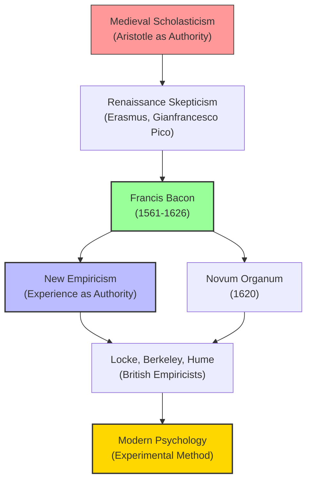

# Module 01 — Coming to Terms: What Empiricism Really Means

*Module 1 of 13 — Chapter 7: Empiricism: The Authority of Experience*

---

In 1605, a London lawyer with a taste for philosophy published a work that would quietly reshape the foundations of Western thought. Francis Bacon's *The Proficience and Advancement of Learning* was not a thunderbolt — it was more like a slow-building tide. But within its pages lay a claim so radical that it would take decades for its full implications to settle: that the authority of direct experience must replace the authority of ancient texts as the basis for all genuine knowledge. This was not merely a philosophical argument. It was a declaration of independence for the human mind — a demand that thinkers stop genuflecting to Aristotle and start investigating the world for themselves. And it launched a tradition that would eventually become the dominant voice in psychology: **empiricism**.

But what exactly *is* empiricism? If you have taken even a introductory course in philosophy, you have probably encountered the standard story: empiricism and rationalism are opposing camps. Empiricists believe all knowledge comes from experience; rationalists believe some knowledge is innate. John Locke fought Descartes, David Hume settled the score, and the British empiricists won the day. It is a clean narrative. It is also substantially wrong.

---

## The Myth of the Great Divide

The conventional framing of empiricism versus rationalism as a straightforward opposition is one of the most persistent myths in the history of ideas. As Robinson points out, there is "a largely undefended convention adopted by historians of psychology of presenting rationalism as the nearly mechanical 'cause' of empiricism and materialism." According to this story, Locke set out to demolish Descartes's theory of innate ideas, and the entire empiricist tradition was a long reply to rationalist claims.

The problem is that Locke never discusses Descartes in the *Essay Concerning Human Understanding*. Not once. And Descartes himself specifically denied that he held the theory of innate ideas with which he was later charged. The neat opposition is largely a retrospective invention — a textbook simplification that flatters our desire for tidy intellectual history.

The reality is far messier, and far more interesting. **Empiricism**, **rationalism**, and **materialism** have existed side by side throughout most of intellectual history. Very rarely is any one of them "utterly destitute of and uniformly hostile to features of the other two." Locke himself, supposedly the arch-empiricist, wrote extensively about "intuitive" knowledge and the "original acts of the mind." His treatment of moral knowledge reads, in places, like a rationalist manifesto.

> [!TIP]
> **Stop and Think:** Consider a belief you hold strongly — perhaps about fairness, or about what makes a good friend. Did that belief come entirely from experience, or does it feel as though it were somehow "always there"? The boundary between what we learn and what we bring to the table is not as clear as the textbooks suggest.

So why begin with empiricism if the opposition is overstated? Two reasons. First, empiricism is the dominant voice in contemporary psychology — its claims feel more familiar to modern readers. Second, the honor of being empiricism's "father" belongs to Francis Bacon, and Bacon's target was not rationalism but **Scholasticism** — the medieval tradition of treating Aristotle's writings as the final word on natural philosophy.

*Figure 1.1: The empirical tradition emerged not from opposition to rationalism, but from dissatisfaction with Scholastic authority.*

## What Empiricism Actually Claims

Strip away the mythology, and empiricism makes a set of specific, testable claims about the human mind. At its core, empiricism is "an overarching philosophy that confers epistemological authority on direct experience." It holds that:

1. The evidence of the senses constitutes the primary data of all knowledge.
2. Knowledge cannot exist unless this sensory evidence has first been gathered.
3. All subsequent intellectual processes must use this evidence — and only this evidence — in framing valid propositions about the real world.

These are not trivial claims. They assert that no amount of logical reasoning, divine revelation, or inherited wisdom can substitute for the direct investigation of nature. They assert that the mind, at birth, is furnished with nothing more than the capacity to receive and process sensory information. And they assert that everything we call "knowledge" — from the laws of physics to the principles of morality — must ultimately trace its origins back to experience.

> [!TIP]
> **Stop and Think:** Think about how you learned to recognize the emotion of anger on someone's face. Was there a moment when someone explained it to you logically, or did you gradually learn it through repeated exposure? The empiricist would argue that every concept you possess was built from such encounters — one experience at a time.

But empiricism is not simply a theory about where ideas come from. It is also a theory about how the mind works. The leading empiricists — Bacon, Locke, Berkeley, Hume — all based their epistemologies on what they took to be the fixed dispositions of the mind. Their philosophies were "explicitly designed to account for the facts of mental life." In other words, they were doing psychology before the discipline existed.

## The Shared Ground: Mentalism

Here is a point that surprises many students: empiricists and rationalists shared a fundamental commitment that would survive unchallenged until the twentieth century. Robinson calls this common feature **mentalism** — the assumption that philosophy's primary task is to account for the facts of mental life.

Both traditions agreed that the mind is furnished by the senses (empiricists) or that the mind brings its own structure to experience (rationalists). But both agreed that the proper subject of investigation is the mind itself — its ideas, its operations, its dispositions. Neither tradition was anti-mental. The empiricists were not, despite later caricatures, denying the existence of mental life. They were arguing about its *origins*.

This shared mentalism is why the empiricist tradition could produce such rich psychological theorizing. Locke's *Essay* is, at its heart, a work of psychology — an investigation into how ideas are formed, how they combine, and how they give rise to knowledge. Hume's *Treatise of Human Nature* is subtitled "Being an Attempt to introduce the experimental Method of Reasoning into Moral Subjects." These were not philosophers ignoring the mind; they were philosophers putting the mind at the center of their inquiries.

> [!TIP]
> **Stop and Think:** The word "psychology" did not exist as a discipline in Bacon's or Locke's time. Yet their investigations into perception, memory, and reasoning are recognizably psychological. What does it mean that psychology existed as a set of questions before it existed as a formal field of study?

## The Renaissance Roots

Empiricism did not spring fully formed from Bacon's brow. Its roots lie in the Renaissance — specifically, in the Renaissance's complex relationship with Aristotle and the Scholastic tradition that claimed to inherit his mantle.

When historians say that the modern era of science began when Aristotle's authority was overcome, they are "generally referring to the emergence of an experimental attitude and the suspension of purely logical approaches to discovery." But this experimental attitude was not entirely new. Aristotle himself possessed it in abundance. What changed was the *motive* behind experimentation.

Aristotle's empirical perspective was that of the "detached, disinterested observer of nature" — a man content to catalog the varieties of animals and describe the makeup of the physical world. Renaissance empiricism, by contrast, was driven by a different impulse: "the motive to control and manipulate nature, to make nature conform and obey, to change the world." This difference — between observing nature and *mastering* it — accounts for the otherwise surprising connection between science and technology in the Renaissance, and for Greek science's indifference to technological application.

> [!TIP]
> **Stop and Think:** Modern science is often praised for its "pure" curiosity — the desire to understand nature for its own sake. But Bacon's empiricism was explicitly practical: knowledge was valuable only insofar as it improved human life. Is this a strength or a limitation of the empirical approach?

The Renaissance was "philosophically conservative and scientifically radical." The seventeenth century reversed this pattern. And the figure who most clearly embodied the reversal was Francis Bacon — a man who, as Robinson puts it, "announced the modern era and Francis Bacon attempted to define it."

## Empiricism's Practical Spirit

One more feature distinguishes the new empiricism from its Scholastic predecessors: its pragmatic orientation. Bacon's ultimate standard for evaluating any undertaking was simple: can it do people good in the daily affairs of life? "If the project can do people little or no good in the daily affairs of life, there is the strongest presumption that it is worthless."

This was a specific rejection of the Reformation theology that depreciated the value of human works. In Bacon's system, "usefulness and worthiness are synonymous." Knowledge is not valuable because it brings us closer to God (though Bacon believed it did that too), but because it alleviates human suffering and improves the human condition.

This pragmatic spirit — the insistence that ideas must prove their worth in practice — would become one of the defining features of the empirical tradition. It would eventually flower into the American pragmatism of William James and John Dewey, and into the behaviorist demand that psychology produce practical, measurable results.

> [!TIP]
> **Stop and Think:** Consider the research that gets funded today versus the research that does not. Medical studies receive billions; pure mathematics struggles for support. Is this Bacon's pragmatic legacy at work? Or is something lost when we demand that knowledge justify itself in terms of immediate usefulness?

The empiricism that Bacon launched was not, then, a simple rejection of the past. It was a redirection — a shift from reverence to investigation, from authority to experience, from contemplation to action. And it set the stage for the extraordinary intellectual developments that followed: Locke's psychology of ideas, Berkeley's immaterialism, Hume's skepticism, and Reid's common-sense realism.

---

## Speaking of Empiricism...

- You practice empiricism every time you test a recipe by tasting it rather than trusting the cookbook's claim that it is "perfect."
- A doctor who orders blood tests rather than relying solely on a patient's self-diagnosis is applying Bacon's principle: investigate, do not assume.
- When a friend insists that their political views are "just common sense," they are — whether they know it or not — channeling the empiricist tradition's suspicion of abstract reasoning.

---

The empiricist tradition that Bacon inaugurated would soon produce its greatest architect: John Locke, a physician-turned-philosopher who would attempt something no one had tried before — to trace every idea in the human mind back to its origins in experience. What he found, and what he could not find, would shape psychology for centuries.

---

## References

- Robinson, D. N. (1995). *An Intellectual History of Psychology* (3rd ed.). University of Wisconsin Press. Chapter 7.
- Bacon, F. (1605/1878). *The Proficience and Advancement of Learning*. In *The Works of Francis Bacon*, Vol. I. Hurd and Houghton.
- Locke, J. (1690/1956). *An Essay Concerning Human Understanding*. Henry Regnery Co.

---

*Module 1 of 13 — Chapter 7: Empiricism: The Authority of Experience*
