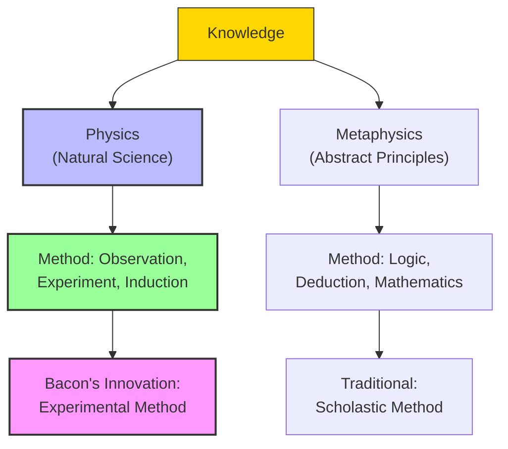

# Module 02 — Francis Bacon and the New Organ of Knowledge

*Module 2 of 13 — Chapter 7: Empiricism: The Authority of Experience*

---

In 1621, the Lord Chancellor of England was brought before Parliament on charges of accepting bribes. Francis Bacon, Baron Verulam, the most powerful legal officer in the realm, did not deny the charges. He confessed. He was fined £40,000, imprisoned in the Tower of London briefly, and banished from court for life. It was a spectacular fall — and yet, within a few years, the disgraced chancellor would be remembered not for his corruption but for his philosophy. Bacon's *Novum Organum*, published just a year before his fall, would become one of the founding documents of modern science. The man who could not resist a bribe also could not resist the truth: that the pursuit of knowledge, properly conducted, was the highest calling of the human mind.

---

## The Man and His Moment

Francis Bacon (1561–1626) was born into the English aristocracy, the son of Sir Nicholas Bacon, Lord Keeper of the Great Seal under Elizabeth I. The younger Bacon rose through the legal profession with remarkable speed: attorney, member of the Privy Council, Lord Keeper himself, and finally Chancellor of the Realm under James I. He was, in the language of his time, a man of business — practical, politically shrewd, and deeply embedded in the machinery of government.

But Bacon was also a man of ideas. And the ideas that consumed him were not the theological disputes that dominated his era but a more fundamental question: *why does human knowledge not advance?* Why, after centuries of scholarship, were the educated classes still mired in the same errors, the same superstitions, the same fruitless debates that had occupied the Schoolmen of the Middle Ages?

The answer, Bacon believed, lay not in the poverty of the human intellect but in the corruption of the methods by which knowledge was pursued. The Scholastic tradition — the intellectual inheritance of medieval Christianity — had turned Aristotle into a dictator. His writings were consulted "with such diffidence as to be unwilling to add a line or a reservation to Greek or Roman teaching." Knowledge derived from Aristotle, exempted from the liberty of examination, would "not rise again higher than the knowledge of Aristotle."

> [!TIP]
> **Stop and Think:** Think of a field you know well — perhaps cooking, or sports, or music. How much of what you "know" came from authorities (teachers, textbooks, traditions) versus your own direct investigation? Bacon would argue that authority, unchecked, becomes a ceiling on understanding.

## The Advancement of Learning

Bacon's first major work, *The Proficience and Advancement of Learning* (1605), was published in the early years of James I's reign. It was, in many ways, a young man's book — ambitious, optimistic, and deliberately provocative. Its project was manifold: to identify the principal causes of enduring ignorance and disagreement; to locate true authority in intellectual matters; to outline areas of inquiry about which little is known; and to present methods able to accommodate the foregoing.

On the question of method, the *Advancement* proves to be a skimpy text. But on the question of *standards*, Bacon was crystal clear. The value of any undertaking is assessed in terms of its potential benefit to the human race. "If the project can do people little or no good in the daily affairs of life, there is the strongest presumption that it is worthless." Knowledge exists to serve humanity, not the reverse.

This was not merely a philosophical preference. It was a specific disavowal of the Reformation theology that depreciated the value of human works. In Bacon's system, "usefulness and worthiness are synonymous." He made this explicit in a passage that still carries the flavor of the Hermetic tradition:

> "But the greatest error of all the rest is the mistaking or misplacing of the last or furthest end of knowledge. For men have entered into a desire of learning and knowledge... seldom sincerely to give a true account of their gift of reason, to the benefit and use of men... for the glory of the Creator and the relief of man's estate."

> [!TIP]
> **Stop and Think:** Bacon argued that knowledge should be judged by its practical benefits. Is this a dangerous standard? Consider pure mathematics, or astronomy, or poetry — fields whose practical value is not immediately obvious. Does Bacon's pragmatic criterion risk impoverishing human understanding?

## The Critique of Scholasticism

Bacon's complaints against the Scholastic tradition were specific and surgical. He did not reject the ancients — he praised Aristotle often, as well as other leading philosophers. His target was the *disciples*, not the masters. "The complaint, then, is not with the ancients but with their disciples."

Three specific intellectual vices drew his fire:

1. **Stultifying reverence for antiquity** — the unwillingness to question or extend the work of the Greek and Roman masters.
2. **Verbal obscurantism** — the tendency to fall in love with words rather than the things they represent. "Words are but the images of matter.... [T]o fall in love with them is all one as to fall in love with a picture."
3. **Superstition and gullibility** — the popular reliance on astrology, natural magic, and alchemy as substitutes for genuine investigation.

These were not abstract philosophical errors. They were practical obstacles to the advancement of learning. And they were deeply entrenched in the institutions — the universities, the Church, the courts — that controlled intellectual life in early modern Europe.

> [!TIP]
> **Stop and Think:** Bacon accused his contemporaries of being "more interested in the words and the grammatical style of the older writers than in the very matters which" those writers addressed. Consider modern academic culture: how much of what passes for scholarship is really about debating interpretations of canonical texts rather than investigating the world directly?

## Bacon's Division of Knowledge

Perhaps the most modern notion in the *Advancement* was Bacon's insistence on dividing natural science into two branches: **physics** and **metaphysics**. The issues in physics, he argued, should be treated with methods different from those purely logical devices normally employed in metaphysical analysis. Mathematics should be reserved for metaphysical matters — placing Bacon squarely against the rationalist (neo-Platonist) tradition that sought to comprehend nature through number theories and harmonic relationships.

This division was not merely organizational. It was methodological. Bacon was arguing that the study of the natural world requires a different *kind* of thinking than the study of abstract principles. Logic alone cannot tell you how the body works, or why the seasons change, or what causes disease. These things must be *investigated*, not deduced.

*Figure 2.1: Bacon's division of knowledge — physics requires experiment, not just logic.*

## The Invention of Psychology

The portion of the *Advancement* that concerns us most directly is Bacon's treatment of "Human Philosophy or Humanity" — a subject that, in his hands, became something recognizably close to psychology. Bacon divided human knowledge into two parts: that which considers "man segregate, or distributively" and that which considers him "congregate, or in society."

The first of these — the study of the individual — includes "knowledges which respect the Body, and of knowledges that respect the Mind." Bacon is clear that both are necessary, and that "the one discloseth the other and how the one worketh upon the other." This is, in embryo, the program of modern psychology: to understand the relationship between mind and body, between mental states and physical conditions.

For human knowledge concerning the mind, Bacon identifies two branches: "the one that enquireth of the substance or nature of the soul or mind, the other that enquireth of the faculties or functions thereof." The first addresses the origin of the soul and its relationship to matter; the second addresses how the mind actually works — its operations, its capacities, its limitations.

> [!TIP]
> **Stop and Think:** Bacon invented the disciplines of theoretical and experimental psychology without naming them. He proposed studying the mind's faculties through observation and experiment — exactly what modern cognitive psychology does. Why do you think it took another two centuries for psychology to emerge as a formal discipline?

## Nature, Habit, and the Alterability of Human Conduct

Bacon's own psychological theories were surprisingly nuanced. He was persuaded that everyone can be identified in terms of several innate characteristics or temperaments — that "some minds are proportioned to great matters, and others to small." These inherent determinants include sex, age, nationality, disease, constitutional deformity, and beauty. The environmental determinants include sovereignty, wealth, and fortune.

But Bacon was not a rigid nativist. He distinguished between the fixed laws of mere matter and those governing human conduct. The latter, he argued, are not "peremptory" but provide a certain "latitude." Since virtue and vice are "only or largely habits," it is possible to create virtuous citizens by a proper regimen. Human nature is alterable through practice, reward, and punishment.

This is a crucial distinction. A stone hurled in the air a thousand times "will not learn to ascend." But human beings are not stones. They are responsive to their environments, capable of learning, and subject to the shaping influences of education and experience. Bacon's empiricism was, in this sense, a psychology of possibility — not unlimited possibility, but possibility nonetheless.

> [!TIP]
> **Stop and Think:** Bacon believed that human nature has both fixed and malleable components. Modern psychology debates the same question under the heading of "nature versus nurture." How much of who you are do you think is determined by your biology, and how much by your experiences? Does the answer matter for how we should design schools, prisons, or workplaces?

## Speaking of Bacon...

- A pharmaceutical company that tests a new drug through randomized controlled trials is applying Bacon's *experimenta fructifera* — experiments designed to bear practical fruit.
- When a manager says "let's not overthink this — let's try it and see what happens," they are channeling Bacon's impatience with purely logical approaches to practical problems.
- The modern university's division between the humanities (which interpret texts) and the sciences (which investigate nature) echoes Bacon's distinction between metaphysics and physics.

---

Bacon's vision was grand, but his method was vague. It would take the *Novum Organum* — his mature work — to spell out exactly how the experimental method should work. What he proposed there was not just a philosophy but a *procedure*: a systematic way of investigating nature that, he believed, would yield truths more reliable than anything Aristotle had ever produced.

---

## References

- Robinson, D. N. (1995). *An Intellectual History of Psychology* (3rd ed.). University of Wisconsin Press. Chapter 7.
- Bacon, F. (1605/1878). *Of the Proficience and Advancement of Learning*. In *The Works of Francis Bacon*, Vol. I. Hurd and Houghton.
- Bacon, F. (1620/1878). *Novum Organum*. In *The Works of Francis Bacon*, Vol. I. Hurd and Houghton.

---

*Module 2 of 13 — Chapter 7: Empiricism: The Authority of Experience*
