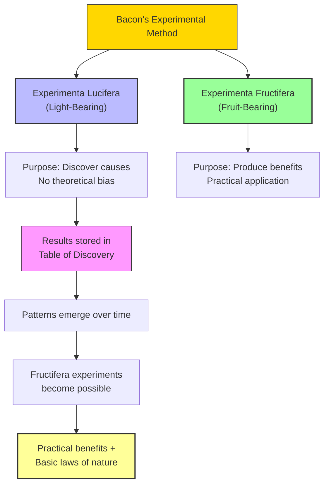

# Module 03 — Bacon's Novum Organum and the Experimental Method

*Module 3 of 13 — Chapter 7: Empiricism: The Authority of Experience*

---

In 1620, the same year that a group of English Separatists would set sail on the Mayflower, Francis Bacon published a book that was, in its own way, just as revolutionary. The *Novum Organum* — "The New Instrument" — was written as a direct challenge to Aristotle's *Organon*, the logical treatise that had governed European thought for nearly two thousand years. Where Aristotle had offered syllogisms and deductive reasoning as the tools of discovery, Bacon offered something different: a systematic method for investigating nature through observation, experiment, and careful induction. It was not a gentle suggestion. It was a hostile takeover.

---

## The Structure of the New Instrument

The *Novum Organum* is written as two books of aphorisms — 130 in the first book, 52 in the second. Book I is the manifesto: brilliant, witty, and always challenging. It dismantles the pretensions of the Scholastic tradition with surgical precision, exposing the "Idols" — the systematic errors of thinking — that prevent human beings from understanding the natural world.

Book II is the method itself. And here, Robinson notes, the work is "rather pretentious, even half-baked" — a collection of "veiled theories, Hermetic innuendos, Scholastic distinctions, and labels." Had only Book II survived, "more than one Ph.D. dissertation would have been needed to establish precisely what the 'Baconian' method was." Fortunately, Book I exhumes the method from the crypt.

The core of Bacon's complaint against existing science is captured in a passage of devastating clarity:

> "Now for grounds of experience — since to experience we must come — we have as yet had either none or very weak ones. Nothing duly investigated, nothing verified, nothing counted, weighed or measured, is to be found in natural history: and what in observation is loose and vague, is in information deceptive and treacherous."

This is not a philosopher speaking in abstractions. This is an indictment. Bacon is accusing the entire intellectual establishment of failing to do the most basic work of science: collecting data carefully, verifying claims against evidence, and measuring what can be measured.

> [!TIP]
> **Stop and Think:** Bacon's complaint about "nothing duly investigated, nothing verified, nothing counted, weighed or measured" could be leveled at much of what passes for knowledge today. Think about the health advice you encounter on social media, or the political claims you hear on the news. How often are they backed by careful investigation?

## Two Kinds of Experiment

Bacon's method distinguished between two types of experiment, each with a Latin name that reveals its purpose. **Experimenta lucifera** are experiments that "shed light" — they are designed to discover the natural causes of effects, without any bias toward producing a particular outcome. **Experimenta fructifera** are experiments that "bear fruit" — they are designed to produce practical benefits for humanity.

The distinction is crucial. The *experimenta lucifera* are "utterly devoid of a theoretical bias on the experimenter's part." They are simple inquiries into elementary cause-effect sequences. And they have, Bacon insists, "one admirable property and condition: they never miss or fail. For since they are applied, not for the purpose of producing any particular effect, but only for discovering the natural cause of some effect, they answer the end equally well whichever way they turn out."

This is a profound insight. An experiment designed to test a specific hypothesis can "fail" — the hypothesis can be disconfirmed. But an experiment designed simply to *discover what causes what* cannot fail, because every outcome is informative. The experiment either confirms the expected cause or reveals an unexpected one. Either way, knowledge advances.

*Figure 3.1: Bacon's two-track method — light-bearing experiments build the foundation; fruit-bearing experiments harvest the results.*

## The Table of Discovery

The *experimenta lucifera*, modest in aim and "useless by themselves," produce findings to be stored in the **Table of Discovery** — a collective repository of verified observations to which other scientists can refer. Over time, as the Table fills in, the patterns become visible. The searching questions become obvious. Then the *experimenta fructifera* become possible, and their results are "not only of great benefit to humanity but also unearth the basic and inviolable laws of nature."

Bacon's vision is remarkably modern. He is describing, in seventeenth-century language, something very close to the way contemporary science actually works. Individual studies accumulate in journals and databases. Meta-analyses reveal patterns that no single study could detect. And from these patterns, general principles emerge — principles that can then be applied to practical problems.

> [!TIP]
> **Stop and Think:** Bacon imagined a collective "Table of Discovery" where scientists would pool their findings. Today we have PubMed, Google Scholar, and institutional databases. Has the internet fulfilled Bacon's vision? Or has the sheer volume of information created new problems he could not have anticipated?

## The Scope of the Method

One of the most striking features of Bacon's method is its ambition. He did not intend it for physics alone. He envisioned it applied to *everything* — including the human mind:

> "If I form a history and tables of discovery for anger, fear, shame, and the like; for matters political; and again for the mental operations of memory, composition, and division, judgment and the rest; not less than for heat, and cold, or light, or vegetation, or the like."

This passage is extraordinary. Bacon is proposing that the same experimental method used to study heat and light should be applied to anger, fear, memory, and judgment. He is, in effect, calling for the creation of an experimental psychology — two and a half centuries before Wundt opened his Leipzig laboratory.

> [!TIP]
> **Stop and Think:** Modern science depends on shared databases where researchers deposit their findings — PubMed, arXiv, institutional repositories. Bacon imagined something remarkably similar with his Table of Discovery. Has the internet fulfilled his vision, or has information overload created new obstacles to the advancement of learning?

## The Critique of Aristotle

Bacon's complaint against Aristotle is not that the ancient philosopher was wrong about specific facts, but that his *method* was fundamentally misguided. Aristotle busied himself "merely with noting and naming rather than searching for causes." Overwhelmed by the importance of his final causes, Aristotle "mixed metaphysics with physics or, worse, failed to develop natural physics by treating its subject matter in a metaphysical way."

The distinction is between *cataloging* and *explaining*. Aristotle was a magnificent cataloger — his *Historia Animalium* remains a monument of observational skill. But he did not ask *why* things are the way they are. He did not search for efficient causes — the mechanical, material processes that produce observable effects. Instead, he appealed to final causes — purposes, ends, goals — which, however philosophically interesting, do not tell you how things actually work.

Had Aristotle discovered the experimental approach, Bacon argues, "he would not have spent his time on a merely historical assessment of the animal kingdom, identifying the types of animals found in different places at different times. Instead he would have inquired into the physical (efficient and material) causes of the variety."

> [!TIP]
> **Stop and Think:** Consider a modern example. A biologist cataloging the species in a rainforest is doing Aristotelian science. A biologist testing whether a specific chemical compound affects the growth rate of a particular fungus is doing Baconian science. Both are valuable. But Bacon would argue that only the second kind produces *actionable* knowledge. Is he right?

## The Courage to Continue

The *Novum Organum* is not merely a methodological treatise. It is, in places, a work of emotional persuasion. Bacon understood that the greatest obstacle to the progress of science is not ignorance but *despair*:

> "But by far the greatest obstacle to the progress of science and to the undertaking of new tasks and provenances therein, is found in this — that men despair and think things impossible."

This exhortation was not idle rhetoric. Bacon was writing in an age of profound pessimism. The fatigue of the Reformation, the cooling of Renaissance achievement, the collapse of governments, poverty, hunger, plague, and civil wars — all conspired to convince educated Europeans that humanity was in decline. The metaphysical poet John Donne could only lament:

> "The world did in her cradle take a fall, / And turn'd her braines, and tooke a generall maime, / Wronging each joynt of th' universall frame."

Bacon's *Novum Organum* was as much a rejoinder to this mood as it was a detached exercise in scientific scholarship. He was telling his contemporaries: the world is not ending. Knowledge is possible. Progress is real. But it requires work — patient, systematic, humble work.

## Methodological Empiricism

Bacon's empiricism was, Robinson notes, "of a limited sort." He was committed to the view that human psychology bears the indelible stamp of hereditary influence. External conditions could produce changes in human conduct, but only of "a limited variety and degree." His was "decidedly not a behavioristic empiricism. It was rather a methodological empiricism."

This is an important distinction. Bacon was not arguing that human beings are blank slates, infinitely malleable by experience. He was arguing that the *method* of investigation — observation, experiment, induction — should be applied to all subjects, including human nature. The method is empirical; the subject matter may have innate components.

> [!TIP]
> **Stop and Think:** Bacon believed in both innate temperaments AND the experimental method. This seems contradictory — how can you experiment on something that is fixed? But consider modern genetics: we accept that genes influence behavior while also believing that scientific investigation can reveal how those influences work. Bacon's "methodological empiricism" anticipated this balanced position.

## Speaking of Bacon...

- The clinical trial — the gold standard of medical evidence — is a direct descendant of Bacon's *experimenta fructifera*: experiments designed to bear practical fruit.
- When a data scientist builds a model by first collecting thousands of observations, then testing patterns on new data, they are following Bacon's two-track method almost exactly.
- Bacon's insistence that science should "relieve man's estate" anticipated the mission statements of organizations like the World Health Organization and the Gates Foundation.

---

Bacon gave the empirical tradition its method. But method alone does not make a psychology. It would take John Locke — a physician, diplomat, and political theorist — to transform Bacon's methodological vision into a systematic account of how the human mind actually works. What Locke proposed was both simpler and more radical than anything Bacon had imagined: that every idea in the mind can be traced back to a single source — experience.

---

## References

- Robinson, D. N. (1995). *An Intellectual History of Psychology* (3rd ed.). University of Wisconsin Press. Chapter 7.
- Bacon, F. (1620/1878). *Novum Organum*. In *The Works of Francis Bacon*, Vol. I. Hurd and Houghton.
- Bacon, F. (1605/1878). *Of the Proficience and Advancement of Learning*. In *The Works of Francis Bacon*, Vol. I. Hurd and Houghton.

---

*Module 3 of 13 — Chapter 7: Empiricism: The Authority of Experience*
