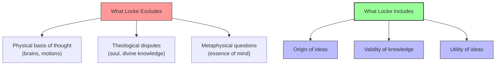

# Module 04 — John Locke and the Essay Concerning Human Understanding

*Module 4 of 13 — Chapter 7: Empiricism: The Authority of Experience*

---

In the winter of 1670, a group of friends gathered at the London home of Lord Shaftesbury to discuss a question that had troubled philosophers for centuries: what can the human mind actually know? Among them was a quiet, precise physician named John Locke — a man whose careful habits of mind had already earned him a reputation as someone who could untangle the most knotted arguments. The conversation turned, as it often did in those days, to the foundations of morality and the principles of natural religion. And Locke, as he later recalled, found himself unable to make progress. The problem, he decided, lay not in the difficulty of the questions but in the failure to examine the instrument with which all questions must be answered: the human understanding itself. That night, he later wrote, was the birth of the *Essay Concerning Human Understanding* — a work that would take twenty years to complete and would permanently alter the course of Western philosophy.

---

## The Opponents on Both Sides

Locke's *Essay* was not written in a vacuum. It was shaped by two intellectual forces that, though hostile to each other, were even more hostile to the empiricism Locke would advance.

The first was **skepticism** — a revived form of ancient Pyrrhonism that was, in Locke's time, "on the verge of becoming the new Scholasticism." Joseph Glanvill's *Scepsis* and *Lux Orientalis* had revived "an almost ancient form of contempt for what presented itself as human understanding." The Doomsday pessimism of Bacon's age was evolving into Know-Nothingism — the conviction that nothing can be known with certainty.

The second opponent was **rationalism** — the Continental tradition of Descartes, Spinoza, and Leibniz, which held that certain fundamental truths are known through reason alone, independent of experience. Cambridge in Locke's time was hosting a revived form of Platonism, replete with anti-empiricist arguments.

Locke set out to challenge and replace both positions. His mission, as he stated it in the Introduction to the *Essay*, was clear:

> "If we can find out those measures whereby a rational creature, put in that state which man is in this world, may and ought to govern his opinions and actions depending thereon, we need not be troubled that some other things escape our knowledge."

> [!TIP]
> **Stop and Think:** Locke was surrounded by skeptics who believed nothing could be known and rationalists who believed reason alone could unlock the universe. He chose a middle path. Have you ever found yourself caught between two extreme positions — one too pessimistic, the other too confident — and looked for a third way?

## What the Essay Is Not About

One of the most striking features of the *Essay* is what it deliberately excludes. Unlike Hobbes and Descartes, Locke is "completely neutral on the question of the biological or physical factors that may be responsible for the character of mental states and activities." He specifically avoids all questions regarding the physiological basis of thought:

> "I shall not at present meddle with the physical consideration of the mind, or trouble myself to examine wherein its essence consist or by what motions of our spirits, or alterations of our bodies, we come to have any sensation by our organs, or any ideas in our understanding."

The *Essay* is not about brains, motions, or theological disputes. It is about **the human understanding** — which, for Locke, is "no more than the ideas possessed by the mind and reflected on by it." This deliberate narrowing of scope is both the work's strength and its limitation. By bracketing the physical basis of thought, Locke could focus on the *structure* of mental life. But he also left open questions about the relationship between mind and body that later philosophers — especially Berkeley and Hume — would exploit.

*Figure 4.1: Locke's deliberate scope — he brackets the physical to focus on the mental.*

## The Two Sources of Ideas

Locke's central claim is that all ideas come from exactly two sources: **sensation** and **reflection**.

Sensation is straightforward: it is "the sensory apprehension of the particular objects of the physical world." We do not sense "universals," "species," "truths," or "principles" — we sense *things* and only things. The organs of sense engage the material stuff of the world, and the mind receives the resulting impressions.

Reflection is more complex. It is the mind's ability to examine its own contents — to take the materials furnished by sensation and inspect them, combine them, compare them. Reflection includes not only the mind's examination of its deposited sensations but also its examination of its *operations* — the effects of the passions on our ideas, the processes of reasoning and remembering.

Together, sensation and reflection provide the raw materials from which all knowledge is constructed. There is, Locke insists, no third source. No innate ideas, no divine revelations deposited at birth, no rational principles that exist prior to experience.

> [!TIP]
> **Stop and Think:** Consider the concept of "justice." Where did your understanding of justice come from? The empiricist would say: from specific experiences of fairness and unfairness, reflected upon and combined into a general concept. The rationalist would say: from an innate moral sense that precedes experience. Which account feels more accurate to your own experience?

## Active Perception

One of the most important — and often overlooked — features of Locke's psychology is his insistence that perception is not a passive process. It is, rather, "an active transaction between the observer and the knowable world."

Locke makes this point through a simple but powerful example. He speaks of the inattentive man who, while inspecting an object of interest, is oblivious to a variety of sounds — "despite the fact that there is no defect in his sense of hearing." For perception to occur, the mind must be *directed* to the object. The ears receive the sound waves, but the mind must attend to them for hearing to take place.

This is a remarkably modern insight. Contemporary cognitive psychology distinguishes between sensation (the raw input from sensory organs) and perception (the mind's interpretation of that input). Locke anticipated this distinction by three centuries. The mind is not a camera, passively recording whatever falls within its range. It is an active agent, selecting, attending, and interpreting.

> [!TIP]
> **Stop and Think:** Consider the concept of justice. Where did your understanding of justice come from? The empiricist would say: from specific experiences of fairness and unfairness, reflected upon and combined into a general concept. The rationalist would say: from an innate moral sense that precedes experience. Which account feels more accurate to your own experience?

> [!TIP]
> **Stop and Think:** Locke's tabula rasa has been enormously influential and enormously controversial. Modern behavioral genetics shows that many psychological traits are substantially heritable. Does this disprove Locke, or does it merely refine his claim?

## The Tabula Rasa

Locke's most famous claim — and the one that would generate the most controversy — is his rejection of innate ideas. He argues that "we enter the world as a tabula rasa" — a blank slate — "and that all we will come to know is furnished by experience."

He allows for the possibility that the fetus, once its sensory apparatus has taken form, may experience rudimentary sensations and therefore may enter the world with certain primitive ideas. But "on no account can such ideas, if they exist, be considered innate." Since knowledge is of particular, material things, and since the infant could not possibly have had experience with such things prior to birth, "there can be no sense in which the infant has 'ideas.'"

Nor, for that matter, can an adult have ideas about that with which the senses have had no commerce. This is not merely a philosophical claim — it is a psychological one. It asserts that the mind's contents are entirely determined by its history of interactions with the world. Everything you know, everything you believe, everything you value — all of it can, in principle, be traced back to specific experiences that furnished the raw materials from which your ideas were constructed.

> [!TIP]
> **Stop and Think:** Locke's tabula rasa has been enormously influential — and enormously controversial. Modern behavioral genetics suggests that many psychological traits are substantially heritable. Does this disprove Locke? Or does it merely show that the "blank slate" was a useful starting point, even if not literally true?

## The Empirical Psychology

Locke's *Essay* is not merely an epistemological treatise. It is, at its core, a work of psychology — an investigation into how the mind operates, how ideas combine, and how knowledge is formed. His empirical psychology is "associationistic, even in the mechanical sense," but it "never denies those mental attributes of human psychology which everyone senses oneself to possess."

He does not advance the crude associationism that Pavlov would later recommend, nor the materialistic psychology of the ancient Epicureans. He does not reduce perception to the mere activation of sense organs. He insists, throughout, that the mind is an active participant in the process of knowing — that understanding requires not just the reception of sensory data but the mind's deliberate engagement with that data.

This is why Locke's empiricism could accommodate concepts like "intuitive knowledge" and "original acts of the mind" without contradiction. He was not denying that the mind has characteristic ways of operating. He was denying that these ways of operating are *innate ideas* — fully formed concepts deposited in the mind at birth. The mind has capacities, but it does not have contents prior to experience.

## Speaking of Locke...

- A newborn baby recognizes its mother's voice within hours — but not the word "mother." Locke would say the baby has the *capacity* for recognition (a natural faculty) but not the *idea* of motherhood (which requires experience).
- When you learn a new skill — say, playing guitar — you start with simple sensations (the feel of the strings, the sound of each note) and gradually build complex ideas (chord progressions, musical patterns). This is Locke's psychology in action.
- The debate over whether intelligence is "nature or nurture" is essentially a replay of Locke's argument with the nativists. The modern consensus — that both matter — would have surprised neither Locke nor his opponents.

---

Locke had established that all ideas come from experience. But this raised an immediate and troubling question: if everything we know is built from sensation, what happens when sensation gives us contradictory or incomplete information? How can we trust our knowledge of the world if the world we know is entirely constructed from the raw materials of perception? The next step in the empiricist journey — Locke's theory of simple and complex ideas — would take this question head-on.

---

## References

- Robinson, D. N. (1995). *An Intellectual History of Psychology* (3rd ed.). University of Wisconsin Press. Chapter 7.
- Locke, J. (1690/1956). *An Essay Concerning Human Understanding*. Henry Regnery Co.
- Yolton, J. W. (1970). *Locke and the Compass of Human Understanding*. Cambridge University Press.

---

*Module 4 of 13 — Chapter 7: Empiricism: The Authority of Experience*
