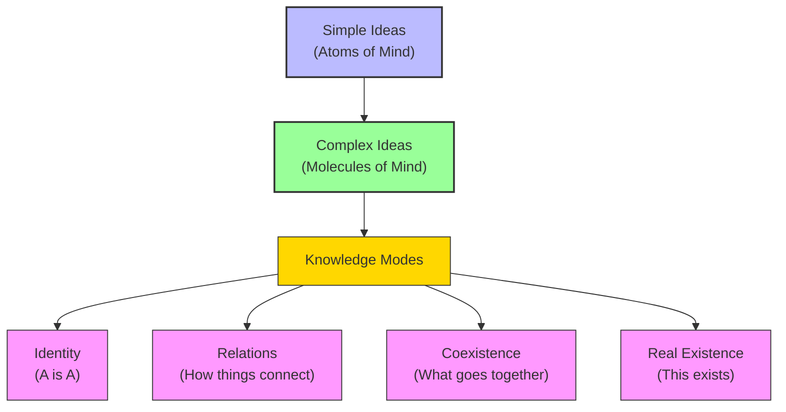

# Module 05 — Locke's Theory of Ideas: Simple, Complex, and the Molineux Problem

*Module 5 of 13 — Chapter 7: Empiricism: The Authority of Experience*

---

In 1693, the Irish scientist William Molineux sent John Locke a thought experiment that would puzzle philosophers for the next three centuries. Imagine, he wrote, a man born blind who has learned to distinguish a cube from a sphere by touch alone. Now suppose this man is suddenly given sight. Could he, *before touching them*, tell which object on the table is the cube and which is the sphere? Molineux's own answer was a confident "Not." Locke agreed. And in that agreement lay one of the most provocative claims in the history of psychology: that the knowledge we gain through one sense cannot be transferred to another without new experience.

---

## Building Blocks of the Mind

Locke's psychology begins with a distinction so fundamental that it has shaped every empiricist theory since. All ideas, he argues, are either **simple** or **complex**.

**Simple ideas** are the atoms of mental life. They are "not fictions of our fancies, but the natural and regular productions of things without us really operating upon us." When you see the color red, or feel the warmth of a fire, or taste the sweetness of honey, you are having a simple idea. These ideas are the direct, unanalyzable products of sensation. The mind cannot invent them; it can only receive them.

**Complex ideas** are the molecules. They are built from simple ideas through the mind's own operations — combining, comparing, abstracting. The idea of "a rainbow" is complex: it combines simple ideas of color, shape, and spatial location. The idea of "justice" is even more complex: it abstracts from countless experiences of fairness, unfairness, authority, and consequence.

The critical point is that no matter how complex our ideas become, "they remain rooted in experience and nurtured by the reflective faculty." To say that we know is no more than to say that we have ideas. And all ideas, without exception, trace their origins back to the simple materials furnished by sensation.

> [!TIP]
> **Stop and Think:** Try to imagine a color you have never seen. You cannot. This is Locke's point: the mind cannot create simple ideas; it can only receive them from experience and combine them into complex ones. What does this tell you about the limits of human imagination?

## The Four Modes of Knowledge

Once the mind has ideas, it can know things about them. Locke identifies four ways in which ideas can be related — four modes of knowledge:

1. **Identity** — the recognition that what is, is. A thing cannot be and not be at the same time. "Black is not white." This is the most basic form of knowledge — the "first act of the mind."

2. **Relations** — the mind's awareness that certain ideas are connected. Mass and weight are related; telephone numbers and annual rainfall are not. This is the knowledge of *how things stand to each other*.

3. **Coexistence** — what we would now call correlation. The word "gold" signifies color, malleability, weight, and other properties that we associate through habitual experience. When the word is uttered, we know these properties by their co-occurrence.

4. **Real existence** — the direct awareness that something exists. "That is an apple." This is the most concrete form of knowledge — the simple recognition of present reality.

*Figure 5.1: From simple ideas to complex knowledge — Locke's architecture of understanding.*

## Three Degrees of Certainty

Not all knowledge is equally certain. Locke orders the confidence we can place in our knowledge along a spectrum with three levels:

**Intuitive knowledge** is the most certain. It is "the sudden, undeliberated awareness of a truth." A circle is not a triangle. Black is not white. No reasoning is required; the truth is immediately apparent. Anyone who seeks to discredit the certainty of this form of knowledge, Locke warns, "has a mind to be a skeptic."

**Demonstrative knowledge** is the next level. It requires reasoning — the step-by-step connection of ideas through logical proof. The theorem that two triangles with equal bases constructed between parallel lines are equal is demonstrative. It can be proved, and once proved, it is known to be certainly true. But unlike intuitive knowledge, demonstrative certainty may come only *after* the proof.

**Sensitive knowledge** is the least certain — and the most common. It is our knowledge of particular, physical objects: "Big Ben is in London," "This apple is red." Sensitive knowledge is reliable enough for practical purposes but lacks the ironclad certainty of intuition or demonstration.

> [!TIP]
> **Stop and Think:** Consider the claim "I am reading these words right now." Is that intuitive, demonstrative, or sensitive knowledge? Locke would say it is a combination — the existence of the words is sensitive knowledge, but your awareness of your own reading is intuitive. How do these different types of certainty interact in your daily experience?

## Molineux's Problem

The thought experiment that Molineux proposed to Locke — and that Locke endorsed — strikes at the heart of empiricist psychology. A man born blind has learned, through touch alone, to distinguish a cube from a sphere. He knows what each shape *feels* like. Now he is given sight. Can he, *without touching them*, identify which is which?

Locke's answer is no. And the reason is profound: "he has not yet had the experience, that what affects his touch so or so, must affect his sight so or so." The knowledge gained through touch is *specific to touch*. It cannot be transferred to another sense without new experience. The blind man knows what a cube feels like; he does not know what a cube *looks* like. These are different ideas, furnished by different senses, and the mind cannot bridge the gap between them without the benefit of experience.

This claim has been tested experimentally — and the results are complex. Studies of individuals who gain sight after congenital blindness show that, initially, they cannot identify objects by sight alone. But with practice and experience, they learn to connect visual and tactile information. The learning is not instantaneous; it requires the very experience that Locke predicted.

> [!TIP]
> **Stop and Think:** Think about learning to read music. You first learn to associate a written note with a specific sound. But could you *visualize* the sound just by looking at the notation, without ever having heard it played? Locke's answer — and Molineux's — suggests that sensory knowledge is always tied to the specific sense that produced it.

## Simple Ideas as Representations

How do simple ideas relate to the external world? Locke's answer introduces a crucial distinction. Simple ideas are **representations** — they correspond to the physical properties of the objects that produce them. The idea of whiteness "exactly answers that power which is in any body to produce it there." Simple ideas have "all the real conformity it can or ought to have with things without us."

Complex ideas, however, are different. They are "archetypes of the mind's own making" — they are not copies of external objects but constructions built from simple ideas. The complex idea of "a writing instrument" is not a direct perception of a physical object; it is a mental construct formed from simple ideas of shape, color, function, and purpose. Whether such an instrument is meaningful, or is a weapon, or is used by a literate society "depends on actual practices."

This distinction between simple ideas (representations) and complex ideas (archetypes) is one of Locke's most important contributions. It allows him to maintain that knowledge is grounded in experience while also acknowledging that the mind is capable of creative construction. We do not merely mirror the world; we *build* our understanding of it from the raw materials of sensation.

> [!TIP]
> **Stop and Think:** If knowledge is the perception of agreement among ideas, then two people with different experiences might have genuinely different knowledge of the same reality. Is this a problem? Or is it simply the human condition?

## Knowledge as the Perception of Agreement

Locke's definition of knowledge is deceptively simple: "Knowledge is nothing but the perception of the connection of and agreement, or disagreement and repugnancy, of any of our ideas."

This means that knowledge is always *about ideas* — not about things in themselves. We do not know the world directly; we know our ideas of the world, and we know how those ideas relate to each other. This is not skepticism — Locke is not saying that our ideas fail to represent reality. He is saying that the *medium* of knowledge is ideas, and that philosophy's task is to understand how ideas are formed, combined, and validated.

> [!TIP]
> **Stop and Think:** If knowledge is "the perception of agreement among ideas," then two people with different experiences might have genuinely different knowledge of the same reality. Is this a problem? Or is it simply the human condition?

## Speaking of Locke...

- When you learn a new language, you start with simple ideas (individual words) and gradually build complex ideas (grammatical structures, idiomatic expressions). This is Locke's psychology of ideas in action.
- A chef who combines simple flavors (salt, acid, fat, heat) into a complex dish is doing exactly what Locke says the mind does with simple ideas: combining them into something greater than the sum of its parts.
- The Molineux problem has modern echoes in debates about artificial intelligence: can a system trained only on text understand what a cat looks like? Locke would say no — not without visual experience.

---

Locke had established that all ideas come from experience, and that knowledge is the perception of agreement among ideas. But this raised a deeper question: if our ideas are all built from sensation, what is the relationship between the ideas in our minds and the physical objects that produce them? Are the colors we see, the sounds we hear, the textures we feel — are these properties of the objects themselves, or products of our own perception? Locke's answer would divide the world in two — and open a door that Berkeley and Hume would walk through.

---

## References

- Robinson, D. N. (1995). *An Intellectual History of Psychology* (3rd ed.). University of Wisconsin Press. Chapter 7.
- Locke, J. (1690/1956). *An Essay Concerning Human Understanding*. Henry Regnery Co.
- Molyneux, W. (1693). Letter to John Locke. In Locke, *Essay*, Book II, Chapter IX.

---

*Module 5 of 13 — Chapter 7: Empiricism: The Authority of Experience*
