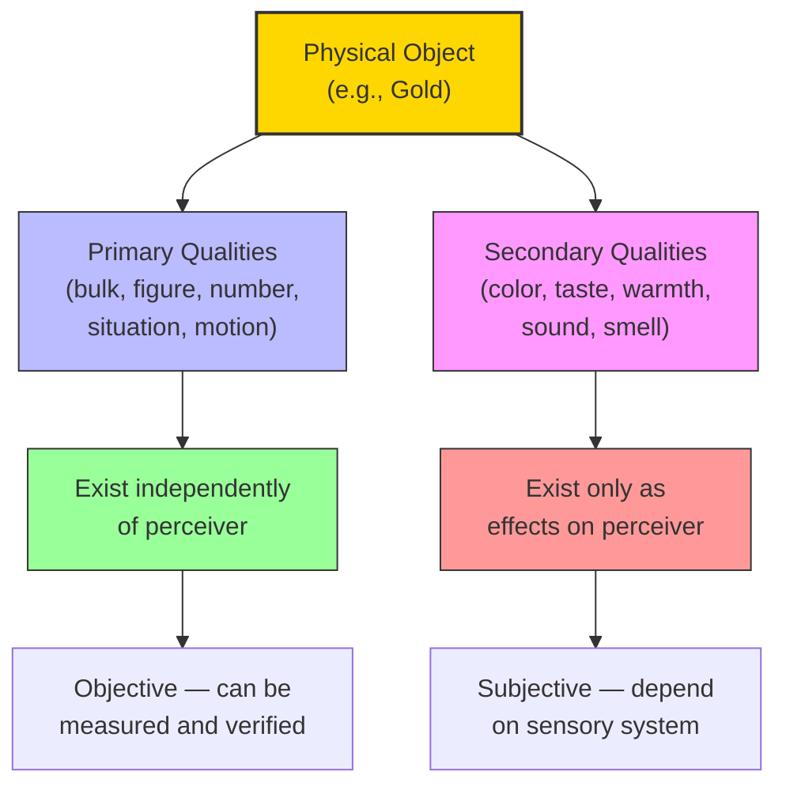

# Module 06 — Primary and Secondary Qualities: Locke's Great Divide

*Module 6 of 13 — Chapter 7: Empiricism: The Authority of Experience*

---

Imagine holding a ripe mango. You feel its weight, its smooth skin, its slightly yielding surface. You see its golden-yellow color. You smell its sweet fragrance. Now ask yourself a question that seems simple but turns out to be devastating: which of these properties belong to the mango itself, and which are products of your perception? The weight, Locke would say, is real — it exists in the object whether or not you are there to feel it. But the yellow color? The sweetness of the smell? These are trickier. They exist, Locke argues, only insofar as they produce effects in a perceiving mind. This distinction — between **primary** and **secondary** qualities — is one of the most consequential ideas in the history of psychology. It draws a line through the middle of reality and raises a question that has never been fully answered: how much of what we experience is really "out there"?

---

## The Objective World: Primary Qualities

Locke's distinction begins with a claim about what exists independently of the perceiver. **Primary qualities** are "discovered by our senses, and are in [things] even when we perceive them not; such as the bulk, figure, number, situation, and motion of the parts of bodies, which are really in them, whether we take notice of them or no."

These are the properties that belong to the object itself — properties that would exist even if no one were there to perceive them. A rock has mass whether or not anyone lifts it. A cube has six faces whether or not anyone counts them. The primary qualities are, in a sense, the *objective* features of the physical world — the features that science can investigate, measure, and describe without reference to the observer.

This is a powerful claim. It asserts that there is a real, physical world "out there" — a world that exists independently of our experience of it. And it asserts that our senses, however imperfect, are capable of giving us genuine knowledge of that world. The primary qualities are not inventions of the mind; they are discoveries.

> [!TIP]
> **Stop and Think:** Consider a stone at the bottom of the ocean, where no human has ever been. Does it have weight? Shape? Extension in space? Locke would say yes — these primary qualities exist whether or not anyone perceives them. But does this claim make sense? How can we know what exists where no one has looked?

## The Perceived World: Secondary Qualities

The **secondary qualities** are where things get interesting. Locke defines them as "nothing but the powers those substances have to produce several ideas in us by our senses; which ideas are not in the things themselves otherwise than as anything is in its cause."

The color yellow, the taste of sweetness, the feeling of warmth — these are not properties of the objects themselves. They are *effects* that the objects' primary qualities produce in our sensory systems. The mango is not yellow in the way that it is heavy. Its physical surface reflects light of a certain wavelength; when that light strikes our retinas and is processed by our visual system, we experience "yellow." But yellow is not in the mango. It is in the *interaction* between the mango and our perceiving minds.

Locke makes this point with striking clarity:

> "Had we senses acute enough to discern the minute particles of bodies, and the real constitution on which their sensible qualities depend, I doubt not but that they would produce quite different ideas in us, and that which is now the yellow color of gold would then disappear, and instead of it we should see an admirable texture of parts of a certain size and figure."

This is not a casual remark. It is a fundamental claim about the nature of perception. If we could see gold at the molecular level, we would not see yellow at all. We would see the arrangement of atoms that *causes* the experience of yellow in our particular sensory systems. The yellow is not in the gold; it is in us.

*Figure 6.1: Locke's great divide — primary qualities belong to the object; secondary qualities belong to the interaction between object and perceiver.*

> [!TIP]
> **Stop and Think:** You know that the experience of "red" is caused by light of a certain wavelength hitting your retina. But can you explain why that wavelength produces the experience of redness rather than blueness? Locke would say you cannot and that no one ever will. Is this a defeat for science, or simply an honest acknowledgment of its limits?

## Incurable Ignorance

The theory of secondary qualities leads Locke to a conclusion that is as startling as it is honest: there will always be an **"incurable ignorance"** about the connection between the physical world and our experience of it. "There is no discoverable connection between any secondary quality and those primary qualities that it depends on."

This is not a temporary limitation — not a gap that better instruments or more research could close. Even if we knew the exact subatomic composition of gold, we would *still* not be able to explain why those particular particles produce the experience of yellow rather than blue, or why they produce any color experience at all. The problem is not merely technical; it is *conceptual*. There is no logical bridge between the physics of light and the psychology of color.

This is, in essence, a version of what modern philosophers call the **hard problem of consciousness** — the problem of explaining why physical processes give rise to subjective experience. Locke did not use that language, but he identified the problem with remarkable precision three centuries before David Chalmers gave it its modern name.

> [!TIP]
> **Stop and Think:** You know that the experience of "red" is caused by light of a certain wavelength hitting your retina. But can you explain *why* that wavelength produces the experience of redness rather than blueness, or why it produces any conscious experience at all? Locke would say you cannot — and that no one ever will. Is this a defeat for science, or simply an honest acknowledgment of its limits?

## The Stamp of the Percipient

If secondary qualities are products of perception, then our knowledge of the world will always bear "the stamp of the percipient" — the mark of those special qualities that attach to experiences *because they are experiences*. We do not know the world as it is "in itself." We know the world as it appears to beings with our particular sensory systems, our particular nervous systems, our particular ways of processing information.

This is not skepticism — Locke is not saying that we know nothing. He is saying that what we know is always, in part, a reflection of *us*. The world we experience is a joint production: partly the physical properties of objects, partly the interpretive apparatus of our minds. And there is no way to separate these two contributions completely, because we can never experience the world except through the medium of our own perception.

> [!TIP]
> **Stop and Think:** Two people looking at the same sunset may see slightly different colors — one may be partially color-blind, another may have more sensitive night vision. Are they seeing "the same sunset"? Locke would say they are experiencing the same primary qualities (the position and motion of the sun) but different secondary qualities (the colors). What does this imply about the possibility of truly "objective" knowledge?

> [!TIP]
> **Stop and Think:** Two people looking at the same sunset may see slightly different colors one may be partially color-blind, another may have more sensitive night vision. Are they seeing "the same sunset"? Locke would say they are experiencing the same primary qualities but different secondary qualities. What does this imply about truly "objective" knowledge?

## Three Categories of Knowledge

Locke does not, despite the skeptical implications of his theory, abandon the possibility of knowledge. He simply defines its limits. All that is knowable falls into three categories:

1. **Self** — We know ourselves by intuition. Our own existence is the most certain thing we can know.
2. **God** — We know God by reason (demonstration). The existence of a creator can be logically proved.
3. **Everything else** — All other knowledge of existing things comes through sensation.

This tripartite division places the empirical knowledge of the physical world in its proper context. We can know the world — but only through the senses, and only within the limits that our sensory systems impose. The self and God may be known by other means, but the world of objects and events is known, and can only be known, through experience.

## Speaking of Primary and Secondary Qualities...

- When a wine taster describes a wine as "fruity" or "tannic," they are reporting secondary qualities — effects on their particular palate. Another taster with different taste receptors might describe the same wine differently. The primary qualities — the chemical compounds in the wine — are the same for both.
- Digital photography captures primary qualities (light wavelength, intensity) and translates them into secondary qualities (colors on a screen). The translation is not perfect — which is why different monitors show the same image differently.
- A radiologist reading an X-ray is trained to see primary qualities (density, structure) rather than secondary qualities (color, brightness). This is why medical imaging is considered more "objective" than a painting — it strips away the secondary to reveal the primary.

---

Locke's theory of primary and secondary qualities had enormous consequences. It established a framework for understanding perception that would dominate philosophy and psychology for centuries. But it also created a problem: if secondary qualities are not "in" the objects, where are they? And if the connection between primary and secondary qualities is "incurably ignorant," how can we claim to know anything about the external world at all? These questions would haunt the next generation of empiricists — and produce some of the most radical philosophical responses in the history of thought.

---

## References

- Robinson, D. N. (1995). *An Intellectual History of Psychology* (3rd ed.). University of Wisconsin Press. Chapter 7.
- Locke, J. (1690/1956). *An Essay Concerning Human Understanding*. Henry Regnery Co.
- Chalmers, D. J. (1995). Facing up to the problem of consciousness. *Journal of Consciousness Studies, 2*(3), 200–219.

---

*Module 6 of 13 — Chapter 7: Empiricism: The Authority of Experience*
