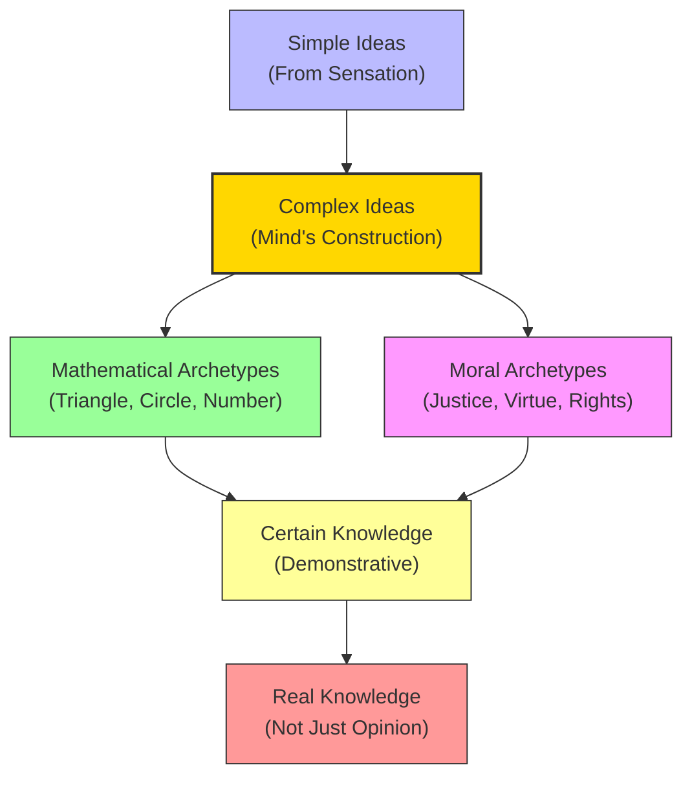

# Module 07 — Locke on Morals, Mathematics, and Archetypes

*Module 7 of 13 — Chapter 7: Empiricism: The Authority of Experience*

---

In 1688, the same year that England's Glorious Revolution replaced James II with William and Mary, John Locke was wrestling with a problem that threatened to undo his entire philosophical system. He had argued, convincingly, that all ideas come from experience. But what about mathematical truths? What about moral principles? Surely "2 + 2 = 4" is not true because we have *experienced* it being true — it seems true *necessarily*, regardless of experience. And what about the principles of justice and morality? If these are merely the products of experience, then they are contingent — they could have been otherwise. But moral truths do not feel contingent. They feel as necessary as mathematics. Locke's solution to this problem was ingenious — and it revealed a hidden rationalism lurking within his empiricism.

---

## Mathematical Certainty as a Model

Locke approaches the problem of moral knowledge by first exploring the certainty of mathematical propositions. This is a strategic move. Mathematics is the one domain where even skeptics admit that certain knowledge exists. If Locke can show that moral knowledge has the same structure as mathematical knowledge, he can claim certainty for morality without resorting to innate ideas or divine revelation.

The key to this argument is the distinction between **simple** and **complex ideas**. Simple ideas, as we have seen, are the direct products of sensation — they are "representations" of external objects. Complex ideas, however, are different. They are "archetypes of the mind's own making" — they are not copies of anything in the external world but constructions built from simple ideas.

Mathematical ideas are complex ideas. The idea of a triangle is not a direct perception of a physical triangle; it is a mental construct built from simple ideas of lines, angles, and surfaces. And yet, mathematical truths are certain. "The idea of whiteness or bitterness, as it is in the mind, exactly answering that power which is in any body to produce it there, has all the real conformity it can or ought to have with things without us."

> [!TIP]
> **Stop and Think:** Consider the Pythagorean theorem: a² + b² = c². You did not learn this by measuring every right triangle in the world. You proved it — through logical demonstration from the *idea* of a right triangle. Where did that idea come from? Locke would say: from experience, but the *truths* that follow from it are discovered by reason.

## Archetypes of the Mind's Own Making

Locke's concept of **archetypes** is one of his most important — and most misunderstood — ideas. When we form a complex idea, we are not copying something from the external world. We are creating a mental model — an archetype — that organizes and extends our simple ideas.

Mathematical archetypes are the clearest example. The idea of a circle is "not the bare, empty vision or vain, insignificant chimeras of the brain." It is a genuine idea with definite properties — properties that can be explored and discovered through logical demonstration. The geometer who reasons that a circle contains 360 degrees, all of whose points are the same distance from the center, may never find such a perfect figure in nature. But this does not make the idea "unreal." It makes it an archetype — a mental construction that captures something true about the *possibility* of physical objects.

Moral ideas work the same way. They are complex ideas built from simple ideas of human behavior, social interaction, pleasure, and pain. And like mathematical ideas, they can be explored through logical demonstration. "Our moral ideas as well as mathematical, being archetypes themselves, and so adequate and complete ideas, all the agreement or disagreement which we shall find in them will produce real knowledge, as well as in mathematical figures."

*Figure 7.1: Locke's architecture of certainty — both mathematical and moral knowledge are built from experience but achieve certainty through logical demonstration.*

> [!TIP]
> **Stop and Think:** Consider the Pythagorean theorem. You did not learn this by measuring every right triangle in the world. You proved it through logical demonstration from the idea of a right triangle. Where did that idea come from? Locke would say: from experience, but the truths that follow from it are discovered by reason.

## The Rationalist Within

Here is where Locke's empiricism reveals its hidden rationalist dimension. He is not arguing that moral propositions have the same kind of validity as our perception of motion or shape. He is arguing that most of what we know is *not* of the type "It is raining" or "The tram is moving." Most of our knowledge — including our most important knowledge — is knowledge of *ideas and their relations*.

"For the attaining of knowledge and certainty, it is requisite that we have determined ideas: and to make our knowledge real, it is requisite that the ideas answer their archetypes.... Nor will it be less true or certain because moral ideas are of our own making and naming."

This is a remarkable passage. Locke is saying that moral truths are not less certain than mathematical truths — they are *equally* certain, because both are discovered through the same logical processes. The fact that moral ideas are "of our own making" does not make them arbitrary. It makes them *constructs* — and constructs can be explored, tested, and validated through reason.

> [!TIP]
> **Stop and Think:** Locke claims that moral ideas can be as certain as mathematical ones. But consider: mathematicians worldwide agree on the Pythagorean theorem, while moral philosophers disagree about almost everything. Does this difference in consensus undermine Locke's claim? Or does it merely show that moral reasoning is harder than mathematical reasoning?

> [!TIP]
> **Stop and Think:** Locke claims that moral ideas can be as certain as mathematical ones. But mathematicians worldwide agree on the Pythagorean theorem, while moral philosophers disagree about almost everything. Does this difference undermine Locke'"'"'s claim? Or does it merely show that moral reasoning is harder?

## The Bridge to Kant

Locke's concept of archetypes brings him uncomfortably close to the rationalist tradition he claims to oppose. His moral archetypes — mental constructions that originate within the mind and generate moral truths — bear a striking resemblance to the rationalist's notion of innate moral principles.

"On a certain construal, the leap from these Lockean archetypes to Kant's categorical imperative is at its narrowest point in this discussion of the truth of moral propositions. It is here also that Locke's credentials as a rationalist are above reproach."

This is one of the most fascinating tensions in Locke's philosophy. He begins by rejecting innate ideas and insisting that all knowledge comes from experience. But when he reaches the question of moral certainty, he finds himself relying on mental structures that function very much like innate principles. The archetypes are not *called* innate, but they serve the same purpose: they provide a foundation for certain knowledge that is not directly derived from sensory experience.

> [!TIP]
> **Stop and Think:** Kant would later argue that the mind brings "categories" to experience — structures like causality, unity, and necessity that shape how we perceive the world. Locke's archetypes seem to anticipate this idea. Is there really a difference between saying "the mind constructs archetypes from experience" and saying "the mind brings innate categories to experience"? Or are these just two ways of describing the same psychological reality?

## Simple Ideas vs. Complex Ideas: A Summary

The distinction between simple and complex ideas is the backbone of Locke's entire system:

| Feature | Simple Ideas | Complex Ideas |
|---------|-------------|---------------|
| **Source** | Direct sensation or reflection | Mind's own construction |
| **Relationship to world** | Representations of external objects | Archetypes — not copies of anything |
| **Examples** | Red, warm, sweet, loud | Triangle, justice, government |
| **Certainty** | Depends on sensory reliability | Can achieve demonstrative certainty |
| **Role in knowledge** | Raw materials | Building blocks of understanding |

*Table 7.1: Simple ideas come from the world; complex ideas come from the mind's manipulation of simple ideas.*

## The Nominalist Position

In the dispute between nominalists and realists — the medieval debate about whether universals (like "humanity" or "justice") have real existence — Locke's position is "undeviatingly nominalistic." The truth of so-called universal propositions is either merely tautological or a proposition about actual, physical entities whose essences are known through sensation.

Thus, "gold is malleable" is true only to the extent that the word "gold" includes malleability in the sense of coexistence. Its malleability is not established by the proposition but by its actual, sensible properties. "No existence of anything without us, but only of God, can certainly be known farther than our senses inform us."

This nominalist position has profound implications for psychology. It means that general concepts — "intelligence," "emotion," "personality" — are not discoveries of pre-existing realities but *constructions* built from particular experiences. We do not find "intelligence" in the world; we construct the idea of intelligence from observations of specific behaviors in specific contexts.

## Speaking of Archetypes...

- A chess player's understanding of "strategy" is a complex archetype built from thousands of individual games. No single game contains "strategy" — but the pattern that emerges from many games does.
- When a doctor diagnoses a disease, they are matching the patient's symptoms to a mental archetype — a complex idea built from medical training and clinical experience. The diagnosis is not a direct perception but a construction.
- The legal concept of "reasonable doubt" is a moral archetype — a complex idea that judges and juries must construct from evidence, instructions, and their own sense of fairness. No two people's archetype of "reasonable doubt" is exactly the same.

---

Locke had shown that even an empiricist can account for the certainty of moral and mathematical knowledge — by treating them as complex ideas (archetypes) constructed from experience but validated through reason. But this solution created a new problem: if complex ideas are the mind's own constructions, and if the connection between our ideas and the external world is "incurably ignorant," then what grounds do we have for believing that there is an external world at all? This question would drive the next generation of empiricists — Berkeley and Hume — to conclusions far more radical than anything Locke had imagined.

---

## References

- Robinson, D. N. (1995). *An Intellectual History of Psychology* (3rd ed.). University of Wisconsin Press. Chapter 7.
- Locke, J. (1690/1956). *An Essay Concerning Human Understanding*. Henry Regnery Co.
- Kant, I. (1781/1998). *Critique of Pure Reason* (P. Guyer & A. W. Wood, Trans.). Cambridge University Press.

---

*Module 7 of 13 — Chapter 7: Empiricism: The Authority of Experience*
