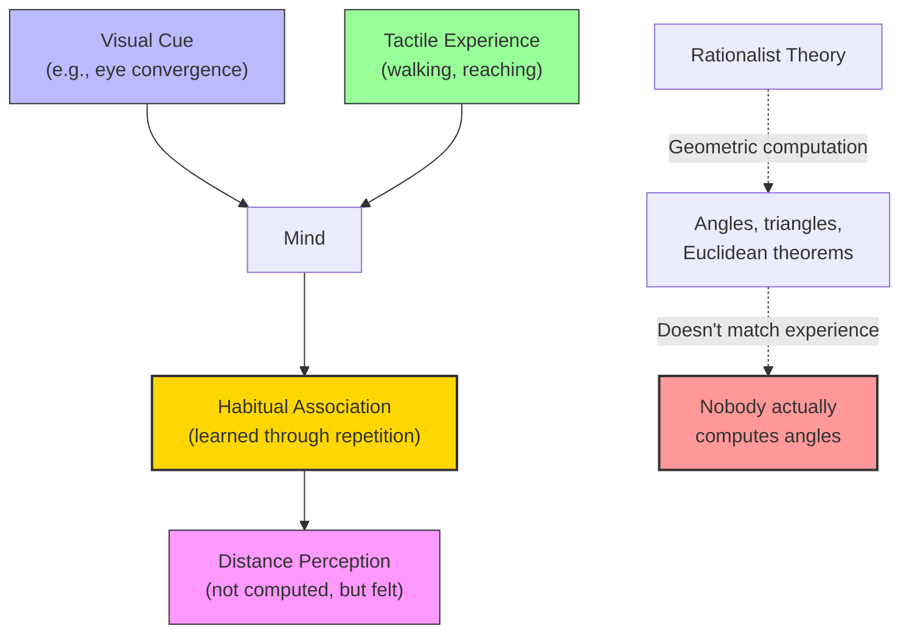

# Module 08 — George Berkeley and the Immaterialist Challenge

*Module 8 of 13 — Chapter 7: Empiricism: The Authority of Experience*

---

In 1709, a young Anglo-Irish clergyman named George Berkeley published a work on visual perception that was, on its surface, a technical contribution to optics. The *Essay Towards a New Theory of Vision* examined how human beings judge distance, size, and spatial relationships — questions that had occupied philosophers since antiquity. But Berkeley's answer was so radical that it undermined the very foundations of the rationalist account of perception. Distance, he argued, is not *seen* at all. It is *learned* — through the repeated association of visual sensations with tactile experiences. And if something as fundamental as depth perception is learned rather than innate, then the entire edifice of rationalist optics — built on geometric principles and mathematical necessity — collapses. Berkeley had found empiricism's most powerful weapon: the simple, devastating observation that nobody actually sees the way philosophers say they do.

---

## The Rationalist Account of Vision

The dominant theory of visual perception in Berkeley's time was developed by Descartes and had very ancient roots. According to this theory, we see objects at a distance on the basis of geometry. When you look at an object, the lines of sight from each eye converge at the object's surface, forming a triangle. The interocular distance (the distance between your eyes) is the base of this triangle. As the object moves farther away, the apex angle becomes smaller. By applying Euclid's theorems, all perceptual data about distance can be deduced from geometric principles.

The muscles that control eye convergence supposedly report the degree of convergence to the brain, which then calculates the distance. This is a neat, mathematical account — exactly the kind of theory that rationalists love. It treats perception as a form of *computation*, and it implies that the laws of geometry are built into the structure of the mind.

> [!TIP]
> **Stop and Think:** The rationalist account of vision sounds scientific — triangles, angles, Euclidean geometry. But think about your own experience: when you judge the distance of an approaching car, are you computing angles? Are you even aware of your eye movements? Berkeley's challenge begins with this simple question: does anyone actually perceive the way the theory says they do?

> [!TIP]
> **Stop and Think:** When you judge the distance of an approaching car, are you computing angles? Are you even aware of your eye movements? Berkeley'"'"'s challenge begins with this simple question: does anyone actually perceive the way the rationalist theory says they do?

## Berkeley'"'"'s Common-Sense Revolution

Berkeley's reply to the rationalist account is devastating in its simplicity: "No one sees things this way!" When we look at an approaching object, we do not compute the convergence of our eyes or the angle at the invisible apex of invisible triangles. "Furthermore, the mathematically untutored are as accurate in judging distances as are masters of optics and so it is not likely that a knowledge of optical rays, lines, and angles ever participates in our perceptual judgments."

This is not a philosophical argument — it is an empirical observation. If the geometric theory were correct, then people who know geometry should be better at judging distances than people who do not. But they are not. A farmer in rural Brazil judges the distance to a fence post just as accurately as a professor of optics at Cambridge. The geometric theory, whatever its mathematical elegance, does not describe how human beings actually perceive.

What, then, does explain distance perception? Berkeley's answer is experience. We learn to judge distance through repeated exposure to the visual and tactile cues associated with objects at various distances. The key passage is worth quoting at length:

> "Not that there is any natural or necessary connection between the sensation we perceive by the turn of the eyes and greater or lesser distance. But — because the mind has, by constant experience, found the different sensations corresponding to the different dispositions of the eyes to be attended each with a different degree of distance in the object — there has grown a habitual or customary connection between those two sorts of ideas."

This is a theory of **habitual association**. Distance perception is not a geometric computation; it is a learned association between visual cues (the turn of the eyes, the blurriness of distant objects, the convergence of lines) and the experience of moving through space. The mind has learned, through countless repetitions, to interpret certain visual sensations as indicating certain distances.

*Figure 8.1: Berkeley's empirical account vs. the rationalist theory — perception is learned, not computed.*

## The Moon Illusion

Berkeley applied the same empirical approach to the **moon illusion** — the well-known phenomenon in which the moon appears larger near the horizon than when it is high in the sky. The rationalist explanation appealed to geometric optics: the moon's image subtends the same angle regardless of its position, so the illusion must be due to some error in the geometric computation.

Berkeley rejected this explanation. The moon illusion, he argued, is caused by the association of the horizon moon with terrestrial objects (trees, buildings, mountains) that provide cues to distance. When the moon is high in the sky, there are no such cues, and the moon appears smaller. The illusion is not a geometric error; it is a *learned association* between visual context and perceived size.

This explanation — though later refined by subsequent researchers — established a principle that would become central to the psychology of perception: our experience of the world is shaped not just by the physical properties of stimuli but by the *context* in which we encounter them and the *associations* we have formed through prior experience.

> [!TIP]
> **Stop and Think:** The moon illusion persists even when you *know* it is an illusion. You can understand Berkeley's explanation perfectly and still see the horizon moon as larger. What does this tell you about the relationship between knowledge and perception? Can intellectual understanding override the habits of the senses?

> [!TIP]
> **Stop and Think:** The moon illusion persists even when you know it is an illusion. You can understand Berkeley'"'"'s explanation perfectly and still see the horizon moon as larger. What does this tell you about the relationship between knowledge and perception?

## Experience as the Interpreter

Berkeley's *New Theory of Vision* makes a claim that extends far beyond optics: bare sensations, by themselves, are meaningless. They acquire meaning only through experience — through the repeated association of one sensation with another.

A blush is not inherently a sign of shame. A child who has never observed the connection between blushing and embarrassment would see only a change in skin color. It is *experience* — the repeated observation that blushing accompanies shame — that teaches us to interpret the blush as a sign. "Without which experience we should no more have taken blushing for a sign of shame than of gladness."

This principle applies to all perception. We do not see "distance" — we see visual cues that we have learned to interpret as indicating distance. We do not hear "music" — we hear patterns of sound that we have learned to organize into melodies and harmonies. Perception is not a passive reception of information; it is an active *interpretation* shaped by a lifetime of experience.

> [!TIP]
> **Stop and Think:** Consider how a sommelier tastes wine differently from a casual drinker. The casual drinker tastes "wine"; the sommelier tastes "notes of blackcurrant with a hint of cedar and a long, tannic finish." The physical sensations are similar — but the *interpretation*, built from years of training and experience, is vastly more detailed. This is Berkeley's principle in action.

## The Immaterialist Implications

Berkeley's *New Theory of Vision* was, in one sense, a modest work — a technical contribution to the psychology of perception. But its implications were anything but modest. If distance is not seen but learned, then the rationalist claim that perception is governed by innate geometric principles is wrong. And if perception is shaped by experience rather than by innate structures, then the mind is far more plastic — far more shaped by its history — than the rationalists had supposed.

More radical still was the direction Berkeley would take these insights in his later work. If the properties we perceive — color, warmth, taste — are not "in" the objects but are products of our interaction with them, then what reason do we have for believing that *any* properties exist independently of perception? This question would lead Berkeley to his famous — and famously misunderstood — thesis: *esse est percipi*, to be is to be perceived.

## Speaking of Berkeley...

- When you learn to play a musical instrument, you gradually develop the ability to "hear" notes before you play them. This is Berkeley's habitual association in action — the mind learns to connect motor actions with auditory outcomes.
- A radiologist learns to "see" tumors in X-rays that are invisible to untrained eyes. The physical image is the same for everyone; the interpretation is shaped by years of training and experience.
- The phenomenon of "pareidolia" — seeing faces in clouds or patterns in random noise — is a dramatic example of Berkeley's principle: the mind imposes learned patterns on ambiguous sensory data.

---

Berkeley had shown that even something as basic as depth perception is learned, not innate. But this raised a more fundamental question: if the properties we perceive are products of our interaction with objects rather than properties of the objects themselves, then what do we actually know about the external world? Berkeley's answer to this question would be the most radical move in the empiricist tradition — a move that would challenge the very concept of material reality.

---

## References

- Robinson, D. N. (1995). *An Intellectual History of Psychology* (3rd ed.). University of Wisconsin Press. Chapter 7.
- Berkeley, G. (1709/1963). *An Essay Towards a New Theory of Vision*. In *Berkeley's Works on Vision* (C. M. Turbayne, Ed.). Bobbs-Merrill.
- Berkeley, G. (1710/1963). *A Treatise Concerning the Principles of Human Knowledge*. Open Court.

---

*Module 8 of 13 — Chapter 7: Empiricism: The Authority of Experience*
