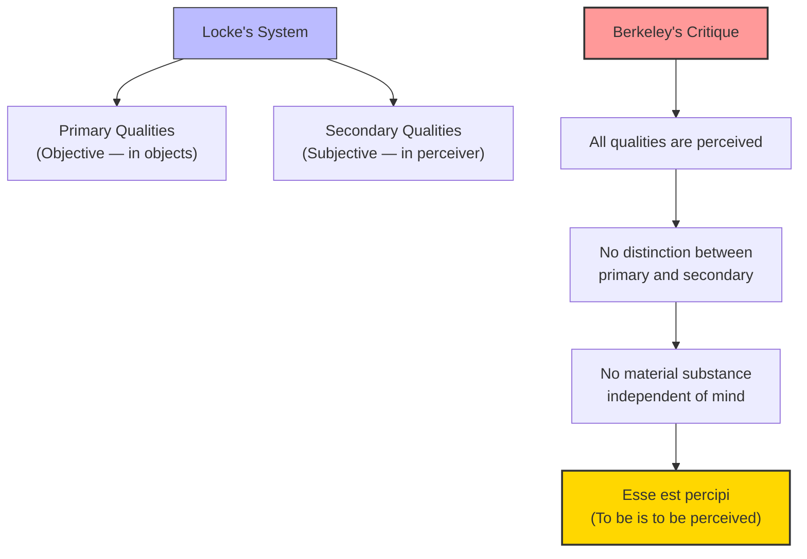

# Module 09 — Berkeley's Treatise: To Be Is to Be Perceived

*Module 9 of 13 — Chapter 7: Empiricism: The Authority of Experience*

---

In 1710, George Berkeley published a work so radical that readers assumed it was a joke. *A Treatise Concerning the Principles of Human Knowledge* argued, in all seriousness, that material substance does not exist. There are no physical objects sitting "out there" in space, independent of the minds that perceive them. A house, a mountain, a river — these are nothing but collections of ideas, and ideas exist only insofar as they are perceived. "To be," Berkeley declared, "is to be perceived." It was the most extreme claim in the history of empiricism — and, paradoxically, it was intended as a *defense* of common sense.

---

## The Attack on "Twofold Existence"

Berkeley's target was a specific philosophical error that he believed was "the very root of Scepticism." This was the doctrine of **twofold existence** — the belief that objects have two kinds of being: one "intelligible or in the mind" and the other "real and without the mind."

According to this doctrine, when you see a tree, there are *two* trees: the tree-as-perceived (an idea in your mind) and the tree-as-it-really-is (a material object existing independently of your perception). The first is subjective; the second is objective. The first is known through sensation; the second is inferred through reason.

Berkeley found this doctrine incoherent. "What are the forementioned objects but things we perceive by sense? And what do we perceive besides our own ideas or sensations? And is it not plainly repugnant that any one of these, or any combination of them, should exist unperceived?"

The argument is deceptively simple. We know the world through our perceptions. Our perceptions are ideas. Ideas exist only in minds. Therefore, the world we know exists only insofar as it is perceived. The notion of a material world existing independently of perception is not just unproven — it is *meaningless*. We cannot even coherently *conceive* of an object that exists unperceived, because the act of conceiving is itself a form of perception.

> [!TIP]
> **Stop and Think:** Berkeley asks: can you conceive of a tree in a forest where no one is present to see it? You probably think you can. But Berkeley would point out that when you imagine this tree, you are *perceiving* it in your mind's eye. You have not conceived of an unperceived tree; you have conceived of a perceived tree and then *imagined* the perceiver away. Is this a genuine thought experiment or a trick of language?

> [!TIP]
> **Stop and Think:** Berkeley asks: can you conceive of a tree in a forest where no one is present to see it? You probably think you can. But when you imagine this tree, you are perceiving it in your mind'"'"'s eye. You have not conceived of an unperceived tree; you have conceived of a perceived tree and imagined the perceiver away. Is this a genuine insight or a trick of language?

## All Qualities Are Secondary

Berkeley's next move was to demolish Locke's distinction between primary and secondary qualities. Locke had argued that primary qualities (size, shape, motion) exist in objects independently of perception, while secondary qualities (color, taste, warmth) are products of the perceiver. Berkeley argued that this distinction is untenable.

His reasoning is elegant. Consider the primary quality of *motion*. Motion can be nothing if not *perceived* motion. Consider *number* — only perceived number. Consider *form* — but perceived form. "Accordingly, there can be no difference between these so-called primary qualities and the secondary ones of color, heat, cold, and so forth."

If we cannot conceive of color without a perceiver, Berkeley argues, we cannot conceive of shape without one either. Try to imagine a shape that no one perceives — you cannot, because the act of imagining is itself a form of perception. The primary/secondary distinction was Locke's attempt to preserve an objective material world; Berkeley's argument shows that the attempt fails.

*Figure 9.1: Berkeley's argument — if all qualities are perceived, the primary/secondary distinction collapses, and with it, material substance.*

## The Rejection of Material Substance

If primary and secondary qualities are equally dependent on perception, then the concept of **material substance** — the underlying physical "stuff" that supposedly has primary qualities — becomes unnecessary. We do not need to postulate an unperceivable material substrate to explain our perceptions. Our perceptions *are* the reality.

This is Berkeley's famous immaterialism. It is not, he insists, a denial of reality. Trees, mountains, and rivers are "real things, or really do exist; this we do not deny." What he denies is "they can subsist without the minds which perceive them or that they are resemblances of any archetypes existing without the mind; since the very being of a sensation or idea consists in being perceived, and an idea can be like nothing but an idea."

J.S. Mill would later define matter as "the permanent possibility of sensation" — a formulation that captures Berkeley's point without the metaphysical baggage. The tree is real, but its reality consists in the *possibility* of perceiving it, not in some hidden material substance.

> [!TIP]
> **Stop and Think:** If you leave a room and close the door, does the furniture continue to exist? Berkeley would say: it exists in the sense that you *would* perceive it if you opened the door again. But it does not exist as an unperceived material object. Is this a meaningful distinction, or just a verbal trick?

## God as Eternal Perceiver

Berkeley was acutely aware that his theory faced a devastating objection: what happens to objects when no one is perceiving them? If the tree in the quad exists only when someone is looking at it, does it disappear when the quad is empty?

Berkeley's answer was ingenious — and theological. Objects do not disappear when human perceivers are absent, because there is *always* a perceiver: God. "The world, the universe, and all that lives are but perceptions held eternally in God's eye." Material objects exist in relation to our minds in the way that ideas exist in God's — permanently, because God's perception is eternal and all-encompassing.

This solution has struck many readers as ad hoc — a desperate attempt to save common sense by invoking divine intervention. But it served a crucial purpose in Berkeley's system. It allowed him to maintain that the world is real and orderly (because God's perceptions are consistent) while denying that material substance exists. It was, in Robinson's words, "Berkeley's simultaneous rebuttal of skepticism, materialism, and atheism."

> [!TIP]
> **Stop and Think:** Berkeley used God to solve the problem of unperceived objects. Modern physics has a parallel: quantum mechanics suggests that particles do not have definite properties until they are measured. Is Berkeley's "to be is to be perceived" really so different from the quantum physicist's "the moon is not there when nobody looks"?

> [!TIP]
> **Stop and Think:** If you leave a room and close the door, does the furniture continue to exist? Berkeley would say: it exists in the sense that you would perceive it if you opened the door again. But it does not exist as an unperceived material object. Is this a meaningful distinction, or just a verbal trick?

## Epistemology Becomes Psychology

Berkeley's most lasting contribution to psychology was not his immaterialism but his insistence that **perception is the first and last criterion by which reality may be known and judged**. In proposing this, "he rendered epistemology a branch of psychology, and the two have never been utterly divorced since."

Before Berkeley, epistemology (the theory of knowledge) was a branch of philosophy concerned with abstract questions about truth, certainty, and the limits of reason. After Berkeley, epistemology became inseparable from psychology — from the empirical study of how human beings actually perceive, think, and know. The question "What can we know?" became, inescapably, the question "How do our minds work?"

This was, in its way, more radical than immaterialism. It did not merely change the *content* of philosophy; it changed its *method*. If knowledge is rooted in perception, then the study of knowledge requires the study of perception — and the study of perception requires the methods of empirical psychology.

## Speaking of Berkeley...

- A virtual reality headset creates the *experience* of being in a different place. The physical reality is just pixels on a screen, but the perception is vivid and compelling. Berkeley would say: the perception *is* the reality, for all practical purposes.
- When a magician makes a coin "disappear," they exploit the fact that you perceive only what your senses report. If your senses report no coin, there is — for you — no coin. Berkeley would approve.
- The philosophical puzzle of "the tree in the forest" — if a tree falls and no one hears it, does it make a sound? — is a direct descendant of Berkeley's challenge. The answer depends on whether "sound" means physical vibrations (which exist independently) or auditory experience (which requires a perceiver).

---

Berkeley had pushed empiricism to its logical extreme: if all knowledge comes from experience, and experience is always *of ideas*, then the material world is, at best, an inference — and an unnecessary one. But there was one more step to take. If Berkeley was right that we know only our own ideas, then what about the *connections* between ideas? What about causation, the laws of nature, the regularities that science claims to discover? David Hume, the most radical of the British empiricists, would take this question and arrive at a conclusion that shook the foundations of Western philosophy.

---

## References

- Robinson, D. N. (1995). *An Intellectual History of Psychology* (3rd ed.). University of Wisconsin Press. Chapter 7.
- Berkeley, G. (1710/1963). *A Treatise Concerning the Principles of Human Knowledge*. Open Court.
- Mill, J. S. (1865). *An Examination of Sir William Hamilton's Philosophy*. Longmans, Green.

---

*Module 9 of 13 — Chapter 7: Empiricism: The Authority of Experience*
