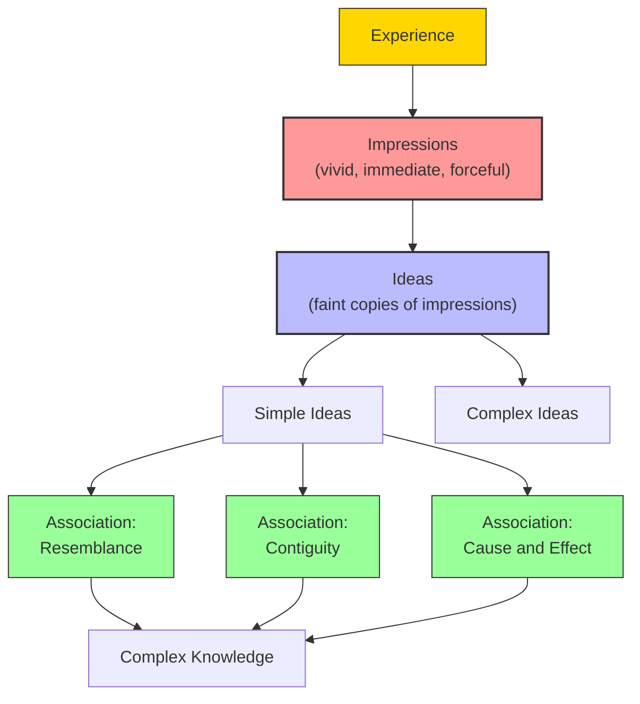

# Module 10 — David Hume and the Science of Human Nature

*Module 10 of 13 — Chapter 7: Empiricism: The Authority of Experience*

---

In 1739, a young Scottish philosopher published a work that he confidently expected would revolutionize the intellectual world. David Hume's *A Treatise of Human Nature* was subtitled "Being an Attempt to introduce the experimental Method of Reasoning into Moral Subjects." It was, in Hume's own estimation, the most important book written in a century. The public disagreed. The *Treatise* "fell dead-born from the press," as Hume later ruefully admitted. But the book that was ignored in 1739 would, within a generation, become one of the most influential works in the history of philosophy — a work that would challenge every assumption about knowledge, causation, morality, and the human mind.

---

## The Scottish Enlightenment

Hume did not write in isolation. He was a product of the **Scottish Enlightenment** — one of the most remarkable intellectual explosions in European history. In the early eighteenth century, Scotland's universities — Edinburgh, Glasgow, Aberdeen, St. Andrews — became centers of medical, legal, and philosophical education that attracted students from across Europe and the Americas.

The intellectual ferment was extraordinary. William Cullen's medical nosology would be translated into French by Philippe Pinel and studied by Benjamin Rush before Rush returned to America to reform the treatment of the mentally ill — and to sign the Declaration of Independence. Adam Smith would articulate modern economics at Glasgow. Joseph Black would make foundational contributions to chemistry. Thomas Reid would found "common sense" philosophy at Aberdeen — a philosophy that would influence Kant in Prussia and the American founding fathers across the Atlantic.

It was in this environment of intense intellectual activity that Hume composed his *Treatise*. He was twenty-six years old. The work appeared a century after Britain's civil war, and a half century after Locke's *Essay*. Milton's *Areopagitica* had already assaulted censorship so effectively that J.S. Mill's *On Liberty*, two centuries later, was proud to paraphrase it. The historic sources of oppressive authority were, by Hume's time, "quite simply outnumbered."

> [!TIP]
> **Stop and Think:** The Scottish Enlightenment produced Adam Smith, David Hume, Thomas Reid, and James Watt — among many others — in a nation of barely two million people. What conditions produce such concentrated intellectual achievement? Is it universities, wealth, political freedom, or something else entirely?

## The Mission: A Science of Human Nature

Hume's mission, stated at the outset of the *Treatise*, was to establish a science of human nature that would set the boundaries on all other sciences:

> "And tho' we must endeavour to render all our principles as universal as possible, by tracing up our experiments to the utmost, and explaining all effects from the simplest and fewest causes, 'tis still certain we cannot go beyond experience; and any hypothesis, that pretends to discover the ultimate original qualities of human nature, ought at first to be rejected as presumptuous and chimerical."

"Hypothesis non fingo," Newton had declared — "I frame no hypotheses." Hume echoed this maxim. His primary objective was to establish the limits of human knowledge — limits that fall short of being able to prove "our most general and most refined principles beside our experience of their reality." Notice was served on all who would promise extrasensory truths or irrefutable moral maxims.

The *Treatise* is organized into three books: the understanding (Book I), the passions (Book II), and morals (Book III). This organization is itself a statement about the structure of the human mind. Knowledge, emotion, and morality are not separate faculties; they are interconnected dimensions of a single psychological system.

## Impressions and Ideas

Since the contents of the mind can come into being only through experience, "it follows that the mind deals in **perceptions**." These are of two sorts: **impressions** and **ideas**.

Impressions include sensations, passions, and emotions — they are "the reports of stimulation of one sort or another." When you see a red apple, feel the sting of a cold wind, or experience the rush of anger, you are having an impression. Impressions are vivid, immediate, and forceful.

Ideas are "only the persistence, in a weaker form, of prior impressions." When you *remember* the red apple, *imagine* the cold wind, or *think about* anger, you are having an idea. Ideas are faint copies of impressions — less vivid, less forceful, but structurally similar.

The relationship is systematic: "every simple idea has a simple impression which resembles it and every simple impression, a correspondent idea." And since impressions always precede their corresponding ideas in experience, "we can be certain that the latter is the result of the former, and not vice versa."

This is a decisive blow against both the idealist claim that mind creates sensation and the nativist claim that ideas are innate. Common experience shows that sensations come first; ideas follow. The mind does not create the world; the world furnishes the mind.

*Figure 10.1: Hume's architecture of the mind — impressions give rise to ideas, which combine through three principles of association.*

> [!TIP]
> **Stop and Think:** The Scottish Enlightenment produced Adam Smith, David Hume, Thomas Reid, and James Watt in a nation of barely two million people. What conditions produce such concentrated intellectual achievement? Is it universities, wealth, political freedom, or something else?

## The Three Principles of Association

Simple ideas become associated and so form complex ideas. The bases upon which such associations are formed are three: **resemblance**, **contiguity**, and **cause and effect**.

**Resemblance**: We associate things that look, sound, or feel alike. A photograph of a friend reminds you of the friend because the image *resembles* the person.

**Contiguity**: We associate things that occur together in time or space. The smell of freshly baked bread reminds you of your grandmother's kitchen because the two were *contiguous* — experienced together.

**Cause and effect**: We associate things that occur in regular sequence. The sound of thunder reminds you of lightning because you have learned that lightning *causes* thunder.

These three principles, Hume argues, are the "cement" of the mental world. They explain how simple ideas combine into complex ones, how memories are triggered, and how the mind creates the appearance of order and meaning from the raw materials of sensation.

> [!TIP]
> **Stop and Think:** Think about a song that triggers a vivid memory. Which of Hume's three principles is at work? Probably all three: the song *resembles* other times you've heard it, it was *contiguous* with the remembered experience, and it was *causally* connected to the emotions you felt. How do these principles interact in your own experience of memory?

## Memory and Imagination

Hume distinguishes between two faculties that operate on ideas: **memory** and **imagination**. Memory simply revives actual impressions — when you picture the face of a relative, you are employing memory. Imagination goes further: it "reconstructs impressions in the form of pure ideas" — it combines, rearranges, and extends the materials furnished by experience.

The distinction is important because it explains how the mind can create ideas that have no direct counterpart in experience. When you imagine a unicorn, you are combining the idea of a horse (from impression) with the idea of a horn (from impression) in a way that has no experiential basis. The imagination is free to construct — but it is always working with materials originally furnished by sensation.

> [!TIP]
> **Stop and Think:** Think about a song that triggers a vivid memory. Which of Hume'"'"'s three principles is at work? Probably all three: the song resembles other times you'"'"'ve heard it, it was contiguous with the remembered experience, and it was causally connected to the emotions you felt. How do these principles interact in your own experience?

## The Scottish Context: Shaftesbury and Butler

Hume was not the first to develop a psychological approach to morality. He acknowledged his debt to **Shaftesbury** and **Butler** — two thinkers who had argued that moral and ethical dimensions of human life are to be understood in human terms, not through rationalist principles or divine revelation.

Shaftesbury had located all morality in the domain of intended actions and argued that these actions, on the part of a reflective animal, are the product of natural appetites, dispositions, and affections. "To have the natural affections... is to have the chief means and power of self-enjoyment: and that to want them is certain misery and ill."

Butler extended this naturalistic approach. "We naturally and unavoidably approve of some actions, under the peculiar view of their being virtuous... and disapprove others as vicious.... That we have this moral approving and disapproving faculty, is certain from our experiencing it in ourselves, and recognizing it in each other."

These sentimentalist theories would undergo revolutionary transformation at the hands of Hume, Adam Smith, and Jeremy Bentham. But their basic insight — that morality is rooted in human nature, not in abstract principles — would remain constant.

> [!TIP]
> **Stop and Think:** Shaftesbury argued that morality is grounded in "natural affections" — our innate dispositions toward empathy, fairness, and social harmony. Modern research in moral psychology (Jonathan Haidt, Joshua Greene) supports something similar: moral judgments are often driven by emotional intuitions, not rational deliberation. Has the sentimentalist tradition been vindicated by neuroscience?

## Speaking of Hume...

- When you feel a surge of anger at an injustice, you are experiencing what Hume would call an "impression" — a vivid, immediate emotional response. Your later reflection on that anger — analyzing why you felt it, whether it was justified — is an "idea" — a fainter copy of the original impression.
- A child who touches a hot stove learns causation not through logical deduction but through the direct experience of pain. This is Hume's principle: knowledge of cause and effect comes from experience, not reason.
- The modern advertising industry is built on Hume's principles of association: products are shown contiguously with attractive people (contiguity), similar products are grouped together (resemblance), and consequences are promised (cause and effect).

---

Hume had established the basic architecture of the mind: impressions give rise to ideas, which combine through association. But this raised a question that would consume the rest of the *Treatise* and much of his later work: if all we know are our own impressions and ideas, what grounds do we have for believing in *causation* — the very concept that makes science possible? Hume's answer would be the most unsettling claim in the history of empiricism.

---

## References

- Robinson, D. N. (1995). *An Intellectual History of Psychology* (3rd ed.). University of Wisconsin Press. Chapter 7.
- Hume, D. (1739/1973). *A Treatise of Human Nature* (L. A. Selby-Bigge, Ed.). Clarendon Press.
- Hume, D. (1748/1965). *An Enquiry Concerning Human Understanding*. In *Essential Works of David Hume* (R. Cohen, Ed.). Bantam Books.

---

*Module 10 of 13 — Chapter 7: Empiricism: The Authority of Experience*
