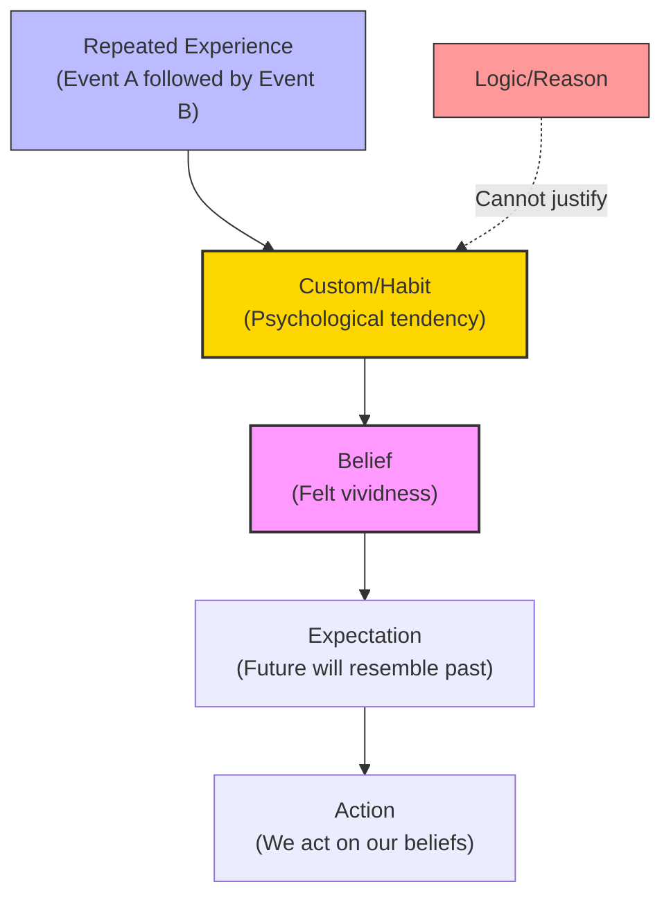

# Module 11 — Hume on Causation, Belief, and the Passions

*Module 11 of 13 — Chapter 7: Empiricism: The Authority of Experience*

---

You strike a match and it ignites. You do this a thousand times, and a thousand times the match ignites. You conclude that striking a match *causes* it to ignite. This seems like the most obvious, undeniable fact in the world. But David Hume, writing in 1739, asked a question that no one had thought to ask before: *how do you know that striking the match causes it to ignite?* You have observed the striking and the igniting, always together, always in sequence. But have you ever observed the *causation* itself — the invisible force that connects the one event to the other? Hume's answer was devastating: you have not. And you never will. Causation is not something we discover in the world. It is something the mind invents.

---

## The Problem of Causation

Hume's treatment of causation is the most famous — and most unsettling — argument in the history of empiricism. It begins with a simple observation: all reasoning about matters of fact is founded on the relation of cause and effect. When we predict that the sun will rise tomorrow, we are relying on our knowledge of the causal connection between the earth's rotation and the appearance of the sun. When we prescribe a medicine, we are relying on our knowledge of the causal connection between the drug and the cure.

But where does this knowledge come from? Hume's answer is unequivocal: "Our knowledge of that relation is derived entirely from experience." We do not discover causation through reason; we discover it through the repeated observation of events occurring together. And this means that our knowledge of causation is always, at bottom, a *habit* — a psychological tendency to expect that the future will resemble the past.

The problem is that there is no logical reason why the future should resemble the past. The fact that the sun has risen every morning for billions of years does not *prove* that it will rise tomorrow. It is merely *probable* — and the probability is based on the assumption that the patterns of the past will continue into the future. But this assumption is itself based on experience, not on logic. We are reasoning in a circle.

> [!TIP]
> **Stop and Think:** You believe that dropping a glass on a hard floor will cause it to shatter. But have you ever observed the *causation* — the actual force that connects the dropping to the shattering? Or have you only observed the dropping and the shattering, always together, and *inferred* that one causes the other? Hume would say you have only ever observed the sequence, never the connection.

## Belief as Feeling

If causation is not a logical necessity but a psychological habit, then what is **belief**? Hume's answer is startling: belief is not a form of knowledge at all. It is a *feeling* — a particular vividness that the mind attaches to certain ideas.

"Belief is something felt by the mind, which distinguishes the ideas of the judgment from the fictions of the imagination." When you believe that the sun will rise tomorrow, you are not performing a logical deduction. You are experiencing a particular *feeling* of conviction — a vividness that attaches to the idea of the rising sun because of your history of experience.

This is a revolutionary claim. It means that the difference between knowledge and opinion, between science and superstition, between rational conviction and mere prejudice, is not a difference in *kind* but a difference in *degree of felt vividness*. The scientist's belief in gravity and the conspiracy theorist's belief in a cover-up are both, at bottom, feelings — psychological states produced by different histories of experience.

*Figure 11.1: Hume's account of belief — repeated experience creates habit, habit creates belief, belief drives action. Reason cannot justify the chain.*

## Reason Serves the Passions

Hume's most provocative claim is that **reason is, and ought only to be, the slave of the passions**. This is not a casual remark — it is the foundation of his moral psychology.

What passes for a rationally derived system of morals is, on closer inspection, "no more than a commitment to what is pleasurable." We are moral to the extent that certain experiences and actions produce a satisfying state of affairs. Moral conduct arises from "the natural sentiments of humanity" — from feelings of sympathy, empathy, and concern that are part of our biological constitution.

The so-called moral virtues are "no more voluntary than are other natural abilities." That is, we are no more voluntarily virtuous than we are voluntarily beautiful or deformed. It makes no more sense to reward or punish a person for his virtues than it does to reward or punish him for his height. All we end up doing is praising or blaming people for doing that which pleases or displeases us.

This is Hume's sentimentalism — the doctrine that moral judgments are grounded in feelings, not in rational principles. We do not love because logic compels it; we are not benevolent because we have intellectual grounds for rejecting selfishness. These sentiments are produced in us by a history of associations, by the rewarding and punishing consequences of our conduct, and by those laws of thought summarized under the headings of resemblance, contiguity, and cause and effect.

> [!TIP]
> **Stop and Think:** Think about a time you felt strongly that something was wrong — a news story about injustice, perhaps, or a personal experience of unfairness. Did your moral reaction come from a logical argument, or did it come first as a feeling — a visceral sense that something was not right? Hume would say the feeling came first, and the reasoning came after, if at all.

> [!TIP]
> **Stop and Think:** You believe that dropping a glass on a hard floor will cause it to shatter. But have you ever observed the causation itself the actual force that connects the dropping to the shattering? Or have you only observed the dropping and the shattering, always together, and inferred that one causes the other?

## Causation and Induction

Hume's analysis of causation has profound implications for the philosophy of science. If causation is not a logical necessity but a psychological habit, then the entire edifice of scientific knowledge rests on a foundation that cannot be rationally justified.

"All arguments concerning existence are founded on the relation of cause and effect;... our knowledge of that relation is derived entirely from experience;... all our experimental conclusions proceed upon the supposition that the future will be conformable to the past."

This is the **problem of induction** — the problem of justifying our belief that the patterns of the past will continue into the future. Hume showed that this belief cannot be justified by logic (because the future is not logically required to resemble the past) and cannot be justified by experience (because the justification itself relies on the assumption it is trying to prove).

The problem of induction has never been satisfactorily solved. Karl Popper, in the twentieth century, argued that science does not actually rely on induction — that it works by *falsification* rather than *confirmation*. Others have argued that induction is a pragmatic necessity — we must assume the future will resemble the past in order to act at all. But Hume's original challenge remains unanswered: we cannot *prove* that the patterns of the past will continue into the future.

> [!TIP]
> **Stop and Think:** You take a pill and feel better. You take it again and feel better again. After several repetitions, you conclude that the pill *causes* your improvement. But Hume would ask: what justifies this conclusion? You have observed a *correlation* (taking the pill and feeling better), but you have not observed the *causation* (the mechanism that connects the pill to the improvement). Is this a problem for medicine? For science? For everyday life?

> [!TIP]
> **Stop and Think:** You take a pill and feel better. You take it again and feel better again. After several repetitions, you conclude that the pill causes your improvement. But Hume would ask: what justifies this conclusion? You have observed a correlation, but not the causation. Is this a problem for medicine? For science? For everyday life?

## Hume's Implicit Materialism

Hume's psychological philosophy combines elements that are, in modern psychology, normally in tension. Epistemologically, he was an empiricist without reservation. "Only two realms of knowledge exist: the demonstrative, which is logical and purely verbal, and the factual, which is purely experiential."

However, while ideas are not innate, *feelings* are. "We are, according to Hume, so constituted as to respond passionately to certain classes of action." Our appetites and the pleasures and pains attached to them give vividness to our ideas and impressions, convictions to our knowledge. Precisely how our constitution does this is only hinted at — but the implication is clear: the mind has a biological basis.

"Materialism is an implicit feature of Hume's psychology. The theory of knowledge is empirical and associationistic; the theory of emotion, nativistic; the final and unexpressed psychological theory, materialistic."

This is a remarkable observation. Hume, the great skeptic, the philosopher who doubted causation and questioned the existence of the self, turns out to be a closet materialist — a thinker who assumes, without arguing for it, that mental life has a physical basis. The empiricist tradition, Robinson notes, "soon or late, becomes either solipsism or psychological materialism." Hume chose materialism.

## Speaking of Causation...

- When a cricket fan says "he always performs well under pressure," they are making a causal claim based on observed correlation. Hume would ask: have you observed the *causation* (the mechanism that connects pressure to performance), or only the *sequence* (pressure, then performance)?
- A stock trader who says "this pattern always predicts a rise" is reasoning inductively — assuming the future will resemble the past. Hume would point out that this assumption cannot be rationally justified, even if it is practically indispensable.
- When you feel guilty about skipping exercise, that guilt is a *feeling*, not a logical deduction. Hume would say: your moral sentiments are products of your history — the rewards and punishments you've experienced — not of rational principles.

---

Hume had shown that causation is a psychological habit, belief is a feeling, and reason serves the passions. These conclusions, if taken seriously, seemed to undermine the very possibility of rational knowledge and moral progress. But one philosopher was determined to show that Hume was wrong — or at least, that his skepticism could be contained. Thomas Reid, the founder of "common sense" philosophy, would argue that the mind has natural faculties that ground our knowledge of the world in something more solid than mere habit.

---

## References

- Robinson, D. N. (1995). *An Intellectual History of Psychology* (3rd ed.). University of Wisconsin Press. Chapter 7.
- Hume, D. (1739/1973). *A Treatise of Human Nature* (L. A. Selby-Bigge, Ed.). Clarendon Press.
- Hume, D. (1748/1965). *An Enquiry Concerning Human Understanding*. In *Essential Works of David Hume* (R. Cohen, Ed.). Bantam Books.
- Popper, K. (1959). *The Logic of Scientific Discovery*. Hutchinson.

---

*Module 11 of 13 — Chapter 7: Empiricism: The Authority of Experience*
