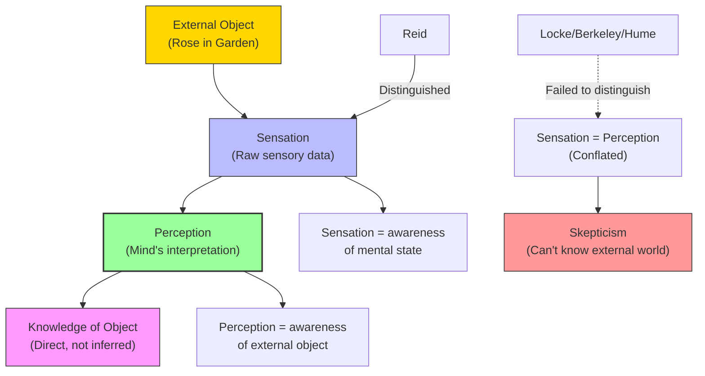
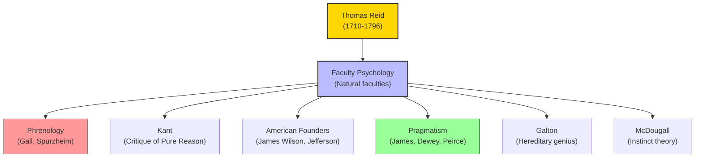

# Module 12 — Thomas Reid and Common-Sense Philosophy

*Module 12 of 13 — Chapter 7: Empiricism: The Authority of Experience*

---

In the 1760s, a Scottish philosopher named Thomas Reid sat down to write a response to David Hume that was, in its own way, as radical as the skepticism it aimed to defeat. Hume had argued that causation is a habit, belief is a feeling, and the external world is, at best, an inference. Reid's reply was not a logical refutation — it was something far more devastating: an appeal to common sense. "I resolve not to believe my senses," Reid wrote, imagining Hume's position taken to its logical conclusion. "I break my nose against a post.... I step into a dirty kennel; and after twenty such wise and rational actions, I am taken up and clapped into a madhouse." The point was simple but powerful: if your philosophy leads you to doubt the existence of the post you just walked into, the problem is not with the post. It is with your philosophy.

---

## The Common-Sense Foundation

Reid's "common sense" is not what the phrase usually implies — the casual opinions of the man in the street. It is, rather, a set of **natural faculties** that are intrinsic to the human constitution. These are not innate ideas (Reid rejected that concept, as Locke had). They are, instead, innate *capacities* — ways of processing information that are built into the structure of the mind.

"Our perceptions, which come from 'the mint of nature,' are triggered by the actual objects in nature. It is these objects that constitute the language nature uses to speak to us. We do not reason that there must be an object when we perceive one. We know immediately and instinctively that such is the case."

This is **direct realism** — the doctrine that we perceive the world directly, without the mediation of "ideas" or "representations." When you see a rose, you are not seeing an *idea* of a rose; you are seeing the rose itself. The perception is immediate, automatic, and trustworthy — not because you can *prove* it is trustworthy, but because it is part of your constitution.

> [!TIP]
> **Stop and Think:** Reid asks us to imagine a philosopher who resolves not to believe his senses. After walking into a post and stepping into a ditch, he is "taken up and clapped into a madhouse." Is this a fair criticism of skepticism? Or is it just an appeal to prejudice — an argument that skepticism must be wrong because it feels absurd?

## Sensation vs. Perception

Reid's most important philosophical contribution is his distinction between **sensation** and **perception** — a distinction that, he argued, Locke, Berkeley, and Hume all failed to make.

"A sensation is the direct experience of that which is in the mind, whereas a perception is of that which lies outside the mind." Consider two sentences: (a) "I feel a pain in my leg." (b) "I see a rose in the garden." In sentence (a), "feel" and "pain" are one and the same — the sensation *is* the experience. But in sentence (b), "see" and "rose" are genuinely different — the seeing is an act of the mind, and the rose is an object in the world.

This distinction is crucial because it explains how the mind can be both empirical (responsive to sensory input) and cognitive (capable of grasping the external world). Sensation provides the raw data; perception interprets it. But the interpretation is not arbitrary — it is guided by the natural faculties that evolution (or, for Reid, God) has built into the human constitution.

*Figure 12.1: Reid's distinction — sensation is awareness of our own mental states; perception is awareness of external objects. The empiricists conflated the two.*

## Natural Faculties

Reid's account of knowledge rests on the concept of **natural faculties** — constitutional endowments that enable us to perceive, think, and act in the world. These are not innate ideas (we do not come pre-loaded with knowledge of the world). They are, rather, innate *capacities* — ways of processing information that are built into the structure of the mind.

"It makes no more sense to ask for the rational justifications for accepting the natural faculties than to ask for a logical proof that the stomach digests food or, better, why the stomach digests food."

This is a powerful argument. We do not demand a logical proof that the stomach can digest food before we eat. We trust the stomach because it is part of our constitution — because it was designed (by evolution, by God, by nature) to perform a specific function. The same is true of our perceptual and cognitive faculties. We trust them not because we can *prove* they are reliable, but because they are the tools we have — and because, in practice, they work.

> [!TIP]
> **Stop and Think:** Reid argues that asking for a logical proof of the reliability of our senses is like asking for a proof that the stomach can digest food. Both are natural faculties — parts of our constitution. Is this a satisfying answer to the skeptic? Or is it just an admission that we cannot justify our most basic beliefs?

## Reid vs. Hume: The Great Debate

Reid's critique of Hume is both philosophical and practical. Philosophically, he argues that Hume's skepticism is self-defeating. If causation is merely a habit, then Hume's own arguments — which claim to *cause* a change in our beliefs — are also merely habits. If belief is merely a feeling, then Hume's belief in his own theory is merely a feeling, not a rational conclusion.

Practically, Reid argues that Hume's philosophy leads to absurdity. The skeptic who doubts the existence of the external world still eats, drinks, and avoids walking into walls. "Even the author of the 'Treatise of Human Nature,'" Reid notes, "though he saw no reason for this belief... could hardly conquer it in his speculative and solitary moments; at other times he fairly yielded to it."

This is not just a debating point. It reveals a fundamental tension in Hume's philosophy: the gap between what we can *logically justify* and what we *actually believe*. Hume's theory says we cannot rationally justify our belief in the external world. But Hume himself — like everyone else — believed in the external world. The theory and the practice are in contradiction.

> [!TIP]
> **Stop and Think:** Hume reportedly said that his skepticism was a "philosophical" position that he could not maintain in everyday life. After writing his skeptical arguments, he would go play backgammon with friends and forget about philosophy. Is this intellectual honesty? Or is it an admission that the arguments are, in some sense, not serious?

> [!TIP]
> **Stop and Think:** Reid argues that asking for a logical proof of the reliability of our senses is like asking for a proof that the stomach can digest food. Both are natural faculties. Is this a satisfying answer to the skeptic? Or is it just an admission that we cannot justify our most basic beliefs?

## Faculty Psychology

Reid's philosophy gave birth to what has come to be called **faculty psychology** — a form of psychological inquiry devoted to uncovering the natural faculties of human beings (and other animals) that are essential to knowledge and conduct.

"In rooting these faculties in instincts or native dispositions, Reid began a branch of British empiricism that finally yielded Galton's theories of hereditary genius and McDougall's instinct-theory of emotion."

The lineage is significant. Faculty psychology would be assimilated by Gall and Spurzheim and would appear in ultramaterialist garb as **phrenology** — the doctrine that mental faculties are localized in specific regions of the brain and can be assessed by examining the shape of the skull. Phrenology was, of course, largely discredited — but the underlying idea that mental functions are carried out by specific brain systems has been vindicated by modern neuroscience.

More importantly, Reid's insistence on natural faculties laid the groundwork for the "common sense" movement that would influence Kant in Prussia, the American founding fathers, and eventually the pragmatism and functionalism of William James and John Dewey.

*Figure 12.1: Reid's influence — faculty psychology branched into phrenology, pragmatism, and the foundations of modern psychology.*

## The Survival Argument

Reid offers a strikingly modern argument for the reliability of our natural faculties: **survival**. "In an anticipation of Darwin, Reid notes that our survival in the real world requires that we be psychologically conversant with nature's objects."

The skeptic who doubts the existence of food, water, and shelter will not survive long. The mind that accurately perceives the world — that correctly identifies predators, food sources, and dangers — has a survival advantage over the mind that does not. Our natural faculties are reliable not because we can *prove* they are reliable, but because unreliable faculties would have been eliminated by natural selection.

This argument has been revived in modern evolutionary psychology and epistemology. The philosopher Alvin Plantinga has argued that evolution favors *adaptive* beliefs rather than *true* ones — that a mind could be perfectly well-adapted to its environment while holding systematically false beliefs. But Reid's basic insight remains powerful: our cognitive faculties are the product of millions of years of interaction with the real world, and this history provides a pragmatic (if not logical) guarantee of their reliability.

> [!TIP]
> **Stop and Think:** Reid argues that our faculties are reliable because unreliable faculties would have led to extinction. But consider: optical illusions, cognitive biases, and false memories are well-documented features of human cognition. Does this undermine Reid's argument? Or does it merely show that our faculties are reliable *enough* for survival, even if not perfect?

## Speaking of Reid...

- When a child learns to catch a ball, they are not computing trajectories or solving differential equations. They are using natural faculties — hand-eye coordination, spatial perception, timing — that are built into the human constitution. This is Reid's common sense in action.
- A farmer who looks at the sky and says "it's going to rain" is using natural faculties — pattern recognition, memory, intuition — that have been refined by generations of interaction with the environment. This is not logical deduction; it is common sense.
- The modern self-help movement's emphasis on "trusting your gut" is, in essence, a popular version of Reid's philosophy: your natural faculties — your instincts, your intuitions, your common sense — are more reliable than abstract reasoning.

---

Reid had shown that empiricism need not lead to skepticism — that the mind has natural faculties that ground our knowledge of the world in something more solid than mere habit. But the empiricist tradition had one more major development to offer: the attempt to translate philosophical principles into a practical program for social reform. Jeremy Bentham's utilitarianism — the doctrine that pleasure and pain are the "two sovereign masters" of human conduct — would bridge the gap between empiricist philosophy and political action, and lay the groundwork for the behaviorist psychology of the twentieth century.

---

## References

- Robinson, D. N. (1995). *An Intellectual History of Psychology* (3rd ed.). University of Wisconsin Press. Chapter 7.
- Reid, T. (1764/1970). *An Inquiry into the Human Mind on the Principles of Common Sense*. In *Between Hume and Mill* (R. Brown, Ed.). Random House.
- Reid, T. (1788/1969). *Essays on the Active Powers of the Human Mind*. MIT Press.

---

*Module 12 of 13 — Chapter 7: Empiricism: The Authority of Experience*
