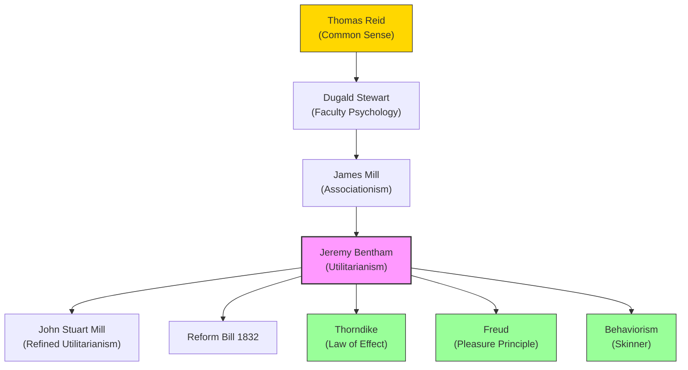

# Module 13 — Utilitarianism and the Empirical Tradition

*Module 13 of 13 — Chapter 7: Empiricism: The Authority of Experience*

---

In 1789, the same year that French revolutionaries stormed the Bastille, an English philosopher named Jeremy Bentham published a work that would quietly revolutionize the moral and political landscape of the Western world. *An Introduction to the Principles of Morals and Legislation* opened with a sentence of devastating simplicity: "Nature has placed mankind under the governance of two sovereign masters, pain and pleasure. It is for them alone to point out what we ought to do as well as to determine what we shall do." This was not merely a philosophical claim. It was a program — a blueprint for reforming laws, institutions, and human conduct itself. And it was built, stone by stone, from the empiricist tradition that Bacon, Locke, Berkeley, Hume, and Reid had constructed over the preceding two centuries.

---

## The Pleasure Principle

Bentham's **utilitarianism** rests on a single, audacious claim: the rightness and wrongness of actions are determined exclusively by their consequences — specifically, by the amount of pleasure or pain they produce. "Pleasure is in itself a good... the only good: pain is in itself an evil; and, indeed, without exception, the only evil."

This is **consequentialism** — the doctrine that the moral worth of an action is determined by its outcomes, not by its intrinsic nature. An act that produces more pleasure than pain is right; an act that produces more pain than pleasure is wrong. There are no moral absolutes, no divine commandments, no categorical imperatives — only the calculus of pleasure and pain.

Bentham attempted to make this calculus precise. He proposed a "felicific calculus" that would quantify pleasure along several dimensions: intensity, duration, certainty, propinquity (how soon it arrives), fecundity (whether it leads to more pleasures), purity (whether it is mixed with pain), and extent (how many people it affects). In principle, every moral decision could be reduced to a mathematical calculation.

> [!TIP]
> **Stop and Think:** Bentham's felicific calculus sounds scientific — quantify pleasure, quantify pain, calculate the difference. But consider: can you really put a number on the pleasure of eating a good meal versus the pleasure of hearing a beautiful piece of music? Is pleasure the kind of thing that can be measured and compared? Or is Bentham's attempt to quantify it a fundamental misunderstanding of human experience?

## The Intellectual Lineage

There is a "nearly irresistible urge" to trace the intellectual lineage from Thomas Reid's common-sense philosophy to Bentham's utilitarianism: Reid's best student was Dugald Stewart; Stewart's admiring pupil was James Mill; and James Mill was the principal disciple and major expositor of Bentham's political philosophy.

"The impression conveyed by such an intellectual pedigree is that the great political reform movement in England in the 1830s was born in the quiet studies of Edinburgh, Glasgow, and Aberdeen, and that its essential character was philosophical."

But the connection between empiricism and utilitarianism is "historic, not logical." It is not the case that empiricism *logically entails* utilitarianism. One could be an empiricist and a deontologist (believing in moral absolutes), or a utilitarian and a rationalist (believing in innate moral truths). The connection is, rather, a product of historical circumstances: the empiricists had identified truth with sense, validity with feeling, morality with sentiment. And sentiment, when pressed to its logical conclusion, leads to the maximization of pleasure and the minimization of pain.

*Figure 13.1: From Reid to behaviorism — the utilitarian tradition bridges empiricist philosophy and modern psychology.*

## The Bridge to Science

Bentham's contribution to psychology is often underestimated. His "pleasure principle" — the doctrine that human behavior is governed by the pursuit of pleasure and the avoidance of pain — would find new expression in the psychoanalytic theories of Freud and in the research and theory of Thorndike. "Indeed, behavioral science's tangled 'law of effect' is but a restatement of Bentham's 'two sovereigns.'"

Thorndike's **law of effect** states that behaviors followed by satisfying consequences tend to be repeated, while behaviors followed by unpleasant consequences tend to be extinguished. This is Bentham's pleasure principle translated into experimental psychology. The connection is not coincidental — Thorndike was working within a tradition that stretched back, through James Mill and Dugald Stewart, to the Scottish Enlightenment and the common-sense philosophy of Thomas Reid.

> [!TIP]
> **Stop and Think:** Thorndike's law of effect and Bentham's pleasure principle are essentially the same idea expressed in different languages — one philosophical, the other experimental. What does this tell you about the relationship between philosophy and science? Is psychology just philosophy with better data?

## The Call for Measurement

Bentham's most prescient contribution to psychology was not his moral philosophy but his demand for *measurement*. In Chapter XVI of his *Principles*, he addressed the problems posed by insanity and mental deficiency and "all but pleads for an Alfred Binet":

> "For exhibiting the quantity of sensible heat in a human body we have a very tolerable sort of instrument, the thermometer; but for exhibiting the quantity of intelligence, we have no such instrument."

This passage, written in 1789, anticipated the entire field of psychometrics — the measurement of psychological attributes. It would take more than a century before Binet and Simon developed the first practical intelligence test (in 1905), but the intellectual demand was already there: if we are to understand human nature scientifically, we must be able to *measure* it.

> [!TIP]
> **Stop and Think:** Bentham asked for a "thermometer of intelligence" in 1789. We now have IQ tests, personality inventories, and countless other psychological instruments. Have they fulfilled his vision? Or has the attempt to quantify the mind created as many problems as it has solved?

> [!TIP]
> **Stop and Think:** Thorndike's law of effect and Bentham's pleasure principle are essentially the same idea expressed in different languages one philosophical, the other experimental. What does this tell you about the relationship between philosophy and science? Is psychology just philosophy with better data?

## From Utilitarianism to Behaviorism

The bridge from utilitarianism to pragmatism is a short one. The distance from pragmatism to behaviorism is even shorter. "As we shall see in later chapters, one builder of these bridges was Charles Darwin."

The intellectual chain is clear: Bentham's pleasure principle → Thorndike's law of effect → Watson's behaviorism → Skinner's operant conditioning. Each step in this chain is a refinement of the same basic idea: behavior is shaped by its consequences. The empiricist tradition, which began with Bacon's insistence on observation and experiment, culminated in a psychology that claimed to explain all behavior in terms of observable stimuli and responses.

But the chain has another link — one that connects utilitarianism to the broader empiricist tradition. The empiricists had argued that all knowledge comes from experience. The utilitarians argued that all morality is grounded in experience (specifically, in the experience of pleasure and pain). The behaviorists argued that all behavior is shaped by experience (specifically, by the consequences of past behavior). The common thread is *experience* — the conviction that the human mind is, from birth to death, a product of its interactions with the world.

## The Political Dimension

Utilitarianism was not merely a philosophical doctrine. It was a political program. Bentham and James Mill used utilitarian principles to argue for specific reforms: universal suffrage, prison reform, the abolition of judicial torture, the establishment of public education. The Reform Bill of 1832 — which expanded the franchise in Britain — was, in large part, a product of utilitarian activism.

This political dimension reveals something important about the empiricist tradition: it was never purely academic. From Bacon's insistence that knowledge should "relieve man's estate" to Locke's theory of the social contract to Bentham's legislative reforms, the empiricists were committed to the idea that philosophy should make a practical difference in the world. Knowledge is not valuable for its own sake; it is valuable because it improves human life.

> [!TIP]
> **Stop and Think:** The empiricist tradition produced both the scientific method and the utilitarian theory of ethics. Are these connected? Does the same impulse that drives us to investigate nature also drive us to reform society? Or are science and ethics fundamentally different enterprises?

## Speaking of Utilitarianism...

- When a government allocates healthcare resources based on "quality-adjusted life years" (QALYs), it is applying Bentham's felicific calculus — maximizing the total amount of health (pleasure) produced by a fixed budget.
- A parent who rewards a child's good behavior with praise and punishes bad behavior with a time-out is applying the law of effect — shaping behavior through its consequences.
- The modern debate over "effective altruism" — the movement to do the most good possible with available resources — is a direct descendant of Bentham's utilitarianism.

---

The empiricist tradition that Bacon launched in 1605 and Bentham translated into political action in 1789 had, by the end of the eighteenth century, become the dominant voice in British philosophy and the foundation of a new approach to the human mind. But it had also generated a powerful counter-movement. The rationalists — Descartes, Spinoza, Leibniz, and eventually Kant — would argue that empiricism, taken to its logical conclusion, leads to skepticism, relativism, and the destruction of moral certainty. The debate between these two traditions — empiricism and rationalism — would shape the course of psychology for the next two centuries.

---

## References

- Robinson, D. N. (1995). *An Intellectual History of Psychology* (3rd ed.). University of Wisconsin Press. Chapter 7.
- Bentham, J. (1789/1961). *An Introduction to the Principles of Morals and Legislation*. In *The Utilitarians*. Dolphin Books.
- Mill, J. S. (1863). *Utilitarianism*. Parker, Son, and Bourn.
- Thorndike, E. L. (1911). *Animal Intelligence*. Macmillan.

---

*Module 13 of 13 — Chapter 7: Empiricism: The Authority of Experience*
