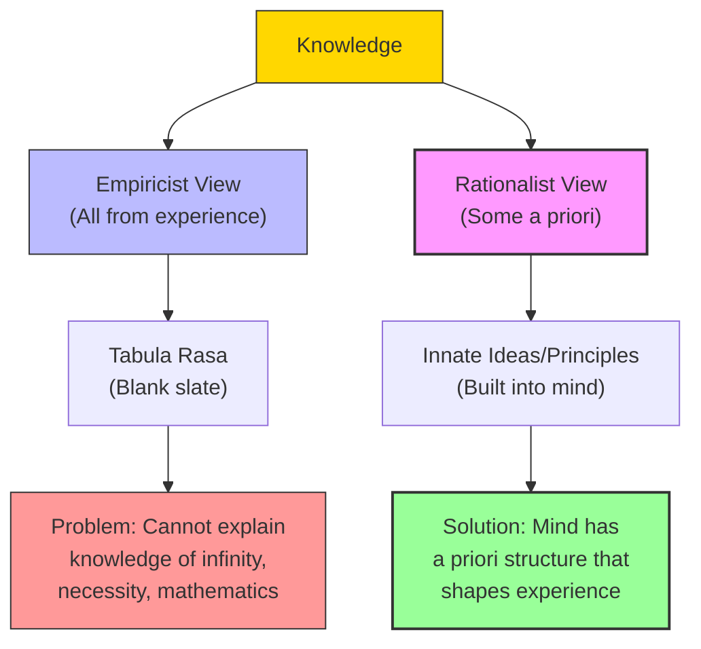

# Module 01 — The Rationalist Challenge: Innate Ideas and the Geometry of Knowledge

*Module 1 of 9 — Chapter 8: Rationalism: The Geometry of the Mind*

---

A child of five can tell you that there is no number so large that one more cannot be added to it. No one taught this child the fact through experience — no one has ever counted to infinity and checked. Yet the child knows it with absolute certainty, the same certainty with which they know that a triangle has three sides. Where did this knowledge come from? Not from the senses, which deal only with particular things. Not from experience, which can never reach the infinite. The rationalist'"'"'s answer is startling: the mind brought this knowledge with it. It was there before the first experience, waiting to be activated. This is the doctrine of **innate ideas** — and it is the foundation of the rationalist tradition that runs from Plato through Descartes, Spinoza, Leibniz, and Kant.

---

## What Rationalism Actually Claims

The term "rationalism" has accumulated so many meanings that almost any objection to its application will stand on solid ground. The eighteenth-century "Age of Reason" was populated chiefly by empiricists — Voltaire, Hume, Diderot, Condorcet. Even Locke'"'"'s empiricism embraced intuition and the possibility of moral maxims as certain as mathematics. Yet there are fundamental differences between the empiricist tradition (Locke, Berkeley, Hume) and the rationalist tradition (Descartes, Spinoza, Leibniz, Kant). These differences center on two issues: **innate ideas** and **method**.

Rationalism is a commitment to thought, reflection, deductive rigor — an argumentative chain in which conclusions are joined by the dictates of reason. The goal is a rational and intelligible account of why things are the way they are and not some other way. If the empiricist has traditionally been content to discover *what is*, the rationalist demands to know *what must be*.

The empiricist'"'"'s evidence has always been the data of experience; the rationalist'"'"'s, the necessary proofs following from axioms and propositions. Integral to the rationalist tradition has been mathematics, and particularly geometry. Euclid'"'"'s theorems have served more than one leading rationalist as the model for epistemology — even for reality itself.

> [!TIP]
> **Stop and Think:** You know that 2 + 2 = 4, that a triangle has three sides, and that nothing can be both true and false at the same time. Did you learn these truths from experience? Or do they seem to be true *necessarily* — true regardless of what you have experienced? The rationalist says the latter. The empiricist says the former. Which feels more accurate to your own experience of learning?

> [!TIP]
> **Stop and Think:** You know that 2 + 2 = 4 and that a triangle has three sides. Did you learn these from experience? Or do they seem necessarily true — true regardless of experience? The rationalist says the latter. Which feels more accurate to your own experience?

## The Doctrine of Innate Ideas

The doctrine of innate ideas does not require that infants enter the world consciously knowing mathematical truths. It requires only that, in their sufficient maturity, they will know certain things with certainty — and that this knowledge will be the result of maturation alone, not instruction or experience.

Employed this way, the term "innate idea" does not require infant awareness. It claims only the existence of certain **innate principles or archetypes of thought** that assimilate experience and determine its psychological character. This is the sense of *a priori* that continues to enliven psychological research and theory. It is a concept of innateness not wed to any particular period of maturation and surely not infancy.

Consider the proposition: "There is no number so large that one cannot be added to it." No one knows this by experience, for no one has actually conducted the experiment. To say that we know this by inference or generalization is to impute to it the less-than-certain status that attaches to all inferences. Yet it is absolutely and irrefutably certain. Since the fact is not established by experience and cannot be confirmed by experience, and since it is a fact, it must be one *not given in experience*. Thus, it is known **a priori**.

> [!TIP]
> **Stop and Think:** Jean Piaget once quipped that the radical empiricist believes the series of positive integers was discovered one at a time! The joke reveals a real problem: how do you account for knowledge of the infinite through finite experiences? The rationalist argues that such knowledge must be innate — built into the structure of the mind itself.

*Figure 1.1: The core dispute — empiricists say all knowledge comes from experience; rationalists say some knowledge is built into the mind.*

> [!TIP]
> **Stop and Think:** Science could not develop through radical empiricism alone, nor through pure rationalism without observation. The greatest achievements married both. Is the debate really about which is right, or about which should lead?

## Methodological Rationalism

Rationalists are further distinguished by the method they recommend for discovering nature'"'"'s laws. Where the empiricist relies on observation, experiment, and induction, the rationalist relies on logic, deduction, and mathematical proof. The goal is not merely to catalog what happens but to explain *why it must happen*.

Aristotle had brilliantly combined the best features of empiricism and rationalism, but had subsumed both under a broader metaphysical system that conferred excessive authority on "final causes." The laws of science describe nature as it is experienced, not the way it "ought" to be. To the extent that Aristotle had preconceived notions about how nature "ought" to be, and to the extent that succeeding generations of rationalists were guided by his preconceptions, the modern era begins with the rejection of Aristotle'"'"'s authority.

On the Continent, the leading spokesman for the new era was René Descartes — a man who, like Bacon, saw unbridled skepticism as his most formidable adversary. But where Bacon replied with experiment, Descartes replied with reason.

> [!TIP]
> **Stop and Think:** Science could not have been developed by way of a radical empiricism; nor could it have flourished if extreme rationalism were adopted at the expense of systematic observation. The greatest scientific achievements — from Copernicus to Newton — were marriages of the two perspectives. Is the debate between empiricism and rationalism really about which is *right*, or about which should take the lead?

## The Problem of Universals

The medieval debate over universals — whether general concepts like "humanity" or "justice" have real existence — is the rationalist challenge in its oldest form. The eye can see one cat at a time, but the mind "knows" of the "universal cat." Such knowledge assumes a knowing faculty that is not sensory, and it is therefore a form of knowledge that cannot be given in experience.

The stock rationalist argument is that children do not have difficulty with the *truth* but with the *language* they must learn in order to articulate it in culturally approved form. The empiricist rebuttal is that such "knowledge" is only linguistic in the first place. The rationalist reply: if such truths were merely verbal, there would have been no reason for every literate society in human history to have invented terms to express them.

This is not a debate likely to end in victory. But it reveals the core of the rationalist commitment: that certain truths are so fundamental, so universal, so resistant to empirical disconfirmation, that they must be features of the mind itself — not products of experience.

## Speaking of Rationalism...

- When a chess grandmaster "sees" that a position is lost before calculating all the variations, they are exercising something like a rationalist intuition — an immediate grasp of necessary relationships.
- A mathematician who proves a theorem is not discovering something in the world; they are uncovering a truth that was, in some sense, always there — waiting to be recognized. This is the rationalist'"'"'s vision of knowledge.
- The debate between "nature" and "nurture" in psychology is a modern version of the empiricist-rationalist dispute. Are our cognitive capacities products of experience (empiricist) or of innate structure (rationalist)?

---

The rationalist tradition that Descartes inaugurated would produce some of the most profound — and most challenging — ideas in the history of psychology. His method of doubt, his discovery of the cogito, and his formulation of the mind-body problem would set the agenda for three centuries of philosophical and psychological inquiry.

---

## References

- Robinson, D. N. (1995). *An Intellectual History of Psychology* (3rd ed.). University of Wisconsin Press. Chapter 8.
- Descartes, R. (1637/1901). *Discourse on Method*. In *The Method, Meditations, and Philosophy of Descartes* (J. Veitch, Trans.). Tudor.
- Leibniz, G. W. (1765/1898). *New Essays on the Understanding*. In *Leibniz — The Monadology and Other Philosophical Writings* (R. Latta, Trans.). Oxford University Press.

---

*Module 1 of 9 — Chapter 8: Rationalism: The Geometry of the Mind*
