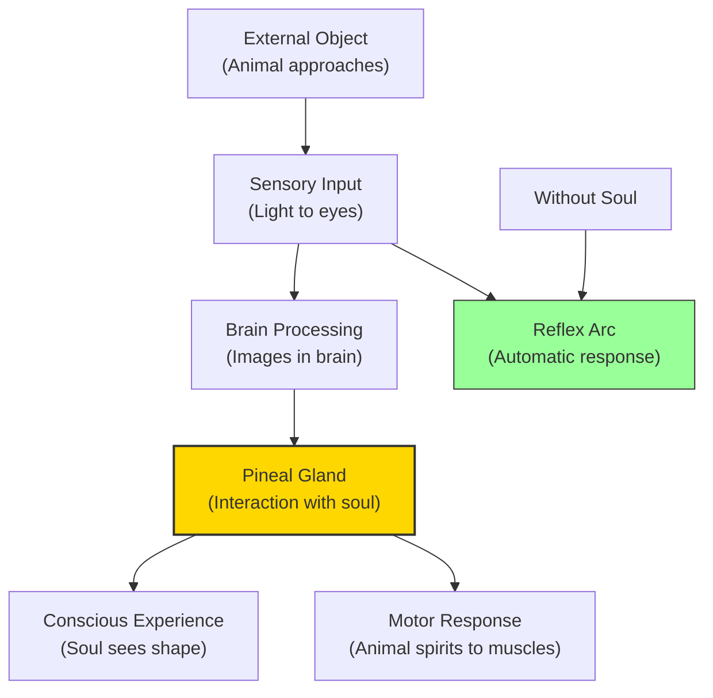

# Module 03 — Descartes'"'"' Dualism: The Mind-Body Problem

*Module 3 of 9 — Chapter 8: Rationalism: The Geometry of the Mind*

---

You decide to raise your hand. The hand rises. Between the decision and the action lies a chasm that has puzzled philosophers for four centuries: how does an immaterial thought — a decision, a wish, an intention — cause a material arm to move? The thought has no mass, no location, no physical properties. The arm is flesh, bone, muscle — pure matter. How does the one affect the other? This is the **mind-body problem**, and it was René Descartes who first stated it in the form that has dominated Western thought ever since. His answer — **dualism** — would prove as influential as it was controversial, and its legacy runs through the heart of modern psychology.

---

## The Thinking Thing

In his *Second Meditation*, Descartes reviews his *cogito ergo sum* and asks what sort of thing he is. He quickly dismisses Aristotle'"'"'s definition of the human as a "rational animal" because this definition fails to tell us what is "rational" and what is "animal." He then reviews the various attributes he believes he has: body, hands, feet, hunger and thirst, and a number of things he does — walking, hearing, sleeping.

All these, however, can be illusory. That is, the only necessary attribute, made necessary by the cogito, is *thinking*. Thus he must be a thinking thing:

> "I suppose there exists an extremely powerful and... malignant being... directed toward deceiving me. Can I affirm that I possess any one of all those attributes of which I have lately spoken as belonging to the nature of body?... Thinking is another attribute of the soul; and here I discover what properly belongs to myself. This alone is inseparable from me. I am, therefore, precisely speaking, only a thinking thing, that is, mind... or reason."

**Matter** is extended and is, therefore, in a place. **Mind** is unextended. This is the fundamental division: the physical world is characterized by extension in space; the mental world is characterized by thought. The two are qualitatively different — so different that no account of one can be reduced to an account of the other.

> [!TIP]
> **Stop and Think:** Consider the experience of seeing the color red. The physical event — light of a certain wavelength hitting your retina — is extended, measurable, and located in space. The *experience* of redness — the qualitative "what it is like" to see red — is not extended, not measurable, and not located anywhere. Are these really two different kinds of thing? Or are they just two descriptions of the same thing?

> [!TIP]
> **Stop and Think:** Consider the experience of seeing red. The physical event is extended, measurable, located in space. The experience of redness is none of these. Are these really two different kinds of thing? Or two descriptions of the same thing?

## The Pineal Gland and Animal Spirits

Descartes'"'"'s major psychological problem — and the one that has vexed dualists ever since — is accounting for the manner in which an immaterial, unextended agent (the soul) can influence an extended, material substance (the body). How can an idea move a muscle if the idea has no mass?

Descartes'"'"'s best guess is that the site of mind-body interaction is the **pineal gland** — a small structure located in the center of the brain that, unlike other brain structures, is not duplicated on each side. The soul'"'"'s ability to direct the body is made possible through its regulation of the flow of **animal spirits** — a now-discredited concept referring to subtle fluids that were thought to flow through the nerves and brain, carrying sensory information outward and motor commands inward.

The soul influences the body through its ability to regulate the flow of animal spirits from the brain to all the nerves associated with experience, action, and feeling. Through God, this will is free.

> [!TIP]
> **Stop and Think:** Descartes chose the pineal gland because it was the only brain structure not duplicated on both sides — he reasoned that a single point of control was needed for a unified mind. Modern neuroscience has found no such single point. Does this disprove dualism? Or does it merely show that Descartes was wrong about the *location* of mind-body interaction, while the *problem* of interaction remains?

## The Reflex Arc

Descartes offers an illustration of how the body works that would found an entire tradition in neuroscience:

> "If we see some animal approach us, the light reflected from its body depicts two images of it, one in each of our eyes. The two images, by way of the optic nerves, form two others in the interior surface of the brain.... The images then radiate toward the small gland which the spirits encircle.... The two brain images form but one image on the gland which, acting immediately on the soul, causes it to see the shape of the animal."

This passage introduces the concept of the **reflex** — the idea that sensory stimulation can produce automatic motor responses without conscious intervention. Descartes'"'"'s reluctant inclusion of the soul in this otherwise materialist account of sensation and behavior would not be preserved by many of his successors. The reflex arc — sensation → brain processing → motor response — would become the foundation of both physiological psychology and behaviorism.

*Figure 3.1: Descartes'"'"' model — sensory input reaches the pineal gland, where the soul experiences it and directs responses. Remove the soul, and you have the reflex arc.*

> [!TIP]
> **Stop and Think:** If animals are machines without consciousness, their screams of pain are no more significant than a machine grinding to a halt. Most people find this repulsive. But on what basis can we reject it while accepting Descartes' dualism?

## Animals as Automatons

Those who have expressed concern about the manner in which scientists have used and abused animals tend to place much of the blame on Descartes'"'"'s psychological writings, in which nonhuman animals are described as "automatons" — a kind of machine. It is true that such a position can be found in Descartes'"'"'s writings, though it is also clear that he accorded nonhuman animals the full range of perceptual and even motivational and emotional processes.

Assuming that animals lacked all rationality, Descartes was led to the conclusion that they were unable to rationally interpret stimulation and therefore were not conscious in the relevant respects. The animal'"'"'s body is a machine — a complex, self-regulating mechanism that responds to sensory input with appropriate motor output. But it is a machine without a soul, without consciousness, without genuine experience.

This conclusion — that animals are mere machines — has been one of the most controversial aspects of Cartesian philosophy. It has been used to justify the most terrible cruelties toward animals, and it has been challenged by every generation of thinkers since Descartes'"'"'s time.

> [!TIP]
> **Stop and Think:** If animals are machines without consciousness, then the screams of an animal in pain are no more significant than the sound of a machine grinding to a halt. Most people find this conclusion morally repulsive. But on what basis can we reject it? If we accept Descartes'"'"'s dualism — that mind and body are fundamentally different — how do we know that animals have minds?

## Descartes'"'"' Contributions to Psychology

Descartes'"'"'s direct contributions to psychology were impressive:

- His dualism — the portion that was materialistic — is the cornerstone of modern **neuropsychology**.
- His writings on the reflex connections between sensation and action began a line of inquiry that culminated in the research and theory of Ivan Pavlov.
- His method saved science from the vain ritual of fact-gathering that Bacon'"'"'s *Novum Organum* seemed to demand.
- In presenting thought and certain kinds of feeling as the distinguishing features of human beings, he prepared the way for an experimental psychology of consciousness that would be inaugurated by Wundt in the nineteenth century.

Indirectly, Descartes'"'"' influence is felt in psychology through the effect his writings had on later critics in the empiricist tradition. It was Descartes'"'"'s position on innate ideas that marks the point of departure between the (British) empirical and the (Continental) rationalist schools. But even Locke, in his discussion of intuition, imagination, and the axiomatic nature of moral precepts, borrows more from rationalism than he rejects.

"Descartes'"'"'s place in the ranks of speculative science and psychology is at the front and durably so. He was not an anti-empiricist; he was just not *only* an empiricist. He was not an anti-materialist; he was merely not *only* a materialist."

## Speaking of Dualism...

- When a patient with a spinal cord injury cannot move their legs despite wanting to, the mind-body problem becomes viscerally real. The intention (mind) is present; the physical connection (body) is broken. Dualism is not just a philosophical puzzle — it is a medical reality.
- The debate over whether artificial intelligence can be "conscious" is a modern version of the Cartesian problem. A computer can process information (body), but does it *experience* anything (mind)? Descartes would say no — and many philosophers agree.
- The placebo effect — the fact that believing a treatment will work can actually make it work — is a dramatic demonstration that mental states (beliefs, expectations) can produce physical effects. This is the mind-body problem in action.

---

Descartes had established dualism — the doctrine that mind and matter are fundamentally different. But this created as many problems as it solved. If mind and matter are different substances, how do they interact? Baruch Spinoza, a Dutch-Jewish philosopher excommunicated from his community for his radical ideas, would propose a solution so radical it shocked his contemporaries: mind and matter are not two different substances at all. They are *the same substance* viewed from different perspectives.

---

## References

- Robinson, D. N. (1995). *An Intellectual History of Psychology* (3rd ed.). University of Wisconsin Press. Chapter 8.
- Descartes, R. (1649/1955). *The Passions of the Soul*. In *The Philosophical Works of Descartes* (E. Haldane & G. R. T. Ross, Trans.). Dover.
- Descartes, R. (1637/1901). *Discourse on Method*. In *The Method, Meditations, and Philosophy of Descartes* (J. Veitch, Trans.). Tudor.

---

*Module 3 of 9 — Chapter 8: Rationalism: The Geometry of the Mind*
