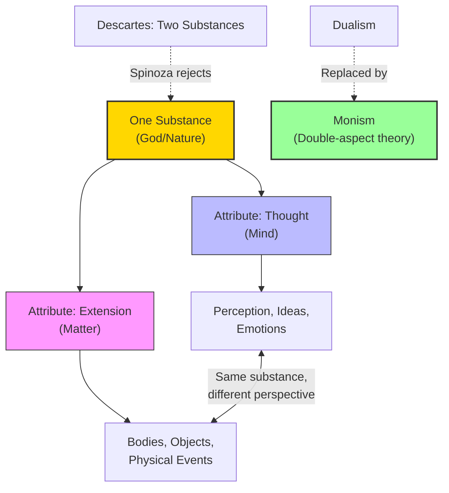

# Module 04 — Spinoza: The Geometry of Emotion

*Module 4 of 9 — Chapter 8: Rationalism: The Geometry of the Mind*

---

In 1656, the Jewish community of Amsterdam issued one of the most severe excommunications in its history. The target was a twenty-three-year-old man named Baruch Spinoza — a brilliant student of Talmud and philosophy who had begun to question the most fundamental tenets of his faith. The excommunication barred him from the synagogue, from the community, and from all contact with other Jews. Spinoza, now effectively homeless, changed his name to Benedict and supported himself by grinding optical lenses — a trade that, ironically, required the same geometric precision he would bring to his philosophy. He lived in poverty, refused prestigious academic appointments, and devoted himself to a vision of reality so radical that it would not be taken seriously by a major philosopher for more than a century. When Hegel finally engaged with Spinoza'"'"'s work, he declared: "You are either a Spinozist or not a philosopher at all."

---

## Pascal'"'"'s Complaint

Blaise Pascal, the French mathematician and philosopher, captured one of the central tensions in Cartesian philosophy with a memorable complaint:

> "I cannot forgive Descartes. In all his philosophy he would have been quite willing to dispense with God. But he could not help granting Him a flick of the forefinger to start the world in motion; beyond this, he has no further need of God."

Descartes'"'"'s system took for granted the separate and independent categories of God, matter, and mind. Once God'"'"'s forefinger flicked, the balance of nature and natural events could be studied rationally. Spinoza found this division incoherent. If God is the author of all, His presence must be *in* all — since "things which have nothing in common cannot be one the cause of the other."

> [!TIP]
> **Stop and Think:** Spinoza argued that if God is truly the cause of everything, then God must be *in* everything — not separate from creation but identical with it. This is pantheism: God is nature, and nature is God. Is this a religious view or an atheistic one? Spinoza'"'"'s contemporaries thought it was atheism. Spinoza himself thought it was the truest form of religion.

## Monism: One Substance

Unlike Descartes, Spinoza could find no reason in logic or experience to assume that mind, matter, and God were distinct categories. If God is the cause of all things, it makes no sense to talk about human freedom. Our very knowledge of good and evil is sufficient to prove that we were not born free — for if we were, this constraining knowledge would not exist.

Spinoza'"'"'s solution was **monism** — the doctrine that there is only one substance. Mind and matter are not two different kinds of thing; they are *the same substance* viewed from different perspectives. For every object, there is a matched idea; for every idea, a matched object. To have an idea is always to have an idea *of* something. The dualism that Descartes had introduced was, for Spinoza, an illusion produced by incomplete thinking.

*Figure 4.1: Spinoza'"'"'s monism — one substance with two attributes (thought and extension). Mind and matter are the same reality viewed from different angles.*

## Passion vs. Emotion

Spinoza'"'"'s most original psychological contribution is his distinction between **passion** and **emotion**. A passion is a feeling toward that about which we have no clear idea. An emotion is a feeling shaped by a distinct idea.

"Blind rage" is an instance of passion — a feeling that overwhelms us without understanding. Love for our fellows is an emotion — a feeling guided by rational awareness of what is good. The distinction echoes Aristotle'"'"'s ethics and Stoic philosophy: to respond passionately is to respond intemperately, in a manner not constrained by knowledge and principles that impose proportion and balance on our conduct.

Our "freedom," therefore, is of a different sort than the libertarians imagine. Since God is a "thinking thing," our thoughts will either share in His or be imperfect. If imperfect, our actions will be compelled by passion rather than emotion. The goal of human psychology is to move from passion to emotion — from confused feelings to clear ideas.

> [!TIP]
> **Stop and Think:** Think about a time you acted in anger and later regretted it. Spinoza would say you were moved by *passion* — a feeling without clear understanding. Now think about a time you felt strongly about something but acted with deliberation. That was *emotion* — a feeling shaped by rational awareness. Is this distinction useful? Can it help you understand your own emotional life?

## Determinism and Adequate Ideas

Spinoza'"'"'s psychology is unreservedly deterministic: "The mind is determined to wish this or that by a cause, which has also been determined by another cause... and so on to infinity." The ultimate or first cause is God.

To the extent that the mind is fixed on **adequate ideas** — ideas that capture the necessary causes of things — it is active. Otherwise, it is passive. When active, it endeavors to persist in its being, which is to say it strives for pleasure. Since this pleasure is the possession of adequate ideas, and since the body is not a necessary entity, "body cannot determine mind to think."

The most intense emotion is that which accompanies the grasp of necessity: "An emotion toward that which we conceive as necessary is, when other conditions are equal, more intense than an emotion towards that which is possible, or contingent, or non-necessary." This is why the mathematician'"'"'s proof, the philosopher'"'"'s insight, and the scientist'"'"'s discovery produce such profound satisfaction — they are emotions attached to necessary truths.

> [!TIP]
> **Stop and Think:** Spinoza argues the highest form of knowledge is intuition — a direct grasp of essential truth. When you suddenly "see" why a proof works, or have a flash of scientific insight, is that not intuition? Is rational intuition a contradiction?

> [!TIP]
> **Stop and Think:** Spinoza argues the highest form of knowledge is intuition. When you suddenly see why a proof works, or have a flash of scientific insight, is that not intuition? Is rational intuition a contradiction?

## The Four Levels of Knowing

Spinoza identifies four modes of knowing, arranged from lowest to highest:

1. **Opinion** — the lowest form, based on hearsay and inadequate experience.
2. **Experience** — knowledge gained through the senses, but still particular and contingent.
3. **Reason** — knowledge of general principles, derived from adequate ideas.
4. **Intuition** — the highest form, direct grasp of the essence of things.

Of the various modes of knowing, only opinion is inferior to mere experience. The highest mode is that by which the essence of a thing is known. We know the essence of a circle when we know that it is the line resulting when a stylus is fixed at one end. To know the essence is to know what must follow from the fact of its existence.

> [!TIP]
> **Stop and Think:** Spinoza argues that the highest form of knowledge is *intuition* — a direct, immediate grasp of essential truth. This sounds mystical, but consider: when you suddenly "see" why a mathematical proof works, or when a scientist has a flash of insight about a natural law, is that not a form of intuition? Is rational intuition a contradiction in terms, or is it the highest form of reason?

## Self-Actualization

Spinoza'"'"'s deterministic psychology leads to a surprising conclusion: the goal of human life is **self-actualization**. We are so constituted that our lives are devoted to perpetuating the existence of mental activity. The motive, at a superficial level, appears in the form of an egoistic quest for pleasure and aversion to pain. But the deeper motive is the mind'"'"'s drive to know itself — to achieve adequate ideas about its own nature and the nature of reality.

This vision of human psychology — the idea that the mind strives toward its own perfection — would influence the German Romantics (Goethe, Coleridge, Schelling) and, through them, the humanistic psychology of the twentieth century. Abraham Maslow'"'"'s concept of self-actualization is, in many ways, a modern echo of Spinoza'"'"'s rational ethics.

## Speaking of Spinoza...

- When you feel calm and clear-headed during a crisis, you are experiencing what Spinoza would call an *emotion* — a feeling guided by adequate ideas. When you panic, you are experiencing a *passion* — a feeling without understanding.
- The Stoic practice of "negative imagining" — visualizing worst-case scenarios to reduce their emotional power — is a Spinozist technique: by understanding the *necessity* of what might happen, we reduce the passion it produces.
- The modern mindfulness movement, which teaches practitioners to observe their feelings without being controlled by them, echoes Spinoza'"'"'s distinction between passion (被动) and emotion (active).

---

Spinoza had collapsed Descartes'"'"'s dualism into a radical monism — one substance with two aspects. But another philosopher was about to challenge both Descartes and Spinoza with an even more radical proposal: that the universe is not made of one substance or two, but of *infinitely many* — each one a unique, windowless monad reflecting the whole from its own perspective.

---

## References

- Robinson, D. N. (1995). *An Intellectual History of Psychology* (3rd ed.). University of Wisconsin Press. Chapter 8.
- Spinoza, B. (1677/1955). *Ethics*. In *The Chief Works of Benedict de Spinoza* (R. H. M. Elwes, Trans.). Dover.
- Spinoza, B. (1677/1955). *On the Improvement of the Understanding*. In *The Chief Works of Benedict de Spinoza* (R. H. M. Elwes, Trans.). Dover.

---

*Module 4 of 9 — Chapter 8: Rationalism: The Geometry of the Mind*
